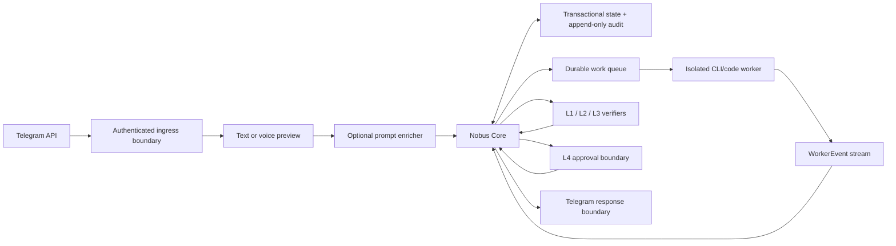

# 03. Архитектурный обзор Nobus Space

**Статус документа:** CANONICAL

**Архитектурный стиль:** детерминированное ядро, сменные адаптеры и исполнители

**Состояние реализации:** CURRENT/PARTIAL; целевая схема обозначена TARGET

## 1. Архитектурная позиция

Nobus Space не является «одной большой LLM». Доверенное ядро принимает решения по проверяемым данным и политикам, а недетерминированные модели работают как заменяемые исполнители с минимальными правами.

Базовые инварианты:

1. Core, а не LLM, управляет правами, риском, состоянием и completion.
2. Внешний ввод становится внутренней командой только на trusted boundary.
3. Каждая сущность связана с tenant и task; никакой глобальный поиск «по имени» не даёт доступа.
4. Все эффекты либо read-only, либо требуют явного capability; внешняя запись требует L4.
5. Результат связан с `contract_digest`, `result_revision` и `result_digest` и проходит разные identities L1/L2/L3.
6. Audit фиксирует решения append-only; operational logs не являются доказательством approval.

## 2. Состояние архитектуры

### CURRENT

В основной ветке существуют:

- runtime `Task`, policy/state guards и terminal audit lock;
- strict Pydantic-контракты trusted ingress, task, worker events, verification bundle и human approval;
- owner-bound Telegram polling с durable SQLite lease/checkpoint, replay guard и tamper-evident status outbox;
- локальная voice download/transcription на `faster-whisper`, actor-bound single-use preview confirmation и очистка временного аудио;
- реальный read-only Codex CLI adapter с закрытым JSONL-протоколом, bounded stdout/stderr, общим deadline и Windows Job cleanup;
- разделение результата на пользовательский answer и exact unified diff; обычный answer проходит L1/L2/L3 и доставляется без L4, а diff требует отдельного owner-bound L4 до применения;
- изолированная ветка `agent/telegram-live`, pre-apply journal, tests/staged audit и локальный CAS commit без merge/push;
- startup network preflight Codex CLI до объявления бота готовым и безопасные отдельные error codes для start/timeout/protocol/output failures.

Live text-answer, owner voice preview/confirm и изолированный CLI/auth/network probe воспроизведены. Terminal Task/event/outbox transitions атомарны; restart не повторяет незавершённый worker автоматически. Callback stores для незавершённых voice/patch confirmations остаются in-memory. OS supervisor, autostart, независимые health alerts, внешний deployment и backup/restore drill относятся к Gate 5B и отсутствуют.

### CURRENT: планировщик Telegram-задач

В основной ветке Telegram polling отделён от длительного Codex execution: accepted text и подтверждённый voice ставятся во внутреннюю FIFO-очередь и сразу освобождают polling handler. Два read-only worker-слота могут параллельно готовить независимые ответы/черновики. Подтверждённый exact diff получает эксклюзивный доступ к обоим слотам, поэтому L4 apply, L2/L3 и локальный CAS commit не пересекаются с чтением меняющегося Git state.

Профиль production worker зафиксирован как `gpt-5.6-sol`, `model_reasoning_effort=high`, `service_tier=fast` и `features.fast_mode=true`; `workspace-write`, web и MCP выключены. Gate 5A.4 задаёт execution deadline 10 800 секунд: двухчасовая задача получает час запаса на startup и финализацию. Абсолютный contract/adapter ceiling — 14 400 секунд. Polling lease 240 секунд покрывает только Telegram update/network boundary и больше не включает длительность worker.

Ограничение CURRENT: очередь и raw instruction живут в памяти одного owner-bound процесса. Admission ограничен 32 ожидающими drafts; общая очередь имеет 40 мест и резерв для L4 jobs. Overflow и controlled close требуют exact durable terminal proof для каждого принятого active/queued job; runtime-ответ не заменяет повторное чтение Task из SQLite. Выполняются три bounded attempts, после чего update не ACK-ается либо clean close возвращает ошибку. Task/audit/outbox сохраняются fail-closed в SQLite, но crash не replay-ит незапущенный queued job автоматически. Durable claim/lease queue и restart resume остаются TARGET Gate 5B; live activation требует отдельного owner acceptance этого residual crash-risk и reconciliation runbook.

Фактический статус — [`handoffs/CURRENT-STATUS.md`](handoffs/CURRENT-STATUS.md).

### TARGET MVP-1

Для MVP допустим один deployable process и одна БД. Очередь может быть таблицей задач с безопасным claim/lease; отдельный message broker не вводится до доказанной нагрузки.

## 3. Компоненты и границы

| Компонент | Ответственность | Доверие | CURRENT |
|---|---|---|---|
| Telegram transport gateway | разобрать update, нормализовать text/voice/callback | недоверенный parser | live owner-bound text/voice/callback control plane |
| Authenticated ingress boundary | allowlist actor/chat, replay guard, tenant binding, trusted envelope | доверенный | bot identity + exact owner binding проверяются server-side |
| Voice service | принять ограниченные bytes, transcribe, выдать и единожды подтвердить actor-bound preview | provider недоверен; confirmation boundary доверенный | live local download/transcription/preview; pending capability in-memory |
| Prompt enricher | предложить instruction/criteria | недоверенный LLM worker | отсутствует |
| Local durable vertical | text/voice → Core → SQLite → Codex → L1/L2/L3 → outbox | локальный MVP | live read-only answer и exact-diff path активны |
| Nobus Core | contracts, policy, state, idempotency, routing, completion | доверенный | MVP-границы реализованы; часть policy registry process-memory |
| State/audit store | транзакционное состояние и append-only evidence | доверенный | SQLite wired; Task+WorkerEvent и terminal Task+outbox атомарны |
| CLI/code worker | локальная работа в allowlist/worktree | ограниченно доверенный | реальный Codex CLI; read-only sandbox, bounded process/output/deadline, Windows Job |
| Verifiers L1/L2/L3 | независимые проверки одной revision | разные identities | локальные разные configured identities; внешняя аутентификация verifiers отсутствует |
| L4 approval boundary | связать решение человека с action/revision и server time | доверенный | owner Telegram callback для exact diff; иной внешний эффект отсутствует |
| Notification adapter | отдать результат без секретов/технических ID | внешняя запись | durable Telegram outbox с lease/ACK/NACK |
| Observability | health, metrics, structured logs, alerts | внутренний | startup CLI preflight есть; независимые alerts/metrics отсутствуют |

## 4. Доверенный вход

Порядок нельзя менять:

1. транспортный parser ограничивает размер и форму update;
2. boundary проверяет Telegram actor/chat по server-side allowlist;
3. external update id преобразуется в tenant-scoped idempotency key;
4. boundary назначает `tenant_id`, `actor_identity`, `received_at` и source metadata;
5. voice при необходимости даёт preview, но не полномочия;
6. пользователь подтверждает распознанный текст;
7. только затем prompt enricher может предложить уточнение;
8. Core независимо проверяет instruction, allowlists, permissions, risk и contract;
9. контракт и задача сохраняются атомарно.

Нельзя брать `tenant_id`, permissions, risk, approved state, пути или identity из текста/голоса/LLM output.

## 5. Поток выполнения

### 5.1. Создание

- Trusted envelope получает immutable digest.
- Нормализованный TaskContract получает `contract_digest`.
- Storage atomically регистрирует `(tenant_id, idempotency_key)` и Task.
- Повтор той же доставки возвращает исходный task id без повторного эффекта.

### 5.2. Исполнение

- Core выбирает worker class и capability set.
- Worker получает минимальный view контракта, без SECRET.
- Каждая попытка имеет `attempt_id`, lease и timeout.
- Worker эмитит только типизированные события с sequence.
- Результат сохраняется с новым целочисленным `result_revision`, криптографическим `result_digest` и статусом `draft`.

### 5.3. Проверка

- L1, L2, L3 добавляются строго последовательно.
- Каждый уровень имеет свою identity, method, outcome и evidence.
- Изменение результата или контракта инвалидирует downstream verification.
- Low/medium может завершиться после L3, если нет внешней записи.
- High/critical и любая внешняя запись переходят в `waiting_human`.

### 5.4. L4 и эффект

- Core создаёт approval request с action digest, preview, TTL и nonce.
- Telegram callback проверяется server-side и связывается с tenant/task/revisions.
- Время решения фиксируется сервером, не берётся из callback payload.
- Истёкшее/повторное/чужое решение не выполняет действие.
- Adapter выполняет только ранее подтверждённый action digest.
- Outcome и remote reference фиксируются в audit.

## 6. Модель состояния

CURRENT runtime автомат имеет 18 статусов, включая `executing` для внешнего эффекта после L4; точные переходы описаны в [`05-Спецификации-контрактов.md`](05-Спецификации-контрактов.md). Статус не приходит «готовым» от worker: WorkerEvent является входом, а Core решает переход.

Terminal: `completed`, `failed`, `escalate`. `rejected` audit-locked и может перейти только чистым атомарным обновлением в `rework`; `deferred` — обратно в выполнение. После terminal запись результата, evidence и approval audit-locked.

## 7. Исполнители и роли

Роль — конфигурация capability/quality profile, а не обязательный отдельный сервис.

Минимальные роли MVP:

| Роль | Тип | Права |
|---|---|---|
| Intake normalizer | deterministic code | только построение candidate instruction |
| CLI/code executor | isolated worker | allowlisted repo/worktree и команды |
| L1 verifier | deterministic runner | read-only к result/evidence |
| L2 verifier | independent worker/method | read-only, без identity executor/L1 |
| L3 verifier | adversarial reviewer | read-only, без identity executor/L1/L2 |
| L4 approver | human | разрешение конкретного action digest |

Будущие бизнес-роли (аналитика, карточки, поставки, отзывы, цены, реклама) добавляются после готовности adapters и контрактов. «Промт-инженер» переименован в prompt enricher: он помогает формулировать задачу, но не является security boundary.

## 8. Хранилище

### TARGET logical model

Минимальные сущности:

- `tenants`;
- `actors` и bindings к tenant;
- `ingress_messages` с unique replay key;
- `task_contracts` с immutable revision;
- `tasks` с version для optimistic locking;
- `task_attempts` и lease;
- `worker_events` с unique `(tenant, task, attempt, sequence)`;
- `results` с digest/revision;
- `verifications` L1/L2/L3;
- `approval_requests` и `approval_decisions`;
- `audit_events` append-only;
- `artifact_refs`, а не blobs/SECRET внутри task row;
- `usage_records` для cost/latency.

Критические операции выполняются одной транзакцией: claim task, status transition, save result, add verification level, approve, record external outcome.

### Tenant isolation

- tenant входит в primary/unique keys либо проверяется composite foreign keys;
- любой repository method требует tenant context;
- фоновые jobs не имеют «глобального текущего tenant»;
- cross-tenant analytics работают только по обезличенным агрегатам;
- тесты обязаны включать negative cross-tenant cases.

## 9. Contracts и versioning

- Wire schemas имеют `schema_version`.
- Accepted object immutable; изменение создаёт revision.
- Reader поддерживает текущую и явно перечисленные предыдущие версии.
- Breaking change требует нового schema version и migration/compatibility test.
- Contract/result/action revisions считаются по каноническому представлению и связывают evidence.
- CURRENT Pydantic v1 — переходный контракт: в нём отсутствует часть полей TARGET. Расхождение исправляется до wire freeze и внешнего API, без ложного объявления текущей схемы полной.

## 10. Security architecture

### Threats MVP

- поддельный Telegram update/callback;
- replay и duplicate delivery;
- prompt injection из текста, файла или tool output;
- path traversal и command injection;
- утечка токенов через exception/log/evidence;
- cross-tenant read/write;
- approval reuse или race;
- executor сам подтверждает результат;
- worker выдаёт произвольный event как разрешение;
- отказ во время внешней записи создаёт неизвестный outcome.

### Controls

- allowlist identity + Telegram secret/webhook verification где доступно;
- idempotency и nonce с TTL;
- strict schemas, size limits и sanitized errors;
- no shell string interpolation; argv/command allowlist;
- resolved-path containment;
- process timeout/cancellation и cleanup;
- secret references, redaction и log field allowlist;
- composite tenant keys;
- distinct verifier identities;
- atomic action claim + remote idempotency where supported;
- неизвестный external outcome → `escalate`, без автоматического повтора.

## 11. Voice preview и confirmation (CURRENT: локальные изолированные boundaries)

Voice boundary:

1. transport передаёт только уже ограниченные bytes разрешённого типа;
2. будущий управляемый async downloader применяет hard limit до bytes-only service;
3. создаёт temp file атомарно;
4. вызывает provider вне event loop или через async adapter;
5. проверяет provider result строгой схемой;
6. возвращает preview, но не TaskContract;
7. очищает temp file при успехе/ошибке; cancellation использует bounded drain и deferred cleanup только после остановки provider;
8. не включает raw audio/path/provider details в exception chain;
9. требует явного подтверждения preview;
10. удаляет raw audio по retention policy.

CURRENT confirmation store принимает только точную пару `VoiceMessage` + `TrustedIngressEnvelope` + `VoicePreview`, выдаёт opaque capability с TTL и хранит только её SHA-256 digest. Gateway атомарно claim-ит capability, после чего confirm повторно связывает tenant, actor identity/role, auth context, user/chat, ingress revision/content ref, audio и transcript digest. Успех единственный: active binding заменяется минимальным tombstone без transcript/raw token. Store wired в live owner-bound Telegram control plane; после подтверждения transcript запускает тот же read-only Codex path. Store остаётся in-memory, поэтому незавершённый preview после restart безопасно теряется и отправляется заново.

## 12. Развёртывание и наблюдаемость

Начальный topology — один service process и Postgres на локальной/закрытой среде. VPS возможен после threat model, secrets management и restore drill. Kubernetes, event bus и микросервисы не требуются MVP.

Обязательные сигналы:

- readiness/liveness без секретов;
- queue depth и oldest task age;
- task duration/error rate по stage;
- duplicate/replay rejects;
- L4 pending/expired count;
- worker lease/timeouts;
- transcription failures и cleanup failures;
- backup age и last restore result;
- usage/cost по tenant/provider/model/policy version.

Критические alerts должны иметь канал вне Telegram, иначе отказ Telegram скрывает отказ системы.

## 13. Осознанно отложено

- отдельный message broker;
- микросервисное разделение;
- браузерные агенты и прокси;
- автоматические внешние записи;
- multi-user RBAC;
- self-learning, меняющий policy;
- бюджеты/автоматическая оптимизация LLM до накопления usage data;
- собственные сайты и коммерческий SaaS.

## 14. Критерий архитектурной интеграции

Компонент считается интегрированным только когда:

1. его trust boundary и contract описаны;
2. happy path и негативные сценарии автоматизированы;
3. tenant/replay/secret/cancellation cases проверены по риску;
4. result/evidence reproducible;
5. наблюдаемость и rollback/cleanup определены;
6. независимый reviewer подтвердил L2/L3;
7. фактический commit записан в CURRENT-STATUS.

## Связанные решения

- [`adr/0001-platforma-zamenyaet-menedzhera-marketpleisa.md`](adr/0001-platforma-zamenyaet-menedzhera-marketpleisa.md)
- [`adr/0002-determinirovannoe-yadro-smennye-llm.md`](adr/0002-determinirovannoe-yadro-smennye-llm.md)
- [`adr/0003-kanal-prodazh-abstraktsiya.md`](adr/0003-kanal-prodazh-abstraktsiya.md)
- [`adr/0005-agent-prompt-inzhener.md`](adr/0005-agent-prompt-inzhener.md)
