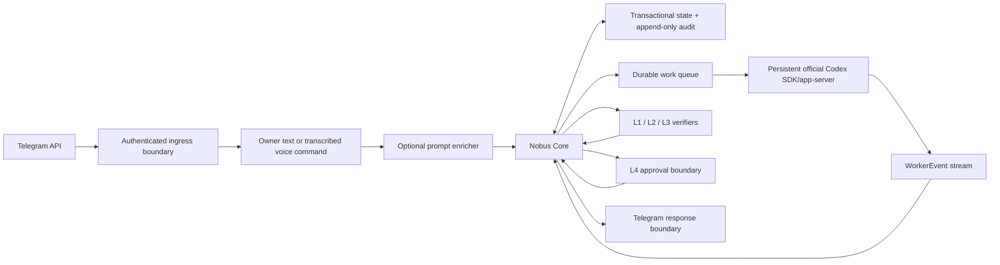

# 03. Архитектурный обзор Nobus Space

**Статус документа:** CANONICAL

**Архитектурный стиль:** детерминированное ядро, сменные адаптеры и исполнители

**Состояние реализации:** CURRENT/PARTIAL; целевая схема обозначена TARGET

**Эталон TARGET MVP-1:** hybrid Server Core + Google Workspace + Windows Local
Library Bridge, Natural Language First и единый document plane определены в
[`12-Эталон-MVP-1-и-дорожная-карта.md`](12-Эталон-MVP-1-и-дорожная-карта.md)
и [ADR 0017](adr/0017-hybrid-natural-google-local-document-plane.md).
Существующие CURRENT-разделы ниже не превращают эти TARGET-компоненты в
реализованные.

## 1. Архитектурная позиция

Nobus Space не является «одной большой LLM». Доверенное ядро принимает решения по проверяемым данным и политикам, а недетерминированные модели работают как заменяемые исполнители с минимальными правами.

Базовые инварианты:

1. Core, а не LLM, управляет правами, риском, состоянием и completion.
2. Внешний ввод становится внутренней командой только на trusted boundary.
3. Каждая сущность связана с tenant и task; никакой глобальный поиск «по имени» не даёт доступа.
4. Все эффекты либо read-only, либо требуют явного capability; внешняя запись требует L4.
5. Результат связан с `contract_digest`, `result_revision` и `result_digest` и проходит разные identities L1/L2/L3.
6. Audit фиксирует решения append-only; operational logs не являются доказательством approval.

## 2. Состояние архитектуры

### CURRENT Queue 1/2 — 24 июля 2026

Этот раздел является единственной активной CURRENT-семантикой. Два исторических
раздела ниже переименованы и не описывают текущий runtime.

- принятые text/voice/L4 jobs до Telegram ACK сохраняются в
  `.runtime/telegram-state.sqlite3`; claim/lease восстанавливается после restart;
- voice/patch/action capabilities и progress-card bindings также durable и
  DPAPI-protected там, где содержат payload;
- безопасная job получает не более трёх claims; затем становится non-blocking
  dead letter, а последующие FIFO jobs продолжают выполняться;
- Task Scheduler — единственный liveness-restart boundary: максимум десять
  перезапусков с минутным интервалом; health task только пишет degraded/corruption
  alert и никогда не останавливает рабочий runner;
- health, backup и restore принимают только точные DDL fingerprints трёх
  runtime БД и перепроверяют application digests; backup всегда содержит полный
  набор БД, manifest аутентифицирован DPAPI;
- public web research выполняется отдельным read-only Codex profile; document,
  download, Git fetch и pip install требуют exact owner L4 capability;
- Git fetch допускает только allowlisted inert local config и exact HTTPS URL;
  pip запускается isolated, без config files, с exact PyPI index, hashes и
  binary-only packages.

Остаточное ограничение Windows path boundary: операции записи повторно проверяют
root/parent identity и reparse ancestors непосредственно перед replace/link, но
не заменяют отдельную ACL/OS identity. До отдельной production identity разрешён
только owner-controlled workspace и quarantine.

### Историческая семантика

Process-memory вариант удалён из канонического CURRENT. Его фактическая история сохранена в Git и в датированных case records.

### TARGET MVP-1

Для `research.web` worker использует два официальных транспорта с одной моделью
и одинаковой read-only policy. Основной — persistent Codex SDK/app-server.
При transient transport failure или отсутствии подтверждённых источников
разрешён ровно один изолированный fallback через pinned `codex exec
--json --ephemeral`. Fallback не получает shell, MCP, apps или workspace-write.
Каждый URL fallback обязан сопровождаться короткой точной цитатой из открытой страницы. Server один раз разрешает DNS, устанавливает TLS непосредственно к выбранному public IP с исходным SNI/Host, повторяет границу на redirect и принимает evidence только при совпадении цитаты с bounded identity-encoded body. Эта transport diversity не расширяет authority задачи и не повторяет внешние эффекты.

Для MVP допустим один deployable process и одна БД. Очередь может быть таблицей задач с безопасным claim/lease; отдельный message broker не вводится до доказанной нагрузки.

## 3. Компоненты и границы

| Компонент | Ответственность | Доверие | CURRENT |
|---|---|---|---|
| Telegram transport gateway | разобрать update, нормализовать text/voice/callback | недоверенный parser | live owner-bound text/voice/callback control plane |
| Authenticated ingress boundary | allowlist actor/chat, replay guard, tenant binding, trusted envelope | доверенный | bot identity + exact owner binding проверяются server-side |
| Voice service | принять ограниченные bytes, локально transcribe и строго валидировать результат | provider недоверен; server-side owner binding доверенный | owner voice сразу получает authority точной команды; отдельный L4 остаётся у удаления и необратимых effects |
| Prompt enricher | предложить instruction/criteria | недоверенный LLM worker | отсутствует |
| Local durable vertical | text/voice → Core → SQLite → Codex → L1/L2/L3 → outbox | локальный MVP | live read-only answer и exact-diff path активны |
| Nobus Core | contracts, policy, state, idempotency, routing, completion | доверенный | MVP-границы реализованы; часть policy registry process-memory |
| State/audit store | транзакционное состояние и append-only evidence | доверенный | SQLite wired; Task+WorkerEvent и terminal Task+outbox атомарны |
| Codex SDK worker | отдельные persistent threads, read-only анализ и public web research | ограниченно доверенный | официальный `openai-codex` app-server, `gpt-5.6-sol/high/Fast`; stable thread per tenant/chat/topic/profile; bounded deadline/interrupt/close/pagination; SDK turn read-only, effects выполняются только доверенными application adapters |
| Verifiers L1/L2/L3 | независимые проверки одной revision | разные identities | локальные разные configured identities; внешняя аутентификация verifiers отсутствует |
| L4 approval boundary | связать решение человека с action/revision и server time | доверенный | owner Telegram callback для exact diff; иной внешний эффект отсутствует |
| Notification adapter | отдать результат без секретов/технических ID | внешняя запись | durable Telegram outbox с lease/ACK/NACK |
| Observability | health, metrics, structured logs, alerts | внутренний | startup CLI preflight есть; независимые alerts/metrics отсутствуют |

## 4. Доверенный вход

Порядок нельзя менять:

1. транспортный parser ограничивает размер и форму update;
2. boundary проверяет Telegram actor/chat по server-side allowlist;
3. external update id преобразуется в tenant-scoped idempotency key;
4. boundary назначает `tenant_id`, `actor_identity`, `received_at` и source metadata;
5. локальный voice provider возвращает строго валидированный transcript;
6. transcript получает authority только из уже проверенного server-side owner binding;
7. обычная обратимая команда сразу передаётся в Core без второй кнопки;
8. удаление и иные необратимые effects переходят к отдельному action-bound L4;
9. Core независимо проверяет instruction, allowlists, permissions, risk и contract;
10. контракт и задача сохраняются атомарно.

Нельзя брать `tenant_id`, permissions, risk, approved state, пути или identity из текста/голоса/LLM output.

## 5. Поток выполнения

### 5.1. Создание

- Trusted envelope получает immutable digest.
- Нормализованный TaskContract получает `contract_digest`.
- Storage atomically регистрирует `(tenant_id, idempotency_key)` и Task.
- Повтор той же доставки возвращает исходный task id без повторного эффекта.

### 5.2. Исполнение

- Core выбирает worker class и capability set.
- Worker получает минимальный view контракта, без SECRET.
- Каждая попытка имеет `attempt_id`, lease и timeout.
- Worker эмитит только типизированные события с sequence.
- Результат сохраняется с новым целочисленным `result_revision`, криптографическим `result_digest` и статусом `draft`.

### 5.3. Проверка

- L1, L2, L3 добавляются строго последовательно.
- Каждый уровень имеет свою identity, method, outcome и evidence.
- Изменение результата или контракта инвалидирует downstream verification.
- Low/medium может завершиться после L3, если нет внешней записи.
- High/critical и любая внешняя запись переходят в `waiting_human`.

### 5.4. L4 и эффект

- Core создаёт approval request с action digest, preview, TTL и nonce.
- Telegram callback проверяется server-side и связывается с tenant/task/revisions.
- Время решения фиксируется сервером, не берётся из callback payload.
- Истёкшее/повторное/чужое решение не выполняет действие.
- Adapter выполняет только ранее подтверждённый action digest.
- Outcome и remote reference фиксируются в audit.

## 6. Модель состояния

CURRENT runtime автомат имеет 18 статусов, включая `executing` для внешнего эффекта после L4; точные переходы описаны в [`05-Спецификации-контрактов.md`](05-Спецификации-контрактов.md). Статус не приходит «готовым» от worker: WorkerEvent является входом, а Core решает переход.

Terminal: `completed`, `failed`, `escalate`. `rejected` audit-locked и может перейти только чистым атомарным обновлением в `rework`; `deferred` — обратно в выполнение. После terminal запись результата, evidence и approval audit-locked.

## 7. Исполнители и роли

Роль — конфигурация capability/quality profile, а не обязательный отдельный сервис.

Минимальные роли MVP:

| Роль | Тип | Права |
|---|---|---|
| Intake normalizer | deterministic code | только построение candidate instruction |
| CLI/code executor | isolated worker | allowlisted repo/worktree и команды |
| L1 verifier | deterministic runner | read-only к result/evidence |
| L2 verifier | independent worker/method | read-only, без identity executor/L1 |
| L3 verifier | adversarial reviewer | read-only, без identity executor/L1/L2 |
| L4 approver | human | разрешение конкретного action digest |

Будущие бизнес-роли (аналитика, карточки, поставки, отзывы, цены, реклама) добавляются после готовности adapters и контрактов. «Промт-инженер» переименован в prompt enricher: он помогает формулировать задачу, но не является security boundary.

## 8. Хранилище

### TARGET logical model

Минимальные сущности:

- `tenants`;
- `actors` и bindings к tenant;
- `ingress_messages` с unique replay key;
- `task_contracts` с immutable revision;
- `tasks` с version для optimistic locking;
- `task_attempts` и lease;
- `worker_events` с unique `(tenant, task, attempt, sequence)`;
- `results` с digest/revision;
- `verifications` L1/L2/L3;
- `approval_requests` и `approval_decisions`;
- `audit_events` append-only;
- `artifact_refs`, а не blobs/SECRET внутри task row;
- `usage_records` для cost/latency.

Критические операции выполняются одной транзакцией: claim task, status transition, save result, add verification level, approve, record external outcome.

### Tenant isolation

- tenant входит в primary/unique keys либо проверяется composite foreign keys;
- любой repository method требует tenant context;
- фоновые jobs не имеют «глобального текущего tenant»;
- cross-tenant analytics работают только по обезличенным агрегатам;
- тесты обязаны включать negative cross-tenant cases.

## 9. Contracts и versioning

- Wire schemas имеют `schema_version`.
- Accepted object immutable; изменение создаёт revision.
- Reader поддерживает текущую и явно перечисленные предыдущие версии.
- Breaking change требует нового schema version и migration/compatibility test.
- Contract/result/action revisions считаются по каноническому представлению и связывают evidence.
- CURRENT Pydantic v1 — переходный контракт: в нём отсутствует часть полей TARGET. Расхождение исправляется до wire freeze и внешнего API, без ложного объявления текущей схемы полной.

## 10. Security architecture

### Threats MVP

- поддельный Telegram update/callback;
- replay и duplicate delivery;
- prompt injection из текста, файла или tool output;
- path traversal и command injection;
- утечка токенов через exception/log/evidence;
- cross-tenant read/write;
- approval reuse или race;
- executor сам подтверждает результат;
- worker выдаёт произвольный event как разрешение;
- отказ во время внешней записи создаёт неизвестный outcome.

### Controls

- allowlist identity + Telegram secret/webhook verification где доступно;
- idempotency и nonce с TTL;
- strict schemas, size limits и sanitized errors;
- no shell string interpolation; argv/command allowlist;
- resolved-path containment;
- process timeout/cancellation и cleanup;
- secret references, redaction и log field allowlist;
- composite tenant keys;
- distinct verifier identities;
- atomic action claim + remote idempotency where supported;
- неизвестный external outcome → `escalate`, без автоматического повтора.

## 11. Voice transcription и owner authority (CURRENT)

Voice boundary:

1. transport передаёт только ограниченные bytes разрешённого типа;
2. downloader применяет hard byte limit до bytes-only service;
3. temp file создаётся атомарно и удаляется при success/error/cancellation;
4. provider работает вне event loop;
5. provider result проверяется строгой схемой и лимитом текста;
6. startup warmup выполняет реальный encoder inference, а не только load модели;
7. русский decoding использует beam search, VAD, cross-segment context и отдельные
   initial context/hotwords для терминов Nobus;
8. raw audio, temp path и provider details не входят в exception chain;
9. transcript из exact owner binding немедленно идёт по тому же policy path, что
   текст; дополнительная кнопка для обратимого действия не создаётся;
10. удаление и иной необратимый effect всё равно создаёт отдельный one-shot L4.

Legacy durable voice-confirmation records сохраняются только для безопасного
restart/reconciliation ранее созданных задач. Новый v2 ingress не выдаёт такие
challenge для обычных owner voice-команд.

## 12. Развёртывание и наблюдаемость

Начальный topology — один service process и Postgres на локальной/закрытой среде. VPS возможен после threat model, secrets management и restore drill. Kubernetes, event bus и микросервисы не требуются MVP.

Обязательные сигналы:

- readiness/liveness без секретов;
- queue depth и oldest task age;
- task duration/error rate по stage;
- duplicate/replay rejects;
- L4 pending/expired count;
- worker lease/timeouts;
- transcription failures и cleanup failures;
- backup age и last restore result;
- usage/cost по tenant/provider/model/policy version.

Критические alerts должны иметь канал вне Telegram, иначе отказ Telegram скрывает отказ системы.

## 13. Осознанно отложено

- отдельный message broker;
- микросервисное разделение;
- браузерные агенты и прокси;
- автоматические внешние записи;
- multi-user RBAC;
- self-learning, меняющий policy;
- бюджеты/автоматическая оптимизация LLM до накопления usage data;
- собственные сайты и коммерческий SaaS.

## 14. Критерий архитектурной интеграции

Компонент считается интегрированным только когда:

1. его trust boundary и contract описаны;
2. happy path и негативные сценарии автоматизированы;
3. tenant/replay/secret/cancellation cases проверены по риску;
4. result/evidence reproducible;
5. наблюдаемость и rollback/cleanup определены;
6. независимый reviewer подтвердил L2/L3;
7. фактический commit записан в CURRENT-STATUS.

## Связанные решения

- [`adr/0001-platforma-zamenyaet-menedzhera-marketpleisa.md`](adr/0001-platforma-zamenyaet-menedzhera-marketpleisa.md)
- [`adr/0002-determinirovannoe-yadro-smennye-llm.md`](adr/0002-determinirovannoe-yadro-smennye-llm.md)
- [`adr/0003-kanal-prodazh-abstraktsiya.md`](adr/0003-kanal-prodazh-abstraktsiya.md)
- [`adr/0005-agent-prompt-inzhener.md`](adr/0005-agent-prompt-inzhener.md)

## Durable Telegram admission (Queue 1)

`Telegram update → trusted ingress → encrypted SQLite admission → CAS lease →
Codex/effect worker → task/outbox → Telegram`.

SQLite хранит job envelope, одноразовые capabilities и identity progress-сообщения.
DPAPI привязывает чувствительный payload к текущему Windows user. Lease имеет отдельный
`lease_id`, поэтому stale ack не может удалить повторно выданную работу. Потеря
heartbeat отменяет child operation. Supervisor получает fail-fast вместо тихо
остановившегося worker.

## Capability profiles and owner effects (Queue 2)

Обычный текст не получает authority из формулировки. Права выбираются только закрытым
профилем/командой. `research.web` остаётся read-only. Artifact/download/network effects
сначала создают точный encrypted proposal, затем требуют actor/chat/tenant-bound L4.
Файловая запись ограничена `NOBUS SPACE BOT`; произвольный shell запрещён.
## Product routing and bounded context (MVP-1)

`owner text/confirmed voice → deterministic intent hints → closed planner/profile
→ durable job/effect → outbox → Telegram`.

Календарь, Google Tasks/Drive, Business Notes, web research, создание документов,
отправка и анализ файлов выбираются до общего answer-worker. Planner не получает
инструменты. Публичный research имеет только web-search; обычный answer не имеет
web, MCP, shell или прямого filesystem-доступа.

Server-side owner boundary индексирует только `C:\Хранилище\АГЕНТ`, исключая
`C:\Хранилище\WORK`. Для анализа явно выбранного файла сервер извлекает не более
24 000 символов из разрешённых text/HTML/JSON/CSV/Word/Excel типов, связывает
контент с digest и маркирует его как untrusted data. PDF передаётся владельцу
вложением, но не разбирается без отдельного проверенного parser dependency.

Создание артефактов ограничено owner workspace. Перезапись существующего файла
невозможна без проверенного snapshot вне workspace, digest-проверки, атомарной
записи и возможности восстановления.
