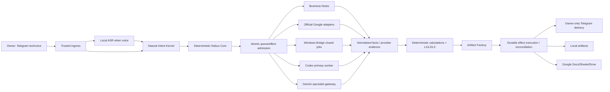
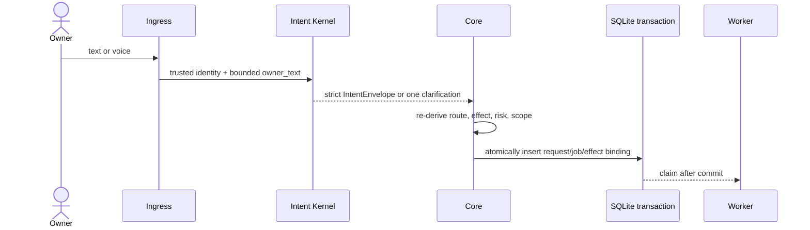
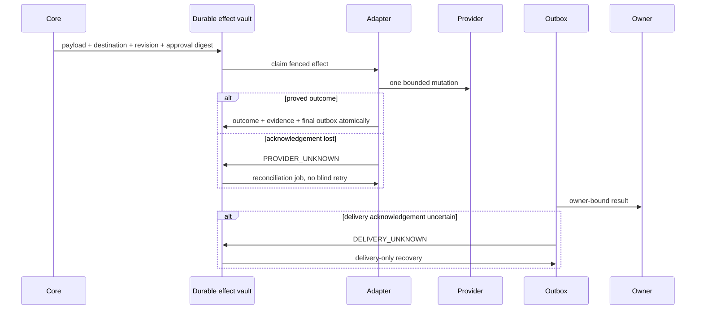

# 13. Интегрированная архитектура MVP-1 Nobus Space

**Статус документа:** CANONICAL TARGET

**Статус решения:** ACCEPTED FOR IMPLEMENTATION

**Статус реализации:** NOT CURRENT; Gate 0–8 не считаются пройденными

**Исследовательская база:** `9d816b35d3f419b42e24ad09ae6aadc92c33db43`

**Дата:** 28 июля 2026 года

**Назначение:** связать архитектуры Gate 0–8 в одну систему, определить
владельца каждого контракта, разрешить межблочные противоречия и не допустить
создания второго бота или параллельных framework.

Детальные исследования и архитектуры:
[`docs/gates`](gates/README.md).

## 1. Итоговый архитектурный вердикт

MVP-1 не переписывается с нуля. Сохраняются существующие Telegram ingress,
durable queue/outbox, Business Notes, Calendar/Tasks adapters, owner effects,
Google read adapters, snapshot/CAS primitives и проверки границ. Они
последовательно приводятся к одной модели контрактов и одному effect plane.

Главная причина прежнего движения по кругу — не «слишком мало прав» и не
отсутствие ещё одного agent framework. Проблема была в незавершённых границах
между уже существующими частями:

1. документный TARGET и фактический runtime могли относиться к разным commit;
2. effect и queue job создавались не одной транзакцией;
3. неопределённый результат провайдера смешивался с неопределённой доставкой
   ответа в Telegram;
4. local path и Google IDs могли просачиваться через слишком широкий contract;
5. для Google Sheets и Drive обещалась CAS-семантика, которой официальный API
   в требуемом виде не гарантирует;
6. модели, adapters и legacy parsers частично дублировали определение intent;
7. supervisor считался достаточной singleton-защитой, хотя не давал
   глобального fencing;
8. rollback кода ошибочно мог восприниматься как rollback внешних эффектов.

Исправление — один минимальный конвейер с закрытыми DTO, явными владельцами
полномочий, evidence-bound переходами и специализированными adapters.

## 2. Продуктовый образ результата

Владелец пишет или произносит обычный запрос. Nobus:

1. понимает намерение без обязательной slash-команды;
2. задаёт один вопрос, если без него нельзя выбрать объект или действие;
3. ищет только в разрешённом Google/local scope;
4. читает минимально необходимые ranges/pages/sections;
5. считает показатели детерминированно и сохраняет provenance;
6. возвращает короткий Telegram-ответ либо согласованные
   Telegram/JPEG/HTML/PDF/XLSX/DOCX;
7. создаёт или изменяет Calendar/Tasks/documents только через application-owned
   adapter;
8. не повторяет внешнюю запись вслепую после потерянного ответа;
9. сообщает понятный `DENIED`, `AMBIGUOUS`, `CONFLICT`, `DEGRADED` или
   `RECONCILING`, а не общий `worker_failed`.

Slash-команды остаются операционным fallback. Модели не получают OAuth,
Telegram token, shell, ambient filesystem или универсальный MCP tool.

## 3. Одна система, а не набор ботов



`Nobus Core` остаётся единственным владельцем routing, policy, tenant binding,
approval, idempotency, queue/effect state и reconciliation. Codex — основной
planner/analyst, Gemini — Google-specialist. Оба возвращают предложения и
содержание, но не исполняют внешние эффекты.

## 4. Владение контрактами

| Контракт или ответственность | Единственный владелец | Потребители |
|---|---|---|
| Baseline Evidence Pack, Product Contract, corpus | Gate 0 | Gate 1–8, release |
| `SemanticProposal`, `IntentEnvelope`, clarification frame | Gate 1 | Core/router/policy |
| Scope/deny/output registries и document contracts | Gate 2 | Gate 3/5/6/7 |
| Google identity, OAuth, REST adapters, provider budget | Gate 3 | Gate 4/5/7 |
| Durable effect lifecycle, provider outcome, delivery outbox | Gate 4 | Все write adapters |
| Bridge protocol, opaque local identity, bounded parsers | Gate 5 | Gate 6/7/8 |
| `NormalizedFact`, `AnalysisResult`, calculation manifest | Gate 6 | Gate 7 |
| `ValueToken`, `ArtifactDocument`, artifact manifest | Gate 7 | Delivery/writeback |
| Release manifest, global fencing, health, backup/pilot evidence | Gate 8 | Operations |

Потребитель не определяет собственную альтернативную версию upstream
контракта. Совместимость добавляется только при существующем реальном
потребителе и с ограниченным сроком удаления.

## 5. Сквозной поток запроса

### 5.1. Admission



Для effect-bearing запроса `effect record` и `queue job` создаются в одной
SQLite transaction. Состояние, при котором одно создано без другого, является
инвариантным нарушением и блокирует health PASS.

### 5.2. Чтение и анализ

1. Intent ссылается только на canonical project/client/source aliases.
2. Gate 2 policy возвращает разрешённые opaque scopes.
3. Поиск выполняется metadata-first.
4. При одном точном кандидате создаётся `DocumentRef`; при нескольких Core
   просит владельца выбрать.
5. `DocumentReadPlan` фиксирует exact source, revision, ranges/pages/sheets и
   лимиты.
6. Adapter повторно проверяет binding и revision перед чтением.
7. Parser выдаёт typed facts с lineage, а не бесформенный текст.
8. Reconciler показывает missing/conflict/OCR uncertainty.
9. Расчёты выполняются `Decimal`/versioned rules отдельно от narrative.
10. Один `AnalysisResult` передаётся Gate 7.

Модель не получает весь файл «для удобства», не выполняет формулы и не
превращает missing в zero.

### 5.3. Формирование результата

`AnalysisResult` компилируется один раз в `ValueToken` и
`ArtifactDocument`.

- Telegram, HTML, JPEG и PDF используют одну semantic HTML presentation;
- JPEG/PDF являются render одного и того же DOM;
- XLSX/DOCX сериализуют те же `ValueToken`;
- renderer не пересчитывает бизнес-показатели;
- manifest связывает source revisions, facts digest, rules, template, fonts,
  browser/library versions, output digest и destination.

### 5.4. Внешняя запись



## 6. Нормативная effect model

### 6.0. Физическая граница атомарности

Все authority-bearing effect tables — intent, job, admission/final outbox,
provider binding, lease/attempt metadata и reconciliation evidence — находятся в одной
authoritative effect SQLite DB. Атомарность не строится на `ATTACH`, dual write
или coordinated commit нескольких DB. Каждый child row содержит `tenant_id` и
composite foreign key `(effect_id, tenant_id)`; все update/claim predicates
включают оба поля.

Остальные runtime DB хранят domain data или idempotent projections. Они
связываются immutable ID/revision/digest и outbox, но не участвуют в authority
transaction. Миграция переносит legacy queue/effect authority в один store и
запрещает постоянный dual-write compatibility mode.

Жизненный цикл и результат провайдера — две разные оси.

### 6.1. Lifecycle

```text
ADMITTED
  -> CLAIMED
  -> EXECUTING
  -> DELIVERY_PENDING
  -> DELIVERING
  -> SETTLED

EXECUTING -> PROVIDER_UNKNOWN -> RECONCILING
RECONCILING -> DELIVERY_PENDING | PROVIDER_UNKNOWN
(manual_review_required is non-authoritative metadata over PROVIDER_UNKNOWN/NONE)

DELIVERING -> DELIVERY_UNKNOWN
DELIVERY_UNKNOWN -> SETTLED (exact owner confirms receipt)
DELIVERY_UNKNOWN -> DELIVERING (fresh owner-authorized resend generation)
```

Точные terminal/recovery states определяются только Gate 4; продуктовые labels не записываются как lifecycle. При этом
`APPLIED`, `REJECTED` и `CONFLICTED` не являются lifecycle states.

### 6.2. Provider outcome

```text
NONE | APPLIED | REJECTED | CONFLICTED | CANCELLED
```

Инварианты:

- `PROVIDER_UNKNOWN` запрещает повтор provider mutation до reconciliation;
- `DELIVERY_UNKNOWN` не возвращает effect к provider execution;
- доказанный outcome, provider evidence/binding и финальный owner-bound outbox
  фиксируются атомарно;
- `SETTLED` требует доказанного outcome и terminal delivery evidence;
- release rollback не отменяет уже произошедший внешний effect;
- перед rollback/restart admission и dispatch замораживаются, фиксируется
  recovery watermark, а неизвестные состояния reconcile или переводятся в
  manual review;
- rollback кода отделён от data restore: DB/snapshot можно восстановить только
  при доказанном отсутствии внешних effects и новых подтверждённых данных после
  watermark; иначе обязателен forward repair или manual L4.

## 7. Document authority и identity

### 7.1. Local

Снаружи Windows Bridge локальный `DocumentRef.source_id` — только
Bridge-minted opaque `doc_id`. Относительный или абсолютный путь не покидает
доверенную Bridge boundary и не передаётся модели/Core как authority.

Bridge:

- принимает только закрытый signed job;
- разрешает `doc_id` по versioned registry;
- проверяет root file identity, ACL, containment, reparse/hard-link policy;
- использует bounded parser без сети и с CPU/memory/time/byte limits;
- выполняет create/update через snapshot, digest CAS, same-directory atomic
  replace и readback;
- при Windows sharing violation останавливается, не применяя
  `delete + rewrite`.

### 7.2. Google

Google file/folder IDs хранятся и разрешаются на стороне Core adapters.
Модель работает с opaque references/aliases.

Google critical path использует официальные Workspace REST APIs:

- Calendar — event ID, ETag/`If-Match`, recurrence/timezone и readback;
- Tasks — task/list binding, marker/idempotency и readback;
- Drive/Docs/Sheets read — metadata/range/structured APIs;
- Docs update — `requiredRevisionId`;
- Sheets existing in-place update — только после отдельного доказанного
  single-writer contract; иначе новая версия/copy или fail closed;
- Drive blob overwrite — новая версия/file по умолчанию, пока официальный
  строгий precondition не доказан;
- native Google create — private marker в `appProperties` и reconciliation;
- binary upload — pre-generated file ID либо resumable status probe.

Workspace MCP/CLI может быть read-only canary или reference implementation.
Он не получает policy/effect authority и не является production executor.

## 8. Identity и ключи

Не используется один универсальный секрет для всех trust boundary.

| Профиль | Решение |
|---|---|
| Registry/release artifact integrity | offline/build signature profile, versioned key ID и rotation |
| Windows device identity | non-exportable CNG P-256 certificate/key через Schannel/WinHTTP |
| Network reachability | Tailscale grants, но не как application authorization |
| Application authorization | mTLS device binding + signed/fenced closed job |
| Telegram bot token | только активный server Core |
| Google OAuth | только Core Google adapter/token broker |
| Backup recovery key | отдельно от VPS и application identity |

DPAPI blob или private key не копируется между identities/hosts. При переносе
секрет re-enroll/reauthorize. Bridge не получает Telegram или Google
credentials.

## 9. Provider и tooling strategy

### Принято

- Python и существующий репозиторий;
- Pydantic v2 как единственный source закрытых DTO;
- SQLite single-node MVP с WAL/transactions и coordinated backup fence;
- official Google Workspace REST;
- `google-genai`/Vertex AI как основной Google-specialist path;
- local `faster-whisper` для voice;
- stdlib + `python-docx`, `openpyxl`/`XlsxWriter`, `pypdf` и bounded fallbacks;
- Jinja + semantic HTML + Vega-Lite + pinned Playwright;
- systemd на VPS, WinSW на Windows;
- Tailscale reachability + application mTLS/fencing;
- restic off-host backup и portable restore drill.

### Не входит в MVP-1 critical path

- OpenAI Agents SDK, Google ADK, LangGraph, PydanticAI;
- Temporal, Celery, Redis broker, n8n, Zapier или Make;
- Kubernetes, active HA, второй Telegram poller;
- OPA/Cedar/Casbin;
- generic filesystem/Google MCP executor;
- arbitrary RAG/vector database;
- Gotenberg/LibreOffice service без отдельного hardened adapter;
- автоматическая миграция на PostgreSQL.

Новый инструмент добавляется только после benchmark на реальном corpus и если
удаляет больше сложного кода, чем создаёт operational/security surface.

## 10. Deployment architecture MVP-1

```text
Linux VPS
  systemd
    -> one immutable Nobus Core release
    -> one globally fenced Telegram poller
    -> policy / queue / effect / reconciliation
    -> Google adapters / Codex / Gemini
    -> dynamically inventoried SQLite DB set

Windows PC
  WinSW
    -> one authorized Bridge
    -> closed local-library operations
    -> device-bound non-exportable key

Recovery
  coordinated SQLite snapshot set
    -> encrypted restic repository off-host
    -> portable restore drill with credential re-enrollment
```

SQLite остаётся MVP-1 default для одного Core writer. PostgreSQL рассматривается
только при измеримом trigger: несколько writers, подтверждённая нехватка
throughput/locking либо принятая HA-архитектура. SQLite никогда не размещается
на network filesystem.

Release inventory обнаруживает все фактические runtime DB и включает каждую в
snapshot/restore manifest; фиксированный список из «трёх» или «четырёх» DB не
является достаточной проверкой.

Supervisor не является global singleton. Один poller обеспечивается
совокупностью:

- единственной custody bot token;
- process singleton;
- durable generation lease/fencing;
- freshness/readiness evidence;
- запрета автоматического restart во время acceptance.

## 11. Composite health

PASS возможен только при свежем согласованном evidence:

- exact docs/repository/runtime/process commit/digests;
- один polling consumer и свежая polling readiness;
- Core/Bridge identity и generation lease;
- Google adapter identity/budget/readiness;
- все runtime DB integrity/schema/migration checks;
- queue/outbox не имеют просроченных orphan;
- любой unreconciled `PROVIDER_UNKNOWN`/`DELIVERY_UNKNOWN` блокирует PASS;
- registry/digest/policy bindings совпадают;
- нет cross-tenant, duplicate или unrequested effects;
- backup set проверен и portable restore воспроизведён;
- natural product smoke и 72-hour pilot завершены.

DB health без worker/polling/provider evidence не является composite health.
`nobus.composite-health.v2` содержит signed evidence chain, boot/sequence,
release/config/schema/DB-inventory digests и probe refs. Отдельно supervised
read-only evaluator сам читает evidence и вычисляет PASS; self-reported
`overall`/`ready` являются только display projection. Replay, missing probe/DB,
digest drift или contradictory counts fail closed.

## 12. Error model

| Класс | Поведение |
|---|---|
| Непонятный intent | Один вопрос, без effect admission |
| Ambiguous document | Metadata candidates, без content read |
| Scope/deny/tenant violation | Fail closed, content/model не получают данные |
| Provider unavailable до mutation | Bounded retry/backoff или safe degraded |
| Mutation outcome unknown | `PROVIDER_UNKNOWN`, reconcile, no blind retry |
| Telegram delivery unknown | Delivery-only recovery, provider не повторять |
| Local/Docs revision conflict | Conflict и новый preview |
| Sheets/Drive без строгого CAS | New copy/version или отказ |
| Bridge offline | Local degraded; Google/Telegram остаются живы |
| Parser/resource limit | Safe typed failure, без partial authority |
| Technical migration/start/health failure | Stop, evidence-bound rollback |
| Procedural smoke error | Исправить на том же runner, без rollback |
| Ambiguous incident | Stop further actions, запросить владельца |

## 13. Последовательность реализации

Gate выполняются последовательно по accepted implementation handoff. Исследование
и архитектура всех Gate уже могут существовать параллельно; это не разрешает
параллельную запись в shared contracts без интеграционного review.

### Gate 0 — зафиксировать истину

- Baseline Evidence Pack;
- Product Contract freeze;
- минимум 80 synthetic natural cases;
- separate docs/repo/runtime/process/Scheduler/DB/config evidence.

### Gate 1 — один входной язык

- strict `IntentEnvelope`;
- local voice parity;
- one clarification FSM;
- убрать обходы через domain-specific parser.

### Gate 2 — одна document authority model

- source/output/deny registries;
- opaque references;
- strict seven-contract family;
- policy before content/model.

### Gate 3 — официальный Google foundation

- Web OAuth/token broker и account binding;
- official REST adapters;
- Vertex/google-genai specialist gateway;
- read-only canary отдельно от production executor.

### Gate 4 — один effect plane

- atomic admission effect+job;
- lifecycle/outcome separation;
- Calendar/Tasks/Notes exact contracts;
- unknown/reconciliation/orphan recovery.

### Gate 5 — тонкий Windows Bridge

- outbound pull protocol v1: `search/read/status/cancel`;
- CNG device identity, mTLS/fencing;
- opaque `doc_id`;
- bounded parsers/index;
- snapshot/CAS/readback primitives без активированного write API;
- Gate 7 добавляет versioned closed write extension
  `prepare_create|commit_create|prepare_update|commit_update|readback` только
  после Gate 5 PASS; unknown operation/version fail closed, compatibility shim нет.

### Gate 6 — факты до текста

- typed structured readers;
- `NormalizedFacts`/lineage;
- deterministic reconciliation/calculations;
- one `AnalysisResult`.

### Gate 7 — один content source, контролируемая запись

- `ArtifactDocument`/`ValueToken`;
- consistent Telegram/HTML/JPEG/PDF/XLSX/DOCX;
- local/Google create/update policies;
- manifest/readback/reconciliation.

### Gate 8 — точный hybrid release

- immutable Core/Bridge artifacts;
- one global poller;
- coordinated backups/portable restore;
- composite health, full smoke, 72-hour pilot.

## 14. Gate handoff и change control

Каждый implementation Gate возвращает:

- exact base/result commit;
- manifest изменённых файлов;
- CURRENT before/after и TARGET remaining;
- migrations/backups/external receipts;
- deterministic L1;
- независимый L2;
- adversarial L3;
- exact L4;
- `READY` или `BLOCKED`;
- inputs и contract digests для следующего Gate.

Если rework меняет contract digest, старые L1/L2/L3 и downstream fixtures
аннулируются. Cross-Gate contract меняется только в интеграционной задаче с
impact analysis.

## 15. Архитектурная приёмка

Архитектура считается достаточно полной для начала Gate 0 implementation,
если:

1. у каждого DTO/state/registry один владелец;
2. нет двух effect engines или routing vocabularies;
3. local path и provider IDs не являются model authority;
4. атомарность admission и provider-outcome/outbox определена;
5. provider unknown отделён от delivery unknown;
6. real CAS заявляется только для backend, где он доказан;
7. renderer не пересчитывает факты;
8. runtime topology содержит один Core/poller/Bridge;
9. rollback учитывает внешние effects;
10. CURRENT нигде не выводится из архитектурного текста.

Фактический MVP-1 PASS остаётся возможен только после реализации и принятия
Gate 0–8 по [`docs/12`](12-Эталон-MVP-1-и-дорожная-карта.md).
