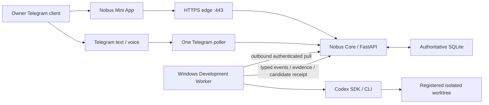

# Gate 2A — Telegram Mini App, Server Control Plane and Development Worker

**Статус документа:** ARCHITECTURE READY

**Статус реализации:** TARGET; Gate 2A не начинался и runtime PASS не заявлен

**Дата:** 30 июля 2026 года

**Research basis:** [RESEARCH.md](RESEARCH.md)

**Normative decision:** [ADR 0020](../../adr/0020-early-miniapp-and-specialist-workers.md)

## 1. Нормативный результат

После Gate 2A владелец получает реально доступный owner-only Telegram Mini App
и может через обычный текст, голос или Mini App управлять разработкой
последующих Gate:

```text
owner task
  -> trusted Telegram ingress
  -> IntentEnvelope(development)
  -> durable task/effect admission
  -> plan
  -> owner approval
  -> Windows Development Worker
  -> Codex in isolated worktree
  -> tests + L1/L2/L3
  -> local candidate commit/ref
  -> Mini App/Telegram verified result
```

Gate 2A является первым bounded live server release новой архитектуры. Это не
финальный MVP-1 release: Google, business effects, documents, analytics,
content writeback и 72-hour pilot остаются Gate 3–8.

## 2. Product Definition of Done

Владелец может:

1. открыть Nobus Mini App из Telegram menu button;
2. увидеть все свои активные, ожидающие решения и завершённые задачи;
3. создать developer-задачу обычным текстом в Mini App либо Telegram chat;
4. увидеть план, exact repository/base и ожидаемый change scope;
5. принять или отклонить план одной явной кнопкой;
6. видеть живой sanitized progress без raw logs;
7. остановить задачу до необратимого действия;
8. увидеть diff summary, verification, evidence и candidate commit;
9. скачать разрешённый patch/report artifact;
10. получить тот же authoritative status через Telegram;
11. пережить restart Core/worker без потери или дублирования задачи;
12. получить понятный `DENIED`, `CONFLICT`, `FAILED`, `CANCELLED`,
    `UNKNOWN` или `NEEDS_OWNER`, а не общий отказ.

## 3. Scope

### 3.1. Входит

- Linux VPS server foundation;
- immutable Python release;
- `systemd` Core supervision;
- one server-held Telegram bot token;
- one globally fenced poller;
- HTTPS owner-only Mini App;
- FastAPI same-origin Control API;
- buildless HTML/CSS/ES modules frontend;
- SSE progress с polling fallback;
- server-side Telegram WebApp authentication;
- exact owner binding;
- task/agent/approval/effect/evidence/artifact views;
- generic durable task, job, approval, effect, outbox и reconciliation plane;
- closed Agent Registry;
- Windows Development Worker под отдельной identity/WinSW;
- outbound device-authenticated worker transport;
- Codex primary development profile;
- registered repository/code scope;
- one task — one worktree;
- plan, patch, tests, verification и local candidate commit;
- bounded deployment, backup, rollback и live smoke Gate 2A.

### 3.2. Не входит

- Google OAuth или production Google calls;
- Calendar/Tasks/Drive writes;
- owner business-document read/write;
- full Web IDE, terminal или arbitrary shell в Mini App;
- direct raw log/stdout/stderr view;
- agent-selected tools/capabilities;
- peer-to-peer agent chat;
- remote/fetch/pull/push;
- GitHub PR/merge;
- active-branch update без отдельного L4;
- live self-update;
- autonomous deploy/restart;
- multi-user SaaS;
- payment/billing management;
- 72-hour full MVP pilot.

## 4. Prerequisites и dependency rule

Gate 2A начинается только после accepted implementation handoff:

| Prerequisite | Обязательный input |
|---|---|
| Gate 0 | product contract, developer/Mini App corpus, owner/risk matrix, exact evidence baseline |
| Gate 1 | `IntentEnvelope`, `development` domain, scoped conversation, voice parity, clarification |
| Gate 2 | repository/source/deny registries, opaque refs, code scope, trusted Git profile |

Gate 3 не начинает integration до accepted Gate 2A handoff. Исследование Gate
3 может существовать, но не меняет shared contracts.

## 5. Целевая topology



### 5.1. Linux VPS trust boundary

Содержит:

- HTTPS edge;
- static Mini App;
- FastAPI Control API;
- trusted Telegram ingress;
- one polling consumer;
- Nobus Core;
- authoritative SQLite;
- server-side agent profiles;
- policy/effect/outbox/reconciliation;
- systemd process and release lock.

### 5.2. Windows Development Worker trust boundary

Содержит:

- отдельную service identity;
- non-exportable device identity;
- Codex auth;
- repository registry private locators;
- isolated worktrees;
- exact-argv tool runner;
- code patch journal;
- test sandbox;
- candidate commit adapter.

Не содержит Telegram/Google credentials и не принимает произвольные paths или
commands от Core/model.

### 5.3. Будущий Windows Document Bridge

Gate 5 создаёт отдельную identity для owner documents. Он переиспользует
Gate 2A transport library и fencing contracts, но не Development Worker
credentials, ACL или repository registry.

## 6. Единственный orchestrator и Agent Registry

### 6.1. Core authority

Только Core:

- аутентифицирует owner/tenant;
- принимает `IntentEnvelope`;
- выбирает route и `AgentRole`;
- назначает capability ceiling;
- создаёт durable task/job/effect;
- выпускает approval challenge;
- выдаёт worker lease;
- проверяет events/results;
- определяет authoritative transition;
- исполняет application effects;
- формирует outbox/delivery;
- выполняет reconciliation.

### 6.2. Closed `AgentRole`

```text
general_orchestrator_worker
google_workspace_specialist
research_analytics_specialist
content_studio_specialist
development_specialist
verification_specialist
```

Gate 2A активирует:

- `general_orchestrator_worker`;
- `development_specialist`;
- `verification_specialist`.

Остальные роли зарегистрированы как `disabled/not_implemented` и не могут
получить lease до PASS своего Gate.

### 6.3. `AgentProfile`

```yaml
schema: nobus.agent_profile.v1
agent_profile_ref: opaque
role: closed AgentRole
implementation_ref: exact worker/adapter version
enabled: strict boolean
host_class: server | windows_development | windows_document
accepted_task_kinds: closed list
capability_profile_ref: exact version
data_class_ceiling: public | internal | confidential | restricted
network_profile_ref: exact version
tool_profile_ref: exact version
budget_profile_ref: exact version
deadline_profile_ref: exact version
output_schema_ref: exact version
verification_profile_ref: exact version
profile_digest: sha256
```

Model/provider names are implementation details behind an exact profile.

### 6.4. `AgentDispatch`

```yaml
schema: nobus.agent_dispatch.v1
dispatch_id: uuid
tenant_id: trusted
task_id: uuid
attempt_id: uuid
contract_digest: sha256
agent_profile_ref: opaque
capability_profile_ref: opaque
input_refs: bounded opaque refs
deadline_at: aware UTC
lease_generation: strict integer
maximum_events: strict integer
maximum_output_bytes: strict integer
dispatch_digest: sha256
```

Worker не может изменить tenant, task, profile, capability, deadline или input
refs в результате.

## 7. Contract ownership

| Contract | Owner Gate |
|---|---:|
| `IntentEnvelope` и development route | 1 |
| repository/source/output/deny refs | 2 |
| `AgentProfile`, `AgentDispatch`, `WorkerResultEnvelope` | 2A |
| `ControlTaskView`, `ControlEventView`, `ApprovalChallenge` | 2A |
| generic task/job/effect/outbox/reconciliation storage | 2A |
| `CodeTaskContract`, `CodePlan`, `PatchCandidate`, `CandidateCommitReceipt` | 2A, importing Gate 2 code scope |
| Google provider bindings/gateway | 3 |
| Notes/Calendar/Tasks effect payloads | 4 |
| Document Bridge jobs and opaque `doc_id` | 5 |
| `NormalizedFacts`, `AnalysisResult` | 6 |
| `ArtifactDocument`, writeback receipt | 7 |
| release/composite health/pilot evidence | 8 |

Ни один downstream Gate не определяет второй вариант этих contracts.

## 8. Durable state

### 8.1. Task lifecycle

```text
RECEIVED
  -> CLASSIFIED
  -> PLANNING
  -> AWAITING_APPROVAL
  -> READY
  -> DISPATCHED
  -> RUNNING
  -> VERIFYING
  -> RESULT_READY
  -> SETTLED

RECEIVED|CLASSIFIED|PLANNING -> REJECTED
AWAITING_APPROVAL -> REJECTED|EXPIRED
READY|DISPATCHED|RUNNING|VERIFYING -> CANCELLING -> CANCELLED
any non-terminal -> FAILED
effect uncertainty -> RECONCILING|NEEDS_OWNER
```

Task status, provider outcome и Telegram delivery outcome не смешиваются.

### 8.2. Generic effect lifecycle

Gate 2A создаёт единственную generic authority, которую Gate 4/7 расширяют
typed payloads:

```text
ADMITTED -> CLAIMED -> EXECUTING -> DELIVERY_PENDING
DELIVERY_PENDING -> DELIVERING -> SETTLED
EXECUTING -> PROVIDER_UNKNOWN -> RECONCILING
DELIVERING -> DELIVERY_UNKNOWN
```

Provider outcome:

```text
NONE | APPLIED | REJECTED | CONFLICTED | CANCELLED
```

Для local code effect `PROVIDER_UNKNOWN` означает неизвестный результат exact
local adapter operation и требует journal/readback reconciliation. Он не
разрешает повтор Git mutation вслепую.

### 8.3. Physical atomicity

Authority-bearing rows для:

- task;
- job;
- agent dispatch/lease;
- approval;
- effect;
- provider/local receipt;
- verification binding;
- final outbox;
- reconciliation evidence

находятся в одной authoritative SQLite DB и используют одну transaction там,
где заявлена атомарность. Mini App projection tables не являются authority.

### 8.4. Core tables

Минимальные logical tables:

```text
tasks
task_revisions
jobs
agent_profiles
agent_dispatches
worker_events
approval_challenges
effects
effect_attempts
effect_receipts
reconciliation_evidence
verification_bundles
artifacts
outbox_messages
webapp_sessions
control_projection
```

Каждый authority child row содержит `tenant_id` и composite binding к parent.

## 9. Mini App product surface

### 9.1. Экраны

1. **Inbox**
   - active;
   - awaiting approval;
   - needs owner;
   - completed/failed.
2. **Task Detail**
   - owner request;
   - normalized goal;
   - route/agent;
   - current status;
   - safe timeline;
   - plan;
   - verification;
   - artifacts.
3. **Approval**
   - action;
   - exact target alias;
   - base/revision;
   - scope;
   - risk;
   - expires;
   - accept/reject.
4. **Development**
   - repository label;
   - base commit;
   - worktree opaque ref;
   - changed-file manifest;
   - diff view;
   - tests;
   - candidate commit.
5. **Agents**
   - role;
   - enabled/degraded;
   - queue/running counts;
   - circuit/budget display without secrets.
6. **Artifacts**
   - allowed reports/patches/evidence;
   - digest/size/format;
   - owner download.
7. **Health**
   - Core/poller/DB/worker readiness;
   - no raw process, path, credential or provider payload.

### 9.2. Task creation

Mini App содержит одно natural-language поле. Client не выбирает raw tool,
capability или agent authority. Optional UI hints (`developer`, `research`)
являются недоверенными suggestions; Core повторно маршрутизирует текст.

Voice остаётся Telegram voice message в MVP-1 Gate 2A. Browser microphone
capture не требуется и не создаёт второй ASR path.

### 9.3. Real-time updates

Primary:

```text
GET /v1/control/events?after=<sequence>
Content-Type: text/event-stream
```

Fallback:

```text
GET /v1/control/tasks/{task_ref}?if_revision=<digest>
```

SSE передаёт только `ControlEventView`, не raw WorkerEvent.

### 9.4. Frontend profile

- packaged static HTML/CSS/ES modules;
- no frontend build service;
- no remote JS/CSS/font dependencies кроме официального Telegram WebApp
  bootstrap script;
- strict CSP;
- no inline scripts;
- accessible labels, focus order и contrast;
- Telegram light/dark theme;
- responsive portrait/landscape;
- no secret/initData/task payload logging.

## 10. Control API

Все DTO strict Pydantic v2, `extra="forbid"`, bounded и versioned.

### 10.1. Authentication

```text
POST /v1/webapp/session
```

Consumes raw bounded `initData`; returns short-lived opaque session bearer,
expiry and session generation.

### 10.2. Tasks

```text
GET  /v1/control/tasks
POST /v1/control/tasks
GET  /v1/control/tasks/{task_ref}
POST /v1/control/tasks/{task_ref}/cancel
```

Create consumes only bounded natural text and optional conversation ref.
Cancel is idempotent and cannot undo an already applied effect.

### 10.3. Events

```text
GET /v1/control/events?after_sequence=<n>
```

Sequence is tenant/session bound. Gap causes bounded snapshot reload.

### 10.4. Approvals

```text
POST /v1/control/approvals/{challenge_ref}/accept
POST /v1/control/approvals/{challenge_ref}/reject
```

No action details are accepted from client. Server resolves the immutable
challenge.

### 10.5. Agents, artifacts, health

```text
GET /v1/control/agents
GET /v1/control/artifacts/{artifact_ref}
GET /v1/control/health
```

Artifact download requires tenant/task binding and content-disposition safety.

### 10.6. API prohibitions

Нет endpoints для:

- arbitrary path;
- shell command;
- raw prompt;
- raw logs;
- env/config;
- credential;
- Git remote;
- process kill/start;
- service deploy/restart;
- policy/skill/prompt edit;
- direct provider effect.

## 11. Telegram WebApp authentication

### 11.1. Login

Core:

1. bounds raw `initData`;
2. parses without trusting fields;
3. verifies Telegram signature for exact bot;
4. verifies `auth_date` within configured short TTL;
5. rejects future/naive/stale time;
6. checks exact owner Telegram identity;
7. consumes login nonce/generation;
8. creates short-lived server session;
9. returns opaque bearer once.

Bearer:

- kept only in Mini App memory;
- never in URL/localStorage/log;
- bound to owner, tenant, bot, session generation and origin;
- expires quickly;
- revoked on token/owner/release generation change.

### 11.2. Action approval

`ApprovalChallenge`:

```yaml
schema: nobus.approval_challenge.v1
challenge_ref: opaque
tenant_id: trusted
owner_identity_ref: trusted
task_id: uuid
task_revision: sha256
action_kind: closed
target_ref: opaque
payload_digest: sha256
precondition_digest: sha256
risk: closed
issued_at: server UTC
expires_at: server UTC
single_use: true
approval_digest: sha256
```

Accept atomically consumes challenge and advances exact task/effect revision.
Replay, expired session, stale revision, changed target/payload/precondition or
already consumed challenge fail closed.

### 11.3. Browser security

- exact Host/origin validation;
- no wildcard CORS;
- HSTS after staged validation;
- CSP default-src self;
- `script-src 'self' https://telegram.org`;
- `object-src 'none'`;
- `base-uri 'none'`;
- frame/navigation policies compatible only with Telegram launch;
- `Referrer-Policy: no-referrer`;
- `X-Content-Type-Options: nosniff`;
- bounded body/query/header sizes;
- login/approval rate limits;
- no sensitive cache;
- sanitized errors.

## 12. Development contracts

### 12.1. `CodeTaskContract`

```yaml
schema: nobus.code_task.v1
task_id: uuid
tenant_id: trusted
owner_request_digest: sha256
repository_ref: opaque Gate 2 ref
expected_base_commit: full git oid
allowed_target_paths_ref: opaque
operation: inspect | audit | change
goal: bounded normalized text
acceptance_criteria: bounded closed list
test_profile_ref: opaque
network_profile_ref: no_network
credential_profile_ref: no_production_credentials
maximum_files: strict integer
maximum_patch_bytes: strict integer
deadline_at: aware UTC
contract_digest: sha256
```

### 12.2. `CodePlan`

```yaml
schema: nobus.code_plan.v1
task_id: uuid
contract_digest: sha256
base_commit: full git oid
target_paths: bounded normalized repo-relative list
steps: bounded list
tests: bounded exact profile refs
risks: closed reason list
requires_approval: true
plan_digest: sha256
```

Plan не разрешает mutation. Target paths обязаны быть subset Gate 2 registry.

### 12.3. `PatchCandidate`

```yaml
schema: nobus.patch_candidate.v1
task_id: uuid
attempt_id: uuid
base_commit: full git oid
plan_digest: sha256
changed_files: bounded manifest
patch_digest: sha256
delete_manifest: bounded manifest
worktree_state_digest: sha256
candidate_digest: sha256
```

Raw patch хранится как bounded protected artifact, а не в Telegram event.

### 12.4. `CandidateCommitReceipt`

```yaml
schema: nobus.candidate_commit_receipt.v1
task_id: uuid
effect_id: uuid
repository_ref: opaque
base_commit: full git oid
candidate_commit: full git oid
candidate_ref: opaque
tree_digest: sha256
patch_digest: sha256
verification_bundle_digest: sha256
approval_digest: sha256
readback_digest: sha256
created_at: server-observed UTC
receipt_digest: sha256
```

Receipt не доказывает integration, deployment или publication.

## 13. Development Worker protocol

### 13.1. Identity

- отдельная Windows service identity;
- no interactive password;
- WinSW pinned;
- no token/password in XML/env/argv;
- non-exportable device authentication key;
- exact worker artifact digest;
- active device generation/lease;
- ACL только registered repo/worktree/runtime directories;
- no owner-document scope.

### 13.2. Transport

Worker устанавливает только outbound connection к exact Core origin.

Transport properties:

- TLS 1.2+;
- device authentication;
- signed closed envelopes;
- nonce/expiry/sequence;
- job lease generation;
- capability digest;
- replay rejection;
- resume from exact event sequence;
- bounded payload/chunk;
- no proxy/netrc/ambient credential inheritance;
- no Core-initiated arbitrary connection to Windows.

### 13.3. Allowed operations

```text
inspect_repository
prepare_worktree
run_codex_plan
run_codex_patch
run_test_profile
collect_verification
prepare_candidate_commit
readback_candidate
cancel_attempt
status
```

Unknown version/operation fails closed.

### 13.4. Prohibited operations

```text
arbitrary_shell
arbitrary_path
git_remote
git_fetch
git_pull
git_push
git_merge
git_rebase
active_branch_switch
service_restart
deploy
credential_read
owner_document_read
policy_or_skill_edit
```

Policy/skill/prompt files may be included only as explicit target paths after
separate high-risk owner approval; default profile denies them.

## 14. Code execution flow

### 14.1. Inspect

Worker resolves opaque repository ref privately and proves:

- registered root identity;
- exact base commit;
- worktree/index state;
- target-path containment;
- no reparse/external object store;
- no overlapping staged/uncommitted target paths;
- no forbidden config/hook/filter/object redirection.

### 14.2. Plan

Codex receives:

- bounded goal;
- architecture references;
- allowed code view;
- no production credentials;
- no network unless exact read-only research subtask is separately admitted;
- closed output schema.

Codex returns `CodePlan`; Core/worker validate it.

### 14.3. Approval

Mutation begins only after one exact owner approval bound to plan/base/scope.
Minor progress updates do not require new approval. Scope/base/target/delete or
external-action drift invalidates approval.

### 14.4. Worktree and patch

- one isolated worktree per task attempt;
- no direct live worktree mutation;
- exact clean disposable baseline;
- patch only allowed targets;
- symlink/reparse/hard-link and `.git` internals denied;
- patch size/file count bounded;
- no auto-stash/reset/checkout of owner changes.

### 14.5. Tests

Test profile is server-owned exact argv:

- targeted tests first;
- static/compile checks;
- impact-selected full suite;
- secret scan;
- diff/forbidden-path scan;
- no production env/credentials;
- no network by default;
- bounded CPU/memory/time/output;
- process tree termination on cancel/timeout.

Model cannot compose shell syntax.

### 14.6. Verification

- L1: deterministic tests/schema/diff/digests;
- L2: clean independent worktree/reproduction or independent verifier method;
- L3: authority, secret, tenant, self-modification, dependency and failure audit;
- executor identity cannot approve its own result;
- exact evidence bound to patch/base/toolchain.

### 14.7. Candidate commit

After exact action-bound approval:

- trusted Git plumbing creates candidate tree/commit/ref through CAS;
- caller active worktree/index remain unchanged;
- hooks/signing/pager/fsmonitor/filters/config/remote/network disabled;
- post-commit tree/diff/ref/readback must equal approved manifest;
- receipt atomically binds effect outcome and owner outbox.

## 15. Server release in Gate 2A

### 15.1. Runtime

- Linux native Python;
- exact offline wheelhouse;
- per-release immutable venv;
- static release directory;
- mutable state outside release;
- `systemd` service identity;
- read-only release filesystem where practical;
- Uvicorn on loopback;
- HTTPS edge on `443`;
- one process lock and durable generation lease;
- no auto-update.

### 15.2. Telegram custody cutover

Gate 2A live activation:

1. freezes new task admission;
2. reconciles or blocks unresolved effects;
3. stops and proves zero previous Windows polling runner;
4. backs up exact runtime DB set;
5. transfers/re-enrolls token into one server secret boundary;
6. starts one Core/poller;
7. proves fresh polling readiness and dedupe/fencing;
8. keeps old runner disabled;
9. registers Mini App menu only after HTTPS/auth readiness.

Token is never present simultaneously in two active polling authorities.

### 15.3. HTTPS edge

Exact edge implementation is selected by read-only server inventory:

- reuse one already managed pinned Nginx/Caddy instance; or
- install one pinned edge artifact under explicit L4.

Gate 2A cannot PASS with:

- direct public Uvicorn;
- self-signed/untrusted mobile TLS;
- exposed API docs/admin/debug;
- unobserved certificate renewal;
- plaintext redirect leakage;
- broad CORS.

## 16. Reliability and recovery

### 16.1. Core restart

- task/job/effect/approval/session authority survives;
- web sessions may be revoked safely;
- active leases fence stale workers;
- Mini App reloads projection by sequence/digest;
- no duplicate Codex/Git mutation.

### 16.2. Worker disconnect

- no new lease until previous generation expires/reconciles;
- running local adapter journal is read back;
- unknown code effect enters `RECONCILING`;
- no blind rerun;
- owner sees `NEEDS_OWNER` when outcome cannot be proved.

### 16.3. Mini App disconnect

Task continues by policy. Reopen creates a new session and reads authoritative
state. Approval is not inferred from a closed UI.

### 16.4. Telegram delivery uncertainty

`DELIVERY_UNKNOWN` allows delivery-only recovery. It never repeats code/provider
effect.

### 16.5. Rollback

Code rollback and data restore are separate:

- stop admission/dispatch;
- capture recovery watermark;
- reconcile unknown effects;
- stop new release;
- restore previous release pointer;
- use DB restore only if no later authoritative data/effects would be lost;
- otherwise forward repair/manual decision.

Candidate commits created before rollback remain facts and are not deleted.

## 17. Observability

### 17.1. Owner-visible

- Core;
- polling;
- DB;
- HTTPS/TLS;
- Development Worker;
- Codex circuit;
- queue/running/approval/unknown counts;
- current release/config/schema digests in opaque shortened display;
- safe incident reason.

### 17.2. Evidence-only

- exact artifact/config/schema digests;
- lease/generation;
- DB quick/integrity checks;
- session/auth counters;
- job/effect/orphan counts;
- worker/tool versions;
- test/evidence refs;
- backup/restore receipt.

### 17.3. Never exposed

- raw argv/env;
- local/server paths;
- host/IP/credential material;
- Telegram initData/token;
- Codex credentials/prompts;
- raw source/business payload;
- raw stdout/stderr;
- private diff unless exact owner task view authorizes it.

## 18. Security and adversarial tests

### Mini App

- forged Telegram signature;
- valid signature for wrong bot;
- wrong owner;
- stale/future auth date;
- replay login;
- stolen/expired session;
- wrong Origin/Host;
- cross-tenant task ref;
- approval replay;
- approval after task revision drift;
- XSS in owner/model/event/diff text;
- CSP bypass;
- oversized request/event stream;
- raw secret/path/log exposure.

### Control plane

- client-selected role/capability/risk;
- worker-selected transition;
- duplicate/out-of-order WorkerEvent;
- lease expiry and stale generation;
- effect/job orphan injection;
- provider vs delivery unknown confusion;
- restart between every transaction boundary.

### Development

- unregistered repository;
- path traversal/reparse/hard-link;
- dirty target overlap;
- malicious Git hook/config/filter/pager/signing/fsmonitor;
- alternates/grafts/replace refs;
- inherited `GIT_*`;
- remote command attempt;
- dependency/test network attempt;
- secret exfiltration;
- patch outside plan;
- self-edit live release;
- self-approve;
- active branch change;
- second termination/retry after unknown outcome.

### Deployment

- two pollers;
- bot token in two active boundaries;
- direct public Uvicorn;
- stale TLS;
- wrong release/config/schema;
- missing/unexpected DB;
- rollback with unresolved effect.

## 19. Implementation slices

Каждый slice имеет RED→GREEN tests и отдельный review, но Gate PASS один.

1. **Contract delta**
   - Gate 0/1/2 inputs;
   - Agent/Control/Code DTOs;
   - schemas and migrations.
2. **Generic durable authority**
   - task/job/approval/effect/outbox/reconciliation;
   - crash tests.
3. **Mini App auth**
   - initData validation;
   - sessions;
   - one-shot approvals.
4. **Control API and projections**
   - tasks/events/agents/artifacts/health;
   - SSE/polling.
5. **Buildless Mini App**
   - all mandatory screens;
   - Telegram themes/accessibility/security.
6. **Server foundation**
   - immutable release;
   - systemd;
   - HTTPS edge;
   - one poller.
7. **Development Worker identity/transport**
   - WinSW;
   - device registration/fencing;
   - closed operations.
8. **Codex/worktree pipeline**
   - plan;
   - patch;
   - tests;
   - verification;
   - candidate commit.
9. **Integrated synthetic tests**
   - Telegram/Mini App/Core/Worker;
   - restart/fault/security.
10. **Bounded live release**
    - backup/cutover;
    - owner Mini App smoke;
    - one synthetic code candidate;
    - rollback drill.

## 20. Acceptance matrix

Gate 2A PASS требует одновременно:

1. Gate 0/1/2 exact accepted digests;
2. full owner-only Mini App доступен через Telegram;
3. signature/freshness/owner/session/replay tests PASS;
4. same-origin API/CSP/rate/size limits PASS;
5. task create/list/detail/event/cancel PASS;
6. plan approve/reject/expire/revision-conflict PASS;
7. one authoritative SQLite and atomic invariants PASS;
8. no orphan job/effect/outbox;
9. one server-held token and one poller;
10. fresh polling readiness;
11. exact immutable server release;
12. HTTPS/TLS readiness and renewal monitoring;
13. one authorized Development Worker generation;
14. worker disconnect/restart recovery PASS;
15. registered repository containment PASS;
16. one-task-one-worktree PASS;
17. Codex closed plan/patch output PASS;
18. no production credentials/network PASS;
19. targeted/static/full impact test profiles PASS;
20. L1/L2/L3 exact patch binding PASS;
21. local candidate commit/ref CAS/readback PASS;
22. active/live worktree unchanged;
23. no remote/fetch/pull/push/deploy;
24. no direct agent-to-agent authority;
25. disabled future agent roles cannot receive lease;
26. Mini App/Telegram show the same task revision;
27. backup and bounded restore drill PASS;
28. live owner smoke PASS;
29. technical failure rollback path proved;
30. exact Gate 2A handoff and local commit accepted.

## 21. Handoff to later Gates

| Consumer | Gate 2A output |
|---|---|
| Gate 3 | server Core, Agent Registry, Google specialist disabled profile, HTTPS/control/effect foundations |
| Gate 4 | one generic effect plane, approvals, provider/delivery unknown and outbox |
| Gate 5 | device transport library; Document Bridge uses separate identity/capabilities |
| Gate 6 | analytics specialist profile, task/event/progress/evidence views |
| Gate 7 | content specialist profile, artifact registry/download and approval surface |
| Gate 8 | early server/DevWorker release baseline, deployment evidence and known rollback path |

Gate 2A handoff содержит:

- exact base/result commit;
- server and Windows artifact manifests;
- schema/config/registry/policy digests;
- HTTPS origin opaque binding;
- bot-token custody receipt without secret;
- Mini App auth/security evidence;
- one-poller/worker readiness;
- DB/backup/restore evidence;
- synthetic candidate commit receipt;
- L1/L2/L3;
- CURRENT before/after;
- remaining TARGET;
- `READY` или `BLOCKED`.

## 22. L4 templates

### 22.1. Implementation L4

```text
Разрешаю Gate 2A MVP-1 Nobus Space — локальную разработку кандидата.

Разрешаю изменить только Gate 2A contracts, generic durable control/effect
plane, FastAPI Control API, buildless Telegram Mini App, server packaging,
Windows Development Worker, Codex/worktree pipeline, synthetic tests и
связанную документацию. Разрешаю offline L1/L2/L3 и один локальный commit
Gate 2A только при полном PASS.

Разрешены только synthetic Telegram/WebApp/provider/device inputs и isolated
test repositories. Запрещены live runtime changes, SSH/deployment, BotFather,
реальный Telegram polling cutover, Google/owner document access, remote,
fetch/pull/push и публикация. Существующие изменения сохранить и не включать
без доказанной принадлежности Gate 2A.

При contract conflict, secret exposure, cross-tenant access, unknown effect или
неоднозначном repository scope остановиться.
```

### 22.2. Live activation L4

```text
Подтверждаю единое live L4-окно принятия точного Gate 2A release
[RELEASE_COMMIT].

Разрешаю read-only inventory точного VPS, DNS/TLS edge, Windows runtime,
Scheduler/poller, registered repository и Development Worker prerequisites.
Разрешаю создать проверенные server/runtime backups по [BACKUP_PATHS],
установить exact immutable Server Core под systemd, настроить
[NOBUS_CONTROL_ORIGIN], перенести единственную Telegram token custody в server
secret boundary, остановить и доказать отсутствие прежнего polling runner,
запустить ровно один server poller, установить один Windows Development Worker
под отдельной identity/WinSW и активировать Mini App menu для owner.

Разрешаю один bounded synthetic smoke: natural developer task -> plan ->
Mini App approval -> isolated worktree -> Codex change -> tests/L1/L2/L3 ->
local candidate commit/ref -> Telegram/Mini App result. Remote, fetch, pull,
push, merge, deploy candidate, Google/owner-document access и другие внешние
effects запрещены.

При технической ошибке identity, migration, integrity, TLS/auth, singleton,
polling readiness, worker fencing, tenant isolation, closed schema, orphan,
candidate readback или незапрошенном effect остановить admission/dispatch,
выполнить evidence-bound rollback и не повторять изменяющее действие
автоматически. Процедурную ошибку smoke разрешаю исправить на том же исправном
release без повторного deployment. Неоднозначность требует решения владельца.
```

## 23. Definition of Ready

Implementation может начаться только когда:

- Gate 0 product delta принят;
- Gate 1 development intent design обновлён;
- Gate 2 repository/code handoff точен;
- владелец подтвердил, что Gate 2A включает ранний server cutover;
- exact VPS/domain/DNS/TLS choices либо известны, либо перечислены как
  action-bound owner inputs;
- нет shared-contract противоречий с Gate 3–8;
- implementation L4 выдан на exact file/scope.
