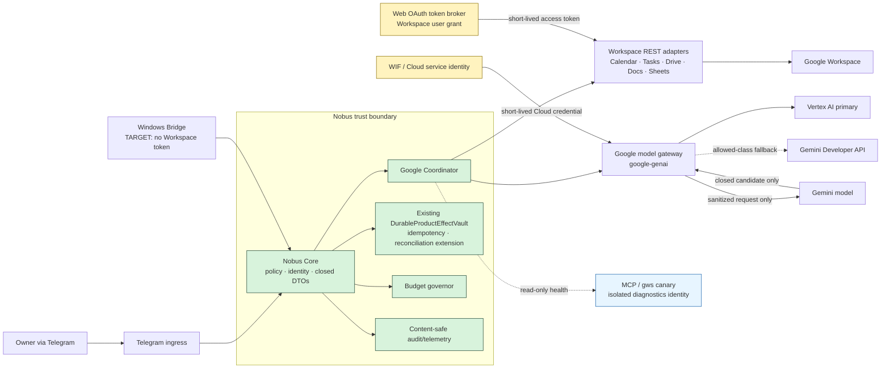
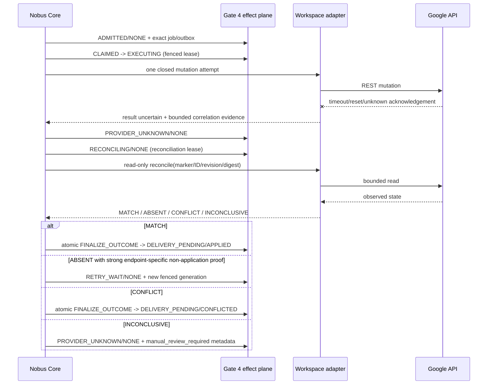

# Gate 3 Architecture — Google Foundation

Status: `TARGET / DESIGN ONLY / ARCHITECTURE READY`
Normative baseline: repository commit `9d816b35d3f419b42e24ad09ae6aadc92c33db43`
Evidence: [RESEARCH.md](./RESEARCH.md)
Vocabulary: `MUST`, `MUST NOT`, `SHOULD` and `MAY` are normative.

## 0.1. Integration addendum — ADR 0020

Gate 3 starts only after accepted Gate 2A and extends its one Core, Agent
Registry, Control API and generic durable effect plane. The
`google_workspace_specialist` is a closed logical worker profile, not a second
bot, backend or OAuth principal. It may propose Workspace plans and return
bounded analytical content, but it receives no refresh/access token and cannot
execute Calendar, Tasks, Drive, Docs or Sheets effects.

Only Core-owned operation-specific adapters receive provider credentials and
execute effects. Gate 3 MUST NOT introduce another queue, journal or effect engine.

## 1. Product decision

Gate 3 establishes Google as a bounded provider plane for Nobus, not as a second product brain.

The final verdict is:

- **ADOPT official Workspace REST APIs and `google-genai`.**
- **Vertex AI is the primary isolated Google-specialist gateway.**
- **Workspace MCP and Google Workspace CLI are read-only canary/diagnostics only, never production authority.**
- **Nobus Core owns policy, identity, closed DTOs, idempotency, reconciliation, budget and telemetry.**
- **A model receives no OAuth/refresh tokens and executes no effects.**
- **Desktop OAuth migrates to a separate Web OAuth/token broker without copying a token file; Google Cloud uses WIF/service identity.**
- **A Google outage does not break Telegram/Core.**

This document defines the TARGET. It does not claim that the target exists in CURRENT.

## 2. Goal, product outcome and non-goals

### 2.1 Goal

Provide one auditable Google foundation that lets later gates:

- read owner-authorized Calendar, Tasks, Drive, Docs and Sheets data;
- use Gemini through an isolated, budgeted Vertex gateway;
- execute explicitly authorized Workspace effects through deterministic Core workflows;
- survive provider, quota, auth and unknown-outcome failures without corrupting state;
- migrate from a Windows desktop grant to a server token broker without credential copying;
- prove privacy, retention, budget and operational behavior before Gate 8 release.

The owner experience must remain simple: Nobus either returns a verified result, reports that no effect occurred, or says that the outcome is being reconciled. It must never manufacture success.

### 2.2 Non-goals

Gate 3 does not:

- replace Nobus Core with Google ADK, Gemini CLI, MCP or another agent runtime;
- make Google the source of truth for Nobus policy, identity or task state;
- implement Gate 4 business semantics, Gate 5 document unification, Gate 6 analytics or Gate 7 artifact production;
- permit autonomous model writes;
- provide multi-tenant domain administration or domain-wide delegation;
- declare runtime, OAuth, billing or release readiness;
- choose final owner budget numbers or widen/change the ADR 0019 Drive-wide
  metadata-discovery contract without owner input;
- modify current code in this design phase.

## 3. CURRENT, reuse and TARGET

### 3.1 CURRENT

At the baseline commit:

- strict/frozen Core contracts and canonical digests exist;
- Calendar has deterministic create IDs and conflict readback;
- Tasks has action markers, same-key locking and unknown-outcome recovery;
- Drive has bounded read-only search/download and ambiguity controls;
- the Google transport loads an authorized-user file and refreshes it locally;
- product adapters contain local retry and timeout behavior;
- Docs, Sheets, Vertex, a token broker, a central budget governor and provider circuits are absent.

### 3.2 Reuse

The implementation MUST reuse:

- the existing `ContractModel` discipline in `src/contracts/models.py`;
- stable task/contract identifiers and canonical digests;
- Calendar deterministic event identity and payload verification;
- Tasks marker-based reconciliation and bounded pagination;
- Drive host, size, request-budget and ambiguity containment;
- existing durable runtime ownership and verification concepts;
- the current adversarial test style.

### 3.3 TARGET

TARGET adds a narrow Google boundary inside the existing architecture:

1. Core validates an owner-bound closed request.
2. Core intersects product policy, granted scopes, data class, health and budget.
3. A Google Coordinator invokes one operation-specific adapter.
4. Credentials are injected by an identity boundary and never enter DTOs, prompts or logs.
5. Reads return closed results with evidence metadata.
6. Model calls return candidate results that Core semantically validates.
7. Effects pass through a durable journal and reconciliation state machine.
8. Telemetry contains operational metadata, not content.
9. Diagnostics use isolated read-only credentials and cannot enter an effects path.

No parallel contract system, agent loop or event store is introduced.

## 4. Component, trust and authority model



### 4.1 Authority rules

| Decision or asset | Sole authority | Explicit exclusion |
|---|---|---|
| Owner and tenant binding | Nobus Core | Provider response, model or email address |
| Product permission | Nobus policy engine | OAuth scope alone |
| OAuth grant/token | Token broker / platform secure store | Model, DTO, logs, Bridge after migration |
| Cloud credential | WIF/service identity provider | Static key file, Workspace user token |
| Model route and data class | Core policy + budget governor | SDK automatic fallback |
| Effect intent | Owner-authorized Core contract | Function call or free text |
| Effect execution | Workspace adapter after journal transition | MCP, CLI or model |
| Idempotency and outcome | Core durable journal | Provider exception text |
| Evidence and audit | Core | Provider chat/session history |

The effective permission for any call is:

`owner identity ∩ product policy ∩ granted OAuth scopes ∩ operation allowlist ∩ data-class route ∩ budget ∩ provider health`.

Every opaque reference is resolved inside Core before a provider call. A Workspace `grant_ref` MUST be stored and looked up under the exact `(tenant_id, owner_subject_id, issuer, provider_subject)` tuple. A `target_ref` MUST resolve to that same tenant/owner grant and an allowlisted resource kind. An `authorization_ref` MUST be one-time or explicitly reusable, unexpired, unrevoked and bound to the exact `contract_digest`, capability, target and destructive flag. The token provider MUST compare these bindings rather than trust caller-supplied references.

The OAuth/OpenID provider subject is an identity binding, not product authority. Email, display name and model/provider claims cannot replace the authenticated Core owner mapping.

If any term is unknown or false, Core MUST fail closed.

## 5. Exact production call paths

### 5.1 Workspace read

1. Telegram ingress creates or resumes a Core task with authenticated owner context.
2. Core constructs a strict `GoogleReadRequest`.
3. Schema and semantic validators verify tenant, operation, target kind, field mask, pagination, size and purpose.
4. Policy intersects the requested capability with the stored grant inventory.
5. Budget/quota governor reserves request units.
6. Google Coordinator selects exactly one operation-specific Workspace adapter.
7. Token broker returns a short-lived access token directly to the adapter transport. The token is never added to the request DTO.
8. Adapter calls the official REST endpoint with an operation deadline and bounded safe-read retries.
9. Adapter normalizes the response into `GoogleReadResult`, dropping unrequested fields.
10. Core validates the result, settles quota/cost, records content-free telemetry and releases a provider-neutral result to the calling Gate.

MCP/CLI is not in this call path.

### 5.2 Model analysis

1. A Gate submits a validated `GoogleModelRequest` referencing Core-controlled, already-read content.
2. Data classification removes or rejects prohibited fields and chooses a retention route.
3. Budget governor estimates the maximum cost from model, input estimate, output ceiling, cache and grounding settings, then reserves it.
4. Gateway resolves a configured model alias; callers cannot submit arbitrary model IDs.
5. WIF/service identity obtains a short-lived Vertex credential directly in the gateway transport.
6. `google-genai` calls Vertex with an explicit project/location, output schema, timeout, token ceiling, storage/grounding settings and correlation metadata. Implicit cache is a verified project-level setting, not a per-request switch; strict and permissive retention routes use separately governed projects when their cache policies differ.
7. The model returns a candidate `GoogleModelResult`. It has no tool authority.
8. Core performs strict parsing, schema validation, domain/range/reference checks and evidence coverage checks.
9. Invalid output is rejected or repaired through at most one separately budgeted, non-effect call; it is never coerced into an effect.
10. Budget is settled from observed usage; logs contain metrics and hashes only.

An optional Gemini Developer API fallback is allowed only when both the route policy and data class explicitly permit it. Fallback is never automatic for confidential data.

### 5.3 Workspace write

1. A business Gate creates a closed effect plan. A model MAY supply only a
   non-authoritative candidate; Core rebuilds and validates the final action.
2. Core verifies fresh owner authority, capability, target, grant,
   preconditions and destructive-action policy.
3. Gate 4 atomically admits one effect as `ADMITTED/NONE`, binding tenant,
   action/request digest, idempotency key, initial execution job and outbox.
4. A fenced Gate 4 lease moves `ADMITTED -> CLAIMED -> EXECUTING`; only then may
   the closed Gate 3 adapter receive one attempt.
5. Adapter performs at most one mutation attempt under the Gate 4 marker/fence:
   Calendar deterministic ID, Tasks marker, Docs revision precondition, bounded
   Sheets expected-state/readback policy, or Drive application marker.
6. A response/readback that proves equivalence is evidence for atomic Gate 4
   `FINALIZE_OUTCOME -> DELIVERY_PENDING/APPLIED`; it is never adapter state
   `SUCCEEDED`.
7. A definitive rejection or precondition conflict is evidence for atomic
   finalization to `REJECTED` or `CONFLICTED`.
8. Timeout/reset/ambiguous response after the attempt marker becomes
   `PROVIDER_UNKNOWN/NONE`. No adapter or journal `PREPARED`, `FAILED`,
   `SUCCEEDED` or generic `UNKNOWN` state exists.
### 5.4 Unknown outcome and reconciliation



Rules:

- Reconciliation is read-only.
- `ABSENT` permits another attempt only if the adapter can prove the original effect cannot later appear and its endpoint strategy is declared retry-safe.
- Otherwise the result is escalated for owner/operator review.
- A second attempt reuses the same logical idempotency key and increments a stored retry generation; it never creates a new user-visible intent.
- Owner-facing status MUST distinguish `verified success`, `verified failure` and `unknown/reconciling`.

The labels in the illustrative sequence above are adapter call results only; they
MUST NOT be persisted as another effect lifecycle. Gate 4 exclusively owns the
authoritative effect row, lifecycle, provider outcome, evidence and delivery.
The mapping is exact:

| Google adapter result | Required Gate 4 transition |
|---|---|
| request not sent / definitive non-application | remain `EXECUTING/NONE` only inside the fenced call, then `RETRY_WAIT/NONE` if policy allows |
| response plus readback proves intended projection | atomic `FINALIZE_OUTCOME` to `DELIVERY_PENDING/APPLIED` |
| provider rejects definitively | atomic finalization to `DELIVERY_PENDING/REJECTED` |
| revision/precondition conflict | atomic finalization to `DELIVERY_PENDING/CONFLICTED` |
| response lost after attempt marker | `PROVIDER_UNKNOWN/NONE` |
| reconciliation starts/inconclusive | `RECONCILING/NONE` then `PROVIDER_UNKNOWN/NONE` |
| applied result observed before Gate 4 finalization crashes | recover only through `PROVIDER_UNKNOWN/NONE -> RECONCILING`; no adapter terminal success exists |

The single authoritative Gate 4 effect DB remains the only durable effects
store. Google adapters return closed evidence objects and never commit
`SUCCEEDED`, `FAILED`, `ESCALATED` or any other parallel terminal state.

## 6. Identity and OAuth architecture

### 6.1 Identities

| Identity | Purpose | Credential form | Storage/issuer | May access |
|---|---|---|---|---|
| Owner Workspace grant | Calendar/Tasks/Drive/Docs/Sheets | Web OAuth refresh grant; short-lived access tokens | Server token broker + secret store | Only approved owner scopes |
| Desktop bootstrap grant | Current Windows integration during migration | Installed-app OAuth with PKCE | Windows Credential Locker or equivalent | Temporary parity/cutover operations |
| Google Cloud workload | Vertex and Cloud control plane | WIF-issued short-lived credential / attached service identity | External identity provider + Google IAM | Allowlisted Vertex/monitoring resources |
| Read-only canary | MCP/CLI health diagnostics | Separate read-only OAuth grant | Isolated operator profile | Read-only test resources |
| Model | Inference only | None | None | No Google credential or effect tool |

The Workspace owner grant and Cloud workload identity MUST never be interchangeable.

### 6.2 Scope matrix

| Capability | Read grant | Write grant | Core capability | Stage |
|---|---|---|---|---|
| Calendar list | `calendar.calendarlist.readonly` | — | `calendar.list.read` | Gate 4 read |
| Owned event read | `calendar.events.owned.readonly` | — | `calendar.event.read` | Gate 4 read |
| Owned event write | same read grant | `calendar.events.owned` | `calendar.event.write` | Separate Gate 4 write enablement |
| Tasks read | `tasks.readonly` | — | `tasks.read` | Gate 4 read |
| Tasks write | `tasks.readonly` | `tasks` | `tasks.write` | Separate Gate 4 write enablement |
| Drive metadata | `drive.metadata.readonly` | — | `drive.metadata.read` | Gate 5 |
| Selected-file content | `drive.file` | `drive.file` | `drive.file.read/write` | Preferred Gate 5/7 path |
| Drive-wide metadata discovery and exact-bound content read | `drive.readonly` | — | `drive.global.read` | Accepted TARGET; restricted-scope verification; Gate 2 exact file/folder binding before content |
| Docs | `documents.readonly` | `documents` or selected-file `drive.file` | `docs.read/write` | Gate 5 read, Gate 7 write |
| Sheets | `spreadsheets.readonly` | `spreadsheets` or selected-file `drive.file` | `sheets.read/write` | Gate 5 read, Gate 7 write |

Rules:

- Read and write grants MUST be separate rollout milestones.
- Where the documented write scope already includes read access, the execution grant MUST NOT require a redundant read-only scope. "Read then write" means staged incremental consent and a separately enabled Core capability.
- Scope inventory MUST store scope identifiers and grant status, not tokens.
- Broad scopes MUST NOT be silently substituted when a narrow scope fails.
- A user OAuth grant is necessary but not sufficient; Core capability remains mandatory.
- Calendar ACL, broad Calendar, full Drive and Workspace administration scopes are denied by default.

### 6.3 Token lifecycle

1. OAuth callback validates exact redirect URI and a one-time, expiring `state` bound to the initiating Core session, tenant, owner, redirect URI and requested scopes. PKCE is mandatory for Desktop OAuth and MAY be added to Web OAuth only when supported and verified for the configured Google client.
2. The identity layer requests `openid` and validates ID-token `iss`, `aud`, one-time `nonce` and stable `sub`; it binds the opaque provider subject to the already authenticated Core owner. Email is neither authority nor a log field. Wrong-account consent fails closed.
3. Token broker exchanges the code and stores refresh material encrypted at rest.
4. Only the broker may read refresh material.
5. Adapters request an access token for an exact tenant/owner-bound grant and capability; returned tokens remain in process memory for the shortest practical period.
6. Access-token cache is bounded by token expiry minus safety skew.
7. Refresh uses single-flight locking per grant.
8. If and only if the refresh response contains a new refresh token, rotation atomically replaces the stored value; otherwise the current refresh token remains. Old material is not retained in logs or task state.
9. `invalid_grant`, revoked consent, account security event or scope mismatch transitions the grant to `REAUTH_REQUIRED`.
10. Revocation disables new calls immediately, clears access-token caches, freezes dependent effects and schedules best-effort provider revocation.
11. Audit records only opaque grant reference, provider-subject HMAC, scope set, transition, timestamp and random correlation ID.

Tokens, authorization codes, client secrets, cookies and credential JSON MUST NOT appear in Markdown, DTOs, prompts, traces, exception payloads or `.nobus-quality`.

### 6.4 Desktop-to-Web migration

| Phase | Required action | Pass condition | Rollback |
|---|---|---|---|
| 0 — Inventory | Record capabilities/scopes and current adapter behavior without reading/copying token material | Approved grant map and tests | No change |
| 1 — Web client | Create separate server Web OAuth client and token broker in implementation phase | Callback/state/nonce/subject/secure storage tests pass | Keep Desktop path active |
| 2 — Fresh consent | Owner authorizes read-only Web grant | Read-only parity canary passes | Revoke new grant |
| 3 — Read cutover | Server reads use Web broker; Desktop remains available but not authoritative | Evidence-equivalent reads and outage tests pass | Feature flag to Desktop read path |
| 4 — Write consent | Owner separately grants exact write scopes | Golden and unknown-outcome tests pass | Freeze server writes |
| 5 — Write cutover | Server becomes sole Workspace effects authority | Durable journal and audit prove outcomes | Freeze effects; do not return authority to model/CLI |
| 6 — Bridge removal | Windows Bridge becomes tokenless for Workspace | All Bridge flows use provider-neutral contracts | Temporary read-only Desktop fallback |
| 7 — Revoke old grant | Revoke Desktop grant and remove local secure record after rollback window | No production dependency remains | Requires fresh consent, not token restoration |

At no phase may an installed-app token file be copied to the server.

### 6.5 WIF and Cloud identity

- VPS/server workloads MUST use WIF or an attached keyless service identity.
- Long-lived service-account keys are prohibited.
- IAM grants MUST be limited to the selected Vertex project/location and required telemetry/billing-read resources.
- Domain-wide delegation MUST NOT be enabled.
- Cloud identity failure affects the model gateway only; it MUST NOT invalidate Workspace OAuth or Telegram/Core.

## 7. Closed contracts and semantic validation

All Gate 3 contracts extend the existing strict/frozen `ContractModel` behavior in `src/contracts/models.py`. They use `schema_version`, forbid extra fields, use canonical digests and reject sensitive key names. These are boundary contracts, not a second domain model.

### 7.1 Common operation context

| Field | Type / constraint | Meaning |
|---|---|---|
| `schema_version` | exact supported version | Contract evolution |
| `tenant_id` | non-empty canonical ID | Tenant boundary |
| `owner_subject_id` | opaque internal ID | Authenticated owner; never email |
| `task_id` | durable task ID | Core correlation |
| `operation_id` | unique attempt-independent ID | One logical operation |
| `idempotency_key` | required for effects; absent for pure reads | Stable deduplication key |
| `purpose` | closed enum | `calendar`, `tasks`, `document_read`, `analytics`, `artifact_write`, `canary` |
| `data_class` | closed enum | `PUBLIC`, `INTERNAL`, `CONFIDENTIAL`, `RESTRICTED` |
| `deadline_at` | UTC timestamp | Absolute Core deadline |
| `contract_digest` | computed, non-serialized SHA-256 property | Immutable identity of the named canonical request projection |

Email addresses, raw OAuth subjects, provider tokens and arbitrary metadata maps are forbidden. Core resolves every reference against the same tenant/owner binding before serialization to an adapter.

`Gate3CanonicalRequestV1` is the only digest projection: canonical serialization of the complete closed request with the computed `contract_digest` property omitted. Core computes the digest; it is not accepted as an independent caller value. If a transport envelope carries a claimed digest, Core recomputes and compares it before policy, cursor, approval, idempotency or provider work. All such bindings MUST name the same projection/version. A digest rule change requires a new projection version and explicit compatibility tests.

### 7.2 `GoogleReadRequest`

| Field | Constraint |
|---|---|
| `context` | Common operation context |
| `service` | `calendar`, `tasks`, `drive`, `docs`, `sheets` |
| `operation` | Closed operation enum per service |
| `target_ref` | Provider-neutral typed reference bound to tenant, owner, grant and resource kind; raw ID only inside an adapter-owned sealed reference |
| `field_mask` | Allowlisted fields only |
| `bounds` | Closed object: item/page/byte/cell/date-range ceilings |
| `consistency` | `best_effort`, `required_revision`, or `snapshot` where supported |
| `page_cursor` | Opaque cursor produced by the same adapter and request digest |

`GoogleReadResult` contains `status`, normalized records, `truncated`, next cursor, evidence references, observed revision/version, provider timestamp and non-content diagnostics. It MUST NOT return raw SDK objects.

Semantic validation MUST reject:

- cross-tenant references;
- operation/target mismatches;
- unbounded searches or ranges;
- fields outside the operation allowlist;
- cursors not bound to the same request digest;
- bytes, cells or item estimates over policy;
- ambiguous file/calendar/list resolution.

### 7.3 `GoogleModelRequest`

| Field | Constraint |
|---|---|
| `context` | Common operation context |
| `model_alias` | Core allowlist; no arbitrary provider model ID |
| `task_kind` | Closed analytical/extraction enum |
| `input_parts` | Sanitized text/chunks with evidence references; no credentials |
| `output_schema_id` | Registered closed schema |
| `max_output_tokens` | Policy ceiling |
| `retention_profile` | `ZDR_STRICT`, `TRANSIENT_ALLOWED`, or `PUBLIC_RESEARCH` |
| `cache_policy` | `OFF`, `IMPLICIT_ALLOWED`, `EXPLICIT_TTL` |
| `grounding_policy` | `OFF` or `SEARCH_ALLOWED` |
| `fallback_policy` | Explicit ordered allowlist |

`GoogleModelResult` contains `status`, typed candidate, evidence bindings, validation findings, provider/model alias, token usage, cache/grounding usage and finish reason. Raw reasoning traces are forbidden.

Semantic validation MUST verify:

- every referenced source exists in the input evidence set;
- enums, numerical ranges, dates and cross-field invariants;
- output size and nesting bounds;
- no tool/function/effect instruction is present;
- no credential-like field or secret marker is present;
- facts required for an effect are backed by current authoritative reads.

### 7.4 `GoogleEffectRequest`

| Field | Constraint |
|---|---|
| `context` | Common context with required idempotency key |
| `service` / `operation` | Closed write allowlist |
| `target_ref` | Typed, tenant-bound target |
| `desired_state` | Operation-specific strict object |
| `precondition` | Revision/etag/expected-state digest or explicit create absence condition |
| `authorization_ref` | Unexpired Core approval bound to tenant, owner, exact request digest, capability, target and destructive flag |
| `reconcile_strategy` | Adapter-declared closed enum |
| `destructive` | Explicit boolean; destructive policy requires owner confirmation |

`GoogleEffectReceipt` contains journal state, logical operation ID, request digest, provider correlation reference, verified resource reference, observed revision, reconciliation status and timestamps. It MUST NOT claim success until semantic readback passes.

### 7.5 `GoogleReconciliationResult`

Allowed outcomes:

- `MATCH` — observed provider state is semantically equivalent to desired state;
- `ABSENT` — no marker/ID/revision match was found within bounded authoritative reads;
- `CONFLICT` — a resource exists but differs or the precondition is invalid;
- `INCONCLUSIVE` — evidence is insufficient or the provider remains unavailable.

It contains an evidence digest and bounded observation metadata, not document/event/task content.

### 7.6 Adapter interfaces

The following logical interfaces are normative; concrete names may follow repository conventions during implementation:

```text
WorkspaceReadAdapter.execute(GoogleReadRequest) -> GoogleReadResult
WorkspaceEffectAdapter.prepare(GoogleEffectRequest) -> PreparedProviderCall
WorkspaceEffectAdapter.execute_once(PreparedProviderCall) -> GoogleEffectReceipt
WorkspaceEffectAdapter.reconcile(GoogleEffectRequest) -> GoogleReconciliationResult
GoogleModelGateway.generate(GoogleModelRequest) -> GoogleModelResult
TokenProvider.access_token(tenant_id, owner_subject_id, grant_ref, capability) -> short_lived_token
CloudCredentialProvider.credential(audience, capability) -> short_lived_credential
BudgetGovernor.reserve(cost_envelope) -> reservation
BudgetGovernor.settle(reservation, observed_usage) -> settlement
ProviderHealth.allow(service, operation_class) -> decision
```

Provider SDK request objects MUST remain inside adapters.

## 8. Resilience and correctness

### 8.1 Deadline budget

Initial TARGET defaults are configuration with hard upper bounds:

| Operation | Per-attempt timeout | Overall Core budget | Notes |
|---|---:|---:|---|
| Calendar/Tasks metadata read | 15 s | 35 s | At most two retries inside overall budget |
| Drive metadata/search | 20 s | 45 s | Bounded pages/terms |
| Drive download/export | 90 s | 110 s | Existing 49 MiB ceiling remains |
| Docs/Sheets read | 30 s | 70 s | Bounded tabs/ranges/cells |
| Workspace mutation | 20 s | 50 s before reconciliation | One mutation attempt |
| Reconciliation read | 20 s | 45 s | Independent read budget |
| Vertex interactive | 45 s | 60 s | No unbounded SDK retry |
| Batch submission/status | 20 s | Durable async task | Never hold Telegram request open |
| MCP/CLI canary | 10 s | 15 s | Diagnostic only |

The caller’s earlier absolute deadline always wins. A timed-out async/batch task is persisted and resumed outside the Telegram response.

### 8.2 Retry matrix

| Class | Retry rule |
|---|---|
| Pure idempotent read: timeout, connection reset, 408, selected 5xx | Up to 2 retries with exponential full jitter inside deadline |
| 429 / quota 403 | Respect `Retry-After`; otherwise bounded backoff; no retry if owner deadline or local quota is exhausted |
| 401 expired access token | Single-flight refresh once, then one read replay; a mutation is never replayed on this local observation alone |
| `invalid_grant`, scope/auth policy error | No retry; mark grant `REAUTH_REQUIRED` |
| 400 semantic validation / 404 conclusive / 412 precondition | No blind retry; return domain outcome or refetch for a newly authorized plan |
| Mutation timeout/reset/5xx after possible transmission | No automatic retry; Gate 4 `PROVIDER_UNKNOWN/NONE`, then read-only reconciliation |
| Invalid model structured output | One optional repair call if policy and budget allow; never an effect retry |

SDK automatic retries MUST be disabled or configured so the Core policy remains the effective limit.

### 8.3 Circuit breakers

Circuits are keyed by `provider + service + operation_class`:

- initial threshold: 5 transient failures in 60 seconds;
- open interval: 30 seconds;
- half-open: one probe;
- success closes; failure reopens with bounded exponential cool-down;
- auth/scope faults open the affected grant-capability immediately until reauthorization;
- budget exhaustion opens a budget gate, not a provider circuit;
- 429 opens the affected local quota bucket;
- canary circuit state never controls production state by itself.

Calendar failure MUST NOT open Vertex or Tasks; Vertex failure MUST NOT open Workspace; any Google circuit MUST NOT open Telegram/Core.

### 8.4 Quota control

- Maintain per-project and per-user token buckets below documented provider limits.
- Reserve pages, requests, cells, bytes and model tokens before a call.
- Use documented server-provided quota headers/retry hints when present.
- Sheets uses separate read and write buckets and a 2 MB target payload ceiling.
- Drive batch requests contain at most 100 subrequests and remain bounded below API maxima where latency requires.
- Tasks daily usage is metered against the documented courtesy limit.
- Quota configuration changes are versioned non-secret config and require tests.

### 8.5 Idempotency and Gate 4 state ownership

Google adapters have no journal state machine. They consume one fenced Gate 4
attempt generation and return one closed result/evidence object. All durable
transitions are the Gate 4 lifecycle/outcome matrix, including
`PROVIDER_UNKNOWN/NONE`, `RECONCILING/NONE`, safe `RETRY_WAIT/NONE` and atomic
`FINALIZE_OUTCOME`.

Rules:

- Gate 4 enforces `(tenant_id, idempotency_key)` uniqueness and action digest.
- Same key + same digest returns the existing effect; another digest conflicts.
- Provider acceptance before Gate 4 finalization does not create adapter
  `SUCCEEDED`; after crash it is recovered only by reconciliation.
- A model cannot create or change an idempotency key.
- Reconciliation strategy and its strong-negative-evidence rule are versioned
  adapter contracts and test inventory.

Endpoint-specific second-attempt policy:

| Operation | After Gate 4 `PROVIDER_UNKNOWN/NONE` reconciliation |
|---|---|
| Calendar deterministic-ID create | A second attempt MAY use the same provider ID only after bounded reconciliation and adapter proof; `409` must be read back and compared |
| Tasks create/update | No automatic second attempt; marker lookup may reconcile, otherwise escalate |
| Docs `batchUpdate` | No automatic second attempt; revision/readback may reconcile, otherwise escalate |
| Sheets batch/value write | No automatic second attempt; digest is not native CAS; concurrent-sensitive changes MUST serialize, append, create a new artifact, or require a fresh owner-confirmed plan |
| Drive create/upload | No new create attempt; an existing resumable upload session MAY resume according to its verified offset/status |

A crash in Gate 4 `RETRY_WAIT/NONE` resumes the same fenced effect generation and policy check; it cannot skip directly to a final outcome or allocate a new logical key.

### 8.6 Durable asynchronous jobs and transient model resources

Batch submission, Files upload and explicit cache creation use the existing durable task/effect infrastructure with a separate resource registry keyed by `(tenant_id, logical_resource_key)`. States are `PENDING`, `SUBMITTING`, `UNKNOWN`, `ACTIVE`, `DELETING`, `DELETED` and `ORPHANED`. A timeout after submission becomes `UNKNOWN`; Core reconciles by the provider resource name or a unique display-name marker and creation window. It MUST NOT blindly resubmit when uniqueness cannot be proved. Files/caches record checksum, data class, owner, TTL and eager-delete status. Deletion failure becomes `ORPHANED`, opens the retention alert and is retried only as an idempotent delete. Batch result polling and spend settlement survive restart.

## 9. Budget, data and retention

### 9.1 Cost control

Every model request MUST reserve a worst-case envelope:

`reserve_usd = input_tokens × input_price + max_output_tokens × output_price + cache_write_tokens × cache_price + cache_token_hours × storage_price + max_grounding_queries × query_price + fixed_request_fees`.

Controls:

- per-task, per-day and per-month Core hard ceilings;
- price key includes provider, model alias, region, service tier, currency and effective version; missing or stale prices fail closed;
- reservation is an atomic compare-and-increment across task/day/month ledgers under a unique reservation ID, so concurrent tasks cannot oversubscribe a ceiling;
- denial before provider call when reservation exceeds a ceiling;
- settlement is idempotent, records actual usage and releases unused reservation; overage becomes accounted debt and blocks new reservations rather than disappearing;
- maximum output tokens required;
- grounding and explicit cache have independent budgets;
- Cloud budget alerts and spend caps are defense in depth, not the hard product control;
- provider price metadata is reviewed before Gate 8 and on model alias changes.

### 9.2 Data classification and route policy

| Class | Examples | Vertex | Developer API fallback | Files / explicit cache | Grounding |
|---|---|---|---|---|---|
| `PUBLIC` | Public web/reference material | Allowed | Allowed if paid route configured | Transient allowed with registry/TTL | Explicit research mode |
| `INTERNAL` | Non-sensitive Nobus operational content | Allowed | Owner-configured, paid/non-training route only | Off by default; explicit TTL allowed | Off by default |
| `CONFIDENTIAL` | Allowed owner data other than domain/source deny entries | Only strict Vertex project **and** exact source-registry route `vertex_strict` | Denied | Denied; implicit cache disabled | Denied |
| `RESTRICTED` / `SECRET` | Credentials, secrets, regulated/high-impact or explicitly denied data | Denied | Denied | Denied | Denied |

Classification alone never authorizes a provider call. Raw Business Notes and any
other domain/source deny entry remain local-only even if labelled `CONFIDENTIAL`.
Credential-like data is always `RESTRICTED` regardless of caller label. Core
classification can only raise sensitivity, never lower it automatically.

### 9.3 Retention policy

- Vertex request/response logging MUST remain disabled.
- Request/response logging and provider abuse-monitoring retention are separate controls. `ZDR_STRICT` fails closed until the project-level abuse-monitoring exception/status is verified.
- Vertex implicit caching is project-level. A strict project MUST have it disabled and verified; routes needing a different setting use a separately governed project.
- Gemini Developer API interactions MUST use non-storage settings when used.
- Files API is off by default. When enabled for an allowed class, Core records upload reference, checksum, purpose, expiry and eager-delete state; automatic 48-hour deletion is only a backstop.
- Explicit caches require a registered owner, data class, TTL and delete job. No cache may outlive its source authorization or contract retention.
- Grounding is a separate route because Search/Maps have their own unavoidable retention.
- Prompts and outputs are not persisted in generic telemetry. Business evidence remains in the appropriate Core/document store under Gate-specific retention.
- Data location and residency are selected before production; no SDK default may silently change the location.

## 10. Observability without content leakage

### 10.1 Allowed telemetry

| Category | Allowed fields |
|---|---|
| Correlation | task ID, operation ID, opaque grant reference, random correlation ID |
| Route | service, operation enum, adapter version, provider, model alias, region |
| Performance | start/end time, latency, deadline, attempt count, backoff |
| Outcome | normalized status, HTTP/gRPC class, circuit transition, reconciliation result |
| Usage | request/page/cell/byte counts, input/output token counts, cache/grounding counters, reserved/settled cost |
| Security | policy decision code, scope capability code, reauth/revocation state, redaction count |

### 10.2 Forbidden telemetry

- prompts, completions, document text, cell values, event descriptions and task notes;
- OAuth authorization codes, access/refresh tokens, API keys, cookies and client secrets;
- raw account email, document title, filename, calendar name or user-visible task title;
- raw provider resource IDs when an opaque hashed reference suffices;
- SDK request/response dumps, HTTP authorization headers and raw exception bodies;
- model chain-of-thought or hidden reasoning.

Sampling MUST NOT turn forbidden content on. A secure, owner-approved diagnostic capture would be a separate time-bounded workflow outside generic telemetry.

### 10.3 Required signals

- success/error/unknown/reconciled rate by operation;
- p50/p95 latency and deadline exhaustion;
- retry and circuit activity;
- quota remaining/rejection;
- budget reserved/settled/denied;
- token-broker refresh/reauth/revocation transitions;
- stale reconciliation queue age;
- Files/cache objects approaching TTL;
- canary freshness.

Alerts MUST reference opaque operation IDs and runbooks, not content.

## 11. Configuration and secret boundaries

### 11.1 Non-secret versioned configuration

- feature flags and route allowlists;
- Workspace service/API version and a compiled official-host allowlist; production cannot configure an arbitrary discovery or token destination;
- model aliases, Vertex location and allowed fallback;
- deadline/retry/circuit defaults and hard maxima;
- scope-to-capability map;
- request/page/byte/cell/token ceilings;
- data-class, retention, cache, Files and grounding policy;
- daily/monthly budget amounts and price-table version;
- canary schedule and test resource aliases.

Project IDs and resource names may be operationally sensitive even when not credentials; logs SHOULD use opaque aliases.

### 11.2 Secrets

- OAuth client secret;
- refresh/access tokens and authorization codes;
- DPoP/private keys if used;
- secret-store encryption keys;
- emergency revocation credentials.

Secrets live only in the approved secret store/token broker boundary. They MUST NOT be committed, stored in config files, passed through queues/DTOs, placed in model context or exposed to MCP/CLI.

### 11.3 Environment boundaries

- Development, canary and production use distinct OAuth clients, Cloud projects, grant references and test resources.
- Read-only canary identity cannot be promoted into a write identity.
- Production code cannot discover local credential files.
- Windows Bridge accepts provider-neutral tasks and local file handles; TARGET has no Workspace refresh token.

### 11.4 Transport egress boundary

- Credentialed traffic MUST use HTTPS with normal certificate and hostname validation and an exact allowlist of official Google API/token hosts for the selected service.
- Adapters MUST reject cross-host redirects. An `Authorization` header or token MUST never be forwarded after any redirect.
- Discovery metadata is build-pinned or validated so it cannot introduce a non-allowlisted base URL.
- Custom proxies, DNS overrides and alternate roots are disabled in production unless separately approved and pinned.
- Tokens are attached only after the final destination passes the egress policy.
- Tests MUST cover poisoned discovery, lookalike hosts, HTTP downgrade, redirect token forwarding and proxy injection.

## 12. Failure taxonomy and degraded behavior

### 12.1 Failure classes

| Code family | Examples | Core action |
|---|---|---|
| `VALIDATION` | Unknown field, bad target, range too large | Reject before provider call |
| `POLICY` | Capability denied, destructive approval absent | Reject and audit decision code |
| `AUTH` | Invalid grant, revoked consent, scope missing | Freeze affected capability; request reauthorization |
| `QUOTA` | 429, per-user/project bucket empty | Defer read or reject with retry window; never blind-write retry |
| `BUDGET` | Task/day/month reservation denied | Do not call provider; offer lower-cost path |
| `PRECONDITION` | Docs revision or resource state changed | Refetch; require a new plan/authorization where meaning changed |
| `TRANSIENT` | DNS, timeout, reset, selected 5xx | Bounded read retry or write `UNKNOWN` |
| `UNKNOWN_EFFECT` | Mutation may have reached Google | Reconcile; do not report success/failure prematurely |
| `PROVIDER_DATA` | Malformed/unexpected response | Fail closed; quarantine adapter result |
| `MODEL_OUTPUT` | Invalid schema/semantics/evidence | Reject or one budgeted repair; no effect |
| `RETENTION` | Route cannot meet data policy | Deny route |
| `INTERNAL` | Journal/validator invariant failed | Stop affected operation and alert |

### 12.2 Degraded states

| State | Available | Blocked | Owner-facing message |
|---|---|---|---|
| `HEALTHY` | All authorized paths | None | Normal response |
| `MODEL_DEGRADED` | Telegram, Core, Workspace deterministic operations | Google model analysis | “Анализ Google AI временно недоступен. Календарь, задачи и документы остаются доступны без AI-функций.” |
| `WORKSPACE_READ_DEGRADED` | Telegram, Core, cached Core state where policy allows, model on already-authorized local evidence | New Google reads; dependent writes | “Google Workspace временно недоступен для чтения. Я не использую устаревшие данные для изменений.” |
| `WORKSPACE_WRITE_BLOCKED` | Reads and analysis | New effects | “Чтение доступно, но изменения в Google временно приостановлены. Ничего не записано.” |
| `AUTH_DEGRADED` | Unaffected providers/capabilities | Capability tied to revoked/invalid grant | “Доступ Google для этой функции нужно подтвердить заново. Другие функции Nobus продолжают работать.” |
| `BUDGET_EXHAUSTED` | Telegram, Core, non-billed paths | New billed model work | “Лимит Google AI достигнут. Я не запускаю платный запрос без нового бюджета.” |
| `CANARY_DEGRADED` | Production paths if their own health is good | Diagnostic confidence only | No owner alert unless it affects production evidence |
| `GOOGLE_OFFLINE` | Telegram, Core, non-Google providers, durable task intake/status | All new Google calls | “Google временно недоступен. Nobus продолжает работать; новые Google-действия не запускаются.” |

For `UNKNOWN_EFFECT`: “Google не подтвердил результат записи. Повтор не выполнен; Nobus проверяет фактическое состояние.”
`UNKNOWN_EFFECT` has precedence over every provider/degraded-state message. Core MUST NOT say “не выполнено” unless it has proof that the request was not accepted.
No owner message may include tokens, raw provider errors, internal hostnames or account identifiers.

## 13. Product behavior during outage

- Telegram acknowledgement MUST complete without waiting indefinitely for Google.
- Provider work runs under a durable task state and absolute deadline.
- Reads may be queued only if their freshness requirement permits it.
- Effects are never silently queued past the authorization validity window; they require revalidation before later execution.
- An open Google circuit returns a deterministic degraded result immediately.
- Non-Google commands, status, help and task tracking remain functional.
- Recovery uses half-open probes and read-only reconciliation before write throughput resumes.

## 14. Code impact map — implementation forecast, no code in Gate 3 design

Paths are referenced relative to the repository.

### 14.1 Reuse

| Path | Reuse |
|---|---|
| `src/contracts/models.py` | `ContractModel`, strict/frozen schemas, digest and secret-marker discipline |
| `src/integrations/google_calendar.py` | Deterministic event IDs, conflict readback, owned-event boundaries |
| `src/integrations/google_tasks.py` | Markers, locks, pagination and reconciliation behavior |
| `src/integrations/google_drive.py` | Read containment, ambiguity rules, download and request ceilings |
| src/integrations/google_transport.py | Bounded transport concepts and discovery construction |
| `src/application/product_effects.py` and its tests | Existing `DurableProductEffectVault`, record/queue lifecycle and restart recovery |
| Existing `tests/test_google_*.py` | Golden/adversarial/fault patterns |
| Existing durable runtime and verification contracts | Task ownership, effect evidence and approval linkage |

### 14.2 Modify in later implementation

| Path | Planned modification |
|---|---|
| `src/contracts/models.py` | Add the Gate 3 closed boundary DTOs and enums; do not create a second contract framework |
| `src/integrations/google_transport.py` | Remove direct credential-file ownership from production path; accept token/credential providers, operation deadlines, normalized errors and telemetry hooks |
| `src/integrations/google_calendar.py` | Implement shared adapter interfaces, scope capability mapping and journal reconciliation receipts |
| `src/integrations/google_tasks.py` | Implement shared adapter interfaces and formal reconciliation outcomes |
| src/integrations/google_drive.py | Return provider-neutral typed results; integrate quota/telemetry and selected-file/global-search policy |
| `src/application/product_effects.py` | Extend the existing vault record with Google outcome/reconciliation/resource metadata; do not create another store |
| Existing application composition root | Wire one Google Coordinator into the current Core; no second runtime |
| Existing Google tests | Parameterize identity, budgets, circuits, closed DTOs and outage isolation |

### 14.3 Add in later implementation

Names are proposed and may be adjusted to repository naming conventions without changing contracts:

| Proposed path | Responsibility |
|---|---|
| `src/integrations/google_docs.py` | Docs read, revision-aware write and reconcile adapter |
| `src/integrations/google_sheets.py` | Bounded range/cell read, atomic write and reconcile adapter |
| `src/integrations/google_model.py` | `google-genai` Vertex-primary gateway and explicit fallback |
| `src/integrations/google_identity.py` | Token-provider and Cloud-credential interfaces; no model dependency |
| `src/integrations/google_resilience.py` | Normalized errors, deadline/retry/quota/circuit policy |
| `src/integrations/google_budget.py` | Reservation/settlement and price-version policy |
| `src/integrations/google_observability.py` | Content-safe metrics/audit normalization |
| `src/application/google_coordinator.py` | Existing-Core orchestration boundary |
| `tests/test_google_docs.py`, `tests/test_google_sheets.py`, `tests/test_google_model.py` | Product contracts |
| `tests/test_google_identity.py`, `tests/test_google_resilience.py`, `tests/test_google_budget.py`, `tests/test_google_security.py` | Cross-cutting acceptance |

### 14.4 Delete/deprecate

- Gate 3 implementation initially deletes nothing.
- Direct production loading of an authorized-user token file becomes deprecated after token-broker cutover.
- Any production MCP/CLI write path is prohibited and therefore must not be introduced.
- Desktop Workspace credential ownership is removed only after Web OAuth parity, rollback window and explicit old-grant revocation.
- Deprecated paths remain readable only as long as rollback requires; they cannot regain write authority.

## 15. Canonical Gate 4–8 handoff contracts

### 15.1 Gate 4 — Business Notes, Calendar и Tasks

Gate 3 provides:

- `GoogleReadRequest/Result` operations for owned Calendar events and Tasks;
- `GoogleEffectRequest/Receipt` with Calendar deterministic IDs and Tasks markers;
- capability/scope mapping and owner grant state;
- due-date, length, pagination, ownership and destructive-action constraints;
- unknown-outcome reconciliation.

Gate 4 owns:

- note/calendar/task business intent and owner-facing language;
- action confirmation rules above the Gate 3 minimum;
- mapping product actions to closed Gate 3 contracts.

Gate 4 MUST NOT give a model effect authority or reinterpret Tasks date-only `due` as a precise time.

### 15.2 Gate 5 — Unified Document Gateway и Windows Bridge

Gate 3 provides:

- Drive metadata/selected-file/global-search policy;
- native Docs and Sheets bounded read contracts;
- evidence references, revisions, ranges, export constraints and normalized provider failures;
- a tokenless Windows Bridge target.

Gate 2 exclusively owns `DocumentRef`, `DocumentQuery` and `DocumentReadPlan`.
Gate 5 imports them unchanged and owns only local/Google provider selection,
Bridge execution projections and freshness/evidence enforcement. Gate 3 returns
provider evidence/read results for the exact imported plan and never registers a
parallel document contract.

Gate 5 MUST NOT expose raw Google SDK objects or Workspace credentials to Bridge/model code.

### 15.3 Gate 6 — Multi-document Analytics

Gate 3 provides:

- `GoogleModelRequest/Result`, Vertex-primary routing and structured-output validation;
- budget reservation/settlement, model alias, batch job and retention policy;
- cache/Files/grounding restrictions and evidence binding.

Gate 2 exclusively owns `AnalysisRequest`. Gate 6 imports it unchanged and owns
`AnalysisExecutionPlan`, analytical method, synthesis, claims/evidence quality,
provider-neutral Core fallback and high-impact human-approval policy. Gate 3
returns model candidates/evidence only.

Gate 6 MUST treat model results as candidates, not evidence or authorization.

### 15.4 Gate 7 — Artifact Factory и writeback

Gate 3 provides adapter-only Docs revision/readback evidence, bounded Sheets
expected-state/readback execution and Drive marker/reconciliation results. Gate 4
exclusively owns the durable effect journal, lifecycle/outcome, receipts and
unknown handling.

Gate 2 exclusively owns `ArtifactPlan` and `DocumentWritePlan`. Gate 7 imports
them unchanged and owns Artifact Factory execution, content/layout verification
and product-specific preview/approval/writeback policy.

Gate 7 MUST submit a closed, semantically validated write plan; raw model-generated API calls are forbidden.

### 15.5 Gate 8 — Hybrid Release и 72-часовой pilot

Gate 3 provides:

- Web OAuth/token-broker and WIF rollout evidence;
- read-only canary, health/circuit signals and Google-offline isolation;
- scope/grant inventory, revocation drill and secret-boundary evidence;
- budget/retention configuration and acceptance results;
- reconciliation queue SLOs and operator runbooks.

Gate 8 owns:

- production environment enablement, 72-hour pilot, rollback authority and release decision;
- final owner approval for scopes, budget, location and fallback.

Gate 8 MUST NOT treat a happy-path API health check as proof of Gate 3 completion.

## 16. Phased implementation slices

Each slice is independently testable and feature-flagged.

| Slice | Change | Exit evidence | Rollback |
|---|---|---|---|
| S0 — Contracts/fakes | Add closed DTOs, fake adapters and journal states | Schema, semantic and transition tests | Disable new contract entrypoints |
| S1 — Shared transport | Normalize errors/deadlines/retries/quota/circuit/telemetry without behavior expansion | Existing Google tests plus fault matrix pass | Route adapters through old transport |
| S2 — Desktop hardening/read canary | Secure local storage, scope inventory, official read-only canary | No token-file discovery in production composition; parity evidence | Disable canary; retain current read path |
| S3 — Vertex gateway shadow | Add `google-genai`, WIF and budget/retention route in no-authority shadow mode | Structured/semantic/security/cost tests | Disable gateway; Core remains provider-neutral |
| S4 — Docs/Sheets reads | Add native bounded read adapters | Golden/fuzz/quota/size/revision tests | Fall back to existing bounded Drive export where product semantics permit |
| S5 — Durable write executors | Add effect journal integration, CAS/markers/readback | Unknown-outcome and duplicate-key tests | Freeze writes; retain reads |
| S6 — Web OAuth migration | Fresh consent, token broker, read then write cutover, tokenless Bridge | Revocation/rotation/parity/outage tests | Revoke new grant or freeze writes; never copy Desktop token |
| S7 — Release hardening | Budgets, alerts, canary, reconciliation SLO/runbooks | Gate 8 pilot prerequisites pass | Open circuits/freeze Google while Telegram/Core stays live |

No slice promotes MCP/CLI or the model into production authority.

## 17. Rollback and deprecation plan

- Every new provider route has an off switch controlled by Core configuration.
- The universal safe rollback is: freeze Google writes, preserve journal state, continue Telegram/Core, allow verified reads if healthy.
- Rollback MUST NOT discard `UNKNOWN` operations or start them under new idempotency keys.
- Vertex rollback disables Google-specialist analysis; it does not change Workspace or Core identity.
- Web OAuth rollback before old-grant revocation may temporarily restore Desktop **read-only** parity. After revocation, recovery requires fresh OAuth consent.
- Old token artifacts are removed only after the rollback window and verified zero dependency.
- Direct authorized-user-file loading receives a removal deadline when Web broker cutover passes; it is never copied or transformed into server credentials.
- MCP/CLI canaries are disposable and can be removed without product impact.

## 18. Acceptance and evaluation matrix

### 18.1 Functional/golden

| ID | Evaluation | Pass criterion |
|---|---|---|
| G3-F01 | Calendar/Tasks/Drive/Docs/Sheets read normalization | Closed result equals golden semantic data; no SDK object leaks |
| G3-F02 | Calendar deterministic duplicate | Same key/digest yields one event and same durable receipt |
| G3-F03 | Tasks marker recovery | Lost acknowledgement reconciles to one task |
| G3-F04 | Docs revision write | Correct revision applies atomically; stale revision fails without overwrite |
| G3-F05 | Sheets bounded batch | Only allowed ranges/cells change; readback matches expected digest |
| G3-F06 | Vertex structured extraction | Valid typed result with source bindings and observed usage |
| G3-F07 | Developer fallback policy | Only allowed data class/route can use fallback |
| G3-F08 | Read-only canary | Canary proves API/auth health and cannot invoke a write operation |

### 18.2 Fault and recovery

| ID | Fault | Pass criterion |
|---|---|---|
| G3-R01 | Read timeout/429/5xx | Bounded jittered retries respect deadline and quota |
| G3-R02 | Mutation timeout after send | No automatic retry; Gate 4 `PROVIDER_UNKNOWN/NONE`; reconciliation begins |
| G3-R03 | Reconcile match/absent/conflict/inconclusive | Exact allowed state transition; no invented success |
| G3-R04 | Vertex outage | Model state degrades; Telegram/Core and Workspace deterministic paths remain available |
| G3-R05 | Workspace outage | Google circuits isolate failure; Telegram/Core status/help remain available |
| G3-R06 | Token refresh concurrency | One refresh per grant; no token race or log leakage |
| G3-R07 | Revoked grant | Capability freezes and asks for reauth; unaffected capabilities continue |
| G3-R08 | Effect-plane restart | fenced `EXECUTING` with attempt marker becomes `PROVIDER_UNKNOWN/NONE` and resumes reconciliation, not mutation |
| G3-R09 | Batch/File/cache submit timeout | Gate 4 `PROVIDER_UNKNOWN/NONE` reconciles by resource marker; no blind resubmit or orphan silence |
| G3-R10 | Concurrent budget reservations | Atomic ledger admits only reservations within task/day/month ceilings |
| G3-R11 | Crash in Gate 4 `RETRY_WAIT/NONE` | Same effect/key resumes through policy and a new fenced claim generation |

### 18.3 Security/adversarial

| ID | Attack | Pass criterion |
|---|---|---|
| G3-S01 | Prompt injection in Doc/Sheet content requests a tool/write | Treated as content; no capability or effect is created |
| G3-S02 | Model emits extra field/raw REST call/function call | Strict DTO rejects it |
| G3-S03 | Cross-tenant/provider reference substitution | Semantic validator rejects before provider call |
| G3-S04 | Scope escalation request | Exact grant/policy intersection fails closed; no broader OAuth request |
| G3-S05 | Credential-like content in prompt/result/log | Classifier rejects/redacts; secret scanner stays clean |
| G3-S06 | MCP/CLI attempts write | Diagnostic identity and tool allowlist deny it |
| G3-S07 | Token broker unavailable | Workspace capability degrades; no credential fallback file is discovered |
| G3-S08 | Service-account key present | Build/config/security test fails; WIF is required |
| G3-S09 | OAuth callback replay/account switch | Expired/reused state, nonce or wrong provider subject is rejected |
| G3-S10 | Grant/approval substitution | Tenant/owner/digest/capability/target binding rejects it before token issue |
| G3-S11 | Poisoned discovery/redirect/proxy | Egress policy rejects destination and never forwards authorization |
| G3-S12 | Low-entropy membership inference | Generic telemetry contains no raw contract digest or content-derived prefix |

### 18.4 Budget/retention/privacy

| ID | Evaluation | Pass criterion |
|---|---|---|
| G3-P01 | Worst-case request exceeds task/day/month budget | Denied before provider call |
| G3-P02 | Usage settlement | Reservation and observed provider usage reconcile within defined tolerance |
| G3-P02a | Parallel reservations and stale price | Atomic ceiling holds; missing/stale route price fails closed |
| G3-P03 | Confidential model route | Exact source registry says `vertex_strict`; strict Vertex only; logging/cache/Files/grounding disabled; raw Business Notes denied |
| G3-P04 | Files/explicit cache allowed route | Registry, TTL, eager deletion and expiry alert verified |
| G3-P05 | Telemetry capture | Contains operational fields only; content/IDs/tokens absent |
| G3-P06 | Price/model alias drift | Unreviewed alias or price-table version fails deployment validation |

### 18.5 Contract compatibility

| ID | Evaluation | Pass criterion |
|---|---|---|
| G3-C01 | Unknown DTO field/version | Rejected deterministically |
| G3-C02 | Same idempotency key/different digest | Conflict; no provider call |
| G3-C02a | Digest-field/projection tampering | Recomputed `Gate3CanonicalRequestV1` differs and is rejected before policy/provider work |
| G3-C03 | Gate 4 mapping | Business Notes, Calendar и Tasks use closed contracts and correct date semantics |
| G3-C04 | Gate 5 mapping | Unified Document Gateway и Windows Bridge receive provider-neutral refs; Bridge is tokenless TARGET |
| G3-C05 | Gate 6 mapping | Multi-document Analytics receives candidate/evidence/usage, never credentials/effects |
| G3-C06 | Gate 7 mapping | Artifact Factory/writeback uses CAS/reconciliation and explicit approval |
| G3-C07 | Gate 8 outage drill | Hybrid Release keeps Telegram/Core available through the 72-часовой pilot |

## 19. Gate 3 Definition of Done

Gate 3 implementation is done only when:

- [ ] official Workspace REST adapters and `google-genai` are the only production Google API boundaries;
- [ ] Vertex is the primary isolated Google-specialist gateway;
- [ ] Core owns policy, identity binding, closed DTOs, idempotency, reconciliation, budget and telemetry;
- [ ] models have no credentials, production tools or effects authority;
- [ ] Desktop OAuth and server Web OAuth are separate grants; no token file was copied;
- [ ] WIF/keyless service identity is active for Google Cloud and no service-account key exists;
- [ ] read and write scopes are separately inventoried, tested and owner-approved;
- [ ] Workspace mutations use one-attempt plus reconciliation semantics;
- [ ] budget reservations hard-stop new paid work before provider call;
- [ ] retention route, Files/cache/grounding and telemetry policies pass security tests;
- [ ] read-only canary exists and cannot mutate;
- [ ] provider circuits and durable task handling keep Telegram/Core available during Google outage;
- [ ] Gate 4–8 contract tests pass with the canonical numbering and dependencies;
- [ ] L1 functional, L2 independent evidence review and L3 adversarial/security review are recorded;
- [ ] Gate 8 receives release evidence and the owner approves the remaining high-impact configuration decisions.

Until these conditions pass, this document is architecture-ready but Gate 3 runtime is not complete.

## 20. Owner decisions and implementation parameters

[ADR 0019](../../adr/0019-owner-service-filesystem-and-runtime-decisions.md)
resolves the product choices:

1. Drive-wide metadata discovery uses `drive.readonly` for My Drive and ordinary
   shared-with-owner items. It provides no content authority: Gate 2 requires an
   exact project/client-bound file/folder registry binding before content read.
2. Non-public Google routing prefers an available EU/EEA route. `CONFIDENTIAL`
   requires both strict Vertex controls and explicit source registry
   `vertex_strict`; raw Business Notes stay local-only and `RESTRICTED/SECRET`
   are model-denied.
3. Only the owner may raise budgets. New paid production routes remain at budget
   zero until benchmark, three cost scenarios where requested, and action-bound L4.
4. Gemini Developer API fallback is opt-in for `PUBLIC/INTERNAL` only and never
   accepts `CONFIDENTIAL`.

Fail-closed implementation parameters remain: exact region/model availability,
OAuth verification and consent-screen evidence, per-task/day/month ceilings,
price-table version, probe budget, and source-route registry entries. None of
these parameters changes Core authority or authorizes billing, OAuth publication
or model effects by this document.

## 21. Architecture readiness

The document resolves the Gate 3 authority, identity, call-path, resilience, retention and handoff model without presenting TARGET as CURRENT or introducing a parallel framework.

Design status: **ARCHITECTURE READY**. Fresh exact-delta L1/L2/L3 evidence:
`CASE-20260728-OWNER-DECISIONS-151422`; old evidence was not reused.
Runtime/OAuth/billing/release status: **NOT IMPLEMENTED / NOT AUTHORIZED BY THIS PHASE**.
