# Gate 4 Target Architecture — Business Notes, Calendar and Tasks

Status: `ARCHITECTURE READY — RUNTIME NOT PASSED`
Canonical baseline: `9d816b35d3f419b42e24ad09ae6aadc92c33db43`
Research basis: [RESEARCH.md](RESEARCH.md)
Normative scope: Gate 4 target behavior only. This document does not claim CURRENT implementation, migration execution, live provider proof or runtime PASS.

## 1. Normative verdict

Gate 4 SHALL:

1. **ADAPT the current SQLite/Python Core.**
2. Keep Nobus Core as the only authority for owner identity, tenant scope, action validation, idempotency, execution state, provider reconciliation, delivery and audit.
3. Create the capability/effect intent, durable execution job and initial delivery-outbox record atomically in one SQLite transaction.
4. Use one owner- and tenant-bound effect state machine for admission, execution, reconciliation and owner delivery.
5. Keep lifecycle `PROVIDER_UNKNOWN` with provider outcome `NONE` nonterminal until adapter-specific reconciliation proves an outcome or proves non-application for a safe retry.
6. Never convert `PROVIDER_UNKNOWN` / `NONE` to a final provider outcome or `SETTLED` merely because a retry/age limit was reached.
7. Never advise the owner to repeat an unresolved mutation. A repeated equivalent command SHALL return the existing effect status.
8. Use official Calendar and Tasks APIs through narrow Core-owned adapters.
9. Implement Calendar deterministic create IDs, ETag preconditions, pagination, sync tokens, `410` full resync, recurrence and IANA timezone semantics.
10. Implement Tasks server-ID binding, bounded marker reconciliation and date-only due semantics.
11. Implement exact Notes topic/alias selection, provenance-bearing summaries/task candidates, versioned migrations and explicit Smoke isolation.
12. Treat Temporal, Celery, n8n, Zapier, Make, Composio and MCP as non-authoritative. They SHALL NOT sit on the write path.

## 2. Product goal

An owner can use ordinary Russian text or a confirmed voice transcript to:

- save and summarize Business Notes in the exact authorized topic;
- derive stable task candidates with source provenance;
- list Calendar events and Google Tasks;
- create or update an exact Calendar event;
- create, update or complete an exact Google Task;
- continue a bounded follow-up conversation without losing the selected object after restart;
- see whether an action is queued, executing, applied, conflicted, unresolved or delivered;
- safely repeat a command without causing a duplicate.

Reliability is defined at the whole effect boundary:

```text
trusted ingress
  -> closed intent
  -> atomic durable admission
  -> leased execution
  -> provider evidence
  -> reconciliation when uncertain
  -> durable owner delivery
```

The provider response alone is not the source of truth. The source of truth is the Core effect record plus provider-bound evidence.

## 3. Product scenarios

### 3.1 Business Notes

#### Save a note

Owner:

> В бизнес-заметки: договориться с подрядчиком о смете до пятницы.

Target behavior:

1. Trusted ingress binds tenant, owner, chat and topic.
2. The exact source text is encrypted and stored once.
3. Duplicate Telegram ingress returns the existing note identity.
4. No summary or Google effect is inferred unless requested.

#### Summarize exact topic

Owner:

> Сделай резюме заметок в этой теме за неделю.

Target behavior:

- resolve the exact topic binding;
- freeze source note IDs/digests into a summary snapshot;
- return an extractive or model-assisted summary with provenance;
- never include another tenant/topic or Smoke data unless explicitly selected.

#### Produce and select task candidates

Owner:

> Выдели задачи из резюме.

System returns a numbered, revision-bound snapshot:

```text
1. Запросить смету у подрядчика — срок: 31.07
2. Проверить договор — срок не указан
```

Owner:

> Создай 1 в «PROстранство».

Target behavior:

- number `1` resolves to an immutable candidate ID in the displayed snapshot;
- exact source note IDs/digests remain attached;
- Tasks action is complete because tasklist, title and due date are closed;
- one Task effect is admitted atomically.

### 3.2 Calendar

#### List

> Что у меня завтра?

This is read-only. Resolve the owner calendar scope, persisted timezone and frozen reference instant; paginate all matching events. No effect admission is required, but inbox dedup and bounded read telemetry still apply.

#### Create

> Добавь завтра в 15:00 встречу с подрядчиком на 45 минут в рабочий календарь.

If calendar, date, time, duration and title are exact in the original owner command, the reversible owner-command policy may admit directly. If the model or a follow-up supplies a missing target/payload field, present a preview before admission.

#### Update an exact event

> Перенеси её на 16:00.

The follow-up pronoun SHALL resolve through a durable context record containing calendar ID, event ID, event ETag and context revision. If the target has changed since it was displayed, return a concurrent-change preview instead of overwriting it.

#### Recurrence

> Перенеси встречу команды в четверг.

If the match is recurring, the system SHALL ask whether the command applies to:

- this occurrence;
- this and following occurrences, if the product later supports it;
- the entire series.

Gate 4 MUST support “this occurrence” and “entire series” only after each has an explicit action contract. “This and following” is a non-goal until a separately tested series-splitting contract exists.

### 3.3 Google Tasks

#### List

> Покажи незавершённые задачи в «PROстранство» на неделю.

Resolve the exact tasklist ID, paginate all tasks, apply inclusive date filtering and return provider task IDs in the durable selection snapshot.

#### Create

> Создай в «PROстранство» задачу «Проверить договор» до пятницы.

The target tasklist and date must be exact. The resulting provider task ID is bound to the effect after reconciliation or confirmed create.

#### Due time mismatch

> Создай задачу завтра в 15:00.

The system SHALL say that Google Tasks stores only a date and ask:

- create the task with due date tomorrow; or
- create a Calendar event/reminder at 15:00.

It SHALL NOT serialize midnight and imply a 15:00 task.

#### Update/complete

> В задаче 2 добавь заметку «ждём правки».

or:

> Отметь её выполненной.

The number/pronoun resolves to a durable task ID and expected provider revision. Ambiguous titles without a selection snapshot fail closed.

### 3.4 Confirmed voice

Target voice flow:

1. Download/transcribe within the trusted ingress boundary.
2. Store a transcript digest and bounded preview, not raw audio in the effect ledger.
3. Display the transcript and parsed action.
4. Require explicit owner confirmation.
5. Derive the idempotency identity from the trusted voice message plus confirmed transcript/action digest.
6. Admit once.

Gate 1 may later approve direct execution for a strictly enumerated reversible subset. Until then, confirmed voice is normative for Gate 4.

## 4. Non-goals

Gate 4 does not:

- use an LLM, MCP server or automation platform as authority;
- provide arbitrary model tool calling;
- guarantee exactly-once Telegram message delivery where Telegram exposes no idempotency key;
- implement shared-team or multi-owner Google delegation;
- implement Calendar ACL management;
- implement arbitrary recurring-series splitting;
- represent a time-of-day due in Google Tasks;
- infer a write target from the first Calendar/tasklist;
- merge Business Notes across topics by default;
- delete original encrypted notes after summarization;
- perform a destructive database downgrade;
- introduce active/active multi-writer SQLite or network-filesystem storage;
- claim live Google behavior before an authorized smoke.

## 5. CURRENT, reuse and TARGET

### 5.1 CURRENT

CURRENT has separate but useful components:

- `SQLiteBusinessNotes` stores encrypted, tenant/topic-bound source notes;
- `GoogleCalendarClient` provides deterministic create IDs and marker-based update replay;
- `GoogleTasksClient` provides thread-local clients, pagination and notes markers;
- `DurableProductEffectVault` owns capabilities and effect states;
- Telegram product control enqueues and later delivers effects;
- SQLite outbox provides leases, CAS and atomic ACK patterns.

The components do not yet share one atomic admission or provider-evidence contract.

### 5.2 Reuse

The target SHALL reuse:

- strict/frozen Pydantic contract style and canonical JSON digests;
- current owner/tenant/chat/topic validation;
- encrypted source-note retention;
- deterministic Calendar create ID generation;
- Tasks marker recovery as a bounded fallback;
- fail-closed ambiguity;
- SQLite `BEGIN IMMEDIATE`, unique constraints and foreign keys;
- lease generations and fencing/CAS;
- delivery-outbox and atomic final acknowledgement patterns.

### 5.3 TARGET

TARGET introduces:

- one `EffectIntent` union containing exact Notes/Calendar/Tasks actions;
- one atomic admission service/repository;
- one effect lifecycle and one typed receipt/error vocabulary;
- provider object bindings and reconciliation evidence;
- durable Notes selections and provider follow-up context;
- Calendar sync projection and recurrence/timezone semantics;
- provider-aware retries, deadlines, circuits and quotas;
- an orphan/reconciliation worker;
- additive, versioned data migrations.

## 6. Root-cause map

| Boundary | CURRENT problem | Root cause | TARGET control |
|---|---|---|---|
| Ingress | Duplicate update can revisit planning/effect code | Dedup and effect identity are not one protocol | Tenant-bound inbox receipt plus source/action digest |
| Admission | Capability can exist without queue job | Separate transactions | One `BEGIN IMMEDIATE` admission |
| Capacity | Queue full can happen after capability issue | Capacity invariant not inside admission | Capacity check and inserts in one transaction |
| Lease loss | Stale worker may report a result | Result update not uniformly fenced | Lease generation on every state/evidence mutation |
| Remote timeout | Mutation may have committed | Network failure conflated with provider rejection | `PROVIDER_UNKNOWN` / `NONE` plus adapter-specific reconciliation |
| Calendar update | Concurrent owner/provider edit can be overwritten | No expected ETag | Exact ID + expected ETag + `If-Match` |
| Tasks update | Concurrent edit/precondition semantics incomplete | No durable provider revision contract | Read snapshot, ETag slot, readback and contract-test blocker |
| Follow-up | Context disappears after restart | Process-memory context | Durable, tenant/topic/domain-bound selection snapshot |
| Notes selection | Number may be reinterpreted from text | No stable candidate identity | Snapshot revision + candidate IDs/digests |
| Delivery | Delivery retry can be confused with effect replay | Outcome and delivery state coupled | Result outbox never calls provider executor |
| Errors | Generic failure hides action/outcome | Untyped exception boundary | Closed error code and owner receipt |

## 7. Unified effect protocol: lifecycle and provider outcome

Gate 4 persists two orthogonal axes on one effect record:

1. `lifecycle_state` describes only the durable protocol phase.
2. `provider_outcome` describes only what has been proven about the intended local/Google mutation.

Neither axis duplicates the meaning of the other. `APPLIED`, `REJECTED`, `CONFLICTED` and `CANCELLED` are provider outcomes and SHALL NOT appear as lifecycle states.

### 7.1 Lifecycle states

| Lifecycle state | Single normative meaning | Lifecycle terminal? |
|---|---|---:|
| `ADMITTED` | Intent, execution job and admission/progress outbox were committed atomically; no worker owns execution | No |
| `CLAIMED` | One execution worker owns the current lease/fencing generation; provider interaction has not started | No |
| `EXECUTING` | The fenced worker is preparing or performing the provider/local operation | No |
| `RETRY_WAIT` | A retry is scheduled only because non-application is proven or no provider attempt began | No |
| `PROVIDER_UNKNOWN` | A provider mutation may have committed, but no final provider outcome is proven | **No** |
| `RECONCILING` | A fenced reconciliation worker is gathering adapter-specific provider evidence | No |
| `DELIVERY_PENDING` | A final provider outcome, its evidence/binding and the final owner-bound receipt/outbox were committed atomically | No |
| `DELIVERING` | One delivery worker owns the final receipt lease; it has no provider-execution authority | No |
| `DELIVERY_UNKNOWN` | Telegram may have accepted the final receipt but delivery acknowledgement was lost | No |
| `SETTLED` | A final provider outcome exists and allowed terminal delivery evidence is committed | Yes |

`RETRY_WAIT` is not provider uncertainty. If a remote attempt began and non-application is not proven, the only legal recovery phase is `PROVIDER_UNKNOWN`.

### 7.2 Provider outcomes

| Provider outcome | Normative proof |
|---|---|
| `NONE` | No final provider/local result has been proven |
| `APPLIED` | The exact intended canonical projection is proven at the exact target |
| `REJECTED` | A definitive provider/business response proves that the mutation was not applied and will not be retried under this intent |
| `CONFLICTED` | The exact idempotency identity, target revision or provider object conflicts with a different projection |
| `CANCELLED` | Cancellation was committed while no applied or unresolved remote attempt existed |

`application_mode` refines `APPLIED` as `MUTATED`, `RECONCILED` or `NOOP_ALREADY_DESIRED`; it is evidence metadata, not a third state axis.

### 7.3 State/outcome compatibility invariant

| Lifecycle states | Required provider outcome |
|---|---|
| `ADMITTED`, `CLAIMED`, `EXECUTING`, `RETRY_WAIT`, `PROVIDER_UNKNOWN`, `RECONCILING` | exactly `NONE` |
| `DELIVERY_PENDING`, `DELIVERING`, `DELIVERY_UNKNOWN`, `SETTLED` | exactly one of `APPLIED`, `REJECTED`, `CONFLICTED`, `CANCELLED` |

A row outside this matrix is an integrity incident. `SETTLED` additionally requires a versioned terminal evidence kind: `TELEGRAM_SEND_ACK` with bounded `message_id`, or `OWNER_CONFIRMED_RECEIPT` bound to the exact effect/receipt revision after an ACK-loss report. Age, retry exhaustion and operator assumption are never terminal evidence.

### 7.4 State diagram

```mermaid
stateDiagram-v2
    [*] --> ADMITTED: "atomic admission; outcome NONE"
    ADMITTED --> CLAIMED: "execution lease"
    CLAIMED --> EXECUTING: "fenced start"
    EXECUTING --> RETRY_WAIT: "safe non-application proof"
    RETRY_WAIT --> CLAIMED: "retry due"
    EXECUTING --> PROVIDER_UNKNOWN: "remote result uncertain"
    PROVIDER_UNKNOWN --> RECONCILING: "reconciliation lease"
    RECONCILING --> PROVIDER_UNKNOWN: "evidence inconclusive"
    RECONCILING --> RETRY_WAIT: "not applied proven; retry allowed"
    EXECUTING --> DELIVERY_PENDING: "atomic finalization"
    RECONCILING --> DELIVERY_PENDING: "atomic finalization"
    ADMITTED --> DELIVERY_PENDING: "atomic cancellation finalization"
    CLAIMED --> DELIVERY_PENDING: "safe cancellation finalization"
    RETRY_WAIT --> DELIVERY_PENDING: "safe cancellation finalization"
    DELIVERY_PENDING --> DELIVERING: "receipt lease"
    DELIVERING --> SETTLED: "allowed terminal delivery evidence"
    DELIVERING --> DELIVERY_UNKNOWN: "delivery response lost"
    DELIVERY_UNKNOWN --> SETTLED: "exact owner confirms receipt"
    DELIVERY_UNKNOWN --> DELIVERING: "fresh owner-authorized resend generation"
```



There is no edge from `DELIVERY_PENDING`, `DELIVERING`, `DELIVERY_UNKNOWN` or `SETTLED` to provider execution or reconciliation.

### 7.5 Events

| Event | Allowed source |
|---|---|
| `ADMIT` | Core atomic admission |
| `CLAIM_EXECUTION` | Execution worker |
| `START_EXECUTION` | Fenced execution worker |
| `MARK_REMOTE_ATTEMPT_STARTED` | Fenced execution worker, committed before provider call |
| `SAFE_RETRY_SCHEDULED` | Retry classifier with proof of no application |
| `PROVIDER_RESULT_UNCERTAIN` | Timeout, connection loss, ambiguous server failure or lease loss after remote-attempt start |
| `START_RECONCILIATION` | Reconciliation worker |
| `EVIDENCE_APPLIED` | Adapter-specific evidence policy |
| `EVIDENCE_NOT_APPLIED` | Adapter-specific strong negative evidence policy |
| `EVIDENCE_CONFLICT` | Same key/object but different canonical projection/revision |
| `EVIDENCE_INCONCLUSIVE` | Reconciliation probe |
| `CANCEL_REQUESTED` | Owner |
| `FINALIZE_OUTCOME` | Fenced Core transaction |
| `CLAIM_DELIVERY` | Delivery worker |
| `DELIVERY_ACKED` | Telegram send acknowledgement commit |
| `DELIVERY_UNCERTAIN` | Telegram response lost; provider outcome remains unchanged |
| `OWNER_CONFIRMED_RECEIPT` | Exact owner-bound confirmation after ACK loss; no send |
| `OWNER_AUTHORIZES_RESEND` | Fresh owner authority for one new delivery generation; no provider job |

### 7.6 Transition table

| From state/outcome | Event | To state/outcome | Required durable evidence |
|---|---|---|---|
| — | `ADMIT` | `ADMITTED` / `NONE` | Inbox/effect identity, action digest, scope revision, job and admission outbox in one transaction |
| `ADMITTED` / `NONE` | `CLAIM_EXECUTION` | `CLAIMED` / `NONE` | Execution lease ID, owner, fencing generation and expiry |
| `CLAIMED` / `NONE` | `START_EXECUTION` | `EXECUTING` / `NONE` | Fenced CAS |
| `EXECUTING` / `NONE` | `SAFE_RETRY_SCHEDULED` | `RETRY_WAIT` / `NONE` | No remote attempt or definitive non-application evidence, typed failure and next-attempt time |
| `RETRY_WAIT` / `NONE` | `CLAIM_EXECUTION` | `CLAIMED` / `NONE` | Due time plus new execution lease generation |
| `EXECUTING` / `NONE` | `PROVIDER_RESULT_UNCERTAIN` | `PROVIDER_UNKNOWN` / `NONE` | Attempt generation, remote-attempt time, request digest and uncertainty class |
| `PROVIDER_UNKNOWN` / `NONE` | `START_RECONCILIATION` | `RECONCILING` / `NONE` | Reconciliation lease/fence |
| `RECONCILING` / `NONE` | `EVIDENCE_INCONCLUSIVE` | `PROVIDER_UNKNOWN` / `NONE` | Immutable evidence and next probe time |
| `RECONCILING` / `NONE` | `EVIDENCE_NOT_APPLIED` | `RETRY_WAIT` / `NONE` | Strong negative evidence plus still-valid owner authority/retry policy |
| `EXECUTING` / `NONE` | definitive applied/rejected/conflict + `FINALIZE_OUTCOME` | `DELIVERY_PENDING` / final outcome | Outcome, immutable evidence, provider binding if applicable and final receipt/outbox atomically |
| `RECONCILING` / `NONE` | applied/rejected/conflict evidence + `FINALIZE_OUTCOME` | `DELIVERY_PENDING` / final outcome | Outcome, immutable evidence, provider binding if applicable and final receipt/outbox atomically |
| `ADMITTED`, `CLAIMED`, `RETRY_WAIT` / `NONE` | proven-safe cancellation + `FINALIZE_OUTCOME` | `DELIVERY_PENDING` / `CANCELLED` | No unresolved/applied attempt; cancellation evidence and final receipt atomically |
| `EXECUTING` / `NONE` before remote-attempt marker | proven-safe cancellation + `FINALIZE_OUTCOME` | `DELIVERY_PENDING` / `CANCELLED` | Fence, no remote-attempt marker, cancellation evidence and final receipt atomically |
| `DELIVERY_PENDING` / final outcome | `CLAIM_DELIVERY` | `DELIVERING` / same outcome | Final receipt lease/fence |
| `DELIVERING` / final outcome | `DELIVERY_ACKED` | `SETTLED` / same outcome | Allowed terminal delivery evidence committed with the delivery ACK |
| `DELIVERING` / final outcome | `DELIVERY_UNCERTAIN` | `DELIVERY_UNKNOWN` / same outcome | Delivery attempt identity and lost-response evidence; no provider job is created |
| `DELIVERY_UNKNOWN` / final outcome | `OWNER_CONFIRMED_RECEIPT` | `SETTLED` / same outcome | Exact owner/effect/receipt binding committed as terminal delivery evidence |
| `DELIVERY_UNKNOWN` / final outcome | `OWNER_AUTHORIZES_RESEND` | `DELIVERING` / same outcome | One new delivery generation; possible duplicate is recorded; provider execution remains impossible |

`FINALIZE_OUTCOME` SHALL atomically update the effect to `DELIVERY_PENDING`, set its final provider outcome, insert immutable provider evidence, insert/update the exact provider binding when applicable, close the execution job and insert the final owner-bound receipt/outbox. A rollback leaves all of those facts uncommitted.

### 7.7 Forbidden transitions

The following transitions SHALL be impossible by schema/service validation:

- `PROVIDER_UNKNOWN -> RETRY_WAIT`, provider execution or final outcome without adapter-specific `ReconciliationEvidence`;
- `PROVIDER_UNKNOWN -> DELIVERY_PENDING` with `CANCELLED` merely because the owner asks to stop;
- any pre-delivery lifecycle state carrying a final provider outcome;
- any delivery/settled lifecycle state carrying outcome `NONE`;
- any final provider outcome changing to another outcome;
- `DELIVERY_PENDING`, `DELIVERING`, `DELIVERY_UNKNOWN` or `SETTLED` returning to `CLAIMED`, `EXECUTING`, `RETRY_WAIT`, `PROVIDER_UNKNOWN` or `RECONCILING`;
- `DELIVERY_UNKNOWN -> SETTLED` without allowed terminal delivery evidence;
- `SETTLED` without allowed terminal delivery evidence;
- stale lease generation changing effect, binding, evidence or outbox;
- same idempotency identity with a different action digest;
- cross-tenant state lookup or transition.

### 7.8 Invariants

#### Identity invariants

1. Every effect belongs to exactly one tenant and one owner actor.
2. Every effect has one immutable canonical action digest.
3. Every job and outbox record references an existing effect with the same tenant.
4. Provider bindings are unique per provider account/scope/object identity and effect.
5. Same idempotency key + same digest returns the existing effect.
6. Same idempotency key + different digest returns `IDEMPOTENCY_CONFLICT`.

#### Admission invariants

7. A committed effect in `ADMITTED` or later has exactly one initial durable execution job record.
8. A committed admitted effect has an admission/progress outbox row.
9. Queue capacity rejection leaves no new inbox claim, effect, capability, job or outbox.
10. No remote call occurs inside the admission transaction.

#### Execution/reconciliation invariants

11. One execution or reconciliation lease generation is authoritative for its phase.
12. A stale worker cannot commit lifecycle, outcome, evidence, binding or outbox.
13. The database records `remote_attempt_started_at` before the provider call.
14. After that marker, crash/timeout becomes `PROVIDER_UNKNOWN` / `NONE` unless a response proves a final outcome.
15. `PROVIDER_UNKNOWN` forbids blind replay; only adapter-specific reconciliation may prove non-application and return to `RETRY_WAIT`.
16. Final outcome, provider evidence/binding, execution-job closure and final owner-bound outbox commit atomically.

#### Delivery invariants

17. Delivery workers cannot claim or execute provider jobs.
18. `DELIVERY_UNKNOWN` describes only final-receipt delivery uncertainty; provider outcome is immutable.
19. `DELIVERY_UNKNOWN` never resends automatically; owner confirmation may settle it, or fresh exact owner authority may create one bounded delivery generation over the same immutable receipt.
20. Final delivery is generated once per effect receipt revision.
21. ACK loss records `delivery_duplicate_possible=true`; only an owner-authorized resend may duplicate a notification, and it can never duplicate the local/Google effect.
22. `SETTLED` requires final outcome plus allowed terminal delivery evidence.

#### Notes invariants

23. Summary/candidate inputs are an immutable set of source note IDs and digests.
24. Exact topic scope is part of every snapshot identity.
25. Smoke data is excluded from non-Smoke queries by default.
26. Derived summaries/candidates never overwrite encrypted source notes.

## 8. Cancellation and compensation

Cancellation is not rollback and `CANCELLED` is a provider outcome, not a lifecycle state.

- `ADMITTED`, `CLAIMED` or `RETRY_WAIT` with outcome `NONE`: owner cancellation may finalize atomically to `DELIVERY_PENDING` / `CANCELLED` when no unresolved/applied attempt exists.
- `EXECUTING` before `remote_attempt_started_at`: a fenced worker may finalize the same cancellation at a safe point.
- after `remote_attempt_started_at`: cancellation becomes `cancel_requested=true`; lifecycle remains `PROVIDER_UNKNOWN`/`RECONCILING` or reaches another proven outcome. It cannot become `CANCELLED` without proof of non-application.
- outcome `APPLIED`: cancellation cannot rewrite history. An undo, where supported, is a new explicit compensating `EffectIntent` with its own authority, target revision and idempotency key.
- `PROVIDER_UNKNOWN`: “stop notifying me” may suppress progress notifications but SHALL NOT mark the provider effect cancelled, settled or replayable.

Gate 4 does not promise compensation for all actions. Calendar delete/recreate or Tasks state reversal requires a separate supported action contract.

## 9. Atomic database admission

### 9.1 Transaction contract

Admission SHALL use one SQLite connection and one `BEGIN IMMEDIATE` transaction:

```text
BEGIN IMMEDIATE

1. Validate schema version and writable health.
2. Re-read tenant/owner/scope revision referenced by the closed plan.
3. Insert inbox receipt, or load and compare its source digest.
4. Insert EffectIntent/capability, or load and compare its action digest.
5. Check durable job capacity inside the same writer transaction.
6. Insert one execution job referencing the effect.
7. Insert one ADMISSION_ACCEPTED outbox notification.
8. Insert audit metadata without raw secrets/provider tokens.

COMMIT
```

Any failure rolls back all eight steps. `SQLITE_BUSY` before commit is an admission failure and may be retried within a bounded local policy; it is not a partially admitted effect.

### 9.2 Capacity

Capacity SHALL be defined over active durable jobs, not an in-process queue length. The capacity predicate and insert run under the same writer transaction. Reserved system/reconciliation capacity MAY be separated from owner-effect capacity so an outage does not prevent recovery.

### 9.3 Initial outbox record

The atomic initial outbox record communicates:

- accepted effect ID;
- action-safe summary;
- current state `ADMITTED`;
- status-query affordance.

It contains no raw encrypted note, OAuth data or complete provider payload. If sending this progress message fails, the effect remains admitted and executable.

## 10. Schema and migration concept

All authority-bearing Gate 4 tables below MUST co-reside in one authoritative
effect SQLite database. `effect_intents`, `effect_jobs`, admission/final outbox,
`provider_bindings`, lease/attempt metadata and `reconciliation_evidence` MUST NOT be split
across attached databases or maintained by dual write. The admission
`BEGIN IMMEDIATE` checks capacity and inserts intent, job and admission outbox
in that one transaction.

`effect_intents` has `UNIQUE(effect_id, tenant_id)`. Every child row has a
non-null `tenant_id` and a composite foreign key
`FOREIGN KEY (effect_id, tenant_id) REFERENCES effect_intents(effect_id,
tenant_id)`; lookup/update predicates include both fields. Other runtime DBs may
hold idempotent projections only and are never part of the authority commit.
Encrypted Notes content remains in its domain store and is referenced by exact
tenant-bound ID/revision/digest; a stale reference blocks execution.

The names below are conceptual. Implementation may adapt existing tables, but it SHALL preserve the invariants.

### 10.1 Core tables

#### `effect_inbox`

```text
tenant_id
source_kind
chat_id
topic_id
update_id
message_id
source_digest
received_at
PRIMARY KEY (tenant_id, source_kind, chat_id, update_id)
UNIQUE (tenant_id, source_kind, chat_id, message_id)
```

A duplicate identity with a different digest is quarantined as an integrity conflict.

#### `effect_intents`

```text
effect_id UUID PRIMARY KEY
schema_version
tenant_id NOT NULL
owner_actor_id
idempotency_key
action_kind
action_json_encrypted_or_minimized
action_digest
source_ref
source_digest
scope_revision
reference_instant
timezone_name
lifecycle_state
provider_outcome
application_mode nullable
state_revision
cancel_requested
remote_attempt_started_at
provider_unknown_since nullable
final_receipt_revision nullable
delivery_terminal_evidence_kind nullable
delivery_terminal_evidence_ref nullable
created_at
updated_at
UNIQUE (tenant_id, owner_actor_id, idempotency_key)
UNIQUE (effect_id, tenant_id)
```

`action_json` contains only the minimum execution payload. Sensitive note content remains in the Notes store and is referenced by ID/digest. Storage validation enforces the section 7.3 compatibility matrix: pre-delivery lifecycle states require `provider_outcome=NONE`; delivery/settled states require a final provider outcome; `SETTLED` additionally requires allowed terminal delivery evidence. `application_mode` is non-null only with outcome `APPLIED`.

#### `effect_jobs`

```text
job_id UUID PRIMARY KEY
effect_id UUID UNIQUE NOT NULL
tenant_id NOT NULL
job_kind
attempt
max_safe_attempts
next_attempt_at
lease_id
lease_owner
lease_generation
lease_expires_at
created_at
updated_at
FOREIGN KEY (effect_id, tenant_id) -> effect_intents(effect_id, tenant_id)
```

#### `effect_outbox`

```text
notification_id UUID PRIMARY KEY
effect_id UUID NOT NULL
tenant_id NOT NULL
receipt_revision
notification_kind
safe_message_code
safe_arguments_json
status
attempt
next_attempt_at
lease fields
telegram_message_id nullable
created_at
updated_at
UNIQUE (effect_id, receipt_revision, notification_kind)
FOREIGN KEY (effect_id, tenant_id) -> effect_intents(effect_id, tenant_id)
```

#### `provider_bindings`

```text
binding_id UUID PRIMARY KEY
effect_id UUID NOT NULL
tenant_id NOT NULL
provider
credential_subject_ref
container_id
object_id
object_kind
provider_etag
provider_revision
idempotency_marker_hash
intended_projection_digest
observed_projection_digest
created_at
updated_at
FOREIGN KEY (effect_id, tenant_id) -> effect_intents(effect_id, tenant_id)
```

#### `reconciliation_evidence`

```text
evidence_id UUID PRIMARY KEY
effect_id UUID NOT NULL
tenant_id NOT NULL
attempt_generation
probe_kind
observed_at
provider_status_class
container_id
object_id
provider_etag
marker_match
projection_digest
conclusion
safe_detail_code
next_probe_at
FOREIGN KEY (effect_id, tenant_id) -> effect_intents(effect_id, tenant_id)
```

Raw HTTP bodies, authorization headers and note contents SHALL NOT be stored here.

### 10.2 Domain tables

#### Business Notes

- `business_note_topics`
- `business_note_topic_aliases`
- existing encrypted `business_notes`
- `business_note_summary_snapshots`
- `business_note_summary_sources`
- `business_note_task_candidates`
- `business_note_candidate_sources`

#### Calendar

- `calendar_sync_cursors`
- `calendar_projection_generations`
- `calendar_event_projections`
- durable selection/context snapshots

#### Tasks

- durable tasklist registry;
- task selection/context snapshots;
- provider bindings use the shared table.

### 10.3 Migration rules

1. Migrations are additive and versioned.
2. Schema version and encrypted-content version are separate.
3. Each migration has precondition, forward transform, verification query and rollback posture.
4. Existing encrypted note bodies are never decrypted into migration logs.
5. Content re-encryption is resumable per row with old/new key versions and digest verification.
6. New code can read legacy state during a bounded drain window.
7. New admissions switch once to the new state machine; there is no indefinite dual write.
8. Legacy in-flight effects are imported or drained before removing the legacy executor.
9. Tables/columns are not dropped in the Gate 4 cutover.
10. Rollback means disable new admission, keep reconciliation/delivery running and return to a compatible binary. It does not mean destructive schema downgrade.

## 11. Inbox deduplication and idempotency

### 11.1 Ingress identity

The source identity is:

```text
tenant_id
transport = telegram
chat_id
topic_id or null
update_id
message_id
```

The system also stores a canonical source digest. The ID prevents repeated processing; the digest detects conflicting reuse.

### 11.2 Effect idempotency identity

The idempotency key SHALL include stable authority and occurrence, not only the mutable payload:

```text
sha256(
  schema_version
  + tenant_id
  + owner_actor_id
  + source identity or confirmed-preview identity
  + domain/action kind
  + selected target identity
  + candidate/selection revision when applicable
)
```

The canonical action digest is stored separately. This gives:

- same occurrence + same action: replay existing effect;
- same occurrence + changed action: conflict;
- a new explicit owner command: a new occurrence/effect even if its payload text is identical.

### 11.3 Follow-up identity

A follow-up context record contains:

- tenant/chat/topic/domain;
- snapshot ID and revision;
- exact provider/local object IDs;
- displayed labels and bounded safe projection;
- provider ETag/revision;
- expiry;
- originating effect/receipt.

Numbers and pronouns resolve only inside that snapshot. Snapshot expiry or revision mismatch requires a new list/preview.

## 12. Leases and fencing

1. Execution claim is allowed only from `ADMITTED` or due `RETRY_WAIT` with provider outcome `NONE`; it increments `lease_generation` and enters `CLAIMED`.
2. Execution start is a fenced `CLAIMED -> EXECUTING` CAS.
3. All execution/reconciliation reads and writes use `WHERE effect_id=? AND tenant_id=? AND lifecycle_state=? AND provider_outcome='NONE' AND lease_generation=? AND lease_id=?`.
4. Lease heartbeat cannot extend a superseded generation.
5. An expired `CLAIMED` lease has no remote attempt and may be reclaimed.
6. An expired `EXECUTING` lease without `remote_attempt_started_at` may return to a proved-safe retry/reclaim path with outcome `NONE`.
7. An expired `EXECUTING` lease with `remote_attempt_started_at` transitions by fenced recovery to `PROVIDER_UNKNOWN` / `NONE`; it is never re-executed directly.
8. `PROVIDER_UNKNOWN -> RECONCILING` uses a distinct reconciliation lease and the same effect state revision fence.
9. Binding/evidence and final outcome cannot be committed by a stale generation.
10. Automatic delivery claims are allowed only from `DELIVERY_PENDING` with exact tenant/final-outcome/receipt-revision binding. `DELIVERY_UNKNOWN` rejects worker claims; only exact owner confirmation may settle it or fresh owner authority may create one fenced resend generation.
11. A delivery lease has no permission to create/claim execution jobs or call a domain/provider adapter.
12. If a delivery lease expires before send began, it may return to `DELIVERY_PENDING`; if send began and acknowledgement is absent, recovery enters `DELIVERY_UNKNOWN`.

## 13. Reconciliation and finalization

### 13.1 Provider recovery query

The reconciliation worker claims only provider-uncertain effects with outcome `NONE`:

```sql
SELECT effect_id
FROM effect_intents
WHERE tenant_id = :tenant_id
  AND lifecycle_state = 'PROVIDER_UNKNOWN'
  AND provider_outcome = 'NONE'
  AND next_reconciliation_at <= :now
ORDER BY provider_unknown_since, effect_id;
```

Startup recovery first converts expired `EXECUTING` rows with `remote_attempt_started_at IS NOT NULL` to `PROVIDER_UNKNOWN` / `NONE` by fenced transaction. It also reclaims expired `RECONCILING` leases back to `PROVIDER_UNKNOWN` / `NONE`. It SHALL NOT select `DELIVERY_PENDING`, `DELIVERING`, `DELIVERY_UNKNOWN` or `SETTLED` for provider execution or reconciliation.

The worker is adapter-aware and bounded by provider rate/circuit state. Calendar and Tasks reconciliation have separate budgets; new owner jobs cannot starve reconciliation.

### 13.2 Evidence conclusions

`ReconciliationEvidence.conclusion` is one of:

- `APPLIED_MATCH`;
- `NOT_APPLIED_PROVEN`;
- `CONFLICT`;
- `DEFINITIVE_REJECTION`;
- `INCONCLUSIVE`;
- `PROVIDER_UNAVAILABLE`.

Only `APPLIED_MATCH`, `CONFLICT` and `DEFINITIVE_REJECTION` can finalize a provider outcome. `NOT_APPLIED_PROVEN` may return the lifecycle to `RETRY_WAIT` / `NONE` only while owner authority, target snapshot and retry policy remain valid. `INCONCLUSIVE` and `PROVIDER_UNAVAILABLE` return to `PROVIDER_UNKNOWN` / `NONE` with a next probe time.

### 13.3 Atomic final-outcome transaction

A fenced execution or reconciliation worker finalizes through one SQLite transaction:

```text
BEGIN IMMEDIATE

1. Re-read effect tenant, owner, lifecycle, outcome, state revision and lease fence.
2. Require lifecycle EXECUTING or RECONCILING and provider_outcome NONE.
3. Insert immutable ReconciliationEvidence or execution-result evidence.
4. Insert/update the exact tenant-bound provider binding when applicable.
5. Set provider_outcome to APPLIED, REJECTED, CONFLICTED or CANCELLED.
6. Set application_mode when outcome is APPLIED.
7. Set lifecycle_state to DELIVERY_PENDING and increment state revision.
8. Close the execution/reconciliation job and clear its lease.
9. Insert one immutable final EffectReceipt and owner-bound outbox row for the same receipt revision.

COMMIT
```

A constraint, capacity, crash or write failure rolls back all nine operations. Therefore no committed final provider outcome may exist without its evidence/binding requirements and final owner-bound outbox. If the provider result was real but this transaction rolled back, the expired execution attempt becomes `PROVIDER_UNKNOWN` and reconciliation proves it again.

### 13.4 Calendar create reconciliation

1. GET deterministic event ID in the exact calendar.
2. Compare canonical projection and exact Nobus marker:
   - match → evidence `APPLIED_MATCH`, then atomic finalization to `DELIVERY_PENDING` / `APPLIED` with `application_mode=RECONCILED`;
   - mismatch → evidence `CONFLICT`, then atomic finalization to `DELIVERY_PENDING` / `CONFLICTED`.
3. If not found, repeat according to the bounded consistency policy.
4. Only `NOT_APPLIED_PROVEN` may return to `RETRY_WAIT` / `NONE`.

### 13.5 Calendar update reconciliation

1. GET exact calendar/event ID.
2. Compare intended mutable projection, exact marker and current ETag.
3. Match → atomic finalization with outcome `APPLIED`.
4. Changed object without intended projection → atomic finalization with outcome `CONFLICTED`.
5. Definitive missing/deleted target → atomic finalization with outcome `REJECTED` and action-specific evidence.

### 13.6 Tasks create reconciliation

1. Search the exact tasklist through all pages.
2. Parse an exact versioned Nobus marker, never a substring.
3. Zero matches → `INCONCLUSIVE` until the bounded provider-consistency policy permits `NOT_APPLIED_PROVEN`.
4. One exact marker + digest match → bind server task ID and atomically finalize outcome `APPLIED`.
5. Same marker identity with different digest, copied marker or multiple matches → atomically finalize outcome `CONFLICTED`; no automatic mutation.

### 13.7 Tasks update/complete reconciliation

1. GET exact tasklist/task ID.
2. Compare intended fields/status and known binding/revision.
3. Matching projection → atomically finalize outcome `APPLIED`.
4. Changed provider revision with different projection → atomically finalize outcome `CONFLICTED`.
5. Missing object → atomically finalize outcome `REJECTED` with `TARGET_NOT_FOUND`; never replay by title.

### 13.8 Owner-visible provider uncertainty

If reconciliation cannot prove an outcome:

- lifecycle remains `PROVIDER_UNKNOWN` and provider outcome remains `NONE`;
- owner receives a throttled progress receipt such as: “Google Calendar не подтвердил результат изменения. Повтор не выполнялся. Проверка продолжается; эффект `…`.”;
- progress receipt delivery does not enter final `DELIVERY_*` lifecycle phases;
- status returns last evidence time, next probe and safe action summary;
- owner may suppress progress notifications but cannot authorize a duplicate by repeating the phrase;
- manual resolution is a future explicit contract requiring fresh evidence and must not overwrite this history.

### 13.9 Delivery recovery query

Delivery recovery is separate from provider reconciliation:

```sql
SELECT effect_id, final_receipt_revision
FROM effect_intents
WHERE tenant_id = :tenant_id
  AND lifecycle_state = 'DELIVERY_PENDING'
  AND provider_outcome IN ('APPLIED', 'REJECTED', 'CONFLICTED', 'CANCELLED')
  AND next_delivery_at <= :now
ORDER BY updated_at, effect_id;
```

The automatic delivery worker never selects `DELIVERY_UNKNOWN`. A separate
owner-visible query surfaces it for either exact `OWNER_CONFIRMED_RECEIPT` or a
fresh `OWNER_AUTHORIZES_RESEND`; both preserve effect ID, provider outcome,
binding/evidence and immutable receipt content. Neither path can enqueue or call
provider execution.

## 14. Orphan and invariant recovery

### 14.1 Impossible relationships

The following are integrity incidents:

- active pre-delivery effect without its execution/reconciliation job history;
- job, provider binding, evidence or outbox belonging to another/missing tenant effect;
- more than one active execution or reconciliation lease for an effect;
- pre-delivery lifecycle state with provider outcome other than `NONE`;
- delivery/settled lifecycle state with provider outcome `NONE`;
- final provider outcome without immutable final evidence and final owner-bound receipt/outbox;
- `DELIVERY_UNKNOWN` without the same immutable final receipt revision;
- `SETTLED` without allowed terminal delivery evidence;
- `DELIVERY_*` effect with an active provider-execution job;
- state requiring a lease without a complete lease/fencing tuple.

### 14.2 Prevention

- foreign keys and tenant-equality validation;
- unique effect/job/receipt constraints;
- one admission transaction;
- one atomic final-outcome transaction;
- state/outcome compatibility checks;
- fenced transitions;
- startup `foreign_key_check` and schema validation;
- no normal-path manual repair.

### 14.3 Recovery queries

Startup and periodic health execute these queries per exact tenant binding. A
separately privileged Gate 8 evaluator may aggregate only content-free counts;
it still joins every child on `(effect_id, tenant_id)` and never exposes another
tenant's IDs:

```sql
-- Final outcome in a pre-delivery phase.
SELECT effect_id FROM effect_intents
WHERE tenant_id=:tenant_id
  AND lifecycle_state IN ('ADMITTED','CLAIMED','EXECUTING','RETRY_WAIT','PROVIDER_UNKNOWN','RECONCILING')
  AND provider_outcome <> 'NONE';

-- Delivery phase without a final outcome.
SELECT effect_id FROM effect_intents
WHERE tenant_id=:tenant_id
  AND lifecycle_state IN ('DELIVERY_PENDING','DELIVERING','DELIVERY_UNKNOWN','SETTLED')
  AND provider_outcome = 'NONE';

-- Delivery phase missing its immutable final receipt/outbox.
SELECT e.effect_id FROM effect_intents e
LEFT JOIN effect_outbox o
  ON o.effect_id=e.effect_id AND o.tenant_id=e.tenant_id AND o.receipt_revision=e.final_receipt_revision
WHERE e.tenant_id=:tenant_id
  AND e.lifecycle_state IN ('DELIVERY_PENDING','DELIVERING','DELIVERY_UNKNOWN','SETTLED')
  AND o.notification_id IS NULL;

-- Settled without allowed terminal delivery evidence.
SELECT effect_id FROM effect_intents
WHERE tenant_id=:tenant_id
  AND lifecycle_state='SETTLED'
  AND (delivery_terminal_evidence_kind IS NULL OR delivery_terminal_evidence_kind NOT IN ('TELEGRAM_SEND_ACK','OWNER_CONFIRMED_RECEIPT'));

-- Delivery uncertainty accidentally linked to active provider execution.
SELECT e.effect_id FROM effect_intents e
JOIN effect_jobs j ON j.effect_id=e.effect_id AND j.tenant_id=e.tenant_id
WHERE e.tenant_id=:tenant_id
  AND e.lifecycle_state='DELIVERY_UNKNOWN'
  AND j.job_kind='provider_execution'
  AND j.status IN ('pending','leased');
```

### 14.4 Repair policy

Automatic repair is allowed only for protocol facts that are already proven:

- expired `CLAIMED` with no remote attempt → reclaim execution;
- expired `EXECUTING` with remote-attempt marker → `PROVIDER_UNKNOWN` / `NONE`;
- expired `RECONCILING` → `PROVIDER_UNKNOWN` / `NONE`;
- expired `DELIVERING` before send began → `DELIVERY_PENDING`;
- lost/uncertain delivery acknowledgement → `DELIVERY_UNKNOWN`;
- verified legacy row → import atomically under a versioned migration rule.

A final provider outcome without its atomic evidence/final outbox is not reconstructed by guesswork. It is quarantined as corruption/legacy inconsistency. Ambiguous state remains owner/operator-visible and never authorizes provider replay.

## 15. Normative action contracts

Contracts are strict, frozen and reject extra fields. Timestamps are timezone-aware UTC unless explicitly a local wall-time field. IDs and digests are bounded strings with explicit formats. A model can propose these DTOs but cannot authorize or execute them.

### 15.1 Common supporting types

```text
SourceRef:
  transport: "telegram"
  tenant_id: str
  owner_actor_id: str
  chat_id: int
  topic_id: int | null
  update_id: int
  message_id: int
  source_digest: "sha256:..."

ScopeRef:
  tenant_id: str
  scope_kind: "notes_topic" | "calendar" | "tasklist"
  scope_id: str
  scope_revision: int

TargetRef:
  provider: "local_notes" | "google_calendar" | "google_tasks"
  container_id: str
  object_id: str | null
  object_kind: str
  expected_etag: str | null
  selection_snapshot_id: UUID | null
  selection_revision: int | null
```

### 15.2 `NotesAction`

```text
NotesAction:
  schema_version: 1
  kind:
    "append_source"
    | "list_notes"
    | "summarize"
    | "extract_task_candidates"
    | "select_task_candidates"
  topic_scope: ScopeRef(notes_topic)
  source_note_ids: tuple[UUID, ...]
  source_snapshot_digest: "sha256:..." | null
  text_ref: UUID | null
  period_start: datetime | null
  period_end: datetime | null
  summary_snapshot_id: UUID | null
  candidate_snapshot_id: UUID | null
  candidate_ids: tuple[UUID, ...]
  selection_revision: int | null
```

Validation:

- `append_source` requires `text_ref`; plaintext is not embedded in the effect row.
- `summarize` and `extract_task_candidates` require a frozen source set/digest.
- `select_task_candidates` requires snapshot ID, revision and nonempty candidate IDs.
- all sources/candidates must belong to the same tenant/topic and non-Smoke scope unless Smoke is explicitly selected.

`select_task_candidates` itself does not create Google Tasks. It returns exact candidate references that a separate `TasksAction(create)` consumes.

### 15.3 `CalendarAction`

```text
CalendarAction:
  schema_version: 1
  kind: "list" | "create" | "update"
  calendar_scope: ScopeRef(calendar)
  target: TargetRef | null
  title: str | null
  description: str | null
  location: str | null
  start_local: local datetime | null
  end_local: local datetime | null
  timezone_name: IANA name
  all_day: bool
  recurrence_scope: "single" | "series_master" | "occurrence" | null
  recurrence_rule: tuple[str, ...]
  recurring_event_id: str | null
  original_start_time: aware datetime | null
  query_start: aware datetime | null
  query_end: aware datetime | null
  page_budget: int
```

Validation:

- `create` has no object ID and requires a closed time interval/title.
- `update` requires exact event ID and expected ETag.
- an occurrence requires recurring event ID and original start time;
- a series master and occurrence cannot be confused;
- timed events require an IANA timezone;
- all-day events use dates and exclusive end-date semantics;
- list has no mutation fields and is never admitted as a provider mutation.

### 15.4 `TasksAction`

```text
PatchValue[T]:
  mode: "unset" | "set" | "clear"
  value: T | null

TasksAction:
  schema_version: 1
  kind: "list" | "create" | "update" | "complete"
  tasklist_scope: ScopeRef(tasklist)
  target: TargetRef | null
  title: PatchValue[str]
  notes: PatchValue[str]
  due_date: PatchValue[date]
  query_due_from: date | null
  query_due_to: date | null
  include_completed: bool
  candidate_ref: UUID | null
  candidate_digest: "sha256:..." | null
  page_budget: int
```

Validation:

- create requires exact tasklist ID and `title.mode=set`;
- update/complete require exact server task ID;
- `complete` cannot include unrelated field changes;
- due is a date and has no time/timezone;
- a source phrase containing a time produces a product clarification before this DTO exists;
- candidate reference and digest must match the stored Notes candidate;
- no mutation may resolve to the first tasklist.

### 15.5 `EffectIntent`

```text
EffectIntent:
  schema_version: 1
  effect_id: UUID
  tenant_id: str
  owner_actor_id: str
  idempotency_key: "sha256:..."
  source: SourceRef
  authority_kind: "exact_owner_text" | "confirmed_voice" | "confirmed_preview"
  reference_instant: aware datetime
  timezone_name: IANA name
  scope_revision: int
  action: NotesAction | CalendarAction | TasksAction
  action_digest: "sha256:..."
  preview_id: UUID | null
  preview_revision: int | null
  created_at: aware datetime
```

Validation:

- tenant/owner/source/scope must agree;
- `action_digest` is recalculated in Core;
- exact owner text is allowed only when target and payload were complete in the original command;
- otherwise confirmed preview/voice is mandatory;
- IDs from model output are accepted only if they resolve through a Core-owned snapshot.

### 15.6 Lifecycle, outcome and `EffectReceipt`

```text
EffectLifecycleState:
  "ADMITTED"
  | "CLAIMED"
  | "EXECUTING"
  | "RETRY_WAIT"
  | "PROVIDER_UNKNOWN"
  | "RECONCILING"
  | "DELIVERY_PENDING"
  | "DELIVERING"
  | "DELIVERY_UNKNOWN"
  | "SETTLED"

ProviderOutcome:
  "NONE" | "APPLIED" | "REJECTED" | "CONFLICTED" | "CANCELLED"

ApplicationMode:
  "MUTATED" | "RECONCILED" | "NOOP_ALREADY_DESIRED" | null

DeliveryTerminalEvidence:
  kind: "TELEGRAM_SEND_ACK" | "OWNER_CONFIRMED_RECEIPT"
  telegram_message_id: int | null
  owner_confirmation_ref: opaque bound ref | null
  receipt_revision: int
  observed_at: aware datetime

EffectReceipt:
  schema_version: 1
  receipt_id: UUID
  receipt_revision: int
  effect_id: UUID
  tenant_id: str
  owner_actor_id: str
  chat_id: int
  topic_id: int | null
  lifecycle_state: EffectLifecycleState
  provider_outcome: ProviderOutcome
  application_mode: ApplicationMode
  action_kind: str
  provider: str
  safe_target_label: str
  provider_object_ref: redacted/bounded ref | null
  message_code: OwnerMessageCode
  safe_arguments: mapping
  applied_at: datetime | null
  provider_unknown_since: datetime | null
  last_evidence_at: datetime | null
  next_status_at: datetime | null
  delivery_terminal_evidence: DeliveryTerminalEvidence | null
```

Validation applies the state/outcome compatibility matrix. A final receipt exists only for a final provider outcome; progress/status receipts for `PROVIDER_UNKNOWN` are separate non-final outbox records. Owner rendering happens from `message_code` and bounded arguments. Raw provider errors are not receipts.

### 15.7 `ReconciliationEvidence`

```text
ReconciliationEvidence:
  schema_version: 1
  evidence_id: UUID
  effect_id: UUID
  tenant_id: str
  provider: "google_calendar" | "google_tasks" | "local_notes"
  attempt_generation: int
  probe_kind: str
  observed_at: aware datetime
  container_id: str
  object_id: str | null
  provider_etag: str | null
  marker_match: "not_applicable" | "none" | "exact" | "collision"
  expected_projection_digest: "sha256:..."
  observed_projection_digest: "sha256:..." | null
  conclusion:
    "applied_match"
    | "not_applied_proven"
    | "conflict"
    | "definitive_rejection"
    | "inconclusive"
    | "provider_unavailable"
  safe_detail_code: str
  next_probe_at: aware datetime | null
```

Evidence is immutable. A conclusion-changing probe creates a new row; it does not rewrite history.

## 16. Business Notes architecture

### 16.1 Topic and alias identity

Canonical topic identity:

```text
(tenant_id, chat_id, topic_id)
```

Alias identity:

```text
(tenant_id, normalized_alias) -> exact topic identity + alias revision
```

Rules:

- alias matching is exact after Unicode normalization and approved case folding;
- approximate/fuzzy alias matching never authorizes a write;
- duplicate aliases within a tenant are rejected;
- aliases never cross tenant or private/group boundaries;
- numeric topic selection is tied to a displayed topic snapshot and revision.

### 16.2 Smoke isolation

Smoke is metadata, not a magic title:

```text
is_test = true
environment = "smoke"
```

Normal summaries, searches and candidate extraction use `is_test=false`. Accessing Smoke requires an explicit Smoke scope/action. Smoke and production topic aliases cannot resolve to each other.

### 16.3 Encrypted content

Each source note retains:

- ciphertext;
- encryption scheme/version;
- key version/reference;
- protected plaintext digest;
- source identity;
- tenant/chat/topic;
- created/updated timestamps.

Logs, summaries and evidence never contain ciphertext keys or plaintext bodies. Summary workers receive only the exact decrypted source set in process memory and emit bounded derived records.

### 16.4 Summary snapshots

A snapshot contains:

- tenant/topic identity;
- source note IDs and protected digests;
- period/filter;
- generation method/version;
- summary text or encrypted derived text according to data classification;
- snapshot digest;
- created-at/reference instant.

Changing source notes creates a new snapshot. Existing candidate numbering never silently points to a regenerated snapshot.

### 16.5 Task candidates

Candidate identity is stable within a snapshot:

```text
candidate_id
summary_snapshot_id
ordinal
title
notes
due_hint
tasklist_hint
status
candidate_digest
```

Provenance is a separate many-to-many mapping to source note IDs and source spans/digests. Candidate status may be:

- `proposed`;
- `selected`;
- `effect_admitted`;
- `task_bound`;
- `dismissed`;
- `stale`.

Status changes are tenant/topic/revision checked. A candidate becomes `task_bound` only when its Tasks effect has provider outcome `APPLIED` and lifecycle `DELIVERY_PENDING`, `DELIVERING`, `DELIVERY_UNKNOWN` or `SETTLED`.

## 17. Calendar architecture

### 17.1 List

- Resolve exact calendar ID from Gate 2 scope registry.
- Freeze reference instant and IANA timezone.
- Paginate until no `nextPageToken`, repeated-token detection, configured page/result budget or provider error.
- Return a durable selection snapshot containing event IDs, ETags, recurrence identity and safe labels.
- Truncation is explicit and cannot be presented as a complete list.

### 17.2 Create

- Derive a Google-compatible deterministic event ID from effect identity.
- Include a private Nobus marker and canonical action digest.
- Make one network mutation attempt per execution generation.
- On confirmed success, validate/read back and bind.
- On `409`, GET and compare.
- On lost/ambiguous provider response, enter lifecycle `PROVIDER_UNKNOWN` with provider outcome `NONE`.

### 17.3 Update

- Require calendar ID, event ID and expected ETag.
- Use `If-Match`.
- Patch only closed mutable fields.
- `412` is atomically finalized as provider outcome `CONFLICTED` with lifecycle `DELIVERY_PENDING` and a refreshed safe projection receipt.
- A changed title never changes the target identity.
- Readback validates the intended projection before atomically finalizing provider outcome `APPLIED` and lifecycle `DELIVERY_PENDING`.

### 17.4 Recurrence

- Persist object kind and recurrence scope.
- Occurrence identity includes series ID and original start time.
- Never transform an occurrence update into a series update.
- Entire-series mutation requires explicit authority text/preview.
- “This and following” remains unsupported.

### 17.5 Timezone

Persist:

- owner/tenant IANA timezone;
- local wall start/end;
- normalized instants;
- all-day dates where applicable.

Offset-only values are insufficient. If user and target calendar timezone differ, preview names both when material.

### 17.6 Incremental sync

Cursor key:

```text
tenant + credential subject + calendar_id + normalized sync query
```

Algorithm:

1. Full pagination into a new projection generation.
2. Commit projection and final `nextSyncToken` atomically.
3. Incremental pages apply to a new generation/delta transaction.
4. Deleted events remain reconciliation evidence.
5. `410` invalidates only the cursor/projection generation and starts full resync.
6. Sync failure never deletes the last known-good projection.

## 18. Google Tasks architecture

### 18.1 List

- exact tasklist ID or explicit all-lists read mode;
- full tasklist/task pagination;
- repeated-page-token fail closed;
- explicit completed/hidden/deleted flags;
- bounded complete/truncated receipt;
- durable selection snapshot with task IDs and ETags.

### 18.2 Create

- exact tasklist scope;
- local effect identity and action digest;
- exact marker in notes, bounded to provider limits;
- one mutation attempt per generation;
- bind server task ID on confirmed response/readback;
- timeout/ambiguous server result → lifecycle `PROVIDER_UNKNOWN`, provider outcome `NONE`;
- full exact-list marker reconciliation.

The marker is not the primary identity after binding. The server task ID is.

### 18.3 Marker format and collision policy

The marker format SHALL:

- be versioned;
- contain a hash, not tenant/owner text;
- delimit fields unambiguously;
- carry effect identity and action digest;
- be parsed exactly;
- fit within notes limits after preserving owner notes.

Any copied marker, multiple matches or same key/different digest is atomically finalized as provider outcome `CONFLICTED` with lifecycle `DELIVERY_PENDING`. It never authorizes automatic deletion or overwrite.

### 18.4 Update

- require tasklist ID and server task ID;
- use tri-state patch fields;
- read current task and provider revision;
- use precondition if the authorized contract test proves support;
- otherwise serialize through the Core effect binding and require post-write readback;
- concurrent mismatch is atomically finalized as provider outcome `CONFLICTED` with lifecycle `DELIVERY_PENDING`;
- no fallback to title after ID binding.

### 18.5 Complete

- require exact server task ID;
- patch only status/completion fields supported by the API;
- repeated equivalent complete returns the existing applied effect/status;
- if the task is already complete from another actor, reconcile the desired state but preserve evidence that the local mutation was not uniquely proven where relevant.

### 18.6 Due date

`due_date` is a calendar date. It has:

- no local time;
- no UTC midnight product meaning;
- no reminder guarantee.

Time-bearing owner intent must be clarified or routed to Calendar.

## 19. Provider transport, retries and limits

### 19.1 Thread safety

- Each worker thread owns its Google discovery service/HTTP transport.
- Credential refresh synchronization is bounded and does not share a non-thread-safe `httplib2.Http`.
- Provider clients expose no mutable discovery resource globally.
- Tests SHALL run concurrent Calendar and Tasks operations with fake transports that detect cross-thread reuse.

### 19.2 Deadlines

Each adapter operation has:

- connection timeout;
- request/read timeout;
- total action deadline;
- reconciliation probe deadline;
- page/result budget.

A total deadline does not convert an uncertain mutation into rejection.

### 19.3 Retry classes

| Failure | Reads | Mutations |
|---|---|---|
| Local validation/scope/authority | No retry | No retry |
| `401` after one refresh | Stop, owner-visible auth error | Stop; no blind retry |
| Permission `403` | Stop | Stop |
| Explicit quota `403` / `429` response | Backoff | Retry only if response proves non-application; otherwise `PROVIDER_UNKNOWN` / `NONE` |
| `404` | Action-specific | Target-not-found or reconciliation evidence |
| Calendar create `409` | Readback | Readback deterministic ID |
| `412` | Refresh list | Conflict/replan |
| Read transport/`5xx` | Bounded jittered retry | `PROVIDER_UNKNOWN` / `NONE` once remote attempt began unless non-application is proven |
| Local `SQLITE_BUSY` before commit | Bounded admission retry | No partial effect |

### 19.4 Rate and outage isolation

- Separate Calendar and Tasks rate gates/circuits per credential subject.
- Reads, execution and reconciliation have separate budgets.
- Reserve reconciliation capacity so new traffic cannot starve unknown effects.
- An open Calendar circuit does not stop Notes or Tasks.
- Telegram ingress remains available and reports provider-specific degraded status.
- Quota values are configuration with source/version metadata, not constants embedded in product logic.

## 20. Owner-facing progress, errors and status

### 20.1 Message codes

At minimum:

- `EFFECT_ADMITTED`;
- `EFFECT_EXECUTING`;
- `EFFECT_APPLIED`;
- `EFFECT_REJECTED`;
- `EFFECT_CONFLICTED`;
- `EFFECT_PROVIDER_UNKNOWN`;
- `EFFECT_RECONCILING`;
- `EFFECT_CANCELLED`;
- `TARGET_AMBIGUOUS`;
- `TARGET_NOT_FOUND`;
- `SCOPE_NOT_CONFIGURED`;
- `AUTH_REQUIRED`;
- `PROVIDER_UNAVAILABLE`;
- `RATE_LIMITED`;
- `DUE_TIME_UNSUPPORTED`;
- `RECURRENCE_SCOPE_REQUIRED`;
- `STALE_SELECTION`;
- `IDEMPOTENCY_CONFLICT`;
- `INTEGRITY_INCIDENT`;
- `INTERNAL_STAGE_ERROR`.

### 20.2 No generic failure

Every owner error SHALL identify:

- domain/action;
- stage;
- whether any remote mutation may have happened;
- what the system will do next;
- whether owner input is needed;
- safe effect reference.

Forbidden:

> Не удалось выполнить запрос. Повторите позже.

Required unresolved example:

> Google Tasks не подтвердил создание задачи. Повтор не выполнялся, чтобы не создать дубль. Эффект `…` проверяется автоматически.

Unexpected internal exceptions render `INTERNAL_STAGE_ERROR` with stage and safe reference, while the durable state follows the real certainty rules. Stack traces, raw provider payloads and credentials are never shown.

### 20.3 Status

Owner can request effect status by:

- the last effect in current tenant/chat/topic/domain;
- explicit safe effect reference;
- selection snapshot.

Status returns state, safe action summary, last evidence time and next action. It does not expose another topic/tenant or raw IDs that weaken security.

## 21. Code and data impact map

This is a design map, not an implementation instruction.

### 21.1 Reuse

| Current area | Reuse |
|---|---|
| `src/application/business_notes.py` | Encryption/source schema discipline, exact binding, local bounded summary helpers |
| `src/integrations/google_calendar.py` | Action projection helpers, deterministic create ID, conflict readback |
| `src/integrations/google_tasks.py` | Thread-local service pattern, pagination, exact tasklist resolution, marker helpers |
| `src/storage/outbox.py` | Fingerprint, lease tuple, generation/fencing and ACK concepts |
| `src/application/product_effects.py` | Owner/tenant-bound capability vocabulary and existing effect kinds |
| Telegram product/control | Trusted ingress envelope, durable delivery loop and owner routing |

### 21.2 Modify

| Current area | Target change |
|---|---|
| Product-effect admission | Replace issue-then-enqueue with one repository transaction |
| Product effect states | Replace overloaded completed/unknown delivery logic with normative state machine |
| Calendar client lifecycle | Thread-local/disposable transport |
| Calendar action/client | Exact ETag, recurrence, timezone, pagination, sync and readback contracts |
| Tasks action/client | Exact list requirement, tri-state patch, durable binding, collision-safe marker reconciliation |
| Business Notes service | Exact snapshot/candidate contracts and alias resolution |
| Telegram product rendering | Closed receipts/progress/errors; durable follow-up context |
| Runtime health | Unknown/orphan/reconciliation/circuit metrics |

### 21.3 Add

Candidate modules:

```text
src/contracts/product_effects.py
src/application/effect_admission.py
src/application/effect_reconciliation.py
src/application/effect_receipts.py
src/storage/effect_repository.py
src/application/domain_context.py
src/application/business_note_candidates.py
src/integrations/google_error_policy.py
src/integrations/google_calendar_sync.py
```

Exact placement may be refined to avoid parallel contract models. There SHALL be one canonical definition of each DTO and state enum.

### 21.4 Deprecate

- non-atomic capability issue + queue enqueue;
- state transition from unknown to generic completed failure;
- global Calendar discovery service;
- process-memory-only Tasks context;
- mutation fallback to first tasklist;
- fixed `+03:00` parsing;
- title-only follow-up target;
- raw/generic exception rendering.

Deprecation occurs only after legacy effects drain/import and compatibility tests pass.

## 22. Gate handoffs

### Gate 1 — Natural/voice policy

Must deliver:

- normative confirmed-voice decision;
- closed intent/preview authority policy;
- Russian date/time corpus;
- reference-instant and timezone policy;
- follow-up snapshot TTL/UX;
- explicit direct-execution reversible action list, if any.

### Gate 2 — Scope and contracts

Must deliver:

- tenant/owner registry;
- exact Calendar and tasklist IDs;
- Notes topic and alias registry;
- Smoke metadata;
- scope revision semantics;
- safe owner-facing object labels;
- error and audit data-class policy.

### Gate 3 — Google foundation

Must deliver:

- credential-subject identity;
- least-privilege scopes;
- thread-local transport factory;
- OAuth refresh/error contract;
- quota/deadline telemetry;
- authorized test resources;
- Tasks `If-Match` contract result;
- Calendar ETag/sync/recurrence test fixtures.

### Gate 8 — Release

Must verify:

- schema backup/restore and rollback posture;
- zero impossible orphans;
- unknown count/age and reconciliation lag;
- provider circuit isolation;
- 72-hour controlled pilot;
- explicitly authorized Calendar/Tasks/Notes Smoke;
- owner-visible unresolved/status UX;
- no duplicate under injected lost responses;
- L1/L2/L3 independent acceptance and L4 for live writes.

## 23. Staged implementation plan

### Stage 0 — Contract freeze

- resolve Gate 1 voice conflict;
- freeze state enum, events and DTO schemas;
- freeze provider error taxonomy;
- define migration compatibility window.

Exit: architecture/contracts approved; no runtime change.

### Stage 1 — Additive schema

- add new effect/inbox/job/outbox/binding/evidence tables;
- add Notes aliases/snapshots/candidates;
- add Calendar projection/cursor tables;
- implement schema/invariant validators;
- no new production admission.

Exit: migration/rollback tests pass on disposable copies.

### Stage 2 — Atomic local admission

- implement one-transaction admission behind a disabled feature flag;
- exercise fake/local effects only;
- prove queue-full and crash rollback;
- implement orphan audit.

Exit: deterministic L1/L2/L3 fault suite passes.

### Stage 3 — Business Notes semantic layer

- exact aliases and Smoke separation;
- snapshot/candidate provenance;
- numeric selection and stale-revision handling;
- no Google writes yet.

Exit: cross-tenant/topic and migration tests pass.

### Stage 4 — Calendar read and synchronization

- thread-local transport;
- pagination, timezone, recurrence projection;
- initial/incremental sync and `410` recovery;
- read-only canary after authorization.

Exit: fake tests plus authorized read-only smoke.

### Stage 5 — Calendar mutations

- deterministic create/binding;
- ETag update;
- unknown reconciliation;
- delivery receipts.

Exit: lost-response/concurrency suite and authorized disposable-calendar smoke.

### Stage 6 — Tasks read and binding

- exact list registry;
- full list pagination;
- durable snapshots;
- marker collision parser.

Exit: fake/adversarial tests plus authorized read-only smoke.

### Stage 7 — Tasks mutations

- create/update/complete;
- due-date UX;
- server-ID binding;
- unknown reconciliation;
- precondition behavior selected from Gate 3 evidence.

Exit: fault suite and authorized disposable-tasklist smoke.

### Stage 8 — Unified natural/voice product flow

- closed planner DTO;
- confirmed voice;
- durable follow-ups;
- typed progress/errors/status.

Exit: owner phrase corpus and restart tests.

### Stage 9 — Release gate

- drain/import legacy effects;
- switch new admission once;
- retain backward read compatibility;
- backup/restore;
- controlled pilot and Gate 8 metrics.

No stage may declare runtime PASS before its upstream dependencies and allowed smoke.

## 24. Backward-compatible migration and rollback

### 24.1 Compatibility strategy

- Existing tables remain intact during Gate 4.
- New code reads legacy effects through a bounded compatibility adapter.
- In-flight legacy effects are classified:
  - provably pending and not remotely attempted → import/admit;
  - executing/provider-uncertain → import as `PROVIDER_UNKNOWN` / `NONE` with immutable legacy evidence;
  - completed/delivered → import receipt/binding if evidence exists;
  - inconsistent → operator-visible integrity incident.
- New effects are written only to the new state machine after cutover.
- Do not dual-write indefinitely.

### 24.2 Rollback

Before first new admission:

- disable feature flag and return to the old binary.

After new admissions:

- stop new admission;
- keep new reconciliation and delivery workers running;
- roll forward with a compatible fix or use a binary that can read the new schema;
- never run an old executor against unresolved new effects;
- preserve new tables/evidence;
- do not downgrade or delete schema/data.

Provider writes already applied are never rolled back by database rollback. They require explicit compensating effects where supported.

## 25. Deterministic and fault test plan

Every test uses fake providers or disposable authorized resources. Secrets and live owner data are excluded.

### 25.1 Admission and idempotency

| ID | Test |
|---|---|
| A01 | Same Telegram update and source digest produces one inbox receipt/effect/job/outbox |
| A02 | Same update ID with different digest fails as integrity conflict |
| A03 | Same idempotency key/same action digest returns existing effect |
| A04 | Same key/different action digest returns idempotency conflict |
| A05 | Crash after inbox insert injection rolls back everything |
| A06 | Crash after effect insert injection rolls back everything |
| A07 | Crash after job insert injection rolls back everything |
| A08 | Crash before outbox insert injection rolls back everything |
| A09 | Queue capacity exhausted leaves no admission artifacts |
| A10 | Two concurrent admissions create one effect/job/outbox |
| A11 | Cross-tenant identical transport IDs remain isolated |
| A12 | Busy writer returns bounded retry/error without partial rows |

### 25.2 Lifecycle, outcome, lease and atomic finalization

| ID | Test |
|---|---|
| E01 | Only one worker claims `ADMITTED`/`RETRY_WAIT` into `CLAIMED` |
| E02 | Expired `CLAIMED` with no remote attempt is reclaimed with outcome `NONE` |
| E03 | Expired `EXECUTING` after remote-attempt marker becomes `PROVIDER_UNKNOWN` / `NONE` |
| E04 | Stale execution lease cannot commit lifecycle or provider outcome |
| E05 | Stale lease cannot insert binding/evidence/final outbox |
| E06 | Heartbeat cannot revive superseded generation |
| E07 | Provider circuit opening affects only its provider/domain |
| E08 | Reserved reconciliation capacity survives owner queue saturation |
| E09 | Every pre-delivery lifecycle state rejects a final provider outcome |
| E10 | Every delivery/settled lifecycle state rejects outcome `NONE` |
| E11 | `APPLIED`, `REJECTED`, `CONFLICTED`, `CANCELLED` are rejected as lifecycle values |
| E12 | Crash after final evidence insert rolls back outcome, binding, job close and final outbox |
| E13 | Crash after provider binding write rolls back outcome, evidence, job close and final outbox |
| E14 | Crash after outcome/state update rolls back all finalization facts |
| E15 | Crash before final outbox insert rolls back final outcome/evidence/binding/job close |
| E16 | Successful finalization commits final outcome/evidence/binding/job close/final outbox together |
| E17 | `SETTLED` rejects missing/unsupported delivery terminal evidence |

### 25.3 Calendar

| ID | Test |
|---|---|
| C01 | Deterministic ID is stable and provider-compatible |
| C02 | Create success binds exact event/projection |
| C03 | Timeout after remote commit reconciles to one event |
| C04 | `409` same projection is applied replay |
| C05 | `409` different projection is conflict |
| C06 | Update sends expected ETag/`If-Match` |
| C07 | Stale ETag returns conflict without overwrite |
| C08 | Title changes after selection do not change target ID |
| C09 | All list pages are returned |
| C10 | Repeated page token fails closed |
| C11 | Initial sync token commits only after final page |
| C12 | Incremental sync preserves compatible query scope |
| C13 | `410` starts full resync and preserves last good projection |
| C14 | Occurrence update cannot mutate series master |
| C15 | Ambiguous recurrence scope requires owner choice |
| C16 | IANA DST transition preserves intended wall time |
| C17 | All-day exclusive end semantics round-trip |
| C18 | Concurrent Calendar operations do not share HTTP transport |

### 25.4 Google Tasks

| ID | Test |
|---|---|
| T01 | Create requires exact tasklist ID |
| T02 | No-list mutation never chooses first list |
| T03 | Create success binds server task ID |
| T04 | Timeout after remote create finds exact marker and binds one task |
| T05 | Same marker/different digest conflicts |
| T06 | Copied marker conflicts |
| T07 | Multiple marker matches conflict |
| T08 | Marker absence remains inconclusive until negative-evidence policy passes |
| T09 | Update uses exact task ID after title change |
| T10 | Concurrent task edit produces conflict/readback mismatch |
| T11 | Complete replay does not create/change another task |
| T12 | `due_date` round-trips as date only |
| T13 | Time-bearing task intent is rejected before provider action |
| T14 | Patch `unset`, `set` and `clear` are distinct |
| T15 | All tasklist/task pages are processed |
| T16 | Repeated page token fails closed |
| T17 | Concurrent Tasks operations use thread-local transports |

### 25.5 Business Notes

| ID | Test |
|---|---|
| N01 | Encrypted source note remains unchanged after summary/candidate generation |
| N02 | Summary contains only exact tenant/chat/topic source set |
| N03 | Private aggregate requires explicit scope |
| N04 | Alias resolution is exact and tenant-bound |
| N05 | Duplicate alias fails closed |
| N06 | Numeric topic selection is snapshot/revision bound |
| N07 | Numeric candidate selection resolves stable candidate IDs |
| N08 | Stale candidate snapshot requires refresh |
| N09 | Candidate provenance maps to source note IDs/digests |
| N10 | Candidate cannot cross tenant/topic |
| N11 | Smoke excluded from normal summary/search |
| N12 | Smoke alias cannot resolve to production topic |
| N13 | Schema migration preserves ciphertext/digest/source identity |
| N14 | Interrupted re-encryption resumes without plaintext logging |
| N15 | Tampered ciphertext/provenance fails closed |

### 25.6 Reconciliation and orphans

| ID | Test |
|---|---|
| R01 | `PROVIDER_UNKNOWN` / `NONE` never ages or exhausts retries into a final outcome/`SETTLED` |
| R02 | Equivalent repeated owner command returns existing provider-unknown status, not a new effect |
| R03 | Provider outage keeps `PROVIDER_UNKNOWN` / `NONE` and schedules bounded adapter probes |
| R04 | Inconclusive evidence cannot authorize replay or final outcome |
| R05 | Only strong `NOT_APPLIED_PROVEN` evidence can schedule one fenced retry |
| R06 | Conflict evidence atomically finalizes `CONFLICTED` + evidence + final outbox |
| R07 | Active effect without required job history is detected |
| R08 | Job/outbox/evidence/binding without same-tenant effect is detected |
| R09 | Final outcome missing evidence/final receipt is quarantined, never guessed/repaired |
| R10 | Cross-tenant binding inconsistency is quarantined |
| R11 | Reconciliation lease loss cannot commit evidence or outcome |
| R12 | Reconciliation restart resumes from `PROVIDER_UNKNOWN` / `NONE` |
| R13 | Recovery query never selects any `DELIVERY_*` or `SETTLED` effect for provider execution |
| R14 | State/outcome compatibility recovery queries detect every invalid pair |
| R15 | `SETTLED` without an allowed ACK or exact owner-confirmation terminal evidence is detected |
| R16 | `DELIVERY_UNKNOWN` linked to active provider job is detected and quarantined |

### 25.7 Delivery and owner UX

| ID | Test |
|---|---|
| D01 | Provider outcome + Telegram failure retries only immutable final receipt delivery |
| D02 | Telegram timeout cannot create/claim/call a provider execution job |
| D03 | `DELIVERING -> DELIVERY_UNKNOWN` preserves final outcome, binding/evidence and receipt revision |
| D04 | `DELIVERY_UNKNOWN` cannot resend without fresh exact owner authority and a new bounded delivery generation |
| D05 | No transition from any `DELIVERY_*` state to provider execution/reconciliation exists |
| D06 | Stale delivery lease cannot ACK or settle |
| D07 | Final receipt revision is unique and owner/tenant/chat/topic bound |
| D08 | Provider-unknown progress notification leaves lifecycle `PROVIDER_UNKNOWN` and outcome `NONE` |
| D09 | Progress notification failure does not enter final `DELIVERY_*` lifecycle states |
| D10 | Notification suppression does not cancel provider reconciliation |
| D11 | `SETTLED` requires final outcome plus exact ACK or owner-confirmed-receipt evidence |
| D12 | Every error class renders domain/action/stage/certainty/next step |
| D13 | No route emits forbidden generic failure |
| D14 | Receipts/logs contain no token, credential, raw encrypted content or foreign tenant label |

### 25.8 Natural text/voice and follow-up

| ID | Test |
|---|---|
| P01 | Russian relative date uses frozen reference instant |
| P02 | Tenant IANA timezone is used instead of fixed offset |
| P03 | Ambiguous “в пятницу” requests clarification |
| P04 | Original complete text command can execute under approved reversible policy |
| P05 | Model/follow-up-completed payload requires preview |
| P06 | Voice transcript requires confirmation |
| P07 | Changed transcript invalidates old confirmation |
| P08 | Restart preserves provider object follow-up |
| P09 | Context expiry requires new selection |
| P10 | Pronoun/number cannot resolve across topic/domain/tenant |
| P11 | Quoted/negated mutation text does not authorize an effect |
| P12 | One Notes candidate selection produces one Tasks effect per exact candidate |

## 26. L3 adversarial replay matrix

The following failure points SHALL be injected explicitly:

1. crash between every pair of admission SQL operations;
2. queue full during concurrent duplicate ingress;
3. lease expiry immediately before and after `remote_attempt_started_at`;
4. worker death while the provider has committed but before local response;
5. crash after each operation of the atomic final-outcome transaction;
6. attempt to persist every invalid lifecycle/provider-outcome pair;
7. blind retry request from `PROVIDER_UNKNOWN` without adapter evidence;
8. reconciliation lease loss after remote evidence read but before commit;
9. Calendar sync token expiry during paginated delta;
10. stale Calendar ETag after owner edits the event elsewhere;
11. recurring title matching both master and occurrence;
12. Tasks marker copied into another task;
13. Tasks marker collision with a different action digest;
14. Notes alias reused in another tenant;
15. summary query accidentally omitting topic predicate;
16. delivery acknowledgement response lost after Telegram accepts the message;
17. recovery attempt from `DELIVERY_UNKNOWN` that tries to enqueue provider execution;
18. forged `SETTLED` row without allowed terminal delivery evidence.

Expected result in every case:

- no unauthorized/cross-tenant effect;
- no blind provider replay;
- no partial final outcome/evidence/binding/outbox commit;
- lifecycle and provider outcome remain compatible;
- delivery recovery cannot enter provider execution;
- no silent orphan;
- durable owner/operator-visible evidence.

## 27. Acceptance matrix and Definition of Done

| Capability | Deterministic acceptance | Fault/concurrency acceptance | Live acceptance |
|---|---|---|---|
| Atomic admission | A01–A12 pass; no impossible relationships | Crash/queue-full/concurrent duplicate pass | Not required for local transaction |
| Lifecycle/outcome/finalization | State/outcome compatibility and transition validators pass | E01–E17, R01–R16 and atomic-finalization crash tests pass | Health metrics show zero invalid pairs/orphans |
| Notes | N01–N15 pass | Cross-topic/Smoke/migration interruptions pass | Authorized exact-topic Smoke |
| Calendar list/sync | C09–C18 read cases pass | Pagination/410/thread tests pass | Authorized read-only disposable calendar |
| Calendar mutations | C01–C08 pass | Lost response/stale ETag/recurrence pass | Authorized create/update/delete cleanup in disposable calendar |
| Tasks list | T01, T15–T17 pass | Pagination/thread tests pass | Authorized read-only disposable tasklist |
| Tasks mutations | T02–T14 pass | Lost response/collision/concurrency pass | Authorized create/update/complete/delete cleanup in disposable tasklist |
| Natural/voice | P01–P12 pass | Restart/stale confirmation/cross-domain pass | Explicit owner confirmation smoke |
| Delivery/errors | D01–D14 pass | ACK-loss, no-blind-resend, owner-confirmation and terminal-evidence tests pass | Owner-visible status and ACK/confirmation evidence verified |

Gate 4 DoD requires:

- lifecycle, provider outcome and terminal-delivery-evidence enums frozen and versioned;
- all invariants enforced by both model validation and storage constraints where possible;
- additive migrations, backup/restore and rollback posture verified;
- exhaustive deterministic suite green;
- independent L2 replay against CURRENT code and official provider semantics;
- independent L3 fault/adversarial acceptance;
- Gate 1/2/3 blockers closed;
- Gate 8 health and pilot complete;
- explicit L4 approval for live writes;
- zero unresolved P0/P1 findings;
- documentation updated by the integration owner only after reproducible evidence.

## 28. Blockers

Architecture can be approved as a target, but runtime implementation/PASS is blocked by:

1. Gate 1 confirmed-voice/direct reversible policy decision.
2. Gate 1 Russian date/time corpus and follow-up UX.
3. Gate 2 exact Calendar/tasklist/topic/alias/Smoke scope registry.
4. Gate 2 safe error/audit data-class policy.
5. Gate 3 credential subject, scopes and thread-local transport factory.
6. Gate 3 authorized Tasks precondition contract test.
7. Gate 3 disposable Calendar/Tasks test resources.
8. Gate 8 backup/restore, health thresholds, 72-hour pilot and L4 live smoke.
9. Independent L2/L3 review of the later implementation and authorized live evidence; this architecture model has completed the Gate 4 root L1/L2/L3 checks.

## 29. Architecture conflicts requiring explicit resolution

| Conflict | Normative temporary resolution | Owner gate |
|---|---|---|
| Confirmed voice vs CURRENT direct reversible voice | Gate 4 assumes confirmed voice | Gate 1 |
| Business Notes “complete” status vs residual group Smoke | Treat live capability as unproven until exact authorized Smoke | Gate 8 |
| Tasks ETag presence vs undocumented mutation precondition | Carry expected revision; block reliance until contract-tested | Gate 3 |
| Telegram at-least-once final delivery | Accept duplicate-notification residual or add a later app-level mitigation; never rerun effect | Gate 8 |
| SQLite single-host vs future active/active | Gate 4 is single-host only; re-architect storage before multi-writer deployment | Future architecture gate |

## 30. Verification posture

### L1 — completeness and deterministic inspection

Required:

- all requested sections and exact contracts present;
- every state transition checked against invariants;
- all local links and external sources resolve;
- only the two Gate 4 documents changed in this task zone;
- no secret, token, cookie, credential, raw client note or VPN data;
- no runtime/current PASS claim.

### L2 — replay against CURRENT and official semantics

Required:

- map every target transition to current code reuse/change/add/deprecate;
- replay Calendar create/update/sync/recurrence against official API semantics;
- replay Tasks ID/due/marker limitations against official API semantics;
- verify that no selected framework/connector becomes authority;
- verify backward migration and rollback against current effect/outbox layout.

### L3 — adversarial

Required:

- execute the fault matrix in section 26 against the design;
- confirm `PROVIDER_UNKNOWN` / `NONE` cannot reach final outcome or `SETTLED` without adapter evidence and atomic finalization;
- confirm `DELIVERY_UNKNOWN` cannot resend without fresh owner authority and no delivery transition can execute a provider action;
- confirm exact tenant/chat/topic and provider target binding;
- confirm every ambiguous state fails closed and remains owner-visible.

This root-rework passed deterministic L1, CURRENT/official-semantics replay L2 and deterministic adversarial state-graph L3. The document status is `ARCHITECTURE READY`. Implementation, migrations and runtime remain separately blocked by sections 27–29 and never inherit this architecture status as runtime PASS.
