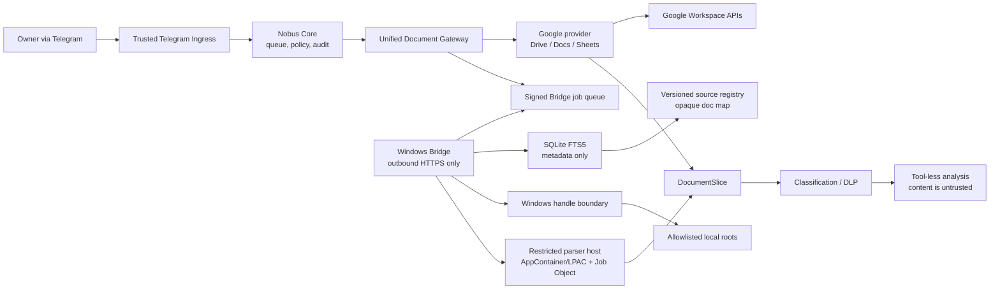
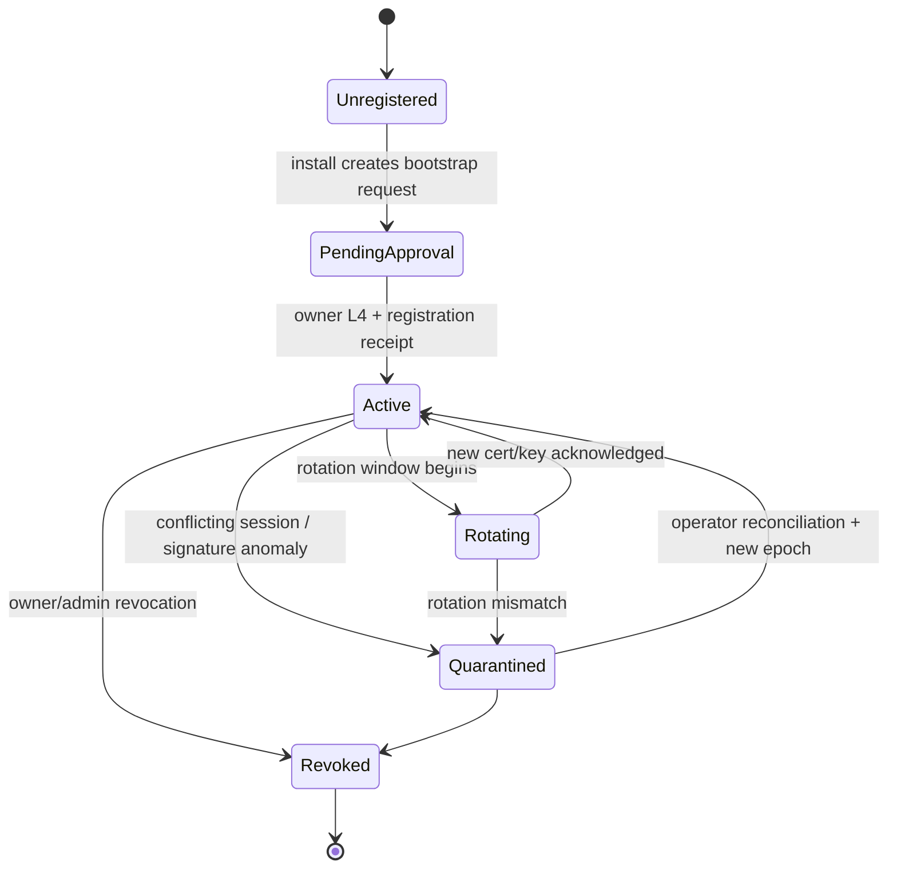
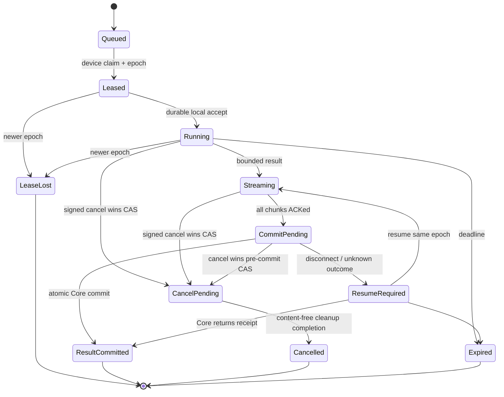
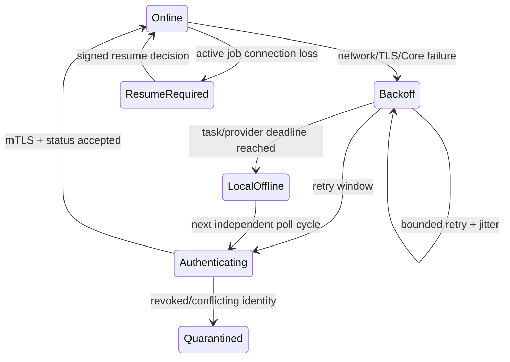

# Gate 5 — Unified Document Gateway and Windows Local Library Bridge Architecture

**Document status:** normative TARGET architecture for Gate 5
**Canonical repository commit:** `9d816b35d3f419b42e24ad09ae6aadc92c33db43`
**Implementation status:** not implemented
**Security status:** design verified; implementation and live acceptance pending
**Research basis:** [`RESEARCH.md`](RESEARCH.md)

## 1. Decision and normative language

Gate 5:

> **ADAPTS the current Nobus document boundaries and BUILDS one minimal
> outbound HTTPS pull-worker for Windows.**

The key words **MUST**, **MUST NOT**, **SHOULD**, and **MAY** are normative.

This document specializes the MVP-1 document contracts for the read plane. It
does not redefine Gate 7 write authority.

Where earlier TARGET text describes a local `source_id` as a relative-path
handle, Gate 5 narrows it as follows:

- the semantic field remains `source_id`;
- its wire value is a Bridge-minted opaque `doc_id`;
- it is not a path-shaped string and cannot be decoded into a path by Core or
  a model;
- only the Bridge registry maps it to a local relative path.

This specialization is required by the accepted Gate 5 security verdict and is
now fixed in ADR 0018 and canonical documents 12–13; no runtime may implement
the older path-shaped interpretation. CURRENT `OwnerFileService.relative_path` and the base64 field in
`gate5a4.py` are compatibility-internal locators, not opaque authority and not
wire DTOs; the TARGET adapter deprecates them at the Bridge boundary.

Protocol v1 has exactly four closed operations: `search`, `read`, `cancel`, and
`status`. Unknown operation enums fail closed. Gate 7 owns and Gate 5 literally
imports the separate `nobus.bridge.write.request.v2` /
`nobus.bridge.write.result.v2` family defined in Gate 7 Section 13.0. Write fields
can never be smuggled into v1. A full-MVP Bridge advertises read-v1 and write-v2
as distinct capability digests; Core pins both exact versions and fails closed on
missing, unknown or downgraded capability. There is no algorithm/version
negotiation or compatibility coercion.
TARGET search is metadata-only and MUST NOT call the CURRENT eager
`OwnerFileService.select()` path that reads the sole candidate immediately.

## 2. Product behavior

### 2.1 Owner experience

The owner uses the same natural-language lifecycle for Google and local
documents:

1. ask Nobus to find a document;
2. receive a bounded merged candidate list;
3. select one exact document when selection is ambiguous;
4. ask for an exact sheet/range, page range, tab/text range, section, or
   bounded excerpt;
5. receive an answer with source, revision, selector, and limitations.

The owner does not need to know:

- whether a provider uses Google APIs or a Windows Bridge;
- a Drive file ID, local path, Bridge device ID, or job ID;
- a parser name;
- a slash command or transport status.

Candidate display metadata MAY include a sanitized title, media type, modified
date, provider label, project/client label, and safe collection label. It MUST
NOT include an absolute path, owner root, denied-directory name, credential
location, or raw provider locator.

### 2.2 Provider parity

Google and local providers MUST implement the same application interface,
status taxonomy, authority checks, selection rules, revision checks, output
budgets, provenance shape, and untrusted-content marking.

Provider parity does not mean identical search algorithms:

- Google MAY use Drive search and change logs;
- local search MAY use SQLite FTS5;
- Core applies a deterministic merge after each provider returns independently
  bounded candidates.

An unavailable provider MUST return `provider_unavailable` or
`partial_results`. It MUST NOT be represented as an empty successful search.

### 2.3 Local offline behavior

When Windows or the Bridge is offline:

- Telegram polling, Core, Google, Calendar, Tasks, and unrelated work continue;
- local-only search/read becomes `DEGRADED_LOCAL_OFFLINE`;
- a mixed search returns bounded Google candidates plus an explicit local
  unavailable marker;
- a local read MAY wait only when the originating task contract explicitly
  allows waiting and has an unexpired deadline;
- Core does not create an unbounded retry loop;
- no plaintext document content accumulates in a local offline spool;
- no write is inferred or retried.

After reconnect, Core MAY lease a still-valid queued read. It MUST NOT replay
an expired owner intent or silently substitute another revision.

### 2.4 Non-goals

Gate 5 does not provide:

- local create, update, overwrite, snapshot restore, delete, or rename;
- Google create/update/delete/sharing;
- third-party delivery;
- arbitrary binary library synchronization;
- filesystem browsing by a model;
- arbitrary path, shell, PowerShell, process, URL, download, upload, plugin, or
  MCP tools;
- a Windows listener, SMB share, network drive, tunnel-exposed origin, or
  remote desktop;
- full-content durable search;
- OCR by default;
- automatic dependency installation or self-update;
- multi-tenant SaaS administration.

Those exclusions are protocol invariants, not UI choices.

## 3. CURRENT, reuse, and TARGET

| Area | CURRENT | Reuse | TARGET delta |
|---|---|---|---|
| Local search | Server-side `find_owner_file_paths`; 50,000-entry/8-candidate bound | query normalization, deny rules, ambiguity behavior | Bridge-local FTS5 and opaque IDs |
| Local read | `OwnerFileService`, 50 MiB source, bounded text/OOXML, DLP, final-handle check | size/DLP/handle tests and error discipline | separate service identity, staged parser child, PDF and structured ranges |
| Local write | `OwnerWorkspace` snapshot/CAS/handle-relative replace | identity and recovery patterns only | not exposed in Gate 5 |
| Google | server-side Calendar/Tasks/Drive; bounded search/download | OAuth ownership, pagination, ancestry, streaming, safe errors | unified Drive/Docs/Sheets read adapters |
| Queue | durable SQLite jobs/outbox, claims, leases, restart recovery | transaction/CAS/dead-letter patterns | device-specific signed job and replay store |
| Process control | Windows Job Object for Codex subprocess trees | launcher/test pattern | AppContainer/LPAC parser host plus Job Object resource limits |
| Autostart | Task Scheduler under current desktop user | health/restart lessons | WinSW service under dedicated identity |
| Contracts | strict/frozen internal contracts; TARGET document family in docs | schema/digest/tenant conventions | exact Gateway and Bridge DTOs |

TARGET status in this document does not claim deployment, installation,
credentials, service readiness, or parser safety.

## 4. Trust architecture



### 4.1 Authority matrix

| Component | Owns | MUST NOT own |
|---|---|---|
| Trusted Ingress | owner/chat/topic identity and original intent binding | Google/Bridge credentials, document content authority |
| Core | durable task/job state, provider routing, policy, audit, Google credentials, final result | local path mapping, Windows filesystem access |
| Document Gateway | provider-neutral validation, merge, selection, limits, provenance | provider credentials outside adapters, model authority |
| Google provider | exact Google APIs and provider IDs | local roots, Bridge identity |
| Bridge transport | mTLS, message signatures, fixed Core endpoints, reconnect | Telegram/Google credentials, arbitrary network |
| Bridge application | local source registry, opaque ID map, index, local read decision | owner intent interpretation, Google, shell, writes |
| Path boundary | opened root/file identity and staging copy | search/ranking, model interaction |
| Parser host | one staged selected file and bounded extraction | owner root, network, child processes, job authority |
| Model/analysis | untrusted selected slices and closed analysis request | OAuth, Bridge credentials, filesystem, shell, mutation |

### 4.2 Security composition

No single mechanism is the security boundary:

- mTLS authenticates the live device channel;
- application signatures make a durable job/receipt independently verifiable;
- authority fields constrain tenant/project/client/library;
- lease fencing prevents a stale worker from committing;
- replay state prevents repeated execution;
- service identity and ACLs enforce negative filesystem access;
- handle validation prevents path substitution;
- parser isolation bounds hostile file formats;
- DLP and tool-less analysis contain document content.

Tailscale MAY protect the network route but does not replace any item above.

## 5. Unified document application contracts

Gate 2 remains the owner of shared contract definitions. Gate 5 consumes those
contracts and adds provider execution DTOs. ADR 0018 separates trust profiles:
Gate 2 Ed25519 signs offline registry artifacts; the Bridge device identity uses
non-exportable CNG `ECDSA_P256_SHA256`. Both profiles have distinct key IDs,
rotation and golden vectors; wire algorithm negotiation remains forbidden.

### 5.1 Imported Gate 2 document contracts

Gate 5 imports the exact Gate 2 `DocumentRef`, `DocumentQuery` and
`DocumentReadPlan` wire schemas unchanged. Their common identity/binding rules,
closed fields, selectors, limits, revision checks and digests are exclusively
owned by Gate 2. The Gate 5 transport envelope fields in Section 6 do not alter
or wrap those schemas into a second application contract.

For `backend=local`, `DocumentRef.source_id` is the opaque key by which Core
addresses the Bridge private reference store. The private mapping from `doc_id`
to a verified Windows identity/path remains inside Bridge. For Google sources,
provider IDs never enter the Bridge protocol.

### 5.2 Bridge search execution projection

Bridge consumes the exact accepted Gate 2 `DocumentQuery`, executes only its
local metadata-search portion and returns bounded provider candidates. Core
merges candidates and issues the authoritative Gate 2 `DocumentRef`. Gate 5
adds only transport status, ordering evidence and safe display metadata; it does
not define another `DocumentQuery` or `DocumentCandidate` authority schema.

Search terms are data, not SQL/FTS expressions. Core and Bridge reject NUL,
control characters, unbounded token counts and raw FTS operators. Core never
merges candidates across authority triples.

### 5.3 Bridge read execution projection

Bridge consumes the exact accepted Gate 2 `DocumentReadPlan` and its selected
`DocumentRef`, resolves the opaque local `source_id` only inside the private
reference store, repeats tenant/project/client/registry/revision checks and emits
`DocumentSlice` plus transport evidence. Gate 5 does not define an alternate
read-plan wire schema. Unknown Gate 2 selectors, fields or versions fail before
filesystem access.
### 5.4 Imported Gate 2 read result contracts

Gate 5 literally imports Gate 2 `DocumentSlice` and `DocumentReadResult` and
cannot redefine, coerce or partially map either schema. Bridge private parser
output is not an application contract: Core admits it only after signature,
exact tenant/project/client/policy/registry/ref/revision plus
job/lease/device/enrollment/capability binding validation and construction of the
Gate 2 schema.

Only opaque `provenance_id` values cross the Bridge/Core boundary. The private
Bridge/vault record retains exact path/file/tab/sheet/page/range locators; neither
`DocumentSlice`, `DocumentReadResult`, Gate 6, logs nor model context receives
those locators. `truncated=true` is never presented as complete evidence, and a
cursor is valid only for the exact scope/plan/ref/revision/policy and transport
fence encoded by Gate 2.
### 5.5 Gateway interface

```python
class DocumentGateway(Protocol):
    async def search(
        self,
        query: DocumentQuery,
        *,
        context: TrustedDocumentContext,
    ) -> DocumentSearchResult: ...

    async def read(
        self,
        plan: DocumentReadPlan,
        *,
        context: TrustedDocumentContext,
    ) -> DocumentReadResult: ...

    async def cancel(
        self,
        request: DocumentCancellation,
        *,
        context: TrustedDocumentContext,
    ) -> DocumentCancellationResult: ...

    async def status(
        self,
        request: DocumentProviderStatusRequest,
    ) -> DocumentProviderStatus: ...
```

`TrustedDocumentContext` is created by Core and contains the authenticated
tenant/actor/conversation/task, policy version, source-registry revision, data
classification ceiling, and task deadline. A provider result cannot raise or
replace this authority.

## 6. Outbound Bridge protocol

### 6.1 Network topology and endpoints

The Bridge opens outbound HTTPS only to one configured Core origin:

```text
https://<fixed-core-origin>/v1/bridge/...
```

Allowed endpoints:

- `POST /v1/bridge/devices:register`
- `POST /v1/bridge/sessions:open`
- `POST /v1/bridge/keys:prepare-rotation`
- `POST /v1/bridge/keys:prove-rotation`
- `POST /v1/bridge/keys:activate-rotation`
- `POST /v1/bridge/jobs:lease`
- `POST /v1/bridge/jobs/{job_id}:heartbeat`
- `POST /v1/bridge/jobs/{job_id}:cancel-complete`
- `POST /v1/bridge/jobs/{job_id}:resume`
- `POST /v1/bridge/jobs/{job_id}/chunks/{sequence}`
- `POST /v1/bridge/jobs/{job_id}:commit`
- `POST /v1/bridge/status`

Normative transport rules:

- registration uses server-authenticated TLS plus a one-time owner-approved
  bootstrap capability;
- every post-registration request uses TLS 1.2+ mTLS;
- certificate hostname and private CA chain are verified;
- redirects are disabled;
- `HTTP_PROXY`, `HTTPS_PROXY`, `ALL_PROXY`, `.netrc`, and ambient credential
  discovery are ignored;
- a job never supplies a URL, host, redirect, upload location, or method;
- `Content-Encoding` other than `identity` is rejected for Bridge protocol
  messages;
- request/response wire bytes are counted before parse;
- JSON is UTF-8, duplicate keys and invalid Unicode are rejected;
- unknown fields and enum values are rejected;
- server time is authoritative for lease, expiry, and audit;
- safe idempotent transport retry is bounded inside the original deadline.

### 6.2 Canonical signing

Application messages are serialized using the Gate 2 canonical JSON profile
and signed over RFC 8785/JCS bytes excluding the `signature` field.

```yaml
SignedMessage:
  schema_version: "1"
  message_type: closed enum
  message_id: UUID
  message_sequence: monotonically increasing integer per key
  audience: exact device/core and endpoint ID
  device_id: bounded string
  key_id: bounded string
  read_v1_capability_digest: exact active sha256
  write_v2_capability_digest: exact active sha256 | null
  issued_at: RFC3339 UTC
  expires_at: RFC3339 UTC
  nonce: base64url 32-byte random value
  payload_digest: "sha256:<64 lowercase hex>"
  payload: strict message-specific object
  signature:
    algorithm: ECDSA_P256_SHA256
    value: base64url
```

Rules:

- Core job-signing keys and Bridge receipt-signing keys have separate IDs and
  lifecycles.
- The algorithm is fixed to `ECDSA_P256_SHA256` for protocol v1; algorithm negotiation is
  forbidden.
- A signature covers schema/message/audience/device/key, the exact read-v1/write-v2 capability pair, sequence/time/nonce/digest and payload.
- `payload_digest` is checked before semantic processing.
- An unknown/revoked key, invalid signature, duplicate nonce with different
  digest, time outside policy, or schema mismatch is terminal.
- Golden canonicalization/signature vectors are required across server and
  Windows implementations.

`ECDSA_P256_SHA256` means SHA-256 over the JCS bytes and an IEEE P1363
fixed-width 64-byte signature (`r || s`, each 32-byte big-endian). Signers
normalize to low-S; verifiers reject high-S, wrong length, non-canonical values,
or DER. Wire signatures and nonces use unpadded base64url. The key registry,
not an `algorithm` value supplied by a message, selects this fixed verifier.

Before any semantic side effect, both Core and Bridge MUST transactionally
write a durable replay ledger entry. The ledger enforces unique `(key_id,
nonce)` and `(key_id, message_sequence)` tuples with the exact canonical digest.
An exact duplicate with the same digest returns the prior idempotent response;
the same nonce/sequence with another digest is a security conflict and
quarantines the session. Each signer maintains a durable monotonically
increasing sequence and each verifier a per-key high-watermark plus accepted
out-of-order window bounded to active jobs. Entries survive restart and remain
at least through key/certificate expiry plus the maximum offline, resume,
rotation, and audit window; entries for pending jobs remain until their terminal
Core receipt and retention expiry. Pruning is transactional below a signed Core
watermark and can never remove pending/resumable entries. A missing, corrupt,
unwritable, or rolled-back ledger blocks leasing and commit.

### 6.3 Registration and software attestation

Registration is an owner/admin action and requires an action-bound Gate 8 L4.
It is not remotely triggerable by a normal Bridge job.

Before registration:

1. Core creates a one-time random bootstrap capability bound to environment,
   intended device label, policy version, expiry, and owner approval.
2. The capability is transferred out of band during the owner/admin install.
3. Bridge generates the mTLS and application-signing private keys locally.
4. The private keys never leave Windows.

`DeviceRegistrationRequest`:

```yaml
schema: nobus.bridge.registration_request.v1
registration_id: UUID
bootstrap_capability: opaque single-use value
device_instance_id: UUID generated once on Windows
device_label: bounded owner-approved label
environment: development | staging | production
tls_csr_pem: bounded CSR, ECDSA P-256
application_signing_public_key: ECDSA P-256 SPKI public key
read_v1_capability_digest: sha256
write_v2_capability_digest: sha256 | null
bridge_build:
  version: semantic version
  artifact_digest: sha256
  manifest_digest: sha256
  signer_thumbprint: bounded string | null
host_facts:
  os_family: windows
  os_build: bounded string
  architecture: x86_64 | arm64
  service_name: fixed expected name
  service_sid: bounded SID string
  source_registry_revision: sha256
attestation:
  kind: software_manifest_v1
  nonce: server challenge
  measured_at: RFC3339
proof_of_possession:
  signed_digest: sha256 of JCS registration request excluding this object
  algorithm: fixed ECDSA_P256_SHA256 from bootstrap policy
  signature: unpadded base64url P1363-64
```

The proof digest covers, without omission, the registration ID, bootstrap-bound
device/environment, device instance, TLS CSR and SPKI digest, application public
key, server attestation challenge/nonce, exact read-v1/write-v2 capability digests,
build artifact/manifest/signer values, host/service facts, and source-registry
revision. Core first verifies the
single-use bootstrap binding and CSR proof, then the application-key signature;
a signature over only the challenge or only the public key is invalid.

This is software attestation, not TPM/secure-boot attestation. The name and
audit MUST NOT imply hardware proof.

`DeviceRegistrationReceipt`:

```yaml
schema: nobus.bridge.registration_receipt.v1
registration_id: UUID
device_id: server-assigned opaque string
device_epoch: integer >= 1
client_certificate_chain_pem: bounded
certificate_not_before: RFC3339
certificate_not_after: RFC3339
core_job_signing_keys: [key_id + public key + validity]
allowed_environment: exact enum
allowed_operations: [search, read, cancel, status]
read_v1_capability_digest: exact accepted sha256
write_v2_capability_digest: exact accepted sha256 | null
allowed_write_v2_operations: [prepare_create, commit_create, prepare_update, commit_update, readback] | []
policy_version: bounded string
source_registry_revision: sha256
next_rotation_at: RFC3339
receipt_digest: sha256
core_signature: SignedMessage.signature
```

Defaults:

- bootstrap capability TTL: 10 minutes;
- bootstrap use count: one;
- mTLS certificate lifetime: 30 days;
- rotation begins with 7 days remaining;
- old/new certificate overlap: at most 24 hours;
- one active device epoch per device.

Registration alone does not authorize concurrent work. Every process opens a
fenced session. A second process cannot displace a live session; a stale-session
takeover increments the monotonic session epoch and fences every message from
the former session. Conflicting proof or signature anomalies quarantine the
device. A fully compromised process can still exercise its non-exportable keys;
short certificates, one-active-session enforcement, revocation, and audit are
mandatory compensating controls.

### 6.3.1 Session registration and fencing

`SessionOpenRequest`:

```yaml
schema: nobus.bridge.session_open_request.v1
device_id: exact assigned device
device_epoch: integer
bridge_instance_id: random UUID per process start
previous_session_id: UUID | null
last_core_message_id: UUID | null
last_receipt_digest: sha256 | null
source_registry_revision: sha256
read_v1_capability_digest: exact registration receipt sha256
write_v2_capability_digest: exact registration receipt sha256 | null
index_generation: monotonically increasing integer
bridge_state: recovering | ready | degraded
```

`SessionGrant`:

```yaml
schema: nobus.bridge.session_grant.v1
session_id: UUID
session_epoch: monotonically increasing integer
server_time: RFC3339
long_poll_seconds: integer 1..30
heartbeat_seconds: integer 5..30
lease_seconds: integer 30..90
lease_stop_margin_seconds: integer 5..20
read_v1_capability_digest: exact device binding sha256
write_v2_capability_digest: exact device binding sha256 | null
```

Core persists the exact capability-digest pair as part of each device epoch.
Registration schemas bind the pair explicitly. Every post-registration message,
including session/rotation/lease/heartbeat/cancel/chunk/commit/receipt/resume and
Gate 7 write-v2, repeats it in the common signed `SignedMessage` envelope; selected
payloads may additionally repeat it for domain binding. Any envelope or explicit payload pair that is missing, changed, mutually
inconsistent, downgraded or has an unexpected nullable write-v2 digest is `FENCED`; it cannot be
recovered through version negotiation or a compatibility shim.

Core persists exactly one active session per `device_id`. A concurrent open
while that session is live returns `DEVICE_ALREADY_ACTIVE` and issues no lease.
Only after the signed stale-session grace expires may Core transactionally
create a higher `session_epoch`. Every lease, heartbeat, cancel, chunk, commit,
receipt, and resume carries `session_id` and `session_epoch`; older or unknown
session state is `FENCED`. The Bridge stores its session tuple durably before
claiming work and never guesses or locally increments an epoch.

### 6.3.2 Private-key and certificate rotation

Rotation is two-phase plus atomic activation; no job can request it. All DTOs
are strict signed-envelope payloads and are accepted only on the fixed Core
origin.

`RotationPrepareRequest`:

```yaml
schema: nobus.bridge.rotation_prepare.v1
rotation_id: UUID
device_id: exact assigned device
current_device_epoch: integer
session_id: UUID
session_epoch: integer
current_certificate_serial: bounded string
current_mtls_spki_digest: sha256
current_application_key_id: bounded string
new_mtls_csr_der: bounded unpadded base64url
new_mtls_spki_digest: sha256
new_application_public_key: ECDSA P-256 SPKI
bridge_manifest_digest: sha256
read_v1_capability_digest: exact current device binding sha256
write_v2_capability_digest: exact current device binding sha256 | null
policy_version: string
requested_activation_after: RFC3339
old_application_key_proof: signature over all preceding canonical fields
```

`RotationGrant`:

```yaml
schema: nobus.bridge.rotation_grant.v1
rotation_id: UUID
device_id: exact assigned device
current_device_epoch: integer
next_device_epoch: current + 1
new_certificate_chain_der: [bounded unpadded base64url]
new_certificate_serial: bounded string
new_mtls_proof_challenge: base64url 32 bytes
new_application_proof_challenge: base64url 32 bytes
no_new_leases_after: server RFC3339
drain_deadline: server RFC3339
activate_before: server RFC3339
read_v1_capability_digest: exact next device binding sha256
write_v2_capability_digest: exact next device binding sha256 | null
policy_version: string
```

The Core-signed grant immediately stops new leases to the old epoch. Existing
leases may only drain before `drain_deadline`; after it Core records cancel and
fences their commits.

`RotationProofRequest`:

```yaml
schema: nobus.bridge.rotation_proof.v1
rotation_id: UUID
device_id: exact assigned device
current_device_epoch: integer
next_device_epoch: integer
session_id: UUID
session_epoch: integer
new_certificate_serial: bounded string
new_mtls_spki_digest: sha256
new_application_key_id: bounded string
read_v1_capability_digest: exact next device binding sha256
write_v2_capability_digest: exact next device binding sha256 | null
new_mtls_proof: P1363-64 signature over Core challenge + rotation/device/epoch/capability digests
new_application_proof: P1363-64 signature over Core challenge + rotation/device/epoch
old_application_authorization: P1363-64 signature over both proof digests
proved_at: RFC3339
```

The proof request is sent over a new-certificate mTLS connection and binds both
new private keys, both epochs, the rotation ID, and the old authority. A proof
does not activate keys.

`RotationActivateRequest`:

```yaml
schema: nobus.bridge.rotation_activate.v1
rotation_id: UUID
device_id: exact assigned device
current_device_epoch: integer
next_device_epoch: integer
old_session_id: UUID
old_session_epoch: integer
new_certificate_serial: bounded string
new_application_key_id: bounded string
read_v1_capability_digest: exact activated sha256
write_v2_capability_digest: exact activated sha256 | null
proof_digest: sha256
old_application_authorization: P1363-64 signature
new_application_confirmation: P1363-64 signature
requested_at: RFC3339
```

Core activates only through one database CAS that verifies: grant/proof are
current, no old-epoch lease remains commit-eligible, no cancel/receipt is
pending, both signatures verify, and `next_device_epoch = current + 1`. It then
atomically activates the new certificate/key, increments `device_epoch`, fences
every old session/lease, and writes:

```yaml
RotationActivationReceipt:
  schema: nobus.bridge.rotation_activation_receipt.v1
  rotation_id: UUID
  device_id: exact assigned device
  active_device_epoch: integer
  new_certificate_serial: bounded string
  new_application_key_id: bounded string
  minimum_next_session_epoch: integer
  activated_at: server RFC3339
  revocation:
    schema: nobus.bridge.rotation_revocation.v1
    old_certificate_serial: bounded string
    old_application_key_id: bounded string
    revoked_at: server RFC3339
    reason: rotation_complete
    old_sessions_fenced: true
  receipt_digest: sha256
```

The old certificate/key can never receive a lease after activation and may only
retrieve this already committed receipt by exact digest during a bounded grace.
An interrupted prepare/proof leaves the old epoch active but lease-drained until
Core signs an abort/timeout decision; it never makes the new keys authoritative.
After activation rollback requires owner-approved re-enrollment, not restoring
the revoked key. Rotation ledger entries are retained across both key-retention
windows and are never pruned while either epoch has resumable state.

### 6.4 `JobLease`

```yaml
schema: nobus.bridge.job_lease.v1
job_id: UUID
job_type: search | read
job_digest: sha256 over exact job
device_id: exact assigned device
device_epoch: integer
session_id: UUID
session_epoch: monotonically increasing integer
lease_id: UUID
lease_epoch: monotonically increasing integer
read_v1_capability_digest: exact active sha256
write_v2_capability_digest: exact active sha256 | null
attempt: integer 1..3
leased_at: server RFC3339
lease_expires_at: server RFC3339
heartbeat_interval_seconds: integer 5..30
job_expires_at: server RFC3339
authority:
  tenant_id: string
  project_ref: string
  client_ref: string | null
  library_ref: opaque registry ID
  source_registry_revision: sha256
policy_version: string
job: SearchJob | ReadJob
```

The entire lease is a Core-signed `SignedMessage`.

Defaults:

- long-poll wait: at most 30 seconds;
- lease duration: 90 seconds;
- heartbeat interval: 20 seconds;
- job expiry after lease issue: at most 15 minutes;
- attempts: at most 3 for safe read-only jobs;
- one active lease per `(device_id, job_id)`;
- each re-lease increments `lease_epoch`.

The Bridge MUST durably record and fsync the job digest, maximum observed
epoch, lease ID, and state before touching the index or filesystem.

### 6.5 `SearchJob`

```yaml
schema: nobus.bridge.search_job.v1
query_id: UUID
authority: exact JobLease authority
safe_name_terms: [1..16 strings, each <=128 chars, total <=512 chars]
scope_refs: [0..8 opaque registry IDs]
media_types: [0..16 normalized MIME values]
modified_from: RFC3339 | null
modified_to: RFC3339 | null
maximum_candidates: integer 1..8
budgets:
  maximum_index_entries: integer 1..50000
  maximum_scan_milliseconds: integer 1..60000
  maximum_result_bytes: integer 1..65536
deadline: RFC3339
```

`SearchJob` contains no path or FTS query syntax. The Bridge compiles bounded
tokens into parameterized SQL and applies authority predicates in the same
query before ranking.

### 6.6 `ReadJob`

```yaml
schema: nobus.bridge.read_job.v1
read_id: UUID
authority: exact JobLease authority
document_ref: exact local DocumentRef
selector: metadata | text_range | section | page_range | cell_ranges
expected_revision: exact revision from selection
budgets:
  maximum_source_bytes: integer 1..52428800
  maximum_wire_bytes: integer 1..1572864
  maximum_decoded_bytes: integer 1..1048576
  maximum_archive_entries: integer 0..10000
  maximum_member_decoded_bytes: integer 0..67108864
  maximum_archive_decoded_bytes: integer 0..268435456
  maximum_compression_ratio: integer 1..100
  maximum_output_characters: integer 1..250000
  maximum_pages: integer 0..200
  maximum_cells: integer 0..50000
  maximum_parser_seconds: integer 1..120
  maximum_parser_cpu_milliseconds: integer 1..120000
  maximum_parser_working_set_bytes: integer 1..536870912
  maximum_temp_bytes: integer 1..536870912
deadline: RFC3339
purpose: owner_answer | analysis | comparison
```

Bridge policy may lower every requested maximum. A job can never raise a
configured ceiling.

### 6.7 Heartbeat and cancel

`JobHeartbeatRequest`:

```yaml
schema: nobus.bridge.heartbeat_request.v1
job_id: UUID
session_id: UUID
session_epoch: integer
lease_id: UUID
lease_epoch: integer
job_digest: sha256
state: leased | running | staging | parsing | streaming | committing
progress:
  examined_entries: integer
  source_bytes: integer
  pages: integer
  cells: integer
  decoded_output_bytes: integer
  emitted_chunks: integer
last_acked_chunk: integer | null
observed_at: RFC3339
```

No filename, path, content, query text, snippet, or parser stderr appears in a
heartbeat.

`JobHeartbeatResponse`:

```yaml
schema: nobus.bridge.heartbeat_response.v1
job_id: UUID
session_id: UUID
session_epoch: integer
lease_id: UUID
lease_epoch: integer
server_time: RFC3339
lease_expires_at: RFC3339
decision: continue | cancel | lease_lost
cancel: CancelDirective | null
next_heartbeat_seconds: integer 5..30
```

`CancelDirective`:

```yaml
schema: nobus.bridge.cancel.v1
cancel_id: UUID
job_id: UUID
session_id: UUID
session_epoch: integer
lease_id: UUID
lease_epoch: integer
reason: owner_cancelled | task_expired | policy_revoked | provider_shutdown
requested_at: server RFC3339
cancel_deadline: server RFC3339
```

The response is Core-signed. Socket closure is not cancellation. Bridge checks
cancellation:

- before index/filesystem access;
- between scan batches;
- before staging;
- between pages/sheets/ranges;
- before each chunk;
- before commit.

CPU-bound parser cancellation closes/terminates the parser Job Object after a
bounded cooperative grace period.

Cancel and result commit are linearized by one Core database compare-and-swap
on the same job row. A durably recorded `cancel_requested` transition before
result commit moves the job to `CANCEL_PENDING` and makes every later result
chunk/`ResultCommitRequest` ineligible. Bridge terminates work, cleans temp, and
uses only the fixed cancel-completion endpoint:

```yaml
CancelCompletionRequest:
  schema: nobus.bridge.cancel_completion.v1
  cancel_id: UUID
  job_id: UUID
  job_digest: sha256
  device_id: exact assigned device
  session_id: UUID
  session_epoch: integer
  lease_id: UUID
  lease_epoch: integer
  parser_terminated: boolean
  staging_cleanup: complete | failed
  cleanup_error_code: closed safe enum | null
  completed_at: RFC3339
```

This DTO contains no result ID, chunk, content, source locator, document digest,
or parser output. Core accepts it only for the exact durable `cancel_id` and
fenced tuple, then atomically creates a Core-signed terminal
`CancellationReceipt` with job/cancel IDs, `outcome: cancelled`, cleanup status,
commit time, audit ref, and receipt digest. Exact duplicate completion returns
the same receipt; a different completion digest is a protocol conflict. A
successful normal receipt commit first makes a later cancel return signed
`ALREADY_TERMINAL`. Neither network arrival order nor Bridge wall clock decides
the race.

### 6.8 Result chunks

Chunks use only the fixed endpoint derived from `job_id` and `sequence`.

```yaml
schema: nobus.bridge.result_chunk.v1
job_id: UUID
session_id: UUID
session_epoch: integer
lease_id: UUID
lease_epoch: integer
job_digest: sha256
result_id: UUID
sequence: integer starting at 0
content_type: application/vnd.nobus.document-result+json
transfer_encoding: base64url
decoded_bytes: integer 0..262144
wire_bytes: integer
payload_digest: sha256 of decoded bytes
previous_rolling_digest: sha256 | null
rolling_digest: sha256 of exact ordered decoded bytes through this chunk
payload: base64url
emitted_at: RFC3339
```

Limits:

- decoded chunk: at most 256 KiB;
- chunks: at most 8;
- decoded result: at most 1 MiB;
- total Base64/wire result: at most 1.5 MiB;
- no HTTP compression;
- sequence is contiguous and unique;
- Core ACKs a chunk only after durable digest/sequence storage;
- duplicate identical chunks are idempotently ACKed;
- duplicate sequence with a different digest is terminal and quarantines the
  result;
- Core never exposes a partial result before final commit.

`ChunkAck` contains only job/result/sequence/digest, server time, and
`accepted|duplicate|reject`.

### 6.9 Commit and receipt

`ResultCommitRequest`:

```yaml
schema: nobus.bridge.result_commit_request.v1
job_id: UUID
session_id: UUID
session_epoch: integer
lease_id: UUID
lease_epoch: integer
job_digest: sha256
result_id: UUID
outcome: success | no_match | ambiguous | blocked | failed | cancelled
chunk_count: integer 0..8
decoded_result_bytes: integer 0..1048576
final_result_digest: sha256
revision_seen: strict revision | null
source_content_digest: sha256 | null
truncated: boolean
warning_codes: [closed enum]
completed_at: RFC3339
```

The Bridge signs the commit with its application key.

Core commits atomically only when:

- mTLS/device epoch/key and exact active session epoch are active;
- signature and payload digest are valid;
- job/lease/epoch/digest match;
- lease is still commit-eligible;
- every expected chunk is present and ordered;
- size and final digest match;
- authority and policy have not been revoked.

`JobReceipt`:

```yaml
schema: nobus.bridge.job_receipt.v1
job_id: UUID
job_digest: sha256
device_id: string
device_epoch: integer
session_id: UUID
session_epoch: integer
lease_epoch: integer
result_id: UUID
outcome: closed enum
result_digest: sha256
committed_at: server RFC3339
audit_ref: opaque Core reference
receipt_digest: sha256
core_signature: SignedMessage.signature
```

The Bridge stores receipt metadata, not result content. Re-delivery of the same
job/digest returns the cached receipt and performs no new index/file read.

### 6.10 Resume

`ResumeRequest`:

```yaml
schema: nobus.bridge.resume_request.v1
job_id: UUID
job_digest: sha256
device_id: string
device_epoch: integer
session_id: UUID
session_epoch: integer
last_lease_id: UUID
last_lease_epoch: integer
local_state: running | streaming | commit_pending | receipt_received
result_id: UUID | null
last_acked_chunk: integer | null
rolling_digest: sha256 | null
receipt_digest: sha256 | null
```

Core returns a Core-signed `ResumeDecision`:

```yaml
schema: nobus.bridge.resume_decision.v1
decision_id: UUID
job_id: UUID
job_digest: sha256
device_id: exact assigned device
session_id: UUID
session_epoch: integer
lease_id: UUID
lease_epoch: integer
lease_expires_at: RFC3339 | null
result_id: UUID | null
action: resume_chunks | return_receipt | abort_lease_lost | restart_safe_read | expired
highest_contiguous_chunk: integer | null
next_chunk_sequence: integer | null
rolling_digest: sha256 | null
receipt_digest: sha256 | null
decided_at: server RFC3339
expires_at: server RFC3339
```

`resume_chunks` requires the exact current session/lease tuple, result ID,
watermark, and rolling digest. `restart_safe_read` requires a strictly higher
lease epoch, the same job digest and authority, no committed chunks visible,
and a fresh result ID. `return_receipt` carries the already committed receipt
digest. An expired decision or any tuple/digest mismatch is `FENCED`; Bridge
never guesses which chunks Core received.

### 6.11 Error taxonomy and retry

Stable Bridge result/error codes:

| Code | Meaning | Retry |
|---|---|---|
| `NO_MATCH` | successful bounded search with no candidate | no |
| `AMBIGUOUS` | more than exact allowed selection | no; owner selection |
| `PROVIDER_UNAVAILABLE` | Bridge/device unavailable | bounded wait/reconnect |
| `INDEX_DEGRADED` | index incomplete/over limit | after reconciliation |
| `STALE_REVISION` | selected revision changed | new search/selection |
| `AUTHORITY_MISMATCH` | tenant/project/client/library mismatch | never |
| `OPAQUE_ID_UNKNOWN` | unknown/tombstoned local ID | new search |
| `CONTENT_BLOCKED` | DLP/classification denied transfer | never automatically |
| `UNSUPPORTED_FORMAT` | format not enabled | no |
| `SOURCE_TOO_LARGE` | source policy exceeded | no |
| `DECODED_LIMIT_EXCEEDED` | archive/parser output exceeded | no |
| `PARSER_TIMEOUT` | parser deadline | at most one fresh attempt if policy permits |
| `PARSER_FAILED` | malformed/unsupported parser result | no blind retry |
| `CANCELLED` | signed cancellation completed | no |
| `LEASE_LOST` | fencing epoch no longer current | stale worker stops |
| `REPLAY_REJECTED` | nonce/job/key replay mismatch | never |
| `PROTOCOL_ERROR` | schema/signature/chunk/order violation | quarantine/reconcile |
| `STATE_UNAVAILABLE` | replay/index DB not durable/writable | no new lease |

Only safe idempotent reads MAY retry, within the original task deadline and at
most the lease attempt limit. An unknown commit outcome first uses `resume`;
it is never blindly recomputed.

## 7. State machines

### 7.1 Device lifecycle



### 7.2 Job lifecycle



### 7.3 Offline/reconnect



Reconnect does not preserve an in-memory lease as authority. Durable local and
Core state plus a signed `ResumeDecision` determine the next action.

### 7.4 Duplicate and split-brain rules

| Scenario | Required result |
|---|---|
| Same signed job, same digest, before work | idempotent accept of existing local state |
| Same completed job/digest | return cached receipt; no new read |
| Same job ID, different digest | reject, audit, quarantine |
| Lower lease epoch | `LEASE_LOST`; no filesystem access/commit |
| Same epoch, different lease ID | protocol conflict; stop and reconcile |
| Two active Bridge sessions for one device epoch | live session remains authoritative; second gets `DEVICE_ALREADY_ACTIVE`; only stale-grace takeover increments `session_epoch`, fencing the old session |
| Two registered devices for one library | Core pins each job to one device; registry policy decides active device |
| Replay after key revocation/expiry | reject |
| Nonce duplicate with identical message | idempotent response if message type permits |
| Nonce duplicate with different message/digest | replay attack; reject/quarantine |

## 8. Backpressure and resource bounds

### 8.1 Core

- one active local document read per Bridge by default;
- at most two concurrent metadata searches;
- bounded per-device queued jobs;
- no unlimited server retry or result buffer;
- result chunks are durably staged and counted before ACK;
- partial chunks are not visible to analysis;
- expired/cancelled partial results are deleted by a bounded cleanup job.

### 8.2 Bridge

- fixed concurrency: one parser job and two metadata searches;
- no unbounded in-memory queue;
- only current lease and bounded receipt metadata persist locally;
- parser output streams into the chunk budget;
- if Core backpressure stops ACKs, Bridge stops reading parser output and
  cancels at the job deadline;
- disk full or replay/index DB write failure stops new claims.

### 8.3 Initial policy ceilings

These are MVP policy defaults and require corpus/SLO validation:

| Resource | Default ceiling |
|---|---:|
| Search index entries examined | 50,000 |
| Search candidates | 8 |
| Source document bytes | 50 MiB |
| Bridge decoded result | 1 MiB |
| Bridge decoded chunk | 256 KiB |
| Chunks | 8 |
| Text output | 250,000 characters |
| PDF selected pages | 200 |
| XLSX/Sheets cells | 50,000 |
| OCR selected pages | 10 |
| Image pixels | 40 megapixels |
| Parser wall time | 120 seconds |
| Parser active processes | 1 |
| OOXML ZIP entries | 10,000 |
| OOXML uncompressed total | 256 MiB |
| OOXML compression ratio | 100:1 |
| Archive nesting | 2 |

Provider/job policy may lower these ceilings. Raising them requires a versioned
policy change, corpus evidence, and fresh L1/L2/L3.

## 9. Windows service, identity, ACL, and protected state

### 9.1 Service

WinSW `2.12.0` runs one pinned Bridge executable:

- fixed service name;
- automatic start before interactive logon is not required;
- bounded failure restart with reset period;
- graceful stop timeout;
- rolling lifecycle logs;
- no WinSW `<download>` or remote update;
- no password, token, key, or document value in XML.

The service runs under a dedicated local non-interactive account with a
restricted service SID. It is not LocalSystem, the desktop owner, Network
Service, or the Telegram runner identity.

### 9.2 Filesystem ACL plan

| Location | Bridge service | Parser host | Administrators | Ordinary users |
|---|---|---|---|---|
| Program install/config | read/execute | read/execute parser only | full | none/read as explicitly required |
| Bridge state/replay/index | modify | none | full | none |
| Bridge logs | append/rotate | none | full | none |
| Approved source roots | read/traverse | none | owner/admin policy | existing owner rights |
| Denied/unrelated roots | none | none | existing admin | existing |
| Per-job staging root | create/read/delete | one job directory read | full | none |
| Upgrade staging | none during jobs | none | full | none |

The Bridge MUST NOT write into the source library. The parser MUST NOT receive
ACL access to any owner-library root.

### 9.3 Credential and private-key boundary

MVP fixed design:

- separate non-exportable CNG ECDSA P-256 keys for mTLS and application
  signing; one key is never reused for both purposes;
- keys are generated on Windows by the approved CNG key storage provider;
- key security descriptors admit only the Bridge service SID/identity and
  administrators; ordinary users and the parser identity have no access;
- mTLS uses Schannel/WinHTTP with the certificate in `LocalMachine\My`;
- application signing calls `NCryptSignHash` through a pinned signed
  in-process native/.NET helper when the Python host cannot use the handle;
- the helper has no listener, named-pipe API, path/file operation, shell,
  arbitrary-key selector, or generic remote signing surface;
- private material is never exported to PEM/PKCS#8, WinSW XML, environment,
  argv, SQLite, logs, crash reports, staging, or child processes;
- rotation creates new non-exportable handles, proves possession, switches the
  active key ID atomically, and retains old public trust only for policy time;
- revocation prevents new leases immediately.

A fully compromised Bridge process can still request signatures while it runs;
non-exportability prevents copying the key but does not make the process
trusted. Device revocation, session conflict detection, short certificates,
closed signing inputs, and service ACLs remain mandatory. If the CNG boundary
cannot be provisioned and proven, activation is blocked; PEM/PKCS#8+DPAPI is
not a silent fallback.

### 9.4 Protected durable state

Bridge state is split:

- `bridge-state.sqlite3`: device epoch, job ledger, nonce/replay state, receipt
  metadata, health;
- `library-index.sqlite3`: source registry projection, opaque mappings,
  metadata, FTS, tombstones, checkpoints;
- `staging/`: per-job temporary copies and parser output;
- `logs/`: content-free lifecycle/audit diagnostics.

Both databases use exact DDL/application digests, transactions, `quick_check`,
bounded size, backup policy, and fail-closed startup. They contain no extracted
body text, mTLS/signing private key, DPAPI plaintext, raw owner content, or
model prompt.

## 10. Source registry and Windows path boundary

### 10.1 Registry

The Gate 2 source registry is authoritative. Core knows only:

- `library_ref`;
- tenant/project/client binding;
- registry revision/digest;
- safe labels;
- policy and classification.

The Bridge-local signed projection additionally contains:

- fixed absolute root path;
- expected volume and root directory identity;
- allowed media types;
- deny patterns and exact denied subtrees;
- scan/index limits;
- classification ceiling.

The model and Core never receive the local projection.

### 10.2 Opaque mapping

For each discovered file, Bridge maintains:

```text
(authority, random doc_id)
  -> root_ref
  -> internal relative path
  -> volume serial + file ID
  -> size + mtime + change marker
  -> metadata revision
  -> media type + classification
```

`doc_id`:

- is random and non-path-shaped;
- remains stable across an allowed rename when file identity is stable;
- is tombstoned on delete/revoke;
- is never reassigned;
- is always resolved together with authority and registry revision.

### 10.3 Metadata revision

Metadata-first search does not parse document content.

Local candidate revision is:

```text
sha256(JCS(
  authority,
  source_registry_revision,
  root_ref,
  volume_serial,
  file_id,
  size,
  mtime_ns,
  filesystem_change_marker
))
```

The tuple is hashed; raw path is not part of the wire revision.

After selection, the Bridge copies from the verified opened handle and computes
`sha256` of the exact staged bytes. `DocumentSlice` returns both the selected
metadata revision and `source_content_digest`. A subsequent continuation may
bind to the content digest.

### 10.4 Open algorithm

For every local read:

1. Validate strict job schema, signature, authority, policy, lease, expiry,
   nonce, and fencing epoch.
2. Resolve `doc_id` only inside the matching authority/registry row.
3. Verify the registered root exists, is a directory, has expected
   volume/root identity, and is not a reparse point.
4. Reject absolute, drive-relative, UNC, device, `\\?\`, `GLOBALROOT`, ADS,
   NUL, reserved-name, trailing-dot/space, or traversal forms in internal
   registry data.
5. Walk ancestors without following reparse points; reject every unexpected
   reparse tag.
6. Open the final file once with a sharing mode that prevents delete/rename
   during staging.
7. Query final path, volume serial, file ID, link count, type, size, and
   timestamps from the opened handle.
8. Prove final path containment and equality to the registered mapping.
9. Conservatively reject multiple hard links unless a later policy can prove
   the alias set is contained.
10. Recheck lease/cancellation.
11. Copy only from that opened handle into the protected staging file while
    hashing and enforcing the source-byte limit.
12. Requery opened-handle state; any change returns `STALE_REVISION`.
13. Pass only the staged copy to the parser.

Path strings are lookup metadata. Authority attaches to verified handles and
identities.

## 11. SQLite FTS5 index

### 11.1 Logical schema

```sql
source_registries(
  registry_revision PRIMARY KEY,
  registry_digest,
  activated_at,
  policy_version
)

documents(
  authority_key,
  doc_id,
  root_ref,
  internal_relative_path_encrypted_or_acl_protected,
  volume_serial,
  file_id,
  size_bytes,
  mtime_ns,
  change_marker,
  metadata_revision,
  safe_title,
  safe_scope_label,
  media_type,
  classification,
  indexed_at,
  tombstoned_at,
  PRIMARY KEY(authority_key, doc_id)
)

document_metadata_fts(
  safe_title,
  safe_scope_label,
  tags,
  content='documents'
)

index_checkpoints(
  root_ref PRIMARY KEY,
  checkpoint_kind,
  checkpoint_value,
  dirty,
  reconciled_at
)

tombstones(
  authority_key,
  doc_id,
  last_metadata_revision,
  tombstoned_at,
  expires_at,
  PRIMARY KEY(authority_key, doc_id)
)
```

Exact DDL is an implementation deliverable. Invariants:

- authority predicate is inside the SQL statement before FTS ranking;
- body text, snippets, secrets, and absolute paths are not in FTS;
- internal relative path is protected by the Bridge ACL boundary and never
  returned over wire;
- user input is tokenized by application code and bound as parameters;
- maximum tokens, term lengths, candidates, rows, and execution time apply;
- the actual Python runtime's `sqlite_version()` is recorded, and FTS5
  availability/tokenizer behavior are exercised on startup; the upstream
  SQLite version is not assumed to equal the embedded runtime version.

### 11.2 Refresh

Refresh sources:

1. bounded startup reconciliation when state is dirty or checkpoint invalid;
2. `ReadDirectoryChangesW` event hints;
3. a 15-minute bounded changed-directory reconciliation;
4. a full bounded reconciliation every 24 hours;
5. immediate selected-read revision check.

Overflow, missed event, offline interval, invalid USN/checkpoint, or source
registry change marks the index dirty. A dirty index can return
`INDEX_DEGRADED` plus explicitly partial candidates; it cannot claim a complete
negative result.

Full scan ceiling is 50,000 entries and 60 seconds per configured cycle.
Exceeding it degrades the root and requires registry/scope correction rather
than silently skipping arbitrary entries.

### 11.3 Tombstones and retention

Delete, rename outside authority, registry removal, or access loss creates a
tombstone. Tombstones retain only authority, opaque `doc_id`, last revision,
and times for 30 days; no path/title/body is retained. A tombstoned ID cannot
resolve to another file.

## 12. Parser architecture

### 12.1 Staging and process boundary

The long-lived Bridge never imports or invokes untrusted-format parsers in its
own process.

Flow:

1. path boundary stages one selected file from the verified handle;
2. parent creates a strict parser request with an opaque staging ID, format,
   selector, and lowered limits;
3. parser host starts in AppContainer/LPAC without any network capability and
   inside a Windows Job Object;
4. parser executable also has an outbound firewall deny as defense in depth;
5. active-process limit is one; child/grandchild creation fails;
6. parser can read only its one staging directory;
7. stdout is a bounded framed result protocol; stderr is bounded and never
   returned to Core;
8. parent validates schema, counts, MIME, selector, and output digest;
9. DLP/classification runs before any result chunk;
10. Job Object and staging directory are removed on every terminal path.

A Job Object limits resources and the process tree; it does not block network.
The no-network claim therefore rests on the AppContainer/LPAC capability
boundary and must be proven with real socket/DNS/HTTP probes in the installed
service environment, not inferred from unit tests or firewall configuration
alone.

### 12.2 Preflight

Before parser start:

- extension, declared MIME, magic bytes, and container type must agree;
- encrypted/password-protected input is rejected;
- executable/polyglot and unexpected embedded content is rejected;
- archive entry count, uncompressed total, per-entry size, compression ratio,
  nesting, duplicate names, traversal names, and external relationships are
  checked;
- macros, VBA, OLE, embedded packages, external workbook links, PDF
  JavaScript/actions, and HTML external fetch are rejected or metadata-only by
  explicit policy.

### 12.3 Format behavior

#### Text, CSV, JSON, Markdown

- bounded byte decode;
- UTF-8/UTF-8 BOM preferred; explicit allowed legacy encodings only;
- line/record/depth/string limits;
- no dynamic evaluation;
- JSON numbers remain data, not formulas.

#### HTML

- parse static bytes only;
- remove/ignore script, style, iframe, object, embed, link preload, and remote
  resource elements;
- never instantiate a browser;
- never resolve or fetch a URL;
- preserve bounded headings/tables/text provenance.

#### DOCX

- `python-docx` primary;
- selected sections/paragraph ranges and bounded tables;
- headers/footers/footnotes included only when explicitly selected;
- no macros, OLE, embedded packages, or external relationships;
- preserve paragraph/table provenance.

#### XLSX

- `openpyxl(read_only=True, keep_links=False)`;
- `defusedxml` installed and verified;
- exact selected sheets and A1/R1C1 ranges;
- maximum cells and dimensions before materialization;
- formulas are returned as formula text or cached value according to an
  explicit mode; never executed or recalculated;
- cached values are marked potentially stale;
- XLSM/XLS and external links are rejected in MVP.

#### PDF

- `pypdf` primary for page count and selected-page text;
- inspect/decode selected page content-stream size under a strict limit before
  extraction;
- `pdfplumber` only for exact selected pages/table regions after primary need
  is demonstrated;
- no rendering or OCR in the primary route;
- encrypted PDF, malformed cross-reference, excessive object/page count,
  JavaScript/actions, and content-stream bomb fail closed;
- every block records page provenance.

#### Docling Slim

Docling Slim is enabled only when:

- a versioned golden corpus demonstrates better extraction for a named format
  class;
- exact `2.115.0`-aligned package/extras/hashes are pinned for the evaluated
  release;
- local files only;
- remote services, external plugins, models, VLM, OCR, and dynamic downloads
  are off;
- model and transitive licenses are separately accepted;
- the same AppContainer/LPAC, parser Job Object, firewall defense, and output
  bounds apply.

#### OCR

OCR:

- is off by default;
- runs only for owner-selected scanned PDF/image pages;
- is limited to 10 pages and 40 megapixels per image;
- uses a separately pinned and licensed Windows artifact;
- has its own language pack/corpus acceptance;
- cannot download models/languages at runtime;
- returns OCR confidence and page/image provenance.

## 13. Google provider architecture

### 13.1 Drive search

The server-side Google provider:

- applies exact tenant/project/client and folder registry binding;
- requests only needed metadata fields;
- bounds pages, requests, candidates, and time;
- handles `incompleteSearch` explicitly;
- uses Drive change tokens for incremental metadata and tombstones;
- does not interpret transport/API failure as absence;
- returns provider-neutral candidates.

Drive file IDs never become model authority.

### 13.2 Docs read

Google Docs has no server-side text-range read in `documents.get`.

Normative flow:

1. check Drive metadata/version and authority;
2. issue `documents.get` with exact document ID and tab mode;
3. enforce HTTP wire bytes and decompressed JSON bytes while receiving;
4. fail `DOCUMENT_TOO_LARGE_FOR_SAFE_READ` before unbounded parse;
5. validate structured response;
6. select exact tab and UTF-16 indices adapter-side;
7. recheck Drive version;
8. emit bounded `DocumentSlice`.

The result provenance states `upstream_fetch=full_document`. Documentation and
UI must not describe it as a native Google ranged read.

### 13.3 Sheets read

Sheets uses:

- `values.batchGet` for exact A1/R1C1 ranges;
- `spreadsheets.get` only for bounded structure/format fields;
- field masks;
- sheet identity and range normalization;
- cell, range, request, response-byte, and deadline limits;
- Drive version check before/after read.

No blind full workbook export is used for semantic Sheets reads.

### 13.4 Google revisions

- durable selected revision uses Drive `File.version`;
- Docs `revisionId` may be captured as short-lived provenance but is not the
  durable cross-user identity;
- Sheets read binds the Drive version plus exact sheet/range;
- access revoke/delete produces a tombstone;
- stale version returns `STALE_REVISION`.

## 14. Prompt injection, DLP, classification, and tenant isolation

### 14.1 Prompt injection

Every extracted block is `source_untrusted=true`.

Document content:

- is placed in a data channel, never system/developer policy;
- cannot create/cancel/resume a Bridge job;
- cannot change selector, budget, root, tenant, provider, tool list, or
  approval state;
- cannot cause shell, filesystem, network, MCP, or write calls;
- is processed by a tool-less analysis profile.

Model output is not evidence until it is bound to source slices and passes
normal Nobus verification.

### 14.2 DLP and classification

Before transfer from Bridge:

1. registry classification is loaded;
2. extracted metadata/content is scanned locally;
3. secret/credential patterns and protected identifiers are evaluated;
4. the task/provider classification ceiling is applied;
5. result is allowed, locally redacted by an explicit policy, or blocked.

Secrets are never:

- sent to Core/model;
- included in candidate titles;
- written to FTS body;
- persisted in job/replay/receipt state;
- logged in parser stderr or Bridge logs;
- returned in a safe error.

Regex/entropy scanning is a defense, not a proof of absence. Restricted routes
remain local deterministic processing unless a versioned policy allows
otherwise.

### 14.3 Tenant/project/client isolation

Authority equality is checked:

- when Core creates the provider request;
- when Core queues a Bridge job;
- when Bridge accepts the lease;
- in the FTS SQL predicate;
- when `doc_id` resolves;
- immediately before open;
- before each result chunk;
- at Core commit;
- before analysis consumes the slice.

Ranking then filtering is forbidden. Two identical document titles and bytes
under different authorities remain different opaque IDs and results.

Cross-client analysis requires a separate explicit owner intent and
multi-authority analysis contract; it is not implied by a broad search.

## 15. Audit and observability

Core audit records:

- task/job/device/tenant/project/client/library IDs;
- operation and policy decision;
- document opaque ID and revision, never local path;
- lease ID/epoch, attempt, nonce/key IDs;
- bytes/pages/cells/chunks and duration;
- cancellation/replay/resume/commit state;
- request/result/receipt digests;
- safe outcome/error code.

Bridge logs record:

- service lifecycle and version;
- Core endpoint label, not credentials;
- message/job/lease safe identifiers;
- state transitions and resource counts;
- safe error code and duration.

Neither side logs:

- document content or snippets;
- absolute/relative local paths;
- query text when it may contain client data;
- Google IDs in user-facing logs;
- private keys, certificates, tokens, DPAPI blobs, signatures, or raw
  protocol payloads;
- parser stdout/stderr content.

Health:

- `live`: service event loop responds;
- `ready`: identity, protected DBs, registry, FTS5, staging, key validity, and
  Core mTLS status pass;
- `degraded`: index dirty, provider offline, rotation due, or dead letter;
- `version`: artifact/config/schema/policy versions and digests only.

## 16. Code impact map

Names below are TARGET module boundaries, not implementation performed by this
document.

### 16.1 Add

| Module / artifact | Responsibility |
|---|---|
| `src/contracts/documents.py` | Gate 2 shared `DocumentRef`, query, read plan, slice, provider statuses |
| `src/application/document_gateway.py` | provider-neutral validation, fan-out, deterministic merge, selection/read |
| `src/application/document_policy.py` | authority, classification, limits, provider partial-result policy |
| `src/integrations/google_documents.py` | native Drive/Docs/Sheets read provider |
| `src/integrations/google_changes.py` | Drive change tokens, tombstones, reconciliation |
| `src/windows_bridge/protocol.py` | strict DTOs, JCS/signature vectors, error taxonomy |
| `src/windows_bridge/client.py` | outbound fixed-origin lease/heartbeat/chunk/resume transport |
| `src/windows_bridge/state.py` | device/job/replay/receipt SQLite |
| `src/windows_bridge/index.py` | registry projection, opaque mapping, FTS5, refresh/tombstones |
| `src/windows_bridge/path_boundary.py` | root/file identity, reparse/ADS/hard-link checks, staged copy |
| `src/windows_bridge/parser_host.py` | AppContainer/LPAC parser request/result and Job Object orchestration |
| `src/windows_bridge/dlp.py` | local content/classification gate before upload |
| `scripts/run_windows_bridge.py` | fixed Bridge entry point only |
| `scripts/check_windows_bridge_health.py` | content-free local health/DDL/version checks |
| `ops/windows/bridge/` | pinned WinSW config, ACL/firewall/install/upgrade/rollback scripts |
| `tests/bridge/` | protocol, state, path, parser, service, fault, corpus, and E2E tests |

### 16.2 Modify

| Existing module | Change |
|---|---|
| `src/contracts/models.py` / `src/contracts/__init__.py` | import/re-export one Gate 2 document contract family; no duplicate model |
| `src/application/gate5a4.py` | route local/Google document behavior through `DocumentGateway` |
| `src/application/telegram_product.py` | present provider-neutral candidates/statuses and selections |
| `src/integrations/google_drive.py` | retain low-level Drive behavior behind the new provider; remove product-facing authority |
| `src/integrations/google_transport.py` | exact response-byte/decompression/deadline/error controls |
| `src/application/owner_files.py` | extract reusable bounded/DLP helpers; no server production root access |
| `src/workers/windows_job.py` | add parser-specific resource/process limits or factor reusable narrow launcher |
| `src/config.py` | strict Core provider config and separate Bridge service config |
| `scripts/run_telegram_mvp1.py` | stop instantiating production `OwnerFileService`; inject Gateway/Bridge provider |
| `requirements.txt` | exact parser/crypto dependencies with hashes after Gate acceptance |

### 16.3 Deprecate after migration

- direct production `OwnerFileService` access from the Telegram/Core process;
- path-shaped local candidate choices crossing the application boundary;
- product-facing `GoogleDriveAction` as the unified document contract;
- full Office export as the semantic source for Google Docs/Sheets;
- Task Scheduler supervision for the future Bridge.

Deprecation is staged. No current behavior is deleted before shadow comparison,
canary acceptance, rollback proof, and release L4.

## 17. Gate handoffs

### Gate 2

Must freeze before Bridge wire implementation:

- final `DocumentRef/Query/ReadPlan/Slice/ReadResult` schemas and golden schema digests;
- authority and registry references;
- canonical JSON/signature profile;
- closed status/error enums;
- cursor and revision semantics;
- schema/golden vectors.

### Gate 3

Must provide:

- separate server-owned Google credential boundary;
- strict read scopes;
- Drive search/change/tombstone primitives;
- Docs/Sheets structured readers;
- provider error, quota, timeout, and retention policy.

### Gate 6

Receives only:

- exact Gate 2 `DocumentReadResult` with bounded slices;
- revisions, selector, opaque provenance IDs, classification and closed warnings;
- explicit partial/provider-unavailable status.

Gate 6 must not receive Bridge credentials, local paths, raw provider objects,
or source authority.

### Gate 7

Owns the exact signed closed `nobus.bridge.write.*.v2` family and its
prepare/commit/readback semantics. Gate 5 imports that family without redefining
fields. It is enabled only after:

- exact write plan and destination/output registry;
- snapshot/revision CAS and one-shot prepare token;
- preview/approval where required;
- readback and Gate 4 unknown-outcome reconciliation;
- exact Core/Bridge v2 capability-digest match.

Gate 7 cannot add write fields to Gate 5 `ReadJob`; a v1-only Bridge remains
read-only and makes local mutation unavailable rather than using a shim.

### Gate 8

Owns:

- exact service identity/SID and ACL creation;
- firewall/no-network rules;
- mTLS/signing bootstrap and rotation;
- WinSW installation;
- signed artifact verification;
- backup/restore/upgrade/rollback;
- negative access and live fault drills;
- 72-hour pilot and release L4.

## 18. Implementation slices

### Slice 5.1 — contracts and fake providers

- freeze Gateway schemas and golden vectors;
- implement fake local/Google providers;
- deterministic merge, partial status, selection, and stale revision tests;
- no filesystem, Google, service, or network.

Rollback: remove feature flag; no persisted migration.

### Slice 5.2 — local registry and metadata index

- implement signed registry projection and opaque mapping;
- FTS5 metadata-only index and bounded reconciliation;
- synthetic files only;
- no Bridge network and no content extraction.

Rollback: delete disposable index and disable provider; owner files unchanged.

### Slice 5.3 — protocol and replay simulation

- implement strict signed DTOs, in-memory/fake HTTPS, durable job ledger,
  fencing, cancel, resume, chunks, receipts;
- stolen-key/two-Bridge/split-brain/replay fault suite;
- no real service or owner root.

Rollback: disable protocol feature; discard synthetic state DB.

### Slice 5.4 — Windows path and parser boundary

- synthetic allow/deny roots;
- handle-based staging;
- restricted parser executable, AppContainer/LPAC, Job Object, and
  firewall/network proof;
- narrow formats and hostile corpus;
- no owner content.

Rollback: remove test service/firewall rules under exact Gate 8 procedure;
synthetic roots only.

### Slice 5.5 — Google structured provider

- Drive metadata/change log;
- Docs bounded full fetch plus adapter range;
- Sheets true range reads;
- fake/sandbox first, read-only canary later under Gate 3 authority.

Rollback: route Google reads to current adapter or mark provider unavailable;
no writes.

### Slice 5.6 — service packaging

- pinned WinSW;
- dedicated identity, ACL, keys, state, health, rotation;
- reboot/no-login/recovery;
- no production source root until negative access passes.

Rollback: stop/uninstall service, revoke cert, preserve content-free audit/state
evidence, remove only exact service-owned directories.

### Slice 5.7 — shadow and canary

- compare current and new local metadata search on an approved synthetic or
  owner-approved corpus without returning content to a model;
- compare bounded read outputs;
- local provider canary for selected tasks;
- Google/local mixed degraded behavior.

Rollback: feature flag returns local provider to unavailable/current
transition path; Google/Telegram remain online.

### Slice 5.8 — Gate 5 release candidate

- all contract/security/fault/corpus/E2E tests;
- exact dependency/artifact/SBOM/DDL/config manifests;
- backup, restore, upgrade, rollback;
- owner smokes and 72-hour pilot;
- L1/L2/L3 and release L4.

## 19. Compatibility, migration, and rollback

### 19.1 Compatibility

- `DocumentGateway` is additive behind a feature flag.
- Existing Telegram behavior remains until a provider is explicitly switched.
- Current `OwnerFileService` remains transition-only and is never used by a
  VPS Core.
- Current Drive behavior remains available behind the Google provider adapter.
- Existing local write behavior is untouched.

### 19.2 Migration

1. Freeze Gate 2 schemas and source-registry revision.
2. Build the Bridge index from approved metadata under synthetic/approved
   scope.
3. Verify no deny/root/path/secret leak in DB/logs.
4. Run shadow metadata search and compare bounded candidates.
5. Run selected-read corpus canary and revision checks.
6. Enroll device and service in staging.
7. Enable local provider for owner canary tasks.
8. Move Core to server while preserving Google/Telegram independence.
9. Disable direct production owner-root access in Core.
10. Retire the transition path only after rollback evidence and Gate 8 L4.

No raw path is migrated to Core. Opaque IDs may be regenerated during the
pre-release index rebuild because they are not a published external API.

### 19.3 Rollback

Rollback order:

1. stop new local leases;
2. let bounded reads finish or cancel them;
3. mark uncertain commit results for receipt reconciliation;
4. disable the local provider feature flag;
5. keep Telegram/Google online;
6. stop Bridge service;
7. revoke/quarantine device certificate and signing key when required;
8. restore the previous signed Bridge version/config/state only through the
   tested admin workflow;
9. verify index/replay DB integrity;
10. re-enable only after L1/L2/L3.

Rollback never introduces SMB, a Windows listener, broad filesystem MCP, or a
blind retry. If server Core has no local fallback, local capability remains
explicitly unavailable until Bridge recovery.

## 20. Required tests

### 20.1 Contract and protocol

- unknown field/enum/schema/algorithm;
- duplicate JSON key, invalid Unicode, NaN/Infinity;
- canonical signature vectors across Core/Bridge;
- P1363 length, low-S/high-S, DER rejection, and padded-base64url rejection;
- registration proof tampering for CSR/SPKI, app key, challenge, build, and registry;
- wrong payload digest/signature/key/device/environment;
- expired/not-yet-valid/revoked cert and signing key;
- nonce replay, job-ID digest conflict, sequence rollback;
- lower/same-conflicting lease epoch;
- two Bridge sessions and two devices for one library;
- durable replay DB loss/rollback/corruption;
- replay pruning watermark retains pending/offline/rotation state;
- disconnect before accept, during read, every chunk, before/after commit;
- resume with missing/duplicate/reordered/hash-mismatched chunk;
- stale/expired ResumeDecision and session/lease/watermark/digest mismatch;
- cancel before lease, scan, staging, parse, stream, and commit;
- cancel/commit CAS in both orderings and `ALREADY_TERMINAL`;
- cancel completion exact duplicate/mismatch, failed cleanup, and no-content schema;
- Core restart, Windows restart, sleep/resume, 24-hour offline;
- queue exhaustion, reconnect herd, clock skew, disk full.

### 20.2 Network and credentials

- Windows inbound firewall deny and zero listening sockets;
- fixed Core origin only;
- redirect, proxy env, job URL, DNS/HTTP attempt rejected;
- wrong SNI/CA/hostname/mTLS cert;
- ordinary user cannot read config/state/key/log;
- parser cannot inherit mTLS/signing keys;
- stolen key and conflicting-session quarantine;
- rotation overlap, rollback, revoke, and expired-key recovery;
- crash/restart after prepare, grant, proof, activation CAS, and revocation;
- old epoch receives no new lease and cannot commit after activation;
- no password/key/token in WinSW XML/env/argv/log/SQLite.

### 20.3 Path and opaque IDs

- absolute, drive-relative, UNC, ADS, device, `\\?\`, `GLOBALROOT`, traversal,
  NUL, reserved names, trailing dot/space;
- symlink, junction, mount point, unexpected reparse tag;
- final-file and ancestor swap between lookup/open/staging;
- hard-link alias;
- root volume/file-ID change;
- forged/unknown/tombstoned/expired opaque ID;
- opaque ID from another tenant/project/client/library;
- same title/content in two authorities;
- rename with stable file ID and overwrite with new revision;
- no path/root/deny name in candidate, job, result, log, or audit.

### 20.4 Index

- FTS5 startup self-test and exact tokenizer/config;
- raw `MATCH` injection;
- authority predicate before ranking;
- maximum terms/entries/candidates/time;
- missed event, buffer overflow, USN/checkpoint loss, offline changes;
- dirty index cannot return complete negative;
- tombstone and no ID reuse;
- crash mid-refresh preserves the prior complete revision;
- registry rollback/signature/digest mismatch.

### 20.5 Parser and corpus

- PDF content-stream memory bomb, excessive pages/objects, malformed/encrypted
  file, JavaScript/action;
- ZIP entry/count/ratio/uncompressed/nesting/path bomb;
- XML entity/billion-laughs and huge node/value;
- XLSX huge dimensions/cells, external links, macros, formula/cached-value
  semantics;
- DOCX external relationships, OLE, embedded package;
- HTML script/style/iframe/object and external fetch;
- MIME/extension/magic mismatch and polyglot;
- parser CPU/memory/time/process limit;
- cancellation kills parser tree and cleans temp;
- parser socket/DNS/HTTP probe proves no network;
- parser cannot read owner/deny/config/key/state paths;
- exact page/sheet/range provenance;
- golden corpus for every parser/version change;
- OCR remains off unless selected-page corpus flag is active.

### 20.6 Google and product

- Drive pagination, `incompleteSearch`, change token, shared-drive log,
  revoke/delete tombstone;
- Docs full response under cap, response over cap, multi-tab UTF-16 range,
  revision change before/after;
- Sheets multi-range, field mask, cell/byte/deadline caps;
- Google offline/local online and reverse;
- mixed-provider deterministic merge;
- provider unavailable is not “not found”;
- ambiguity prompts before content read;
- prompt injection cannot create tools/jobs/effects;
- secret in filename/metadata/content/formula and no secret in
  index/log/audit/result;
- source provenance survives single- and multi-document analysis.

## 21. Definition of Done

Gate 5 is implementation-ready only when:

- [ ] Gate 2 shared schemas and canonical signature vectors are frozen.
- [ ] Gate 3 Google read identity and Drive/Docs/Sheets adapters are ready.
- [ ] Core has one provider-neutral `DocumentGateway`.
- [ ] Windows has no listener and succeeds with inbound firewall deny.
- [ ] Bridge v1 exposes only `search/read/cancel/status`; any Gate 7 local write uses only the exact separately pinned v2 family.
- [ ] Every local ref uses opaque `doc_id`; no path crosses the boundary.
- [ ] mTLS, signing, nonce, expiry, rotation, fencing, replay, resume, and
      receipt tests pass.
- [ ] dedicated identity, service SID, ACLs, protected keys/state, and WinSW
      configuration pass negative-access tests.
- [ ] FTS5 is metadata-only, authority-filtered before ranking, bounded, and
      recoverable.
- [ ] path/reparse/TOCTOU/hard-link/ADS tests pass against synthetic roots.
- [ ] parsers run only in AppContainer/LPAC without network capability, inside
      restricted Job Objects, with proven no-network and temp cleanup.
- [ ] narrow parser corpus passes; Docling/OCR remain gated.
- [ ] Docs full-fetch caveat and cap are implemented and visible in
      provenance; Sheets true ranges pass.
- [ ] prompt injection, DLP, classification, and tenant isolation pass.
- [ ] local offline/degraded/reconnect behavior passes without blocking
      Telegram/Google.
- [ ] dependency versions, licenses, hashes, SBOM, DDL, config, and artifacts
      are pinned.
- [ ] compatibility, migration, backup, restore, upgrade, and rollback are
      reproduced.
- [ ] L1, independent L2, adversarial L3, and Gate 8 release L4 bind the same
      artifact/config/schema/policy revisions.

Until every applicable item passes, implementation status remains
`NOT IMPLEMENTED` or `REWORK`, never `CURRENT`.

## 22. Architecture verification status

### L1

- required owner behavior, non-goals, CURRENT/reuse/TARGET, trust boundaries,
  DTOs, states, limits, Windows boundary, index, parsers, Google semantics,
  security, impact, handoffs, migration, rollback, tests, and DoD are present;
- internal links and terminology are checked against the pinned canon;
- no secret, credential, owner content, runtime activation, or external write
  is part of this document.

### L2

- DTO/state decisions are replayed against current durable lease/outbox,
  owner-file, Google, DPAPI, and Windows Job Object primitives;
- protocol and library claims are cross-checked with primary sources in
  [`RESEARCH.md`](RESEARCH.md);
- new modules reuse existing implementation lineage and do not create a
  second provider-neutral contract family.

### L3

Adversarial review must explicitly pass:

- stolen key and simultaneous clone;
- two Bridges and lease split brain;
- replay before/after restart;
- cancel/resume and unknown commit;
- truncation/reorder/duplicate chunks;
- ZIP/PDF/XML bomb;
- parser escape and network;
- reparse/ancestor swap and hard-link alias;
- opaque-ID/tenant swap;
- stale/dirty index and tombstone;
- Docs full-fetch overflow;
- offline reconnect and provider partial result.

Architecture status after independent review: **`ARCHITECTURE READY`**.
Implementation and release remain unpassed.
