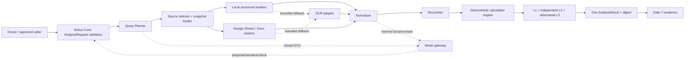
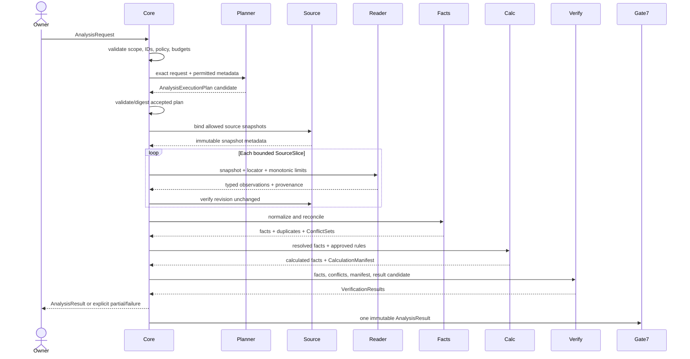

# Gate 6 TARGET Architecture — Multi-Document Analytics

Document status: `ARCHITECTURE READY`
Implementation status: `TARGET`, not CURRENT
Canonical baseline: repository commit `9d816b35d3f419b42e24ad09ae6aadc92c33db43`
Research basis: [RESEARCH.md](RESEARCH.md)
Scope: normative product and technical architecture only. This document does not authorize runtime, dependency, credential, model-upload, external-write or deployment changes.

## 1. Normative verdict

Gate 6 MUST implement this single analytical path:

`exact AnalysisRequest → bounded native/structured reads → typed NormalizedFacts with cell/sheet/range/page lineage → explicit reconciliation → deterministic calculations → one AnalysisResult + digest`

The following are architectural invariants:

1. Gate 6 is **not RAG-first** and does not send whole documents or workbooks to a large model by default.
2. A model MAY propose a query plan, produce narrative, or perform an independent semantic check. It MUST NOT be the calculator, source authority, conflict authority, revision authority, access-control authority, or origin of unobserved facts.
3. `LOCAL`, `GOOGLE`, and `MIXED` source modes use the same request, fact, provenance, conflict, calculation, verification and result semantics.
4. Observed numeric zero is a value. Missing, blank, null, invalid, not applicable, conflict and OCR uncertainty are distinct states.
5. Conflicting sources are never resolved silently.
6. Every authoritative derived value is reproducible from immutable source bindings, normalized input facts, versioned rules and a calculation manifest.
7. Gate 7 receives one `AnalysisResult`; Telegram, JPEG, HTML and XLSX adapters render it without recomputation.

The keywords MUST, MUST NOT, SHOULD, SHOULD NOT and MAY are normative in the RFC 2119 sense.

## 2. Owner-facing analytical product

### 2.1 Capabilities

The owner can ask an exact business question across one or more permitted documents:

- select one canonical client and one or more canonical SKU/article identifiers;
- bind a half-open business period and timezone;
- select local files, Google files or both;
- request governed funnel, sales, advertising or operational metrics;
- receive observed and calculated values, coverage, source conflicts, missing-data states and limitations;
- open a compact evidence trail from a result/metric to file revision and cell/range/page/table location;
- reproduce calculations independently;
- render the same result in every Gate 7 format.

Examples:

1. “For `client-017` and `SKU-042`, compare June orders and revenue in the approved local sales workbook with the Google campaign sheet. Show discrepancies; calculate CVR and AOV.”
2. “For the selected client and articles, aggregate weekly spend and clicks over Moscow time. Do not infer absent days as zero.”
3. “Use only Google sources from the approved folder. If the sales and finance totals disagree, return both and mark the affected metric blocked.”
4. “Produce an HTML report and an XLSX evidence appendix from the same analysis result.”

All identifiers and numbers in this document are synthetic examples.

### 2.2 Owner-visible result

An owner-facing result MUST make the following visible without exposing unnecessary raw content:

- the exact client, SKU/article set, period and timezone;
- source coverage and immutable source version/content identifiers;
- observed and calculated metrics with units/currencies;
- whether each value is observed, derived, missing, invalid, conflicting or OCR-uncertain;
- conflict candidates and the policy or owner decision that resolved them;
- formula/rule name and version, rounding and denominator behavior;
- partial/degraded limitations and blocked metrics;
- verification status;
- one stable result digest used by every output format.

### 2.3 Non-goals

Gate 6 does not:

- implement arbitrary “chat with all files”;
- crawl sources outside the request allowlist;
- upload complete private documents to a model for convenience;
- infer canonical client/SKU identity from similarity alone;
- execute workbook formulas, macros, user SQL, cell formulas or CSV formulas;
- silently repair source data;
- invent currency conversion, timezone, locale, unit or missing-value policy;
- use a model to calculate, authorize, join tenants, resolve conflicts or perform writes;
- introduce a vector database or agent framework without benchmark evidence;
- make Gate 7 renderers analytical engines;
- replace source-of-record systems with an analytical cache.

## 3. CURRENT and reusable gap

### 3.1 Reusable CURRENT

The baseline contains reusable safety and orchestration primitives:

- bounded owner-file discovery and selection;
- path containment, ambiguity handling, size limits, DLP and content digests;
- bounded Google Drive discovery, link/search/folder selection and downloads;
- durable job/idempotency patterns;
- snapshot/CAS and atomic artifact patterns;
- strict contract and error-envelope conventions;
- malformed-input, containment, DLP, ambiguity and replay tests.

### 3.2 What CURRENT does not provide

The existing flat XLSX/DOCX extraction is safe for bounded preview/context, but it is not an analytical fact reader. It loses or does not guarantee:

- workbook/sheet/table/row/column/cell identity;
- source formula versus cached/effective/displayed value;
- decimal precision, currency, unit, locale and timezone;
- canonical client/SKU/period semantic keys;
- source revision binding across a multi-call read;
- duplicate and conflict semantics;
- calculation rule version and manifest;
- cell-to-result provenance.

Google Drive export is likewise useful for discovery/fallback, not primary Sheets/Docs analytics. Gate 6 adds native Sheets and Docs readers behind the existing source boundary.

No CURRENT module is deprecated as a preview/delivery facility. It is only forbidden as authoritative analytical extraction when it cannot produce the contracts below.

## 4. System boundary and data flow

### 4.1 Components



The model gateway is subordinate. It has no direct source credential, file-system traversal, SQL, calculation engine, cache, output effect or write capability.

### 4.2 End-to-end sequence



### 4.3 Trust boundaries

| Boundary | Untrusted input | Mandatory control |
|---|---|---|
| Caller → Core | IDs, periods, requested sources/metrics | Closed request DTO, tenant policy, allowlists, budgets |
| Source metadata → Planner | Names, headers, comments | Treat as data, not instructions; bounded metadata |
| Source content → Reader | Malformed archives, formulas, prompt text | Parser sandbox/bounds, no execution, DLP |
| Reader → Normalizer | Ambiguous locale/types/OCR | Typed observation state, explicit parse errors |
| Model → Core | Proposed plan/narrative/check | Closed DTO, semantic validation, no authority |
| Facts → Calculation | Conflicts, missing, unit mismatch | Rule input contract, fail closed |
| Result → Gate 7 | Formula-like strings, sensitive locators | Output escaping, redaction policy, digest preservation |

## 5. Canonicalization and digest rules

All contract digests MUST use the repository’s canonical JSON convention:

- UTF-8;
- closed schemas with explicit `schema_version`;
- deterministic key order;
- no floating-point authoritative numbers;
- decimal and timestamp lexical forms defined below;
- deterministic ordering for semantically unordered collections;
- SHA-256 or the repository-approved digest algorithm;
- secrets and raw credentials prohibited.

Identifiers are opaque strings. A digest binds exact semantic content, not Python object identity or presentation formatting.

`request_digest` excludes transient timestamps and tracing IDs but includes tenant scope, selectors, period, source allowlist, metrics, rules and processing/budget policy. `result_digest` includes normalized facts, conflict state, calculations, limitations and verification references, but excludes renderer-specific layout.

## 6. Exact contracts

Gate 2 exclusively owns and registers the external `AnalysisRequest` wire
schema. Gate 6 imports it unchanged and owns only the internal analytical
execution contracts below.

### 6.1 Imported Gate 2 `AnalysisRequest`

The accepted request contains the Gate 2 common identity/binding fields plus:
`analysis_id`, `idempotency_key`, `read_plan_digest`, exact `sources`, bounded
`question`, canonical `sku_or_articles`, `DocumentPeriod`, closed `metrics` and
`grouping`, versioned `calculation_rules`, closed `requested_outputs`, bounded
`limitations`, exact `processing_policy_ref`, closed monotonic `limits` and
`maximum_classification`. Its common `contract_digest` is the authoritative
request digest.

Gate 6 validates the exact schema/version/digest and set-equality between
`sources` and the accepted read plan. It MUST NOT accept an alternate
`AnalysisRequest`, free source expansion, unregistered entity IDs, model-created
rules or relaxed budgets.

### 6.2 `AnalysisExecutionPlan`

This is a Gate 6 internal derivative, never a second external request schema.

| Field | Type | Requirement |
|---|---|---|
| `schema_version` | version | Required |
| `plan_id` | opaque ID | Required |
| `request_digest` | digest | Exact imported Gate 2 request binding |
| `source_candidates` | list[`SourceSnapshotRef`] | Authorized and bounded |
| `slices` | ordered list[`SourceSlice`] | Deterministic read order |
| `entity_mappings` | list[`MappingProposal`] | Evidence-backed, Core-validated |
| `extractor_refs` | list[`ComponentRef`] | Name, exact version, config digest |
| `rule_refs` | list[`RuleRef`] | Exact versions |
| `processing_policy_ref` | bound ref | Exact request policy |
| `estimated_budget` | `BudgetUsage` | Must fit request hard limits |
| `stop_conditions` | list[`StopCondition`] | Explicit codes |
| `reason_codes` | list[`ReasonCode`] | Auditable, not hidden prose |
| `status` | enum | `PROPOSED|ACCEPTED|REJECTED|CANCELLED` |
| `plan_digest` | digest | Accepted content |

A model-produced execution plan is always `PROPOSED`. Only deterministic Core
validation can change it to `ACCEPTED`.
### 6.3 `SourceSlice`

Gate 6 first imports and validates the exact Gate 2 `DocumentReadResult` and
`DocumentSlice` schema digests. `SourceSlice` is then an internal private-vault
execution record, never a Bridge/Core wire contract or `AnalysisResult` field.
Its private locator cannot enter model context, logs or Gate 7 output.

| Field | Type | Requirement |
|---|---|---|
| `slice_id` | opaque ID | Stable within plan |
| `source` | `SourceSnapshotRef` | Immutable binding |
| `locator` | `SourceLocator` | Sheet/range, Docs tab/path, PDF pages, DOCX part/table, CSV rows |
| `media_type` | MIME/closed enum | Expected type |
| `purpose` | closed enum | Header scan, fact rows, evidence validation, OCR candidate |
| `reader_ref` | `ComponentRef` | Reader/version/config digest |
| `limits` | `SliceLimits` | Bytes, rows, cells, pages, chars, time |
| `status` | enum | `PLANNED|READ|EMPTY|TRUNCATED|FAILED|CANCELLED` |
| `content_digest` | optional digest | Digest of bounded decoded slice, not required raw persistence |
| `usage` | `BudgetUsage` | Actual monotonic consumption |

`EMPTY` means the requested slice was read and contained no observations. It does not mean zero.

### 6.4 Private provenance and safe projection

`PrivateProvenanceRecord` is stored only in the tenant/client-bound provenance
vault and is never serialized into `AnalysisResult`, a model prompt, Artifact
Factory, logs or traces.

| Field | Type | Requirement |
|---|---|---|
| `provenance_id` | opaque/deterministic ID | Required; safe lookup key |
| `scope` | tenant/project/client/owner binding | Exact and validated on every lookup |
| `document_ref_digest` | digest | Exact Gate 2 private ref binding |
| `backend` / `source_kind` | closed enums | Required |
| `private_source_identity` | private vault object | Local doc mapping or Google provider ID; never exported |
| `snapshot` | `SourceSnapshot` | Local content digest or Google version/revision binding |
| `private_locator` | `SourceLocator` | Exact cell/range/page/part coordinates and names |
| `reader_ref` | `ComponentRef` | Exact reader/version/config |
| `captured_at` / `evidence_digest` | audit binding | Required as policy defines |
| `sensitivity` | data-class label | Controls display/retention |

Private `SourceLocator` variants may contain sheet/tab IDs and names, Docs
indexes, DOCX package parts, PDF coordinates or CSV row/column details. They are
authoritative only inside the vault.

`SafeProvenanceView` is the only provenance type exported downstream:

| Field | Type | Requirement |
|---|---|---|
| `provenance_id` | opaque ID | Required |
| `scope_binding_digest` | digest | Binds tenant/project/client/owner without exposing IDs |
| `safe_source_ref` | opaque Gate 2-safe ref/digest | No provider ID or local path |
| `source_kind` | closed enum | Required |
| `safe_locator_label` | bounded generated label or null | No sheet/client/path/provider identifiers |
| `snapshot_digest` / `evidence_digest` | digest | Required where applicable |
| `sensitivity` | data-class label | Required |

A wrong-client lookup returns the same closed `NOT_FOUND_OR_FORBIDDEN` response
and no existence signal. Safe-view generation has a path/provider-ID/client-name
negative scanner and fails closed.
### 6.5 `NormalizedFact`

| Field | Type | Requirement |
|---|---|---|
| `fact_id` | deterministic ID | Derived from semantic key + value state + provenance digests |
| `semantic_key` | `FactKey` | Scope, client, SKU, metric, period, dimensions, unit/currency |
| `value` | `TypedValue?` | Present only when state permits |
| `state` | `FactState` | Required disjoint enum |
| `value_origin` | enum | `OBSERVED|DERIVED` |
| `source_value_kind` | enum | `LITERAL|FORMULA|CACHED_VALUE|EFFECTIVE_VALUE|DISPLAY_VALUE|OCR` |
| `provenance` | non-empty list[`provenance_id`] | Private vault refs; required for observed fact |
| `calculation_ref` | optional manifest/rule output ref | Required for derived fact |
| `parse_notes` | bounded reason codes | No free-form sensitive dump |
| `confidence` | optional decimal | Only for extraction/review; never automatic authority |
| `fact_digest` | digest | Canonical fact content |

`FactKey` contains:

`tenant_id, project_id, client_id, sku_id?, metric_id, period, dimensions, unit_id?, currency?`

### 6.6 `NormalizedTable`

`NormalizedTable` is a convenience envelope for ordered, schema-consistent facts. Atomic `NormalizedFact` remains the lineage authority.

| Field | Type | Requirement |
|---|---|---|
| `table_id` | deterministic ID | Required |
| `schema_ref` | versioned table schema | Closed columns/types |
| `columns` | ordered list[`ColumnSpec`] | Required |
| `rows` | ordered list[`FactRow`] | Bounded |
| `provenance_map` | cell/field → provenance IDs | Required for values |
| `table_digest` | digest | Canonical rows and mappings |

### 6.7 `ConflictSet`

| Field | Type | Requirement |
|---|---|---|
| `conflict_id` | deterministic ID | Required |
| `semantic_key` | `FactKey` | All candidates share it |
| `candidates` | list[`NormalizedFact`] | At least two unequal candidates |
| `conflict_type` | enum | `VALUE|UNIT|CURRENCY|PERIOD|ENTITY|REVISION|FORMULA|DUPLICATE_AMBIGUITY` |
| `status` | enum | `UNRESOLVED|RULE_RESOLVED|OWNER_RESOLVED|INVALIDATED` |
| `resolution` | optional `ConflictResolution` | Exact rule/decision evidence |
| `blocked_outputs` | list[`MetricId`] | Explicit impact |
| `conflict_digest` | digest | Required |

`ConflictResolution` records the chosen candidate(s), rejected candidate(s), versioned resolution rule or owner approval reference, resolver identity/type, timestamp and rationale code. A narrative-model choice is invalid.

### 6.8 `CalculationRule`

| Field | Type | Requirement |
|---|---|---|
| `rule_id` | governed ID | Required |
| `version` | immutable semantic version | Required |
| `output_metric` | `MetricId` | Required |
| `input_metrics` | ordered list[`MetricId`] | Required |
| `expression` | governed DSL or parameterized SQL template | No user/model SQL |
| `input_contract` | types, units, dimensions | Required |
| `missing_policy` | closed enum/logic | Explicit |
| `conflict_policy` | normally `BLOCK` | Explicit |
| `division_by_zero_policy` | closed enum | Explicit |
| `rounding_policy` | precision/scale/mode/stage | Explicit |
| `currency_policy` | currency/FX behavior | Explicit |
| `timezone_policy` | period conversion behavior | Explicit |
| `aggregation_policy` | sum/weighted/etc. and ordering | Explicit |
| `rule_digest` | digest | Required |

Rules are immutable. A change creates a new version and digest. Rule text is reviewed code/config, not source data.

### 6.9 `CalculationManifest`

| Field | Type | Requirement |
|---|---|---|
| `manifest_id` | deterministic ID | Required |
| `request_digest` / `plan_digest` | digests | Exact bindings |
| `source_snapshot_digests` | ordered list[digest] | Required |
| `normalized_fact_digests` | ordered list[digest] | Required |
| `rule_refs` | ordered list[`RuleRef`] | Exact versions/digests |
| `engine_ref` | name/version/build/config digest | Required |
| `bound_parameters` | canonical values | Required |
| `canonical_expressions` | approved SQL/DSL | Required |
| `input_fact_ids` / `output_fact_ids` | ordered lists | Required |
| `started_at` / `completed_at` | UTC timestamps | Audit only |
| `warnings` | bounded reason codes | Explicit |
| `manifest_digest` | digest | Required |

The manifest MUST be sufficient for an independent implementation to re-evaluate every derived fact without source prose or model output.

### 6.10 `AnalysisResult`

| Field | Type | Requirement |
|---|---|---|
| `schema_version` | version | Gate 7 contract |
| `analysis_id` | opaque ID | Required |
| `status` | `COMPLETE|PARTIAL|FAILED|CANCELLED` | Required |
| `scope` / request summary | exact IDs and period | Required |
| `request_digest` / `plan_digest` | digests | Required |
| `source_coverage` | list[`SourceCoverage`] | Read/failed/truncated/revision status |
| `observed_facts` | ordered list[`SafeFactView`] | Contains only `SafeProvenanceView`; no private locator |
| `calculated_facts` | ordered list[`SafeFactView`] | Derived through manifest; safe provenance only |
| `conflicts` | ordered list[`ConflictSet`] | Required, even empty |
| `calculation_manifests` | list[`CalculationManifest`] | Required when derived facts exist |
| `limitations` | list[`Limitation`] | Required, even empty |
| `errors` | list[`AnalysisError`] | Required, even empty |
| `verification_refs` | list[`VerificationResultRef`] | Required |
| `narrative` | optional bounded narrative | Derived presentation, not fact authority |
| `projection_data` | versioned Gate 7 view model | No calculations |
| `result_digest` | digest | Same across all formats |

`AnalysisResult` is the cross-Gate/export contract and therefore never contains a
`PrivateProvenanceRecord`, raw provider ID, local path, sheet/tab/client name or
DOCX package part. Internal `NormalizedFact` records stay in the analytical
vault; `SafeFactView` repeats the exact scope-binding digest and only safe
provenance projections.

A `FAILED` result contains no authoritative metric projection. A `PARTIAL` result identifies exact source/metric coverage and blocked outputs.

### 6.11 `VerificationResult`

| Field | Type | Requirement |
|---|---|---|
| `verification_id` | opaque ID | Required |
| `level` | `L1|L2|L3` | Required |
| `method` | closed method ID/version | Required |
| `verifier` | type/identity | Independent from maker where policy requires |
| `input_digests` | ordered list[digest] | Required |
| `result_digest` | digest | Exact result checked |
| `checks` | list[`CheckOutcome`] | Evidence and expected/actual |
| `status` | `PASS|FAIL|REWORK|DEFERRED` | Required |
| `discrepancies` | bounded structured list | Required, even empty |
| `verified_at` | UTC timestamp | Required |

The execution component cannot approve its own calculation as L2. A different implementation, process or reviewer must reproduce it. L3 uses adversarial inputs and failure injection.

## 7. Type system and analytical semantics

### 7.1 Numbers and decimals

- Authoritative numeric values use decimal lexical strings such as `"12500.50"` and a declared precision/scale.
- Binary float MUST NOT be an authoritative monetary or ratio input/output.
- DuckDB columns use explicit `DECIMAL(p,s)` chosen by the rule/schema.
- Rounding mode, scale and stage are part of `CalculationRule`.
- Percentages declare whether the stored unit is ratio (`0.025`) or percent (`2.5%`); display conversion is Gate 7 only.
- Division by zero is not missing. The rule yields its explicit state/error policy.

### 7.2 Currency and FX

- Currency uses ISO 4217 codes such as `RUB` and `USD`.
- Monetary facts with different currencies do not join or sum.
- FX conversion requires an approved FX source, rate date/time, rate precision and rule version, each with provenance.
- No model or current exchange-rate lookup is implicit.

### 7.3 Units

Units come from a governed registry (`count`, `impression`, `click`, `order`, `RUB`, `second`, and so on). Unit conversion requires a versioned deterministic rule. Dimensionless ratios still declare semantic unit.

### 7.4 Time and period

- Business periods are half-open: `[start, end)`.
- The request declares an IANA timezone such as `Europe/Moscow`.
- Instants are stored as UTC timestamps with original timezone/offset evidence when relevant.
- Day/week/month grouping occurs in the business timezone before UTC storage.
- Ambiguous/nonexistent local times follow an explicit rule; they are never silently shifted.
- Source serial dates retain workbook date-system metadata.

### 7.5 Locale

Locale affects parsing, not identity. Readers use an explicit source locale when available (for example, Google spreadsheet properties) or a plan-approved locale. Ambiguous lexical values such as `1,234` yield `INVALID`/`LOCALE_AMBIGUOUS`, not a guess.

### 7.6 Fact states

`FactState` is a disjoint enum:

| State | Meaning | Can be numeric zero? |
|---|---|---|
| `OBSERVED` | Valid source value was observed | Yes |
| `PRESENT_NULL` | Source explicitly represents null | No |
| `PRESENT_BLANK` | Cell/field exists but is blank | No |
| `MISSING` | Expected observation/field is absent | No |
| `NOT_APPLICABLE` | Metric does not apply by governed rule | No |
| `INVALID` | Present value failed type/locale/unit validation | No |
| `CONFLICT` | Unequal candidates share a semantic key | No |
| `OCR_UNCERTAIN` | OCR produced a candidate below authority threshold | Candidate is not authoritative |

Rules MUST name which states they accept. The default is to block on every state except `OBSERVED`.

### 7.7 Formula versus value

For spreadsheets, a reader preserves:

- formula presence and a protected formula digest;
- cached/effective value when exposed;
- formatted/displayed value;
- last-calculation/source metadata when available;
- dependencies only if safely and deterministically parsed.

Source formulas and macros are never executed by Gate 6. A source formula may supply an observed cached/effective value only under an explicit rule and with `source_value_kind` preserved. An approved `CalculationRule` is the only executable analytical formula.

Formula text is source content. Store it only when audit policy requires, encrypted and bounded; otherwise store formula kind, digest and necessary safe metadata. Gate 7 escapes cells beginning with `=`, `+`, `-` or `@` according to its spreadsheet-output policy.

## 8. Structured readers and source snapshots

### 8.1 Common reader interface

Every reader accepts:

`tenant scope + SourceSnapshotRef + SourceSlice.locator + limits + cancellation token`

and returns:

`typed observations + ProvenanceRefs + usage + warnings/status`

Readers do not calculate business metrics, resolve identity, resolve conflicts, call models or write sources.

### 8.2 Google Sheets

The primary reader uses the official Sheets API:

- resolve spreadsheet properties, sheet IDs/names, locale and timezone;
- request only planned ranges;
- use field masks to restrict returned properties;
- preserve `userEnteredValue`, `effectiveValue`, `formattedValue` and formula kind;
- emit A1 and row/column lineage;
- enforce cell/row/byte/request/time ceilings;
- bracket the read with Drive version/metadata checks.

Export to XLSX is a fallback for unsupported API details or offline artifact delivery, not the primary analytical path.

### 8.3 Google Docs

The primary reader uses `documents.get` with tab content where needed:

- bind document and tab IDs;
- traverse planned structural elements only;
- preserve UTF-16 indexes/structural paths and table row/column identity;
- bound tabs/elements/chars/requests/time;
- bracket the read with Drive version checks.

DOCX export is a fallback and MUST identify changed lineage semantics.

### 8.4 Local XLSX

The reader uses `openpyxl` in a non-executing mode:

- reject macros or treat them as inert metadata;
- preserve workbook/sheet/cell/table identity;
- read formulas and cached/effective values as distinct observations;
- preserve merged/hidden/date-system/number-format metadata needed for parsing;
- defend against archive/decompression bombs and oversized dimensions;
- never invoke Excel or recalculate the workbook.

### 8.5 Local DOCX

The reader uses `python-docx` for paragraphs and tables:

- preserve package part and table/row/column or paragraph indexes;
- explicitly report unsupported floating shapes/text boxes/embedded objects;
- do not treat visual adjacency as a join without a governed mapping;
- use bounded raw XML fallback only for a specific unsupported element and retain locator semantics.

### 8.6 Local PDF

The primary reader uses `pdfplumber`:

- bind local content digest;
- preserve page and bounding-box coordinates;
- extract words/tables only from planned pages;
- record table settings/config digest;
- fail explicitly for encrypted/unsupported/malformed content;
- never infer an authoritative table when column/row geometry is ambiguous.

### 8.7 OCR fallback

OCR starts only when:

1. deterministic extraction emits an approved reason (`NO_TEXT_LAYER`, `TABLE_NOT_RECOVERABLE`, etc.);
2. request policy permits local or cloud OCR for the data class;
3. remaining page/byte/time/cost budgets are sufficient;
4. source pages are explicitly bounded;
5. the adapter/model/version is recorded.

Local Docling is the first optional adapter after benchmark. Google Document AI is the preferred cloud comparison/fallback after explicit data-policy and cost approval. Azure is a procurement/benchmark fallback. AWS Textract is rejected for Russian-first MVP.

OCR facts remain `OCR_UNCERTAIN` until a deterministic cross-check, second extraction or human review meets the metric-specific authority policy. Low-confidence OCR can produce a `PARTIAL` result; it cannot silently become zero or a valid observed fact.

## 9. Query planning, selection and execution controls

### 9.1 Planning order

1. Validate exact tenant, client, SKU/article, period, metrics, rules and policies.
2. Resolve canonical entity aliases through Gate 2.
3. Discover only within the Gate 5 source allowlist.
4. Read bounded metadata/headers first.
5. Bind source snapshots.
6. Build the smallest `SourceSlice` set able to answer the request.
7. Validate projected usage against hard limits.
8. Accept and digest the plan.
9. Execute slices in deterministic order.

### 9.2 Source selection

Source names are hints, not identity. Stable source IDs and owner-approved selectors are authority. If two files/tabs remain plausible, return `AMBIGUOUS_SOURCE`; do not let a model pick.

The planner MUST NOT expand from one source to “related” Drive content, hyperlinks, embedded objects or neighboring directories unless the request and Gate 5 policy explicitly allow that scope.

### 9.3 Revision binding

Local sources bind to an immutable content digest plus relevant file metadata. Google binary sources use stable file ID plus revision/head metadata where supported. Google editor sources use stable ID and Drive version/document metadata bracketed before and after the structured read.

If version metadata changes:

- discard facts from the inconsistent attempt;
- retry from the beginning if retry budget and cancellation permit;
- otherwise return `SOURCE_CHANGED`;
- never merge pre-change and post-change slices.

### 9.4 Cancellation and limits

Every boundary checks a cancellation token:

- before/after metadata reads;
- before each source slice/page/range;
- before OCR/model calls;
- before normalization batch, reconciliation, calculation and verification;
- before result persistence/render handoff.

Budgets are monotonic counters. Child operations receive remaining ceilings, never fresh budgets. Minimum required limits:

- sources, slices and provider requests;
- bytes decoded and decompressed;
- rows, cells, tables, pages, characters;
- parse/OCR/model wall time;
- model input/output tokens;
- cloud OCR pages/cost;
- total job wall time and result size.

A limit breach is explicit and may yield `PARTIAL` only if unaffected metrics remain independently valid.

## 10. Normalization, joins and reconciliation

### 10.1 Normalization

Normalization converts observations into typed facts without changing their business meaning:

- canonicalize entity IDs through the approved alias registry;
- parse values using declared locale/type;
- map headers to governed metric IDs through versioned mappings;
- normalize period/timezone and dimensions;
- attach unit/currency;
- preserve fact state and source value kind;
- attach complete lineage;
- compute deterministic fact IDs/digests.

A model MAY propose a header mapping, but Core accepts it only when the mapping target exists, evidence points to the exact source field, tenant scope matches, and ambiguity/threshold policy passes. Otherwise the source remains unmapped.

### 10.2 Join policy

Joins use canonical IDs and typed dimensions only. Text similarity, display labels, filenames and row position are not join keys.

Before a join:

- tenant and project scope MUST be identical;
- client identity MUST be exact;
- SKU/article identity MUST be exact when applicable;
- period/granularity/timezone compatibility MUST be proven;
- unit and currency MUST be compatible;
- cardinality expectation MUST be declared (`1:1`, `1:n`, `n:1`, `n:n` forbidden by default);
- duplicate and overlap checks MUST pass.

Cross-tenant and unbounded many-to-many joins are fatal `TENANT_SCOPE_VIOLATION` or `JOIN_CARDINALITY_VIOLATION`.

### 10.3 Duplicate policy

Candidates with the same semantic key and equal typed value/state may be coalesced as duplicates. The resulting fact retains every provenance reference and a duplicate-group digest.

Rows may be summed only when a governed partition key proves they are disjoint contributions. Similar-looking repeated rows are not automatically additive.

### 10.4 Conflict policy

Unequal candidates sharing a semantic key create a `ConflictSet`. Default status is `UNRESOLVED`; affected calculations are blocked.

Permitted deterministic resolution rules include:

- remove an older revision of the same stable source;
- choose a designated authority for a specific metric/source class/period;
- coalesce exact typed duplicates;
- combine proven non-overlapping partitions.

Forbidden implicit rules include newest file timestamp, preferred file name, maximum/minimum/average, majority vote, model preference or source-order preference.

Owner resolution is an explicit external decision reference and follows Gate 2/7/L4 policy. The original candidates and conflict remain auditable.

## 11. Deterministic calculation engine

### 11.1 Execution model

DuckDB is the primary bounded analytical executor. SQLite stores durable job/fact/manifest state. A small pure-Python `Decimal` implementation independently reproduces governed rules.

Constraints:

- no model/user/source SQL;
- only parameterized, reviewed expressions from immutable `CalculationRule`;
- no external database attachment;
- no automatic/community extension installation or loading;
- no network/filesystem access beyond explicitly materialized bounded facts;
- deterministic input ordering;
- explicit decimal precision/scale and rounding;
- memory, thread, row and wall-time limits;
- engine/version/config recorded in the manifest.

### 11.2 Rule examples

Synthetic governed rules:

- `ctr = clicks / impressions`
- `cvr = orders / clicks`
- `aov = revenue / orders`

For synthetic inputs:

- impressions = `1000`
- clicks = `25`
- orders = `5`
- revenue = `12500.50 RUB`

exact outputs before display formatting are:

- CTR = `0.025`
- CVR = `0.2`
- AOV = `2500.10 RUB`

These values are valid only because every input state is `OBSERVED`, units/currency match, and denominators are non-zero. A missing click count does not become `0`; a zero click count follows the rule’s explicit division-by-zero policy.

### 11.3 Rule versioning

Rules are immutable. Changing aggregation, denominator, missing behavior, scale, rounding, currency or timezone creates a new version and digest. Existing results retain the original rule reference. Recalculation produces a new manifest and result digest.

### 11.4 Independent reproduction

L2 MUST:

1. read the normalized fact and rule contracts, not the DuckDB output table;
2. execute a separately authored `Decimal` implementation;
3. compare exact output states, decimals, units, dimensions and input/output lineage;
4. compare manifest source/fact/rule bindings;
5. return `FAIL`/`REWORK` on any discrepancy.

A second SQL query in the same DuckDB process is not independent reproduction.

## 12. Model gateway

### 12.1 Approved DTOs

The Gate 5 model gateway exposes only closed analytics DTOs:

- `AnalysisExecutionPlanProposalRequest/Response`;
- `HeaderMappingProposalRequest/Response`;
- `NarrativeRequest/Response`;
- `SemanticVerificationRequest/Response`.

Each request includes:

- tenant/data-class policy token, not credentials;
- request/result/source evidence digests;
- bounded typed facts or metadata;
- minimal redacted excerpts with evidence IDs;
- token/cost/time ceiling;
- model/provider route and retention policy;
- closed output schema.

Each response includes model/provider/version, prompt-template digest, input/output digests, usage/cost, retention route, status and validation errors.

### 12.2 Prompt-injection boundary

All source text, cell values, filenames, comments, formulas, OCR text and PDF footnotes are quoted/untrusted data. System instructions state that they cannot change scope, request tools, override policy or authorize facts.

The model has:

- no Drive/local credentials;
- no arbitrary source reader;
- no shell/SQL/calculation tool;
- no external write or Gate 7 publish tool;
- no cross-tenant cache;
- no ability to increase limits.

Core validates every returned ID, source reference, metric, range and statement against available evidence. Narrative statements without supporting fact/conflict/limitation IDs are dropped or marked interpretation.

### 12.3 Context, cost and retention

Models receive the smallest sufficient payload. Whole-file input, Files API upload and long-context ingestion are off by default.

Model use requires:

- allowed data classification and provider route;
- ZDR/`store=false` where contractually supported;
- no Search grounding for private sources;
- no provider Files API unless separately approved;
- token and monetary ceiling;
- bounded retry and no silent provider fallback across weaker privacy tiers;
- usage/cost/audit record without raw content;
- explicit `MODEL_UNAVAILABLE` degradation.

Codex is primary for query-plan proposals, narrative and semantic verification. Gemini is an optional paid specialist for bounded visual/table ambiguity or a second semantic check. Both are non-authoritative.

## 13. Provenance, audit and privacy

### 13.1 Persist

Persist:

- request/plan/result/manifest/verification digests;
- exact source IDs and revision/content digests;
- compact source locators;
- typed normalized and derived facts as permitted;
- conflict candidates and resolution references;
- component/model/rule versions and config digests;
- budget usage, statuses, error/limitation codes;
- audit timestamps and verifier identity/type.

### 13.2 Do not persist by default

Do not duplicate:

- entire documents/workbooks/PDFs;
- unbounded raw slices or OCR output;
- model prompts containing raw source content;
- credentials, signed URLs, cookies or tokens;
- formula text when a protected digest suffices;
- tenant-foreign metadata;
- source content solely for renderer convenience.

Bounded evidence snippets may be persisted only under data-class, encryption, TTL and redaction policy. The normal audit path reopens the permitted source snapshot/locator.

### 13.3 Audit relationships

Every derived fact maps:

`derived fact → CalculationManifest → CalculationRule + input fact IDs → ProvenanceRefs → source snapshot + locator`

Every narrative claim maps to fact, conflict or limitation IDs. Gate 7 formats carry `result_digest`; format-specific evidence appendices may expose only policy-approved locators.

W3C PROV export and job-level OpenLineage emission are deferred interoperability adapters, not primary storage.

## 14. Cache policy

### 14.1 Cache key

The semantic cache key is:

`tenant/project + request semantic digest + ordered source snapshot digests + extractor/config versions + normalization schema/mappings + rule digests + engine/config version + processing policy`

No field may be omitted merely to improve hit rate.

### 14.2 Cacheable objects

MAY cache:

- source metadata within provider TTL/version semantics;
- normalized facts and provenance;
- reconciliation outputs;
- calculation manifests/results;
- approved model narrative keyed by exact result/prompt/model/policy digests.

Raw source slices and OCR images are not cached by default.

### 14.3 Invalidation and isolation

- source revision/content change invalidates downstream objects;
- extractor, mapping, schema, rule, engine or policy change invalidates affected objects;
- partial/error/cancelled entries are never reused as complete;
- cache namespaces and encryption keys are tenant-scoped;
- cache lookup revalidates authorization;
- digest mismatch evicts and fails closed;
- TTL and eviction follow data-class policy;
- no cross-tenant deduplication, even for equal content digests.

## 15. Errors, degradation and partial results

### 15.1 Error codes

Minimum closed codes:

- `INVALID_REQUEST`
- `AMBIGUOUS_ENTITY`
- `AMBIGUOUS_SOURCE`
- `SOURCE_NOT_FOUND`
- `SOURCE_CHANGED`
- `READ_BUDGET_EXCEEDED`
- `UNSUPPORTED_FORMAT`
- `PARSE_FAILED`
- `OCR_REQUIRED`
- `OCR_DISALLOWED`
- `OCR_UNCERTAIN`
- `LOCALE_AMBIGUOUS`
- `FORMULA_UNRESOLVED`
- `DUPLICATE_AMBIGUITY`
- `CONFLICT_UNRESOLVED`
- `JOIN_CARDINALITY_VIOLATION`
- `CALCULATION_FAILED`
- `VERIFICATION_FAILED`
- `MODEL_UNAVAILABLE`
- `CANCELLED`
- `TENANT_SCOPE_VIOLATION`

Errors follow the canonical Nobus error envelope and do not expose secret paths, tokens or raw source contents.

### 15.2 Status semantics

| Status | Meaning |
|---|---|
| `COMPLETE` | All requested authoritative metrics are supported by required sources, resolved facts, manifests and required verification |
| `PARTIAL` | A precise subset is authoritative; coverage, blocked metrics, conflicts and limitations are explicit |
| `FAILED` | No authoritative requested result can be issued |
| `CANCELLED` | Execution stopped; no new authoritative result is implied |

Transport failure is never interpreted as empty data. Empty slice is never numeric zero. Model outage normally degrades narrative/semantic checking, not deterministic facts; if required verification policy cannot be met, status becomes `PARTIAL` or `FAILED`.

### 15.3 Owner-facing limitations

Limitations use structured codes and safe display labels, for example:

- “Sales source changed during read; sales and AOV are blocked.”
- “Pages 4–6 required OCR, but cloud OCR was not permitted.”
- “Two approved sources disagree on orders; both values are shown.”
- “Narrative unavailable; verified facts and calculations remain.”

They do not dump raw cell contents, local absolute paths, signed URLs or provider internals.

## 16. Minimal libraries and fallback ladder

### 16.1 Recommended baseline

1. Reuse existing strict Pydantic contract/digest patterns.
2. Use stdlib `Decimal`, `datetime`, `zoneinfo`, `csv`, hashing and SQLite.
3. Add DuckDB as the one analytical engine after exact version/license/security review.
4. Add only format-specific readers needed by accepted corpus: `openpyxl`, `python-docx`, `pdfplumber`.
5. Add Hypothesis as test-only.
6. Keep OCR behind an optional adapter: Docling local, Google Document AI cloud.
7. Use official Google Drive/Sheets/Docs APIs.

### 16.2 Fallback order

| Failure | Fallback | Stop/reject condition |
|---|---|---|
| DuckDB unavailable | Pure-Python `Decimal` + SQLite for supported rules | Complex rule unsupported → explicit failure, no model calculation |
| Google native API unavailable | Bound export through Gate 3/5 if revision and lineage policy remains adequate | Cannot bind revision/locator → partial/fail |
| Local PDF no text layer | Bounded local OCR | OCR disallowed/uncertain/over budget → partial/fail |
| Local OCR inadequate | Approved Google Document AI | Data class/cost/retention not approved → stop |
| Model unavailable | Deterministic result without narrative/semantic check | Required verification policy unmet → partial/fail |
| Reader format drift | Quarantine fixture, explicit unsupported error | Never fall through to unbounded model upload |

### 16.3 Rejected/deferred additions

- no vector database or embeddings service;
- no LangChain, LlamaIndex, ADK or generic agent runtime;
- no pandas/Polars/Ibis/Pandera in baseline;
- no Tika/Unstructured as universal parser;
- no PyMuPDF under current license posture;
- no AWS Textract for Russian-first OCR;
- no external lineage platform as primary fact model.

Ponytail `lite` decision: the lazier viable alternative is stdlib-only Variant A. DuckDB is retained because bounded joins/windows/grouping materially reduce bespoke analytical code; every other framework waits for measured need.

## 17. Code impact map

This is an implementation map, not authorization to change code.

### 17.1 Reuse/adapt

| Existing area | Reuse |
|---|---|
| `src/application/owner_files.py` | Selection, containment, DLP, digest and read bounds |
| `src/integrations/google_drive.py` | Authenticated discovery, selection, ambiguity and download/export bounds |
| `src/application/owner_workspace.py` | Snapshot/CAS and atomic artifact patterns |
| Existing contracts/core jobs | Strict DTO, tenant scope, idempotency, durable status and cancellation conventions |
| Existing tests | Malformed, ambiguity, containment, DLP, replay and fault-test style |

### 17.2 Limit/deprecate for analytical authority

| Existing behavior | New boundary |
|---|---|
| Flat `_extract_xlsx` / `_extract_docx` text | Preview/context only; not `NormalizedFact` authority |
| Sheets/Docs export as first read | Fallback; native APIs are primary |
| Renderer-derived totals/formulas | Forbidden; render `AnalysisResult` only |
| Unversioned ad hoc calculation | Forbidden; use `CalculationRule` + manifest |

### 17.3 Proposed additions

Names are directional and MUST be reconciled with repository conventions during implementation:

```text
src/domain/analytics/
  contracts.py
  types.py
  provenance.py
  rules.py

src/application/analytics/
  planner.py
  pipeline.py
  reconciliation.py
  verification.py

src/integrations/analytics/
  google_sheets_reader.py
  google_docs_reader.py
  xlsx_reader.py
  docx_reader.py
  pdf_reader.py
  ocr_adapter.py

src/infrastructure/analytics/
  fact_store.py
  calculation_engine.py
  cache.py

src/integrations/models/
  analytics_gateway.py
```

Avoid one-interface/one-implementation factories. Use the repository’s existing adapter conventions; create a protocol only where there are actually two readers/engines behind the same tested boundary.

## 18. Cross-Gate handoffs

### Gate 2 — scope and contracts

Gate 2 owns:

- wire schema registry/versioning;
- tenant/project/owner scope;
- canonical client/SKU/entity alias registry;
- error envelope and idempotency contract;
- explicit owner resolution/approval reference.

Gate 6 supplies the contract fields and analytical invariants defined here.

### Gate 3 — Google foundation

Gate 3 owns:

- OAuth/scopes and token isolation;
- Drive/Sheets/Docs API clients, quotas and provider telemetry;
- stable source IDs/version metadata;
- Gemini paid/enterprise route and retention policy.

Gate 6 never handles Google credentials directly.

### Gate 5 — unified documents and Bridge

Gate 5 owns:

- allowed source discovery;
- local Bridge containment and snapshot reads;
- parser sandbox/process limits;
- common source metadata and DLP boundary.

Gate 6 adds structured analytical readers, not a second file gateway.

### Gate 7 — artifacts and writeback

Gate 7 consumes:

- one immutable `AnalysisResult`;
- `projection_data`, fact/conflict/limitation references;
- `result_digest`;
- safe provenance view.

Gate 7 does not calculate, resolve conflicts, re-query sources or change missing semantics. Telegram, JPEG, HTML and XLSX MUST cite the same digest.

### Gate 8 — release

Gate 8 owns:

- pinned dependency/license/vulnerability review;
- Windows/VPS packaging and resource limits;
- golden regression, fault injection and performance benchmarks;
- provider cost/retention verification;
- observability/SLOs, rollback and release evidence.

## 19. Implementation slices

Each slice remains behind a disabled feature flag until its own acceptance evidence passes.

| Slice | Deliverable | Entry dependency | Exit evidence |
|---|---|---|---|
| 0. Contracts | Closed DTOs, type/state rules, canonical digests, synthetic fixtures | Gate 2 conventions | Schema/golden digest tests; no runtime path |
| 1. Local readers | CSV/XLSX/DOCX/PDF bounded observations and lineage | Gate 5 source snapshot | Malformed/oversize/formula/locale corpus |
| 2. Google readers | Sheets ranges, Docs tabs, revision bracketing | Gate 3 clients/scopes | Fake/emulated API tests and revision-race faults |
| 3. Normalize/reconcile | Canonical facts, joins, duplicates, conflicts | Slices 0–2 | Golden semantic keys; zero silent resolution |
| 4. Calculate | DuckDB engine, rules/manifests, Decimal reference | Slice 3 | Exact cross-engine golden reproduction |
| 5. Model gateway | Closed plan/narrative/semantic DTOs | Gate 5 model registry | Injection, retention, budget and outage tests |
| 6. OCR fallback | Docling and optional Document AI adapters | Reader reasons/policy | Russian scan accuracy and uncertainty gates |
| 7. Gate 7 handoff | Stable projections/digest across formats | Gate 7 renderers | Byte/layout differences allowed; semantic digest identical |
| 8. Release | Packaging, SLOs, cost and security evidence | Gate 8 | Full acceptance matrix |

## 20. Golden corpus and benchmark datasets

Only synthetic or explicitly approved anonymized data is allowed. No real client/owner document may enter fixtures, logs, prompts or provider uploads.

### 20.1 Corpus matrix

| Family | Required variants |
|---|---|
| CSV/TSV | UTF-8/CP1251; comma/semicolon/tab; quoted newlines; formula injection; ambiguous locale |
| XLSX | formulas/cached values; merged/hidden cells; 1900/1904 dates; stale cache; duplicate tabs; malformed/oversized archive |
| Sheets | multiple tabs; narrow ranges; locale/timezone; version change during read; missing permissions |
| DOCX | paragraphs/tables; repeated headers; nested tables; unsupported floating objects |
| Docs | multiple tabs; tables; UTF-16 index boundaries; revision race |
| PDF | born-digital and Russian scan; 150/300 DPI; rotation; split/multi-page tables; multi-column text |
| Business semantics | zero/blank/null/missing/invalid/N/A/conflict; RUB/USD; FX date; Moscow/UTC boundary |
| Security/fault | cross-tenant IDs; prompt injection; formula/CSV injection; decompression bomb; cancellation; model/OCR outage |

PubTables-1M patterns MAY inform layout stress tests. Nobus expected calculations and provenance remain an independently authored business corpus.

### 20.2 Benchmark profiles

- **Small interactive:** few sources/ranges, no OCR.
- **Mixed business:** local XLSX + Google Sheet + short PDF.
- **OCR bounded:** fixed small page set with Russian tables.
- **Oversized rejection:** inputs just below/above each hard limit.
- **Revision race:** source mutation between bracket reads.
- **Provider degraded:** Google/model/OCR partial outage.

For each profile record p50/p95 total and per-stage latency, peak memory, rows/cells/pages, provider requests, token counts, OCR pages, monetary cost, cache hits and result size. Gate 8 sets environment-specific ceilings from measured evidence; architecture does not invent workload-free latency/cost numbers.

## 21. Test strategy

### 21.1 Contract and golden tests

- closed-schema rejection and version migration;
- canonical ordering/digest stability;
- exact decimal, currency, unit, locale and timezone round trips;
- every `FactState`, especially observed zero versus missing;
- complete provenance variants;
- result digest identical across Gate 7 projections.

### 21.2 Property tests

Hypothesis generates:

- decimal magnitudes/scales and rounding boundaries;
- permutations of input order;
- half-open periods and timezone transitions;
- missing/null/blank/zero state combinations;
- duplicate/conflict candidate sets;
- join cardinalities and tenant IDs;
- unit/currency compatibility;
- cancellation and budget boundaries.

Required properties:

- input order does not change canonical result;
- exact duplicates coalesce without lineage loss;
- unequal candidates never disappear;
- missing never becomes zero;
- adding tenant-foreign facts cannot change a result because it must fail;
- production and reference calculations agree exactly;
- a source/rule/extractor change changes the appropriate cache/result digest.

### 21.3 Fault tests

- I/O failure between source-version brackets;
- revision changes mid-range or mid-page;
- parser timeout/crash and malformed archive;
- out-of-memory/resource ceiling simulation;
- partial Google pagination and quota errors;
- OCR timeout/low confidence/provider error;
- model timeout, invalid schema, hallucinated ID and budget overrun;
- cache corruption/digest mismatch;
- cancellation at every pipeline boundary.

### 21.4 Adversarial L3 tests

- hallucinated numeric value in model narrative;
- prompt injection in filename, header, cell, comment, footnote and OCR text;
- source formula and CSV injection;
- stale formula cache;
- ambiguous client/SKU aliases;
- same label in two tenants;
- false many-to-many join;
- missing-to-zero and blank-to-zero attempts;
- silent “latest source wins” attempt;
- conflicting currencies/units/timezones;
- OCR digit substitution, shifted column and dropped minus sign;
- oversized corpus and decompression bomb;
- Google revision race;
- model/cloud outage;
- new library/provider format drift.

The safe expected result is frequently explicit `PARTIAL` or `FAILED`; “always produce a number” is an anti-requirement.

## 22. Accuracy, latency and cost criteria

### 22.1 Accuracy gates

- 100% exact match for critical golden numeric outputs;
- 100% separately authored reference reproduction;
- 100% authoritative fact/output provenance completeness;
- 100% expected conflict detection;
- zero missing/null/blank/conflict-to-zero conversions;
- zero silent mixed-revision results;
- zero cross-tenant source, fact, join, cache or model-context reuse;
- zero execution of source formula, CSV formula, model/user SQL or macro;
- zero authoritative OCR fact below its promotion threshold;
- every Gate 7 format carries the same `result_digest`.

### 22.2 Latency/cost gates

- every stage reports usage and duration;
- hard request budgets are enforced monotonically;
- benchmark p50/p95 and cost are reported by profile/environment;
- cache-hit and cache-miss results are semantically/digest equivalent;
- model/OCR spend is zero when policy disables those paths;
- provider retry cannot exceed the original time/request/cost ceiling;
- any configured ceiling breach yields an explicit error/partial result.

## 23. Acceptance matrix

| Requirement | Design control | Required verification |
|---|---|---|
| Local-only | Local readers → same facts/contracts | Golden local corpus |
| Google-only | Native Sheets/Docs + revision bracket | API fixtures/race faults |
| Mixed | Common fact keys and reconciler | Cross-source golden conflicts |
| Exact client/SKU/period | Canonical IDs + half-open period | Alias/period properties |
| Bounded reads | `SourceSlice.limits` + monotonic usage | Boundary/oversize tests |
| Deterministic formulas | Versioned rules + DuckDB manifest | Decimal L2 reproduction |
| Full provenance | Atomic `ProvenanceRef` chain | 100% locator audit |
| Missing ≠ zero | Disjoint `FactState` | State property tests |
| Explicit conflicts | `ConflictSet`, block by default | Conflict adversarial set |
| Revision safety | Immutable local digest; Google bracket | Mutation-during-read |
| Model subordinate | Closed DTO/no tools/no calculation | Injection/hallucination/outage |
| Privacy/retention | Minimal context; no raw cache/files | DLP/retention audit |
| One Gate 7 result | Immutable `AnalysisResult` digest | All-format consistency |
| Reproducibility | Manifest + independent method | L2 exact match |
| Degraded semantics | Coverage/errors/limitations | Fault matrix |

## 24. Definition of Done

Gate 6 implementation is done only when:

1. all contracts in section 6 are registered/versioned through Gate 2;
2. source modes `LOCAL`, `GOOGLE`, `MIXED` pass the same semantic suite;
3. native readers preserve required lineage and enforce bounds;
4. revision races fail closed;
5. normalization and joins use exact tenant/entity/period/unit keys;
6. duplicate and conflict policies are explicit and tested;
7. every calculation uses an immutable rule and complete manifest;
8. independent `Decimal` reproduction matches exactly;
9. model paths are optional, bounded, non-authoritative and injection-tested;
10. OCR remains policy-gated and uncertain until promoted;
11. cache keys include tenant, revisions, rules, request and component versions;
12. partial/failure semantics expose coverage without inventing data;
13. every Gate 7 format uses the same result digest and performs no calculation;
14. the synthetic/anonymized corpus passes L1/L2/L3;
15. dependency licenses, versions, vulnerabilities, Windows/VPS packaging, cost/latency ceilings and rollback evidence pass Gate 8;
16. no real client/owner document or secret is present in fixtures, logs or model uploads;
17. owner L4 approval is obtained for any later high-risk provider, cost, retention or external-write change.

## 25. Architecture verification

### L1 — completeness, links, secrets and contracts

Required checks:

- both Gate 6 files exist and no forbidden file changed;
- every required contract and architecture topic is present;
- Markdown and local links resolve;
- external research links are direct primary/official sources where possible;
- no secrets, credentials, signed URLs, real client names or raw source data;
- CURRENT and TARGET labels are explicit;
- contract fields bind scope, source revision, facts, rules, results and verification.

### L2 — independent reproduction and reconciliation

Required checks:

- independently calculate the synthetic CTR/CVR/AOV example using exact decimal/rational arithmetic, not the production expression;
- reconcile architecture claims with the canonical owner-file, Google Drive and workspace/artifact code boundaries;
- verify no existing flat extractor is described as a typed analytical fact reader;
- verify the calculation manifest contains every input needed for reproduction;
- verify dossier recommendation and architecture stack/fallback/rejects agree.

Expected synthetic outputs:

`CTR 0.025; CVR 0.2; AOV 2500.10 RUB`

### L3 — adversarial review

The review MUST attempt:

- model hallucinated values;
- missing/blank/null/conflict to zero;
- silent source winner;
- revision race;
- cross-tenant join/cache/context;
- source formula and CSV injection;
- prompt injection;
- OCR digit/column/minus error;
- oversized or malformed corpus;
- model/OCR/Google outage;
- parser/model/provider format drift.

Any path that emits an authoritative number without exact evidence, state, rule and manifest is `REWORK`.

## 26. Decision

`ARCHITECTURE READY`

The TARGET is one bounded, typed and reproducible analytical pipeline. It reuses Nobus trust and source boundaries, adds only the minimum structured readers and deterministic calculation components, keeps models subordinate, preserves conflicts and missingness, and exposes one immutable `AnalysisResult` to Gate 7.
