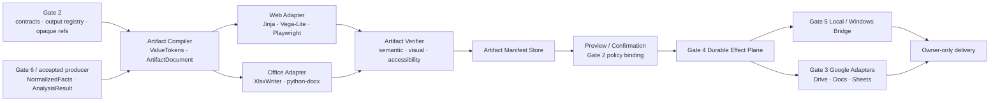
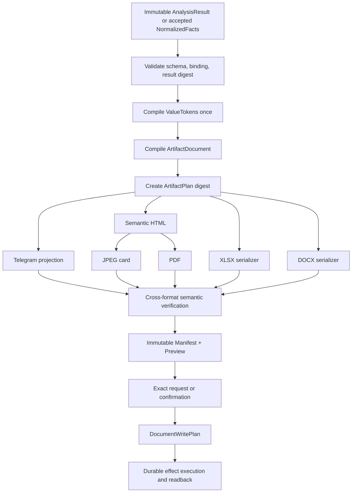
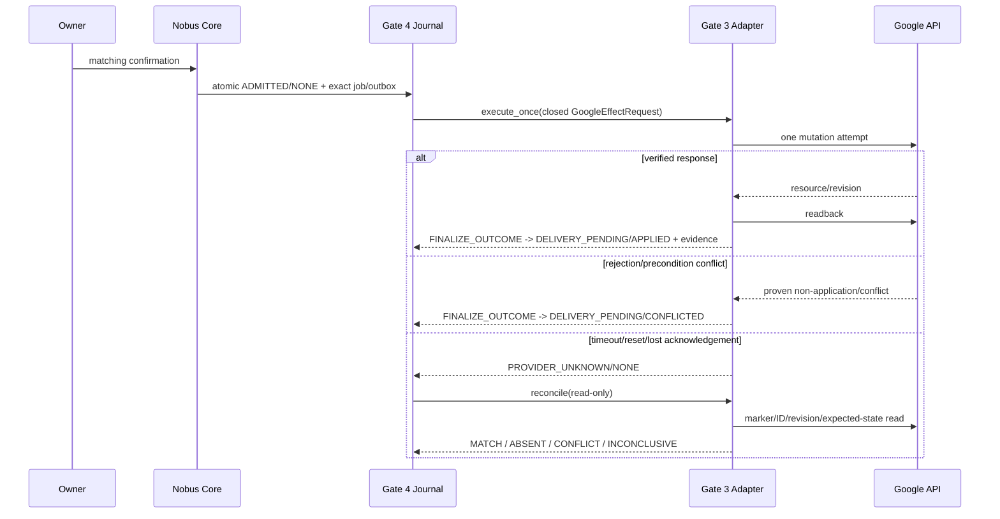

# Gate 7 TARGET Architecture — Artifact Factory and Controlled Writeback

**Status:** `TARGET / DRAFT UNTIL L1-L2-L3`
**Research basis:** [`RESEARCH.md`](RESEARCH.md)
**Canonical documentation baseline:** `9d816b35d3f419b42e24ad09ae6aadc92c33db43`

## 1. Product result in plain language

The owner asks Nobus for a report, card, spreadsheet or document once. Nobus
calculates the answer once, then presents the same values as:

- a concise Telegram message;
- a readable JPEG card;
- a self-contained mobile HTML report;
- a printable PDF;
- an editable XLSX or DOCX where requested.

Before Nobus writes anywhere, the owner can see what will be written and
where when those details were formed during analysis. A local update has a
snapshot and cannot overwrite a concurrent edit. A Google update uses the
provider's real revision control where available. If Nobus loses an
acknowledgement, it stops and checks what actually happened instead of
creating a duplicate.

The owner receives either a verified receipt, a verified rejection/conflict,
or an honest `UNKNOWN/RECONCILING` status. “Probably succeeded” is never a
success state.

## 2. Scope

### 2.1 In scope

- compile accepted normalized facts into one immutable ArtifactDocument;
- render Telegram text, HTML, JPEG, PDF, XLSX and DOCX;
- create permitted local and Google artifacts;
- update permitted local files and Google Docs with strict preconditions;
- create a new version/copy when strict update is unavailable;
- preview, action-bound confirmation, owner-only delivery;
- manifest, provenance, digests, readback, receipts and reconciliation;
- hardened optional conversion fallback;
- semantic, visual, accessibility and failure testing.

### 2.2 Out of scope

- source discovery and parsing;
- analytics, formulas, joins, conflict resolution or source re-query;
- delete, trash, sharing/permissions, publication, deployment or money;
- arbitrary local paths or raw Google IDs supplied by the model;
- arbitrary templates, CSS, JavaScript, SQL or Google API request bodies;
- a second bot, workflow framework, effect queue or policy engine;
- blind retry after an external mutation may have been transmitted;
- strict Sheets or Drive blob overwrite without a proven backend precondition.

## 3. CURRENT and TARGET

| Area | CURRENT | TARGET |
|---|---|---|
| Facts | Product/analysis outputs exist, but renderer contracts are minimal | One immutable `NormalizedFacts`/`AnalysisResult` handoff |
| Rendering | Hand-built basic HTML/DOCX/XLSX/PDF; Edge PDF only | `ArtifactDocument` plus pinned adapters |
| Cross-format values | No explicit ValueToken equality contract | One semantic token map and digest in all formats |
| Charts/JPEG | No unified path | Vega SVG in canonical DOM; Playwright JPEG |
| Local write | Strong proposal/snapshot/CAS/replace/readback/journal | Reused under opaque output scope and artifact manifest |
| Google | Drive read/search/download/export | Marker-based create/upload; Docs revision update; safe new-version paths |
| Effects | Durable vault with idempotency and `UNKNOWN` | Gate 4 state machine plus artifact-specific receipts/reconciliation |
| Delivery | Telegram/local paths exist | Owner-only destination and semantic/readback gate before delivery |

TARGET statements do not claim implementation.

## 4. Architectural invariants

1. Business data is calculated exactly once upstream.
2. Gate 7 never changes fact state, value, rounding, unit, currency, timezone,
   missingness, conflict resolution or provenance.
3. `ArtifactDocument` is the only Gate 7 presentation model.
4. Telegram/HTML/JPEG/PDF use the same semantic document and ValueTokens.
5. JPEG and PDF are rendered from the same self-contained HTML DOM.
6. XLSX and DOCX are specialized serializers of the same ValueTokens.
7. Every boundary model is strict, frozen, versioned and rejects unknown
   fields.
8. Tenant/project/client/owner and registry bindings are part of every digest
   and capability decision.
9. The model may propose structure but cannot select a private locator, emit
   raw provider requests or execute an effect.
10. An immutable artifact is not permission to write it.
11. Payload, destination, revision, operation, approval and idempotency are
    bound in one action digest.
12. Update requires an exact expected revision/digest. Missing strict backend
    capability means new version/copy or denial.
13. Success requires semantic or byte readback appropriate to the backend.
14. `UNKNOWN` forbids blind mutation retry.
15. Logs, metrics and receipts contain opaque IDs/digests and reason codes,
    not document content, paths, credentials or raw provider IDs.

## 5. Component architecture



There is no renderer plugin framework in v1. The application calls two narrow
adapter modules: web outputs and Office outputs. Interface extraction is
allowed only when a second real implementation, such as a hardened
Gotenberg fallback, is approved.

## 6. Data flow



The stored HTML bytes are the exact self-contained document used as the
Playwright input. The browser may select `screen`, `card` or `print` CSS, but
the DOM token values remain identical.

## 7. Closed schemas

All schemas use Pydantic frozen models with `extra="forbid"`, exact
`schema_version` literals, UTC-aware timestamps, bounded arrays/strings,
discriminated unions and canonical JSON digests. They reuse Gate 2 common
identity/binding types, Gate 3 Google effect types, Gate 4 effect states and
Gate 6 normalized fact types. Raw paths, provider IDs, credentials and
arbitrary metadata maps are forbidden.

### 7.1 `ArtifactRequest`

| Field | Type / rule |
|---|---|
| `schema_version` | literal `nobus.artifact_request.v1` |
| common binding | Gate 2 tenant/project/client/owner/task/registry bundle |
| `request_id` | server-generated opaque ID |
| `source_result_ref` | opaque immutable result reference |
| `source_result_digest` | required digest |
| `formats` | non-empty unique closed set: `telegram_text`, `html`, `jpeg`, `pdf`, `xlsx`, `docx` |
| `template_ref` | versioned allowlisted template |
| `render_profile_ref` | versioned allowlisted profile |
| `locale` / `timezone` | closed supported values |
| `classification` | policy data class; may not be downgraded |
| `target_backend` | `telegram`, `local`, `google`, or `preview_only` |
| `output_scope_id` | required for local/Google |
| `destination_hint` | safe name/title only; never a locator |
| `collision_policy` | `new_version` or `ask` |
| `request_digest` | JCS SHA-256 of all semantic fields |

### 7.2 `ArtifactPlan`

Gate 2 owns the canonical `ArtifactPlan`; Gate 7 consumes and realizes it.
Required Gate 7 interpretation:

| Field | Rule |
|---|---|
| `artifact_plan_id` | server-generated |
| `analysis_digest` | exact Gate 6 result digest where applicable |
| `sections` | 1..64 closed text/table/chart/reference sections |
| `content_digest` | compiled normalized render-input digest |
| `render_profile` | exact template/profile/runtime policy reference |
| `target_backend` / `output_scope_id` | exact policy binding |
| `provenance_refs` | all refs belong to the same binding |
| `plan_digest` | canonical digest including request and template pins |

An ArtifactPlan is not a file write and cannot carry approval authority.

### 7.3 `ValueToken`

| Field | Type / rule |
|---|---|
| `schema_version` | literal `nobus.value_token.v1` |
| `value_id` | deterministic from semantic key and fact digest |
| `fact_ref` / `fact_digest` | required |
| `state` | exact upstream present/missing/conflict/error state |
| `value_type` | closed typed-value discriminator |
| `raw_value` | canonical typed value; null only when state permits |
| `unit_id` / `currency` / `timezone` | explicit optional semantics |
| `precision` / `rounding_mode` | copied from governed rule/presentation policy |
| `locale` | supported locale |
| `display_text` | final bounded display string |
| `provenance_refs` | bounded policy-safe refs |
| `token_digest` | JCS SHA-256 |

`display_text` is computed once by the compiler. A renderer changing it is a
verification failure.

### 7.4 `ArtifactDocument`

| Field | Type / rule |
|---|---|
| `schema_version` | literal `nobus.artifact_document.v1` |
| common binding | exact request/plan binding |
| `document_id` | deterministic opaque ID |
| `title` | safe bounded label |
| `value_tokens` | ordered unique registry |
| `blocks` | 1..256 discriminated blocks |
| `limitations` / `conflicts` | explicit projections; never silently omitted |
| `source_result_digest` | required |
| `semantic_projection_digest` | digest of ordered `value_id -> display_text/state` |
| `document_digest` | JCS SHA-256 of the whole semantic document |

Block variants are exactly:

- `heading(level, text)`;
- `paragraph(inline_parts)`;
- `metric(label, value_id)`;
- `table(columns, rows[value_id])`;
- `chart(chart_ref, value_ids, accessible_summary, table_ref)`;
- `callout(kind, content)`;
- `source_list(provenance_refs)`;
- `page_break`.

No block embeds executable code or arbitrary HTML.

### 7.5 `ArtifactManifest`

| Field | Rule |
|---|---|
| `schema_version` | literal `nobus.artifact_manifest.v1` |
| identities | artifact/request/plan/document and common binding |
| source | result/fact/calculation/provenance digests |
| presentation | template/profile/asset/font digests |
| runtime | renderer/library/browser build and config digests |
| outputs | format, media type, byte size, bytes SHA-256, semantic digest |
| destination | opaque output scope/ref and destination digest |
| effect | effect/idempotency/action digests and state |
| backend evidence | base/post revision, marker/session/provider opaque refs |
| recovery | snapshot ref/digest and reconciliation ref |
| verification | L1/L2/L3 refs and statuses |
| `manifest_digest` | JCS SHA-256 |

Artifact bytes live in the existing encrypted/bounded artifact storage, not in
the effect log. The manifest stores safe evidence and references.

### 7.6 `ArtifactPreview`

| Field | Rule |
|---|---|
| `schema_version` | literal `nobus.artifact_preview.v1` |
| `preview_id` | opaque ID |
| binding | artifact/manifest/tenant/owner/output-scope |
| `operation` | create/update/new_version |
| `destination_display` | safe owner-facing projection only |
| `payload_summary` | bounded safe summary |
| `diff_summary` | required for update |
| `base_revision_digest` | required for update |
| `preview_assets` | bounded refs to verified preview outputs |
| `preview_digest` | canonical digest |
| `expires_at` | policy TTL |

### 7.7 `ArtifactConfirmation`

| Field | Rule |
|---|---|
| `schema_version` | literal `nobus.artifact_confirmation.v1` |
| `confirmation_id` | opaque ID |
| `owner_subject_id` / ingress binding | exact authenticated owner |
| `preview_id` / `preview_digest` | exact preview |
| `action_digest` | payload + destination + operation + revision + scope |
| `decision` | `approve` or `reject` |
| `decision_digest` | canonical digest |
| `decided_at` / `expires_at` | UTC and fresh |
| `channel_binding` | accepted Telegram/text/voice/button proof |

Mutation after confirmation changes the action digest and invalidates approval.
An exact owner request may use Gate 2 `exact_owner_request`; when payload or
destination was formed after analysis, `preview_confirmation` is mandatory.

### 7.8 `ArtifactEffect`

This is an artifact payload carried by the Gate 4 durable effect plane, not a
new state engine.

| Field | Rule |
|---|---|
| `schema_version` | literal `nobus.artifact_effect.v1` |
| `effect_id` / common binding | Gate 4 identity and tenant fence |
| `write_plan_ref` / digest | exact Gate 2 `DocumentWritePlan` |
| `artifact_ref` / manifest digest | immutable verified artifact |
| `destination_ref` / digest | opaque exact target |
| `operation` | `create`, `update`, `new_version` |
| `base_precondition` | local digest, Docs revision, or create-absence condition |
| `idempotency_key` | digest-bound stable key |
| `approval_ref` / action digest | exact fresh authority |
| `reconcile_strategy` | closed backend-specific enum |
| `state_revision` | durable optimistic fence |

### 7.9 `ArtifactReceipt`

| Field | Rule |
|---|---|
| `schema_version` | literal `nobus.artifact_receipt.v1` |
| effect/action/manifest digests | exact |
| `product_status` | Gate 7 projection; never an independent authority state |
| `effect_lifecycle` / `provider_outcome` | exact Gate 4 values |
| provider and delivery evidence refs | exact Gate 4 durable references |
| backend/operation | closed values |
| destination_ref | opaque verified target |
| bytes/semantic digest | expected and observed |
| base/post revision | where supported |
| snapshot ref | local update where applicable |
| reconciliation ref | required when completion was reconciled |
| completed/delivered timestamps | UTC |
| `receipt_digest` | canonical digest |

`COMPLETED` is invalid until Gate 4 records `provider_outcome=APPLIED`, verified
readback and the required terminal delivery evidence. `ROLLED_BACK` is only a
product view of a separately admitted compensating effect; the original effect
and outcome remain immutable.

### 7.10 `ArtifactReconciliation`

| Field | Rule |
|---|---|
| `schema_version` | literal `nobus.artifact_reconciliation.v1` |
| effect/attempt generation | exact durable fence |
| strategy | `local_journal`, `drive_file_id`, `drive_marker`, `resumable_session`, `docs_revision`, `sheets_expected_state` |
| observations | bounded metadata/revisions/digests only |
| evidence_digest | canonical digest |
| conclusion | `MATCH`, `ABSENT`, `CONFLICT`, `INCONCLUSIVE` |
| next_state | transition allowed by Gate 4 |
| observed_at | UTC |

`ABSENT` authorizes another attempt only when the adapter proves authoritative
absence and Gate 4 creates a fenced retry generation. `INCONCLUSIVE` returns
to `UNKNOWN`.

## 8. Template, asset and runtime pinning

An approved render profile is an immutable record:

```text
template_id + template_version + template_digest
CSS profile digest
Vega runtime/spec version and digest
font file names + SHA-256 + license
Jinja/Playwright/XlsxWriter/python-docx versions
Chromium revision
OS/container image digest
locale/timezone/viewport/device scale
network policy and resource limits
```

Rules:

- templates, CSS and chart themes are repository-controlled;
- model/user-provided executable template text is forbidden;
- external URLs and runtime network are denied;
- fonts and JS assets are local and digest-pinned;
- the browser waits for fonts, charts and a deterministic ready marker;
- clock, animations and randomness are fixed;
- output metadata timestamps are normalized where supported;
- Gate 8 freezes exact versions after license/vulnerability review.

## 9. Renderer adapter boundaries

### 9.1 Artifact compiler

```text
compile(request, analysis_result, artifact_plan)
    -> ArtifactDocument + compilation evidence
```

It validates result binding, creates ValueTokens and semantic blocks, and
performs no source access.

### 9.2 Web adapter

```text
render_html(document, profile) -> bytes + semantic projection
render_jpeg(verified_html, card_profile) -> bytes
render_pdf(verified_html, print_profile) -> bytes
```

The module owns Jinja, Vega-Lite and Playwright. JPEG/PDF do not accept an
independently rebuilt HTML document.

### 9.3 Office adapter

```text
render_xlsx(document, profile) -> bytes + cell/token map
render_docx(document, profile) -> bytes + OOXML/token map
```

New XLSX uses XlsxWriter. Existing XLSX update is a separate restricted path
using openpyxl only after feature inventory. New DOCX uses python-docx and a
curated template. Existing DOCX update requires a known template revision and
stable anchors; otherwise create a new version.

### 9.4 Fallback boundary

MCP, SaaS and Gotenberg are absent from the v1 critical path. A future
Gotenberg adapter may accept only already verified self-contained HTML or
Office bytes. It must be authenticated, isolated, resource-bounded and deny
outbound, private, loopback, metadata and file URL access. Permissive SSRF
defaults are a deployment blocker.

## 10. Semantic and accessibility rules

- Telegram is a bounded projection of ArtifactDocument, not a model rewrite.
- HTML uses semantic headings, lists, tables, captions, landmarks and
  accessible chart descriptions.
- Card JPEG contains no unique fact absent from the text/HTML projection.
- Every chart has an adjacent accessible summary and data table.
- Mobile profiles pass at 320 CSS px without two-dimensional page scrolling
  except an explicitly scrollable data table.
- Essential text meets WCAG 2.2 contrast and remains usable at 200% zoom.
- PDF uses tagged output and outline where supported; PDF/UA is claimed only
  after veraPDF plus manual assistive review.
- XLSX has sheet titles, table headers, freeze panes, useful widths/number
  formats and image descriptions. Formula-like external text is escaped.
- DOCX uses semantic headings, real tables, repeated header rows, `ru-RU`,
  alt text and curated styles.
- Digest-pinned Noto Cyrillic fonts are the default cross-platform family.

## 11. Preview, approval and owner-only delivery

An exact owner command can authorize a reversible create/update only when the
payload and destination were already explicit and remain digest-identical.
If analysis selects or forms the payload, title, filename, folder, document or
update destination, Gate 7 must show `ArtifactPreview` and obtain a fresh
`ArtifactConfirmation`.

Before execution, Core revalidates:

- authenticated owner and tenant/project/client;
- current registry bundle and output scope;
- classification and backend capability;
- artifact/manifest/action/destination digests;
- expected revision;
- confirmation freshness and channel binding;
- idempotency key and absence of conflicting payload.

Delivery is owner-only:

- Telegram target is the authenticated private owner chat;
- local target is an opaque output-scope destination;
- Google target is an owner-bound grant and verified private parent;
- no share/permission mutation is available in Gate 7 v1.

## 12. Product projection over the Gate 4 effect plane

Gate 4 exclusively owns `effect_lifecycle`, `provider_outcome` and delivery
state. Gate 7 stores no third authority state machine. Its UI/product labels are
pure projections:

| Gate 7 product label | Normative Gate 4 meaning |
|---|---|
| `PREPARED` | Artifact/plan exists before effect admission; no Gate 4 effect yet |
| `AWAITING_CONFIRMATION` | Approval is pending before effect admission; no Gate 4 effect yet |
| `EXECUTING` | lifecycle `CLAIMED` or `EXECUTING`; outcome `NONE` |
| `WRITE_VERIFIED` | outcome `APPLIED` with readback; delivery is not yet terminal |
| `UNKNOWN` | lifecycle `PROVIDER_UNKNOWN`; outcome `NONE` |
| `RECONCILING` | lifecycle `RECONCILING`; outcome `NONE` |
| `COMPLETED` | lifecycle `SETTLED`; outcome `APPLIED`; readback and required delivery evidence are terminal |
| `CONFLICT` | outcome `CONFLICTED` with the corresponding terminal evidence |
| `MANUAL_REVIEW` | lifecycle `PROVIDER_UNKNOWN`, outcome `NONE`, plus non-authoritative `manual_review_required=true` metadata |
| `ROLLED_BACK` | Separate compensation effect is settled; the original effect remains immutable |

Normative constraints:

- `APPLIED` requires provider/local readback evidence;
- `PROVIDER_UNKNOWN` is nonterminal and never ages into success/failure;
- only a read-only reconciliation probe runs from `PROVIDER_UNKNOWN`;
- `ABSENT` may produce a new fenced retry generation through Gate 4 policy,
  never direct replay;
- cancellation after a provider attempt suppresses further desired work or owner
  notifications but does not erase/replay the unknown effect;
- delivery has its own durable state and cannot trigger provider re-execution.
## 13. Local create/update protocol

### 13.0 Signed Bridge write protocol v2

Protocol v1 remains read-only (`search`, `read`, `cancel`, `status`). Local
mutation is available only through the separately versioned closed protocol v2.
Unknown versions, operations, fields or enum values fail closed before filesystem
access.

`nobus.bridge.write.request.v2` contains:

- `protocol_version=2`, request/effect IDs and the exact Gate 4 tenant binding;
- device ID, enrollment generation, exact protocol/capability digest, Gate 4 lease ID/generation, nonce, issued/expiry timestamps;
- closed `operation`: `prepare_create`, `commit_create`, `prepare_update`,
  `commit_update`, or `readback`;
- opaque output scope/destination and optional opaque existing `doc_id`;
- artifact/manifest/chunk digests and size, plus expected base digest/revision;
- one-shot `prepare_token` for commit operations;
- `snapshot_required`, action/approval/idempotency/contract digests;
- Core signature under the exact pinned protocol profile.

`nobus.bridge.write.result.v2` contains:

- exact request/effect/tenant/device/enrollment/lease generation, capability and request-digest binding;
- the repeated closed operation;
- closed result: `PREPARED`, `COMMITTED`, `READBACK_VERIFIED`, `REJECTED`,
  `CONFLICT`, or `PROVIDER_UNKNOWN`;
- one-shot prepare token where issued, snapshot/base/output opaque refs,
  observed identity/digest/revision and journal generation;
- safe reason code, evidence digest and Bridge device signature.

Core and Bridge accept the job only when the exact read-v1/write-v2 capability
manifest digest matches the release manifest; missing/unknown/downgraded versions
or algorithms fail closed. Every result commit is fenced by the current Gate 4
lease generation and Bridge enrollment generation.

A prepare token is single-use, TTL-bound and bound to every request digest above.
Prepare performs validation and, for update, creates the required snapshot; it
cannot publish target bytes. Commit revalidates token, base CAS and target
identity before one atomic replacement/create. Readback is a separate signed
operation. A lost or ambiguous commit response becomes Gate 4
`PROVIDER_UNKNOWN`; automatic commit replay is forbidden. Raw paths never cross
this protocol.

### 13.1 Create

1. Resolve the Gate 2 opaque output scope through Gate 5.
2. Validate tenant, policy, format, classification and safe filename.
3. Open the parent through the verified handle boundary.
4. Apply `new_version` deterministically or return `ask` on collision.
5. Create same-directory temporary content and flush it.
6. Commit with create-new semantics; never silently overwrite.
7. Reopen through the trusted boundary and verify identity, bytes digest and
   size.
8. Record manifest destination and receipt.

### 13.2 Update

```mermaid
sequenceDiagram
    participant C as Core / Gate 4
    participant W as Gate 5 Workspace
    participant F as Windows filesystem

    C->>W: execute exact write plan + artifact digest
    W->>F: resolve opaque destination and open verified handle
    W->>F: read current identity + digest
    W->>W: compare expected digest; create snapshot
    W->>F: write same-directory temp; flush/fsync
    W->>F: recheck handle identity + CAS
    W->>F: ReplaceFile/handle-bound rename
    W->>F: reopen and read back digest
    F-->>W: verified identity/digest
    W-->>C: receipt or UNKNOWN/conflict
```

Rules:

- raw paths never cross the model/Core boundary;
- `snapshot_required=true`;
- update is denied when current digest differs;
- final replacement uses the existing Gate 5 handle/identity algorithm;
- an open Word/Excel sharing violation fails closed;
- no delete-and-rewrite fallback;
- journal evidence determines recovery after crash;
- rollback restores the snapshot only if the target still has the expected
  failed post-write identity/digest.

## 14. Google create/upload/update

All calls use official APIs through Gate 3 `WorkspaceEffectAdapter` and the
Gate 4 durable effect plane. Gate 7 never handles OAuth tokens or raw generated
API bodies.

### 14.1 Common execution



### 14.2 Owner-only policy

- use the Gate 3 owner OAuth subject and least privilege;
- prefer `drive.file` for selected/created files;
- resolve only opaque output refs;
- verify private parent/inherited permissions;
- never call sharing or permission mutation;
- provider IDs remain inside sealed refs.

### 14.3 Binary create/upload

- pre-generate a Drive file ID and persist it before the call;
- include the same effect marker/digests in private `appProperties`;
- create/upload once with that ID;
- after ambiguity, get/search the ID before any new attempt;
- persist resumable session URL and uploaded range;
- probe session status after interruption;
- complete only after metadata and downloaded/exported digest readback.

### 14.4 Native Docs/Sheets create

Because pre-generated IDs do not support native Workspace files:

- create the native MIME with an exact private parent and `appProperties`
  marker;
- populate it through the service adapter;
- reconcile unknown create by exact marker + parent + MIME + not-trashed;
- one match is read back; multiple matches conflict; no match remains unknown
  until authoritative absence policy permits a fenced retry.

### 14.5 Google Docs update

1. `documents.get` returns base revision and semantic projection.
2. Gate 7 binds the revision and expected content digest into preview/action.
3. Gate 3 sends one `documents.batchUpdate` with `requiredRevisionId`.
4. Stale revision is a conflict; no rebase via `targetRevisionId`.
5. A second `documents.get` verifies post-write revision and ValueTokens.
6. Lost acknowledgement enters `UNKNOWN`; reconciliation compares revision and
   semantic desired state before any retry.

### 14.6 Google Sheets

`spreadsheets.batchUpdate` is atomic for one accepted request but provides no
Docs-like strict revision CAS. Readback or `includeValuesInResponse` does not
remove the collaboration race.

Default:

- existing Sheet + `strict_cas_required=true` → `backend_capability_missing`;
- offer a new version/copy with a new file ID;
- in-place write may be added only under an explicitly approved weaker
  contract with measured single-writer fencing; it is not strict CAS.

### 14.7 Drive binary blob update

Drive version/checksum metadata is evidence, not a proven strict update
precondition. Default to a new file/version artifact. In-place overwrite
remains disabled until an official conditional contract and lost-response
integration tests pass.

## 15. Reconciliation rules

| Backend/operation | Read-only evidence | MATCH | ABSENT | CONFLICT/INCONCLUSIVE |
|---|---|---|---|---|
| Local create/update | journal, target identity/digest, snapshot | exact expected bytes | authoritative no-target where create | changed target or incomplete evidence |
| Drive binary create | pre-generated file ID, digest, marker | ID and digest match | ID not found under authoritative rule | different content / provider unavailable |
| Resumable upload | session status/range, final file | complete file matches | expired session plus no file | inconsistent range/content |
| Native Docs/Sheets create | exact private appProperty marker search | one matching resource + readback | bounded authoritative no-match | multiple matches / unavailable |
| Docs update | revision + semantic projection | desired token map | base unchanged and no mutation evidence | collaborator/mixed/unknown content |
| Sheets expected state | bounded cells/metadata | exact desired projection | only if provider semantics prove it | any concurrent or ambiguous state |
| Telegram delivery | durable delivery receipt/provider evidence | ACK or exact owner confirmation | ACK loss is not provider uncertainty | remain unknown; no blind resend; owner may confirm receipt or authorize one bounded resend generation |

Reconciliation evidence is immutable and fenced by effect state revision and
attempt generation. A stale worker cannot commit its observation.

## 16. Failure and recovery matrix

| Failure | State/result | Recovery |
|---|---|---|
| Unknown field/schema/version | rejected before prepare | fix producer; no effect |
| Tenant/project/client mismatch | policy denial | no cross-scope fallback |
| Artifact semantic mismatch | verification failure | recompile from same facts; no delivery |
| Template/runtime digest drift | readiness failure | restore pinned release |
| Local collision | conflict/clarification | deterministic new version or owner choice |
| Local digest changed after preview | conflict | new read/preview/approval |
| Windows sharing violation | conflict | owner closes file; fresh execution plan |
| Crash before local replace | recoverable journal state | remove bounded temp; target unchanged |
| Crash during/after replace | `UNKNOWN` | target/snapshot/readback reconciliation |
| Rollback target changed | conflict/manual review | never overwrite later edit |
| Google auth/scope denial | rejected | Gate 3 consent/capability flow |
| Docs revision stale | conflict | re-read, replan and reconfirm |
| Sheets/blob strict CAS requested | capability missing | new version/copy or deny |
| Lost Google acknowledgement | `UNKNOWN` | read-only marker/ID/revision reconciliation |
| Duplicate marker matches | conflict/manual review | do not choose arbitrarily |
| Resumable session expired | `UNKNOWN` | reconcile final ID; fenced restart only if absent |
| Parent has inherited sharing | policy denial | choose verified private parent |
| Renderer timeout/resource limit | failed before effect | reduce/bound artifact; no write |
| Gotenberg network policy permissive | readiness failure | fallback disabled |
| Delivery receipt lost | delivery `UNKNOWN` | no blind resend; exact owner confirms receipt or authorizes one bounded resend generation |

## 17. Code impact map

This is a future implementation map, not authorization to edit code.

### 17.1 Reuse or modify

| Path | TARGET impact |
|---|---|
| [`src/contracts/models.py`](../../../src/contracts/models.py) | Reuse strict/frozen primitives and canonical digest conventions only |
| `src/contracts/document_models.py` (Gate 2 new) | Consume canonical `ArtifactPlan` and `DocumentWritePlan`; do not duplicate |
| [`src/core/policy.py`](../../../src/core/policy.py) | Add pure artifact capability/approval decisions and stable denial reasons |
| [`src/application/product_effects.py`](../../../src/application/product_effects.py) | Carry artifact effect payload/receipt and Gate 4 state transitions; preserve one vault |
| [`src/application/owner_workspace.py`](../../../src/application/owner_workspace.py) | Execute verified artifact bytes under opaque output scope; retain snapshot/CAS/journal/restore |
| [`src/integrations/google_drive.py`](../../../src/integrations/google_drive.py) | Add bounded create/upload/marker/session/readback operations behind Gate 3 contracts |
| [`src/application/telegram_product.py`](../../../src/application/telegram_product.py) | Add closed preview/confirmation/status projections through the existing owner product boundary |
| [`src/config.py`](../../../src/config.py) | Exact renderer/runtime/resource pins only after Gate 8 dependency approval |

### 17.2 New minimal modules

| Path | Responsibility |
|---|---|
| `src/contracts/artifact_models.py` | Gate 7-only closed schemas; import Gate 2/3/4/6 types |
| `src/application/artifact_factory.py` | Validate handoff, compile ValueTokens/ArtifactDocument, render orchestration and manifest |
| `src/integrations/artifact_web.py` | Jinja + Vega-Lite + Playwright HTML/JPEG/PDF |
| `src/integrations/artifact_office.py` | XlsxWriter/python-docx new-file serializers and restricted update inventory |
| `src/integrations/google_documents.py` | If Gate 3 does not split files: Docs/Sheets closed write/readback/reconcile adapter |

Do not create separate factories, registries, queues or one-class-per-format
modules. Split an adapter only after file size or a second implementation
demonstrates the need.

### 17.3 Tests

| Path | Coverage |
|---|---|
| `tests/test_artifact_contracts.py` | closed schemas, bounds, canonical digests, tenant/action binding |
| `tests/test_artifact_factory.py` | one-time ValueToken compilation, limitations/conflicts, manifest |
| `tests/test_artifact_rendering.py` | HTML/JPEG/PDF/XLSX/DOCX semantic parity and Russian text |
| `tests/test_artifact_visual.py` | pinned viewports, screenshot/PDF/mobile/accessibility goldens |
| `tests/test_artifact_effects.py` | preview, approval drift, state transitions, receipts, unknown handling |
| [`tests/test_owner_workspace.py`](../../../tests/test_owner_workspace.py) | opaque destination, open-file, crash, rollback CAS |
| [`tests/test_google_drive_durable.py`](../../../tests/test_google_drive_durable.py) | generated ID, resumable upload and lost acknowledgement |
| `tests/test_google_documents.py` | Docs revision CAS/readback; Sheets fail-closed/new-copy; marker reconciliation |
| [`tests/test_product_effect_routes.py`](../../../tests/test_product_effect_routes.py) | owner-only status/confirmation/delivery projections |
| `tests/test_gate07_acceptance.py` | complete Gate 7 PASS matrix with fake/test-only backends |

## 18. Gate handoffs

### Gate 2

Provides `ArtifactPlan`, `DocumentWritePlan`, common bindings, output registry,
opaque refs, collision policy and approval forms. Gate 7 returns renderer
capability and manifest schemas. A missing Gate 2 capability is a hard block.

### Gate 3

Provides owner OAuth, least-privilege grants, token isolation, provider
budgets/health, `WorkspaceEffectAdapter`, Docs revision behavior, Sheets/Drive
capability declarations and normalized reconciliation. Gate 7 supplies only
closed desired state and expected preconditions.

### Gate 4

Owns durable admission, state revisions, leases, retry generations,
`UNKNOWN`, reconciliation workers, receipts and delivery. Gate 7 adds
artifact-specific payload/evidence, not another state machine.

### Gate 5

Provides opaque local/Google refs, output-scope resolution, Windows
handle/identity containment, Bridge signed jobs and local snapshot/replace
execution. Gate 7 provides immutable verified bytes and expected digest.

### Gate 6

Provides one immutable `AnalysisResult`, normalized facts, conflicts,
limitations, safe provenance and `result_digest`. Gate 7 never re-reads or
recalculates them and returns format parity evidence.

### Gate 8

Pins dependency versions, licenses, vulnerabilities, Chromium/fonts/assets,
Windows/VPS packaging, process isolation, resource limits, observability,
backup/recovery and pilot evidence. Gate 7 supplies smoke tests and artifact
runtime health.

## 19. Implementation slices

Each slice remains disabled for real writes until its L1/L2/L3 evidence passes.

1. **Contracts and compiler**
   - implement Gate 7 schemas;
   - compile fixed Gate 6 fixtures into ValueTokens/ArtifactDocument;
   - prove no calculation or cross-tenant refs.
2. **Canonical web rendering**
   - Jinja self-contained HTML;
   - Vega inline SVG;
   - pinned Playwright JPEG/PDF;
   - semantic/mobile/visual goldens.
3. **Office outputs**
   - XlsxWriter and python-docx new-file paths;
   - semantic readback and LibreOffice QA;
   - restricted existing-file feature inventory.
4. **Manifest, preview and policy**
   - artifact/plan/runtime digests;
   - exact request versus preview confirmation;
   - owner-only destination checks.
5. **Local effect integration**
   - connect immutable artifact bytes to existing workspace;
   - collision, snapshot, CAS, sharing violation, crash and rollback tests.
6. **Google create/upload**
   - pre-generated IDs, appProperties, resumable sessions and reconciliation.
7. **Docs update and safe versioning**
   - `requiredRevisionId` and semantic readback;
   - Sheets/blob new-copy default and capability denial.
8. **Delivery and Gate 8 pilot**
   - durable owner delivery receipt;
   - fault injection, runtime pins, health, metrics and recovery drill.

## 20. Acceptance criteria

Gate 7 passes only when:

1. identical `value_id`, state and display values appear in Telegram, HTML,
   JPEG source DOM, PDF, XLSX and DOCX;
2. every format carries the same source/result/document semantic digest;
3. charts use exactly the referenced ValueTokens and expose an accessible
   table/summary;
4. HTML/card pass mobile, contrast, zoom and overflow checks;
5. Russian text and embedded/pinned fonts pass on Windows and VPS;
6. artifact bytes cannot be delivered before semantic verification;
7. payload/destination formed after analysis always receives preview and fresh
   confirmation;
8. destination, payload, revision or approval drift stops execution;
9. Telegram/Google/local delivery is bound to the authenticated owner and
   output scope;
10. local create never overwrites a collision;
11. local update proves snapshot, CAS, atomic replace and readback;
12. Windows sharing violation fails closed;
13. restore cannot overwrite a later owner edit;
14. Drive binary create/upload does not duplicate after lost acknowledgement;
15. native Google create reconciles marker searches with 0/1/2 outcomes;
16. Docs update uses `requiredRevisionId` and semantic readback;
17. strict Sheets/blob in-place update is denied or converted to an explicitly
   approved new version/copy;
18. `UNKNOWN` blocks blind retry and survives restart;
19. MCP/SaaS/Gotenberg has no implicit authority or critical-path dependency;
20. logs, metrics, manifests and errors expose no secret, raw private path,
   content or cross-tenant identifier.

## 21. Test and verification plan

### 21.1 Semantic

- golden facts for decimals, currencies, dates/timezones, missing/conflict
  states, long Cyrillic strings and large tables;
- extract token maps from HTML DOM, PDF text/tag structure, XLSX cells and DOCX
  XML;
- compare Google readback to expected token maps;
- prove Telegram is a deterministic bounded projection;
- verify chart data and accessible table use the same token IDs;
- property tests for input ordering, canonical JSON and locale/timezone pins.

JPEG correctness is proven by the exact verified DOM it captures plus visual
regression. OCR may detect gross defects but is not the semantic oracle.

### 21.2 Visual/mobile/accessibility

- viewports 320, 360 and 390 CSS px;
- 200% zoom and keyboard/reading order;
- contrast and no clipped/overlapping text;
- long-word/table overflow;
- pinned Playwright screenshots and ARIA snapshots;
- PDF page count, text extraction, tags, outline and veraPDF;
- DOCX/XLSX open/export through isolated LibreOffice plus targeted manual
  Word/Excel checks before production;
- missing font and alternate-runtime negative tests.

### 21.3 Effect/security

- unknown/extra schema field and unsupported version;
- tenant/project/client/output-scope swaps;
- expired/replayed/mutated approval;
- template HTML/URL/script/CSS injection;
- SSRF, file URL, oversized input, render timeout and memory limits;
- formula injection in spreadsheet strings;
- malicious ZIP/XML/OOXML, macros and external relationships;
- collision, path traversal/reparse/hard-link race;
- disk full, power loss, open file and journal recovery;
- stale Docs revision and collaborator race;
- Sheets/blob strict-CAS denial;
- Drive lost create/update response, marker 0/1/2 and resumable `308/404`;
- inherited Google sharing;
- stale reconciliation lease and restart;
- Telegram lost delivery receipt without duplicate replay.

## 22. Definition of Done

- all closed schemas and JSON Schemas are versioned and negative-tested;
- no duplicate Gate 2/3/4/5/6 contract or framework exists;
- exact dependency versions/licenses/vulnerability review are approved by
  Gate 8;
- semantic, visual, mobile, accessibility and Russian-text suites pass in the
  pinned runtime;
- local and Google fake/integration fault suites pass;
- real-provider tests use only dedicated owner-approved test scopes;
- manifests and receipts prove artifact, destination, revision, approval,
  readback and reconciliation bindings;
- no unexplained orphan or `UNKNOWN` effect remains at Gate 8 PASS;
- rollback/recovery runbooks and observability are tested;
- L1/L2/L3 evidence is independent and linked;
- human L4 is recorded before any real external write or release.

## 23. Unresolved risks and decisions

1. Exact Gate 8-approved Playwright/Chromium, Jinja, Vega-Lite, XlsxWriter,
   python-docx and font pins remain a release decision, not an architecture
   claim.
2. Chromium tagged PDF does not itself prove PDF/UA. If legal accessibility
   requires formal PDF/UA, evaluate a separate Typst/WeasyPrint profile without
   claiming visual identity until parity tests pass.
3. Arbitrary existing XLSX/DOCX updates remain unsupported. The owner must
   choose restricted known-template updates or new-version semantics.
4. Google Sheets has no proven strict revision CAS for this contract.
5. Drive v3 blob overwrite has no proven strict precondition for this
   contract.
6. Native Workspace create reconciliation may remain inconclusive during
   provider unavailability; manual review is legitimate.
7. Telegram Bot API has a residual at-least-once delivery window when the
   provider accepted a send but Nobus lost the receipt.
8. Exact retention policy for artifact bytes, snapshots, previews and Google
   markers must be frozen with Gate 2/8 data policy.
9. The parallel Gate 3 document-adapter file layout must be reconciled before
   code work: one `google_documents.py` or split `google_docs.py`/
   `google_sheets.py`, never both compatibility layers.

## 24. Architecture L1/L2/L3

### L1 — deterministic structure and invariants

Required product view, CURRENT/TARGET, schemas, pins, diagrams, local and
Google protocols, state machine, adapter boundaries, impact map, handoffs,
implementation slices, acceptance criteria, tests, DoD and risks are present.
Closed schemas, tenant isolation, owner-only delivery, approval, digests,
readback and no-blind-retry invariants are explicit.

### L2 — contract reconciliation

The design is reconciled against the Gate 2 `ArtifactPlan`/
`DocumentWritePlan`, Gate 3 Google adapter/effect contract, Gate 4 durable
state semantics, Gate 5 opaque/Windows boundary, Gate 6
`NormalizedFact`/`AnalysisResult` and Gate 8 pilot evidence. It reuses current
`product_effects`, `owner_workspace` and `google_drive` boundaries.

### L3 — adversarial architecture audit

The architecture explicitly tests and fails closed on cross-tenant binding,
payload/destination drift, forged approval, renderer injection/SSRF, resource
exhaustion, font drift, local path/handle races, rollback overwrite, inherited
sharing, duplicate Google create, stale Docs revision, Sheets/blob missing
CAS, ambiguous reconciliation and duplicate delivery.

This document does not approve its own implementation. Independent executable
L1/L2/L3 evidence and human L4 are required before real writes.

## 25. Architecture decision

`ARCHITECTURE READY`.

Gate 7 is implementable as one small compilation/rendering layer plus narrow
backend adapters inside the existing Nobus contract, policy and durable effect
plane. Strict safety is preserved by refusing in-place updates where the
backend cannot prove the requested CAS semantics.
