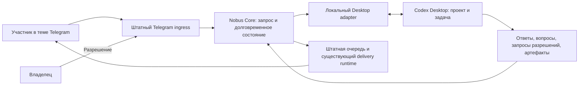

# M2-DESKTOP — Telegram ↔ Codex Desktop

25 сентября 2026. **TARGET / LOCAL WIP; OWNER IPC/UIA LIVE
TRANSPORT VERIFIED, TELEGRAM PRODUCT NOT ACTIVE.** Функциональный scope задан
владельцем. Локальный адаптер и часть интеграции реализованы; реальный
Desktop подтвердил создание/продолжение, полный ответ, вопрос и approve/deny,
но сквозная Telegram-приёмка D01–D17 ещё не завершена. Один Gate = одна задача разработки; исследование,
исправления, проверки и разрешённая активация продолжаются в ней.

После независимого аудита локально включены renderer полного ответа,
разбор файловых ссылок, карточки pending-запросов, CAS ответа, opt-in bridge и
проверяемый backup rebind. Это не замороженный кандидат: общий
request-scoped operation key/receipt установлен в существующий sender, а
самодостаточная аутентичная проверка — в существующий notifier. Их позитивный
продуктовый live-цикл, отсутствие дублей и mode/pending parity
ещё не подтверждены. UIA/context и owner IPC уже прошли узкий реальный
create/continue цикл ниже. Production bot tasks остаются Disabled; обычный
notifier отправил summary для трёх тестовых turn; позже exact bridge opt-out
проверен только read-only на установленном notifier и изолированной SQLite.
Отсутствие живого Telegram-дубля ещё не доказано.
[Точный журнал](m2-desktop/AUDIT-JOURNAL.md).

Уточнение локального WIP после аудита 24 сентября: R01–R05 адресно
исправлены в одном worktree, включая устойчивый план частичной доставки и
доказанную Git-связь managed worktree. Их offline-проверки не подменяют
живой цикл. Критерий A06 для **создания** требует видимого семантического
подтверждения активного проекта непосредственно перед UIA send и последующей
IPC-correlation; проверка только существования кнопки проекта недостаточна.
В случае смены окна, черновика или неопределённого исхода повтор turn
запрещён до readback. После ручного открытия пустой задачи read-only UIA
выявила несколько web-корней Chromium и однозначный app-root. Адаптер
отказывает при неоднозначности и проверяет видимые активный проект вне
sidebar и метку «Новый чат» до ввода и непосредственно перед send; тот же
предикат на настоящем Desktop вернул `true` без мутации. После ручного
переключения на существующую задачу того же проекта он вернул `false`.
Позднее подтверждено: визуально пустой Chromium composer возвращает LF +
placeholder, а не чужой draft; в новом виде две видимые кнопки «Новый чат».
После точной защиты от этих ложных стопов UIA один раз отправила уже
набранный запрос: Desktop создал задачу `01a0d432-e0c9-7280-bcd5-4350a8c7843f`,
owner IPC прочитал полный короткий финал. Затем IPC и семантический UI
сделали по одному продолжению в ней и оба финала считаны. Это подтверждает
узкий create/visibility/двустороннее продолжение в выбранном существующем
проекте, но не продуктовую Telegram-приёмку, полный capability parity,
pending/approval и восстановление после lost ACK. A01 на
реальной старой SQLite, живой bridge/notifier opt-out A09/A13 и D01–D17
остаются открытыми; read-only exact opt-out проверен отдельно.

25.09 проверена отдельная граница восстановления: после выгрузки задачи
`thread-owner-discovery` может вернуть `no-client-found`, хотя задача
сохранена и видна в списке Desktop. Внешний адаптер не вправе перейти к
отдельному CLI/App Server. Для ранее связанного точного thread ID он хранит
последнее название, полученное только из полной IPC-истории, открывает
единственный семантический sidebar-элемент через UIA **без ввода** и
повторяет read-only owner discovery для исходного ID. Лишь после exact owner
и проверки `cwd` допускается ход. При неизвестном/устаревшем названии,
неоднозначном selector или отсутствии владельца задача ждёт ручного
открытия; другое исполнение не запускается. Один live open-only опыт не дал
владельца, другой открыл ранее выгруженную задачу и дал exact owner с первого
readback. Это положительное, но не универсальное доказательство recovery;
продуктовый Telegram restart/lost-ACK D12 остаётся открытым.

Отдельный ограниченный опыт запустил настоящий `DesktopBridgeService` с
реальными UIA/IPC, но изолированной SQLite и локальным приёмником вместо
Telegram. Он создал задачу в том же проекте и доставил полный короткий
финал в правильную тестовую тему/reply; продолжение вернуло 6 243-символьный
финал, два текстовых фрагмента, `answer.md` с точным digest финала и
исходный файл с совпавшими bytes. Все четыре локальных delivery slot —
`sent`. Это подтверждение интеграции Bridge→Desktop и локального формата
доставки, не реальный Telegram, не положительный notifier opt-out и не
приёмка D09/D10.

## 1. Результат для пользователя

Любой участник закрытой группы «Заметки бизнеса» в любой её теме обращается
к Nobus Space Bot текстом или голосом. Бот создаёт задачу в указанном уже
существующем проекте Codex Desktop на ПК владельца либо продолжает выбранную
существующую задачу. Задача видна и доступна для продолжения в Desktop.

После выполнения бот возвращает в исходную тему полный итоговый ответ Codex,
без сокращения и пересказа, с адаптацией оформления под Telegram. Артефакты
передаются файлами. Уточнения адресуются автору текущего запроса, разрешения —
только владельцу. Ответить и разрешить можно из этой же темы Telegram.

Частные сценарии: найти документ по описанию; проанализировать таблицу;
создать презентацию; разработать код; продолжить исследование. Тип задачи
не выбирается из закрытого списка. Поиск документов — обычная задача Codex,
отдельный интеллектуальный поисковик в этот Gate не входит.

### Принятое функциональное требование о правах

- Все реальные участники указанной группы, включая агентов-ботов, имеют
  одинаковую возможность создавать и продолжать задачи. Сейчас владелец
  называет Артура младшего; Артур и Альберт будут добавлены позднее.
- Не вводить урезанный режим исполнителя, запрет классов задач или отдельный
  список разрешённых инструментов поверх возможностей владельца в Desktop.
- Использовать его действующие аккаунт, проект, правила, skills, плагины,
  MCP, модель/усилие и штатный механизм разрешений. Продолжение сохраняет
  настройки существующей задачи, создание наследует настройки проекта/Desktop,
  если пользователь явно не выбрал другое.
- «Как если бы владелец написал в Desktop» означает тот же доступ и те же
  штатные ограничения платформы. Это не указание отключить sandbox, обойти
  запрет Codex, извлечь credentials или автоматически принять разрешение.
- Владелец делегирует постановку задач всем участникам группы. Финальное
  право ответа на запрос разрешения остаётся только у владельца. Отдельных
  подтверждений для каждого обычного запроса не добавлять.
- Корневая папка поиска из предыдущего требования — рабочая библиотека
  владельца на ПК. Она не становится искусственной границей всего Desktop.
  Доступ определяется фактическими настройками и правилами проекта Codex.

Идентификатор владельца подтверждается при настройке по реальному Telegram
аккаунту [@pro_success_official](https://t.me/pro_success_official), указанному
им в запросе. Username служит отображению/упоминанию,
числовой user_id — проверке личности. Реальные ID, пути к секретам и токены
хранятся только в закрытой конфигурации, не в Git.

## 2. Что подтверждено сейчас

MVP1 принят 19.09; после инцидента 20.09 в CURRENT записан LIVE `9065cfc`.
Это исходная точка совместимости, не новое наблюдение доступности бота.
При запуске разработки заново прочитать точные Git/LIVE версии и сохранить
пользовательский WIP. [Текущий статус](../../handoffs/CURRENT-STATUS.md).

В проекте уже есть Core, долговременное состояние, очередь, восстановление,
распознавание голоса и доставка результатов. Но текущий Codex CLI worker
изолирован и не доказывает интеграцию с Desktop; поиск owner_files преимущественно
отбирает по имени/пути; общий групповой маршрут не равен Desktop bridge.

| Источник | Подтверждённый факт и граница |
|---|---|
| [codex_cli.py](../../../src/workers/codex_cli.py) | Используется ephemeral CLI с отключением пользовательских rules/config/MCP; не переименовывать его в Desktop adapter |
| [telegram_product.py](../../../src/application/telegram_product.py) | Групповой путь и текущий semantic admission требуют отдельного расширения для M2-DESKTOP |
| [bindings.py](../../../src/transport/telegram/bindings.py) и [gateway.py](../../../src/transport/telegram/gateway.py) | Точная owner/chat-пара остаётся корнем доверия; ingress производит identity каждого фактического numeric sender только для подтверждённого отрицательного group chat_id |
| [bot_api.py](../../../src/transport/telegram/bot_api.py) | Передача текста и документа сохраняет тему; bridge-файлы проходят через установленный delivery runtime и его ledger — второго multipart sender нет |
| [App Server](https://learn.chatgpt.com/docs/app-server) | Есть протокол задач, событий и разрешений. Отдельный сервер не доказывает связь с установленным Desktop; WebSocket отмечен экспериментальным и неподдерживаемым для production |
| [Remote Connections](https://learn.chatgpt.com/docs/remote-connections) | Описан доступ официальных клиентов ChatGPT к подключённому компьютеру. Это не обещание публичного API для стороннего Telegram-бота |
| [Telegram Bot-to-Bot](https://core.telegram.org/bots/features#bot-to-bot-communication) | Режим включён 22.09.2026; реальное сообщение Артура младшего `8916856788` получено Nobus bot в точном group/topic, без запуска bridge-задачи |

Для установленного Desktop `26.915.4065.0` на Windows проверен не только общий
контракт, но и фактический выбор транспорта. В наблюдаемой неизменённой
конфигурации локальный host запускает собственный дочерний `app-server` через
`stdio`. Ветка подключения к
`app-server-control.sock` в поставляемом Desktop bundle ограничена не-Windows
платформами и отдельным feature-флагом. Это привязанное к версии наблюдение
реализации, а не публичное обещание OpenAI; оно показывает, что установка
managed daemon сама по себе не подключит к нему этот Windows Desktop.

Отдельно 21–22 сентября реально проверен локальный Desktop owner IPC
`\\.\pipe\codex-ipc`: `initialize` версии 0 принят, а
`thread-owner-discovery` версии 1 нашёл владельца существующей задачи разработки.
Semantic UIA создал задачу в сохранённом проекте; затем owner-targeted IPC
выполнил turn, полный history readback, `requestUserInput`, принятое безопасное
разрешение и отказ запуска Calculator. Отдельный auto-review probe показал,
что Telegram-turn обязан задавать `approvalsReviewer=user`.
В установленном bundle обнаружены follower-методы start turn, полной истории,
вопросов и approvals. Это новый кандидат, который направляет запрос владельцу
задачи внутри работающего Desktop, а не пытается стать вторым writer отдельного
App Server. С 24 сентября узкий create/visibility/двусторонний цикл также
доказан на версии `26.917.9434.0`; полный функциональный паритет и продуктовый
Telegram-цикл пока не доказаны. Подробности и границы —
в [исследовании транспорта](M2-DESKTOP-TRANSPORT-RESEARCH.md).

### Повторное использование: уточнение после проверки кода 21 сентября

Обратная интеграция уже существует. Её канон — пакет
`codex-task-notifier-v2/README.md`, а установленный skill `nobus-send-results`
определяет текущие условия отправки артефактов. При разработке сначала прочитать
оба источника; точные локальные пути даны в промпте. Не подменять этот пакет
описанием одного только bot_api.py из репозитория.

| Уже существующий компонент | Что использовать | Необходимое расширение MVP2 |
|---|---|---|
| send_result.py | Проверка файла, размера и SHA256, identity/binding, preflight | Текущий CLI знает два назначения, ограниченные расширения и файлы своей задачи; это не готовый универсальный API bridge |
| telegram_delivery_runtime.py | Topic delivery, ответ Telegram, one-shot claim, SQLite ledger и UNKNOWN | Привязка к запросу, динамическая подтверждённая тема, reply и поддерживаемый интерфейс для новых клиентов |
| notify_every_turn.py / установленный wrapper | Финальное событие, точная пара thread/turn, проверка регистрации задачи | Для bridge — передать событие в единый маршрут доставки до получения/отправки краткого summary |
| notification_reconciler.py | Восстановление пропущенного финального события тем же маршрутом | Учитывать bridge ownership; не создавать второй scanner всех Codex-задач |
| Core/outbox | Durable запрос, план доставки и состояние пользователя | Новые соответствия Telegram↔Desktop и ссылки на существующие delivery receipts |

Восьмёрка файлов установленного notifier/skill совпала с manifest пакета от
02.09 при read-only сверке 21.09. Это проверка bytes, не новая живая отправка.
На синтетических данных без сети воспроизведены два ограничения совместимости:

- У `delivery_key_for` ключ состоит из destination_ref и artifact_digest.
  Первая отправка успешна, второй независимый запрос того же файла блокируется
  `duplicate_delivery_blocked`. После искусственного timeout слепой повтор
  также блокируется — это полезная защита, её сохранить.
- `extract_final_summary` превращает контрольные 1594 символа в 104 символа,
  заключительная контрольная деталь отсутствует. Это корректный summary, но
  использовать его как источник полного ответа нельзя.

Это не дефекты принятого MVP1: прежние контракты уже, чем новый scope.
Ошибкой проекта MVP2 было бы использовать их без расширения либо построить
рядом вторую независимую систему отправки.

Исторически глобальный notifier был расширен синтаксическим marker
`NOBUS-BRIDGE-REQUEST:<uuid>`: он подавлял summary для совпавшего текста.
Аудит A13 показал, что сам marker можно скопировать в обычную задачу; такое
подавление не доказывает принадлежность turn bridge-запросу. Первый
[патч аутентификации notifier](m2-desktop/notifier-auth-v2.patch) сохранён
как история промежуточного выпуска. Последующий
[самодостаточный патч](m2-desktop/notifier-auth-v3.patch) не загружает код
из изменяемого `bot_repo`:
подавление допускается только при точном совпадении durable request, thread и
turn; при недоступном DB уведомление сохраняется. Выпуск с SHA
`3befa848059448783b2f5f2b270078a4240226485390d9b76c9eb93e7bfef08a`
установлен 24.09 после точного подтверждения владельца. В конфигурацию добавлен
только read-only `bridge_state_path`; `bot_repo`, credentials и Telegram-тема
не менялись. Read-only отрицательная проверка установленного verifier прошла,
но полный live-цикл подавления/отправки ещё не подтверждён. После него
обнаружена гонка быстрого первого хода UIA: bootstrap turn не имел durable
привязки и мог вызвать параллельный summary notifier. Текущий
[патч v4](m2-desktop/notifier-auth-v4.patch) ждёт ограниченное время только
точную запись request/thread/turn; отдельный `bootstrap_turn_id` добавлен
аддитивной миграцией, которую проходят и прежние БД. SHA установленного
v4-релиза `e6e08ba29097b3a35e58f43cf2a7619778b95bf72561d23499c31e91a6479eda`
подтверждён владельцем; installer не менял настройки или credentials и не
вызывал Telegram. Локальная проверка обеих привязок прошла, но позитивный
live opt-out ещё не подтверждён. A13/D15 остаются открытыми. Существующий
reconciler остаётся единственным восстановителем уведомлений.

Для A09 подготовлено [расширение существующего sender](m2-desktop/telegram-delivery-runtime-v2.patch):
optional request-scoped operation key при неизменном смысле proof-bound
destination_ref и read-only receipt. Патч проверен на копии и установлен в
существующий skill runtime после сравнения исходных bytes; его self-test прошёл.
Продуктовый bridge fail-closed, если при opt-in видит прежний runtime без этих
возможностей. Второй вызов skill из самого Desktop turn запрещён инструкцией
bridge-turn, но устойчивость этой границы и отсутствие дублей требуют
live-проверки. Локальная интеграция не равна live-гарантии.

Минимально новое: входящее поручение/корреляция, реальный Desktop adapter,
маршрут вопросов/разрешений и детерминированное оформление полного ответа.
Проверки файлов, Telegram transport, credentials, binding, отправка в тему,
подтверждение результата и восстановление уведомлений повторно не создаются.

## 3. Архитектура

«Туннель» — двусторонняя связь команд, событий, ответов и файлов. На текущем
ПК уже работает Core; новый VPS и публичный порт для управления Desktop не
нужны. Использовать существующий Telegram ingress, единственного потребителя
updates и прежний outbox. Не запускать второй poller на токене бота.

Локальный adapter соединяет Core с подтверждённой точкой управления Desktop.
Выбирать IPC либо аутентифицированное loopback-соединение, если Desktop
действительно предоставляет такой интерфейс. Адрес и способ получения доступа
не придумывать. Публично доступный неаутентифицированный app-server запрещён.

Core — источник соответствий Telegram↔Desktop, ожидающих вопросов и доставки.
Codex Desktop — источник истории и состояния исполнения самой задачи.
Adapter переводит события, но не создаёт второй агентский runtime или вторую
независимую очередь. Один logical request владеет каждым исходящим действием.

У delivery runtime и Core уже есть разные обязанности: outbox планирует работу,
ledger фиксирует единственную попытку внешнего send и его receipt. Сохранить
это разделение через один стабильный operation_id, не создавать третий ledger
и не считать ACK очереди доказательством отправки Telegram.

### Внутренняя проверка осуществимости — обязательное начало Gate

В одной задаче разработки сначала доказать на установленной версии Windows/Desktop:

1. Получение реальных сохранённых проектов и проверяемое сопоставление выбранного
   проекта с рабочей папкой и контекстом задачи. Наличие `projectId` в каждом
   ответе и равенство идентификаторов разных API не требуются без подтверждённого
   контракта.
2. Создание задачи в выбранном существующем проекте, её видимость в Desktop и
   проверка того же thread, рабочей папки и контекста. Далее — продолжение задачи,
   созданной вручную в Desktop, и продолжение из Desktop задачи, созданной через
   bridge.
3. Получение полного финального ответа, вопросов и разрешений; возможность
   ответить на каждый тип и получить подтверждение принятия ответа.
4. Доступ к тем же инструментам/skills/MCP/плагинам и настройкам, что у обычной
   задачи Desktop. Наличие метода в JSON-RPC не доказывает доступ к Desktop-host tools.
5. Восстановление подписки и состояния после разрыва без повторного запуска.

Средства управления, доступные агенту внутри этого чата Codex, сами по себе
не являются внешним API, которым может пользоваться Nobus Space.

Основной кандидат — минимальный локальный follower-адаптер к owner IPC
работающего Desktop. Выбор существующего проекта, создание и открытие задачи
выполняются через проверяемые семантические Windows UI Automation selectors;
после появления owner дальнейшие операции по возможности идут через IPC.
Отдельный процесс адаптера допустим, но он должен доказать видимость задачи в
Desktop, последовательное продолжение одного thread с обеих сторон, правильный
рабочий контекст и доступ к требуемым возможностям Desktop. Изолированный CLI
или App Server с одной лишь общей историей такого паритета не доказывает.
Не писать напрямую в БД Desktop, не копировать cookies/токены, не патчить
приложение и не подменять UI Automation координатными кликами или вводом в
произвольное активное окно.

Если стабильного подтверждённого интерфейса нет, сохранить точный блокер,
проверенные варианты и альтернативу для решения владельцем. Функциональный
scope не уменьшать молча. Экспериментальный транспорт требует отдельного
осознанного решения перед production, а не декларации полной поддержки.

### Feasibility-checkpoint для установленной Windows-версии

Блокер локализован по транспорту. Сохраняется исторический результат: отдельный
короткоживущий App Server создаёт видимую задачу и читает общую историю, но после
Desktop-turn не получает writer (`already has an active writer`). Managed daemon
и Remote Connections — другие механизмы; ни установка daemon, ни общий cwd не
исправляют этот конкретный маршрут автоматически.

Общий вывод «внешнее управление Desktop невозможно» снят новым наблюдением:
owner IPC принимает внешний локальный клиент и находит владельца существующей
задачи. В bundle есть версии follower-операций, которые адресуются найденному
owner. Это достаточное основание для минимальной локальной реализации и одного
ограниченного live-smoke, но не PASS двустороннего продолжения, approvals или
Desktop parity.

Read-only UI Automation обследован в том же интерактивном сеансе без фокуса,
кликов и ввода. Окно `Chrome_WidgetWin_1` дало 600 доступных элементов;
точные кнопки проекта `nobus-orchestrator-dev`, «Начать новый чат в папке …» и
существующих задач доступны через `ExpandCollapse`/`Invoke`, composer — через
`Value`/`Text`. Слепые координаты не нужны. Пока не проверено, создаётся ли
thread/owner сразу после `Invoke` новой задачи либо для первого turn потребуется
дополнительный семантический UIA-шаг. Любая такая изменяющая UI-операция входит
только в отдельно разрешённый live-сценарий.

CDP остаётся резервом лишь после конкретной недостаточности UI Automation;
перезапуск Desktop с debug-портом требует отдельного разрешения. Отсутствие owner
переводит запрос в ожидание и не разрешает fallback на CLI/App Server.

## 4. Пользовательские сценарии

### Создание

Пример: «Nobus, в проекте PROстранство создай задачу: найди последний документ
об архитектуре Артура и Альберта и пришли его сюда».

Core сохраняет источник и исходную инструкцию. Название проекта сопоставляется
только с фактическим каталогом Desktop. При нескольких совпадениях автор
получает варианты; при отсутствии — список подходящих существующих проектов.
Новый проект автоматически не создаётся. Кодовый идентификатор задачи не
обязателен для человека; бот сообщает короткий номер и название.

В создание передаётся исходный запрос без LLM-пересказа. Служебный контекст
отдельно сообщает происхождение, автора и адрес возврата. Модель может помогать
разрешить неоднозначность проекта/задачи, но не назначает права и Telegram IDs.

### Продолжение

Пример: «Продолжи задачу “Архитектура агентов” в PROстранстве: добавь схему»
либо ответ на карточку результата: «Уточни раздел про память».

Приоритет идентификации: явный task/thread reference → reply на связанную
карточку/результат → однозначное совпадение в выбранном проекте → уточнение.
Нельзя продолжать «последнюю глобальную задачу» по одному слову «продолжи».
Ссылка codex://threads/... — идентификатор, но не разрешение перехода к другому
проекту. Конфликт ссылки и проекта уточняется.

Любой участник может продолжить существующую задачу; автором нового запроса
становится он. Ответы на этот turn возвращаются в тему нового запроса.
Одновременные продолжения одной задачи сериализуются; активный turn не
прерывается чужим сообщением. Явная просьба скорректировать текущую работу
использует steer только при подтверждённой поддержке и точной привязке.
Разные задачи не смешиваются; параллельность определяется реальной ёмкостью
Desktop, не создаётся искусственная обязанность выполнять их одновременно.

### Голос и входные вложения

Повторно использовать ASR MVP1. Автор подтверждает распознанный текст в этой
же теме до исполнения; голосовой шум не становится командой. Бот-автор может
подтвердить структурированным reply, поскольку нажатие кнопки человеком ему
недоступно. Дальше текст и голос идут одним маршрутом.

Не вводить собственный whitelist смысловых форматов задач. Вложения сохраняются
как связанные с запросом материалы и передаются способом, поддерживаемым Desktop.
Бинарные файлы не вклеиваются в prompt. Если Telegram/адаптер не умеет передать
вход, который принимает Desktop, это выявленный пробел паритета, не скрытый PASS.
Ссылка или инструкция внутри документа остаётся данными, а не новым поручением.

### Вопросы и разрешения

| Событие | Получатель | Ответ |
|---|---|---|
| Неясны проект, задача, содержание или выбор документа | Автор данного запроса с упоминанием | Reply на точный вопрос или выбор варианта |
| Штатное разрешение команды, файлов, сети, MCP, плагина | Только владелец с упоминанием | Разрешить/отклонить доступное действие с его точными параметрами |
| Просьба Codex о разрешении обычным текстом | Только владелец | Ответ в продолжение той же задачи после привязки к конкретному вопросу |
| Login/OAuth/действие, требующее интерфейса пользователя | Владелец | Штатный защищённый путь; секреты не запрашиваются в группе |
| Уточнение одновременно с разрешением | Уточнение — автору, разрешение — владельцу; задача ожидает | Каждый pending request сохраняет собственный numeric адресат |
| Неизвестный тип вопроса | Владелец; задача ожидает | Не понижать до обычного вопроса автору и не отвечать автоматически |

Не определять тип вопроса по одному названию API: tool/requestUserInput может
нести разрешение вызова App. Учитывать происхождение и семантику события.
Для установленного Desktop `26.917.9434.0` обычный
`request_user_input_async` обнаружен как `agentMessage` с `delivery=async`
и массивом `questions`, а ответ поступает владельцу как `steeringUserMessage`
через `thread-follower-steer-turn` с точным `questionItemId` и
`restoreMessage` рабочего контекста. Его нельзя ошибочно считать готовым
финальным ответом или отвечать через синхронный `submit-user-input`.
Подтверждённый live-cycle пока использует изолированный Telegram-приёмник.
`commandExecution/requestApproval` на этой версии содержит
`availableDecisions`; bridge передаёт только действительно предложенный
вариант решения и показывает владельцу новые поля команды полностью.
Текущий локальный адаптер не получает подтверждённого поля происхождения для
всех форм `requestUserInput`: явные просьбы о согласии/побочном действии и
неизвестные поля контейнера уходят владельцу на ручную проверку в Desktop,
обычные уточнения — автору. Это снижение риска, а не доказанный полный
классификатор App/MCP; D08 остаётся открытым до реального цикла.
Серверные запросы связываются с connection generation, thread, turn, item и
request_id. Telegram reply/callback связывается с тем же вопросом и digest
его параметров. «Да» без однозначной связи ничего не разрешает.

Перед отправкой карточки вопроса/разрешения durable state резервирует
операцию. Только ACK всех её частей делает Telegram reply действительным;
после потерянного ACK или crash автоматический повтор запрещён до сверки
фактической доставки. Это относится и к вводной карточке, а не только к
финальному ответу и файлам.

Owner binding проверяется по Telegram user_id при каждом ответе. Бот-агент,
пересланное сообщение владельца, display name, username-клон и анонимный
администратор не могут выдать разрешение от его имени. Для упоминания автора
использовать доступный username или Telegram mention по user_id.

Показывать владельцу действие, цель, существенные параметры, объём прав и
доступные варианты; длинные diff/команды — полным приложением. Тайм-аут не
означает согласие. Постоянное разрешение нельзя подменять разовым и наоборот;
передавать только реально доступный выбор, явно сделанный владельцем.
После ответа в Desktop карточка в Telegram закрывается, и наоборот; первый
подтверждённый ответ побеждает. Поздний ответ отклоняется. При обрыве соединения
нельзя воспроизводить старый request_id в новой сессии без readback.

Штатные и обычные текстовые вопросы проверяются отдельно. Запрет Codex,
отказ инструмента или отклонение auto-review не превращать в разрешение через
Telegram; показать причину и допустимый следующий шаг.

## 5. Полный ответ и артефакты

Полный ответ — все пользовательские итоговые сообщения выбранного turn в
исходном порядке, включая несколько финальных блоков. Это не скрытые
рассуждения модели и не автоматически весь журнал shell/tool output.
Промежуточные сообщения передавать как краткий статус без изменения результата.
Ошибка, отмена и вопрос в конце turn не помечаются успешным выполнением задачи.

Сохранять оригинальный итоговый Markdown приватно с digest. Telegram-проекция
детерминированная, без модели-пересказчика: сохранить формулировки, числа,
ссылки, порядок, оговорки, код, строки и ячейки таблиц. Разметку преобразовать
в поддерживаемые entities/HTML, длинные ответы разбить на нумерованные части
по текущему ограничению API, не разрывая Unicode/entity/code некорректно.
Для широкой таблицы допустимы пронумерованные записи с названиями всех столбцов;
диаграмма/интерактивная визуализация передаётся также своим исходным файлом,
а изображение-предпросмотр не заменяет артефакт.

Весь текст отправляется сообщениями, при необходимости многими. Приложенный
answer.md с точным оригиналом дополняет сообщения, а не заменяет их. Он нужен
для длинного ответа или преобразования таблиц/ссылок. Нет лимита «первые N частей»
с потерей остатка; очередью управляют ограничения Telegram и доступный диск.
Исчерпание ресурса даёт явный неполный результат, а не укороченный успех.

Локальные ссылки на артефакты заменяются понятной ссылкой на вложение/именем
файла. Веб-ссылки сохраняются. Строго проверять полноту текста после разрешённых
преобразований; не сравнивать лишь длину ответа. Служебные UI-директивы, включая
notifier marker, не выводятся как пользовательский текст; исходник сохраняется.

Файлы:

1. Получить manifest артефактов из поддерживаемых данных задачи; при отсутствии
   структурированного manifest разрешать локальные ссылки только в контексте
   конкретной задачи и её подтверждённого результата. Не отправлять все файлы
   из рабочей папки и не сканировать глобальное хранилище для угадывания артефактов.
2. Поддержать созданные файлы и существующий документ, который задача явно
   выбрала по запросу. Старый send-results skill только для созданных артефактов
   не покрывает второй случай; реализовать контракт bridge, не расширять skill тайно.
3. Перед отправкой зафиксировать доступный файл, имя, размер, MIME и SHA256,
   проверить фактическую цель пути/ссылки, создать согласованный snapshot при
   необходимости. Изменившийся файл не подменяет уже выбранные bytes незаметно.
4. Отправить каждый файл через штатную очередь в исходные chat/topic/reply.
   PNG/медиа по желанию показываются дополнительно; оригинал доставляется документом
   без потери качества. Нет искусственного whitelist выходных расширений.
5. При превышении лимита транспорта сохранить содержимое: архив без потерь и
   части с manifest/checksums, плюс короткая инструкция сборки. Не заменять файл
   внешней ссылкой. Если нужен единый крупный файл, отдельным точным разрешением
   настроить Local Bot API; это не обязательный второй сервер по умолчанию.
6. Отсутствующий файл, отказ загрузки и частичная доставка видимы пользователю.
   Успех Codex и успех доставки — разные состояния. Удаление временных snapshot
   выполняется по согласованной retention-политике и точному manifest.

Платформенные размеры проверяются при реализации: на 21.09 стандартный Bot API
указывает до 4096 знаков сообщения и до 50 MB документа, локальный сервер —
до 2000 MB загрузки. Физически неограниченный файл не обещается.
[Официальный Bot API](https://core.telegram.org/bots/api).

Глобальный notifier не должен отдельно дублировать результат bridge-задачи
в фиксированной теме. Нужна адресная координация ownership доставки по thread/turn;
прочие задачи Desktop продолжают пользоваться существующим notifier. Изменение
его установленной глобальной конфигурации выполняется только с точным разрешением.

### Один владелец доставки на конкретный запрос

Bridge request заранее получает устойчивый идентификатор до запуска turn.
Bridge записывает request до dispatch и добавляет его UUID как закрытый
protocol marker в каждый свой Desktop turn. Callback notifier и reconciler
распознают только этот точный формат, завершают свою ветку как
`bridge_suppressed` и не отправляют fallback-summary. Bridge самостоятельно
делает readback полного результата по точному thread/turn. Поэтому быстрый
финал не опережает регистрацию request, а ownership не выводится из смысла
поручения или похожего текста.

Обычные задачи Desktop сохраняют прежний notifier. Для bridge-задач не должно
быть одновременно «Codex вызывает send-results напрямую» и «Core отправляет
тот же артефакт». Skill может оставаться входом в ту же операцию доставки
через подтверждённый контекст bridge; повторный вход возвращает известный
receipt, а не создаёт второй send. Без такой совместимости его прямой вызов
нельзя дополнять ещё одной отправкой Core. Это координация одного эффекта,
не запрет использовать функцию Telegram из Codex.

В MVP2 ключ операции включает версию, bridge request/turn, output part/artifact id,
подтверждённое назначение и digest bytes. Повтор одного запроса использует
тот же ключ. Новый явный запрос «пришли тот же файл» получает новый request_id
и может отправить те же bytes снова, не перезапуская прежнюю задачу Codex.
Не менять destination_ref фиктивно и не очищать старый ledger ради обхода dedup.
Старый CLI сохраняет прежнюю семантику; новое поле/версия контракта вводится
совместимо с проверкой старых потребителей и их receipts.

Полное содержимое читать по подтверждённому turn из Desktop. Callback/reconciler
могут служить сигналом «результат готов», но их last-assistant-message/summary
не доказывает наличие всех финальных блоков и артефактов. Не повышать лимиты
парсера событий бесконечно ради пересылки большого текста одним событием.
Существующий reconciler не умеет доставлять уточнения/разрешения во время работы;
это отдельная обязанность нового Desktop adapter в рамках того же Gate.

## 6. Telegram и доверенная группа

Сохранять исходные bot identity, chat_id, message_thread_id (включая общую тему),
message_id, sender user_id и is_bot. Получение задачи из другой темы не меняет
адрес доставки уже запущенного turn. Закрытая/удалённая тема блокирует доставку;
не переключать её молча в личку или другую тему.

Группа — единственная разрешённая точка входа этого Gate; её участники имеют
одинаковые права постановки. Проверка реального членства/выхода — техническая
идентификация, а не новая роль с ограниченным набором задач. Пересланный текст
атрибутируется фактическому отправителю. При анонимном sender_chat нужно
попросить отправить запрос от идентифицируемого аккаунта, не угадывать автора.

Обрабатывать обращения к боту и ответы на связанные карточки, не превращать
всю фоновую беседу в задачи. Поддержать понятное обращение по имени/упоминанию;
для ботов дополнительно надёжный command@bot или прямой reply. Возможность
получать обычные групповые сообщения зависит от настроек Telegram.

Bot-to-Bot Communication Mode и group privacy/admin проверяются на настоящем
Nobus Space и Артуре младшем. Включение/изменение — отдельный разрешённый шаг
активации. Для будущих Артура/Альберта дать короткую инструкцию подключения,
не требовать их наличия сейчас и не заявлять их протестированными.

Нужна защита от эха: собственный результат/статус не создаёт задачу; учитываются
request correlation, повторы и конечность цепочки. Очередь и backoff не урезают
типы задач. Новая осознанная задача агента допустима, бесконечный обмен одинаковыми
сообщениями — диагностируемый сбой. Уточнения от агента принимаются текстовым reply,
а не только callback. Все разрешения всё равно адресуются человеку-владельцу.

## 7. Техническая реализация

### Модули и зона изменений

Сохранять Python и существующие компоненты проекта. Точные имена новых модулей
разработчик выбирает после проверки дерева; ниже роли, а не обязательный framework.

| Часть | Изменение |
|---|---|
| Telegram models/bindings/ingress | Доверенная группа, реальные участники/боты, тема, reply, вложения, корреляция вопросов |
| Application/Core | Capability Desktop task; один маршрут create/continue/query/reply; новые состояния внутри существующей durable модели |
| Desktop adapter | Только недостающие каталог/управление задачей, текущие события вопросов/разрешений, readback полного результата и manifest |
| Telegram renderer/delivery | Новый formatter полного текста; существующий delivery runtime расширяется для request/turn/topic/reply, без второго Telegram sender |
| Runtime/recovery | Совместимые миграции, reconnect, блокировка дублей, shutdown, health adapter |
| Документация | Forward ADR для делегирования всем участникам и Desktop authority; существующий runbook и пользовательская памятка |

Не посылать новый сценарий через старый no-effect allowlist и не снимать
проверки у всех старых задач. Новый принятый контракт делегирования расширяет
конкретную capability и явно документирует заменённые ограничения. Старые
запечатанные ADR/evidence не редактировать для видимости совместимости.

Файлы skills/notifier находятся вне репозитория: нельзя незаметно изменить
установленную копию или размножить исходники двумя независимыми реализациями.
Сначала зафиксировать действующие владельцы исходников/хеши и минимальный diff
каждого компонента. Переиспользование — через объявленный проверяемый интерфейс
совместимой версии. Если общей библиотеке действительно нужна новая точка
владения, подготовить адресный план переноса/поставки с сохранением старого
CLI; миграция не является поводом переписывать notifier. Установку обновлений
пакета выполнять только по точному разрешению, с manifest и rollback.

### Минимальная модель данных

Использовать существующие durable storage и миграции; таблицы/поля ниже логические,
их не нужно превращать в отдельные сервисы или отдельную БД без причины.

| Запись | Поля и обязательная связь |
|---|---|
| bridge_request | id, ingress dedupe key, автор, chat/topic/source_message, create/continue, исходная инструкция/material refs, project_id, thread_id, turn_id, status, timestamps |
| desktop_binding | project identity, environment/worktree/cwd, thread identity, версия адаптера/протокола, последняя подтверждённая позиция |
| pending_question | kind, request/turn/item, connection generation, Telegram question message, адресат, payload digest, исход, срок/причина закрытия |
| output_part | turn, final item/order, source digest, renderer version, part index/count, outbox key, Telegram receipt, delivery state |
| artifact | turn, artifact id, filename/type/size/hash, private snapshot ref, части/manifest, outbox/receipt |

Идентификаторы и текст задач хранятся локально с прежней защитой, не в публичных
логах. В журнале — краткие коды, ссылки/digests, без содержимого документов,
аудио, секретов и посторонних Desktop-задач.

### Контракт adapter

Реализовать операции list_projects, resolve_thread, create_thread,
continue_thread, subscribe/read_state, answer_question, answer_approval,
get_final_output и get_artifacts. Это интерфейс Nobus, не утверждение, что
одноимённые внешние endpoints уже существуют. Привязку к реальному протоколу
зафиксировать в evidence по установленной версии.

Текущий профиль `codex-desktop-26.915.4065.0` использует четырёхбайтовый
little-endian размер и JSON-кадр через `\\.\pipe\codex-ipc`: initialize 0,
owner discovery 1, follower start turn 2, полную историю 1, ответы на command/
file/permissions approval и user input/MCP elicitation 1, stream-state broadcast
11. Interrupt и update settings не вызывать до проверки их точных payload
установленной версии. Несовпадение version останавливает исполнение без fallback.

Локальная реализация содержит bounded framing, тайм-ауты, корреляцию request/response,
повтор соединения только до нового вызова, owner-targeting и raw versioned events.
Мутация не повторяется автоматически: если после записи потерян ACK, результат
`UNKNOWN_DISPATCH` сначала сверяется полной историей по переданному
`clientUserMessageId`. Отсутствие этого поля в readback пока не доказывает, что
turn не начался, и не разрешает повтор. Default frame limit адаптера — 16 MiB,
жёсткий protocol cap — 256 MiB; увеличение локального лимита требует проверки
памяти и реального размера истории.

UIA отвечает только за bootstrap, который IPC пока не доказал: точный проект,
создание/открытие задачи и проверка выбранного окна. Селекторы обязаны быть
однозначными, enabled и иметь нужный Automation pattern; offscreen-элемент
сначала прокручивается штатным pattern. Координаты, clipboard/SendKeys в
произвольное окно и выбор «последней задачи» запрещены. Получение thread id и
момент появления owner — открытый вопрос live-smoke. Каталог, attachments,
Desktop-host tools и pending-request events проверяются на реальном Desktop.

### Состояния и сбои

Последовательность: RECEIVED → NEEDS_TARGET/NEEDS_VOICE_CONFIRMATION либо
QUEUED → DISPATCHING → RUNNING → WAITING_AUTHOR/WAITING_OWNER → RUNNING →
EXECUTION_COMPLETED → DELIVERING → DELIVERED. Отдельно: FAILED, CANCELLED,
WAITING_PC, UNKNOWN_DISPATCH, DELIVERY_PARTIAL, DELIVERY_UNKNOWN.
Названия сопоставить с имеющимися состояниями, не плодить параллельные enum.

- Записать запрос до dispatch. Дедупликация updates и бизнес-запросов не даёт
  одному повтору создать второй turn. Редактирование старого Telegram сообщения
  не перезапускает задачу; изменение оформляется новым явным запросом.
- Два новых сообщения с одинаковым текстом — два отдельных поручения, если
  нет явной связи повтора. Сходство текста или одинаковый hash документа не
  заменяют идентификатор запроса. Для явной повторной доставки создать новую
  delivery operation, сохранив исходный completed turn.
- При потерянном ACK create/turn сначала readback по подтверждаемой корреляции.
  Если API не поддерживает idempotency key и нельзя установить исход, сохранить
  UNKNOWN_DISPATCH; автоматическое повторное исполнение запрещено.
- Telegram API не обещает exactly-once send после неизвестного исхода.
  Сохранить известные message receipts, сверить доступными штатными средствами;
  при невозможности сверки показать неопределённость, не повторять весь ответ
  вслепую. Явный запрос повторной доставки не должен повторно запускать Codex.
- Перезапуск адаптера не означает перезапуск задачи. Восстановить связь,
  readback turn/output/pending requests и только затем возобновить доставку.
- Один активный writer на Desktop-thread; очередь продолжений сохраняет автора
  и тему каждого turn. Одновременная работа пользователя в Desktop учитывается.
- ПК/приложение выключены: нет обещания выполнения. Если Core доступен —
  WAITING_PC и очередь; если Core также на выключенном ПК — мгновенного ответа
  нет. Telegram хранит updates ограниченное время; круглосуточный VPS ingress
  не входит в этот Gate. Для сохранённого запроса после длительного простоя
  показать возраст и запросить актуальность, не выполнять устаревшее действие молча.
- Обновление Desktop с несовместимым API переводит bridge в понятный degraded
  режим до проверки совместимости, не запускает CLI fallback.
- Существующие правила секретов и проектные ограничения сохраняются. Если
  итог содержит секрет, нельзя переслать его в группу ради «полноты»: доставка
  приостанавливается с причиной, задача получает безопасную исправленную версию.
  Не редактировать текст молча и не отправлять секрет в answer.md.

Выпускной opt-in проходит существующую цепочку Scheduled Task → supervisor →
Core: флаг `--desktop-bridge`, точный `desktop-projects.local.json` и только
явно перечисленные owner-workspace корни артефактов. Без пары флаг+каталог
проектов запуск отклоняется. Путь и bytes каталога входят в activation и
backup input binding; дополнительные корни входят в activation binding.
Для обновления остановленного runtime backup reconciler принимает только
точный завершённый журнал с подтверждённым digest. Под admission hold он
мигрирует только известную прежнюю DDL bridge-таблицы, затем сверяет всю БД и
создаёт новое поколение до запуска Core. Свежая и мигрированная DDL имеют
разные точные разрешённые хэши; любая третья схема отклоняется. Это локально
проверено, но production-восстановление ещё не выполнялось.

## 8. Паритет Desktop

На старте записать версию Desktop, доступные возможности и контекст конкретного
профиля владельца. Проверять фактическую доступность, а не обещать все будущие
функции платформы. Матрица содержит minimum:

- проекты, создание, выбор/продолжение существующей задачи, история;
- модель/усилие, project instructions, skills, MCP и установленные плагины;
- локальные файлы, shell, web/browser и другие реально включённые инструменты;
- входные материалы, артефакты, видимые визуализации;
- обычные вопросы, все встречающиеся семейства approvals, Desktop↔Telegram race;
- host-specific tools, интерактивные действия и формы авторизации.

Каждая включённая в Desktop возможность получает VERIFIED, BLOCKED либо
непроверенный статус с причиной. Недоступную владельцу возможность не нужно
добавлять. Доступную ему возможность нельзя исключить из паритета без отдельного
решения владельца. Отсутствие поддержанного протокола/человеческого интерфейса
для конкретной функции — открытый блокер, а не «полный доступ» с оговоркой мелким шрифтом.

Матрица проверяет одинаковый effective context и семейства механизмов, а не
заставляет запускать каждую команду каждого skill или реальный внешний эффект
каждого плагина. Представительных безопасных сценариев достаточно, когда ими
доказана общая граница; уникальный host-specific путь проверяется отдельно.
Абсолютную безошибочность не обещать. Приёмка означает заданные воспроизводимые
сценарии, обнаружение неуспеха, отсутствие скрытой потери/повторного эффекта
и понятное восстановление. UNKNOWN с честной остановкой безопаснее ложного PASS.

## 9. Приёмка одного Gate

| ID | Проверяемый результат |
|---|---|
| D01 | Текст от владельца создаёт реальную видимую задачу в выбранном существующем проекте; рабочая папка, контекст и связь с тем же thread подтверждены без требования равенства идентификаторов разных API |
| D02 | Запрос настоящего Артура младшего принят из группы; автор сохранён; бот получает и отвечает на уточнение текстовым reply |
| D03 | Продолжение задачи, созданной вручную в Desktop, сохраняет контекст; задача bridge продолжается вручную в Desktop |
| D04 | Неоднозначный проект/задача уточняется; неизвестный проект не создаётся молча; несколько тем не смешиваются |
| D05 | Голос распознан, показан автору и исполнен только после подтверждения; повтор confirm не создаёт дубль |
| D06 | Уточнение приходит автору текущего запроса; ответ действительно продолжает соответствующую задачу |
| D07 | Разрешение получает владелец; другой участник/бот/forward/поддельное имя не может его выдать; approve/deny реально отражаются в Desktop |
| D08 | Проверены requestUserInput с побочным действием, неизвестный тип запроса, expiry, reconnect и ответ одновременно из Desktop/Telegram |
| D09 | Длинный итог целиком доставлен: код, таблицы, ссылки, Unicode, несколько финальных сообщений; есть воспроизводимая проверка полноты |
| D10 | Созданный артефакт и найденный документ пришли файлами с совпадающими bytes/hash; новый запрос тех же bytes доставляет файл повторно, повтор старого запроса не создаёт второй send |
| D11 | Проверены большой файл/части, изменившийся/отсутствующий файл, неподдержанная визуализация и неполная доставка без ложного успеха |
| D12 | Дубликат update, потеря ACK, restart, ошибка сети и два продолжения не создают повторного исполнения/чужого ответа; одинаковый текст новых запросов не сливается |
| D13 | Матрица паритета соответствует фактическим возможностям владельца; isolated CLI/test double не заменяют реальный Desktop |
| D14 | Эхо между ботами прекращается; другой чат и анонимное неподтверждённое действие не получают доступ |
| D15 | Миграции/rollback и MVP1 проверены; callback/reconciler/skill/Core не дублируют bridge output; быстрый turn и недоступный Core не теряют событие; старый CLI/notifier работают прежним образом |
| D16 | Один замороженный кандидат прошёл L1/L2/L3; evidence привязаны к SHA/tree/config/версии Desktop, нет открытых обязательных блокеров |
| D17 | После точного разрешения на публикацию/активацию владелец прошёл короткий реальный сценарий; docs/Git/live различены; полный результат получен в Telegram |

Тесты на fixtures подтверждают обработчики, но не D01/D02/D03/D07/D10/D13/D17.
Реальные проверки требуют согласованного проекта, темы, тестовых файлов и
конкретных действий. Не использовать реальные удаления/платежи как тест approval.
Повторное 72-часовое наблюдение и повтор C6 не входят в Gate. Проверки новых
границ не являются повторной приёмкой неизменённого MVP1.

## 10. Последовательность реализации и разрешения

1. Восстановить актуальные источники, получить точную base revision, выделить
   изолированную рабочую копию, сохранить существующие локальные документы.
2. Проверить реальный интерфейс Desktop и Telegram bot-to-bot; оформить
   capability/compatibility evidence и forward ADR. Нереализуемость ключевого
   паритета останавливает зависимую разработку, а не ведёт к подмене продукта.
3. Реализовать минимальный сквозной путь create → complete → полный текст,
   затем resume, вопросы/approvals, голос/вложения, файлы и recovery.
4. Выполнить целевые проверки и согласованные реальные сценарии; обновить
   документацию до freeze. Внутренние checkpoints не становятся новыми Gate.
5. Заморозить цельную ревизию; провести один независимый L1/L2/L3. Собрать
   блокеры, исправить пакетом, повторить затронутые проверки; не создавать цикл
   новых проверяющих после каждого изменения.
6. Подготовить конкретный план публикации/backup/migration/activation/rollback,
   затем запросить только отсутствующие разрешения. Выполнить разрешённые
   действия и короткую реальную приёмку в этой же задаче.

Владелец 22.09.2026 разрешил все необходимые действия для полной реализации
MVP2. Действия всё равно выполняются минимально, с backup/rollback, без второго
poller, установки или патча Codex Desktop и без обхода отказов доступа.

При завершённом коде без live-проверки писать CANDIDATE VERIFIED / NOT ACTIVE,
а не MVP2 ACCEPTED. Принятие Gate требует закрыть обязательные D01–D17 и получить
приёмку владельца; отсутствие разрешения означает ожидающий шаг в той же задаче.

## 11. Документация и источники

Scope — [docs15](../../15-Продуктовая-дорожная-карта.md); реализация — этот документ;
статус исполнения — [REGISTRY](REGISTRY.md); запуск — [M2-DESKTOP-PROMPT](M2-DESKTOP-PROMPT.md).
Версионное транспортное исследование —
[M2-DESKTOP-TRANSPORT-RESEARCH](M2-DESKTOP-TRANSPORT-RESEARCH.md).
При старте создать один `m2-desktop/HANDOFF.md` и один `EVIDENCE.json`, без пустых
фиктивных PASS заранее. Механика — [DOCUMENTATION](../../mvp2/DOCUMENTATION.md).

Использована глава Nobus Memory «VC-06 — Архитектура и выбор стека» (прочитана
21.09): один существующий runtime, эксперимент с критической зависимостью,
разбор потери ответа до добавления новых сервисов. Это методика, не доказательство
доступности конкретного API. Динамические факты сверены по официальным источникам
выше на 21.09.2026; при разработке проверить установленную версию.

При проверке повторного использования применены code-review-skill и глава
«VC-10 — Тесты и приёмка»: проверять наблюдаемый эффект и потерянный ACK,
не выдавать mock за живой Desktop. Systematic-debugging применён к конкретной
гипотезе несовместимости dedup с новым независимым запросом; production-сбой
не заявляется. Закрытая воспроизводимая диагностика: `.runtime/architect-handoff/`
`probe_mvp2_reuse.py`, receipt в `reuse-probe-1a961b2b14ac4b888302bf339079bb49/`.
Это локальные evidence проекта, не опубликованный результат приёмки Gate.

При продолжении 21.09 Nobus Memory подтвердил READY и scope
`project:nobus-space`, но scoped search завершился ошибкой операции; повтор и
обход не выполнялись. Scope Vibecoding `project:prostranstvo` этим маршрутом не
разрешён. Эти ограничения не заменяют Git, локальное IPC-наблюдение и тесты.
