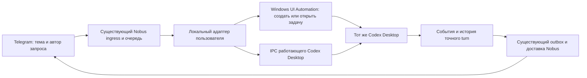

# MVP2: способы связи Telegram с работающим Codex Desktop

Проверено 21 сентября 2026 года. Статус документа: локальный исследовательский CHECKPOINT, не принятый Gate и не опубликованный результат. Продуктовый контракт M2-DESKTOP и D01–D17 сохраняются. Документ дополняет архитектуру новым доказательством; существующие статусы разработки автоматически не меняет.

## Вывод

Общий вывод «связь с настоящим Codex Desktop невозможна» не подтверждается. На этом ПК обнаружен и проверен действующий IPC-канал запущенного Desktop: `\\.\pipe\codex-ipc`. Приложение приняло инициализацию внешнего локального клиента и определило владельца задачи разработки. Это новый маршрут, отличающийся от ранее неудачного подключения отдельного App Server к занятой Desktop задаче.

Основной кандидат для MVP2 — небольшой локальный адаптер к IPC Desktop. Для выбора сохранённого проекта, создания и открытия задачи нужно проверить Windows UI Automation. После появления владельца задачи дальнейшие операции по возможности выполнять через IPC. CDP — запасной кандидат, если доступность интерфейса через UI Automation окажется недостаточной.

Это доказательство наличия канала и маршрутизации к нужной задаче, а не доказательство готовности всего MVP2. Передача поручения, создание задачи, получение полного ответа, вопросы, разрешения и паритет инструментов в этом исследовании через новый канал не выполнялись. Установленный Desktop не патчился и не перезапускался. Сторонние проекты не устанавливались; скачанный код не запускался.

Предыдущий блокер следует сузить до проверенного неработающего транспорта: самостоятельный App Server не смог надёжно продолжить задачу, которой уже владеет Desktop. Этот факт не опровергает IPC-делегирование самому владельцу. Следующий шаг — ограниченный эксперимент нового маршрута в той же задаче M2-DESKTOP, а не подмена требований отдельным CLI.

## 1. Контракт исследования

Цель — найти технически обоснованный путь выполнения исходного требования владельца: участники «Заметок бизнеса» создают и продолжают задачи именно в установленном Codex Desktop; получают полный ответ и файлы в исходной теме; уточнения идут автору, разрешения — владельцу. Ручная работа в Desktop с теми же задачами сохраняется.

Границы: открытые источники, чтение релевантного локального кода и документации, безопасная проверка подключения. Разрешение на исследование не означает разрешения на установку, патч приложения, внешние сообщения, реальные тестовые поручения, изменение BotFather, публикацию или deploy.

Критерий достаточности исследования — конкретные реализации, сверка заявлений с кодом и проверка доступности наиболее подходящего механизма на этом ПК. Обещать абсолютную безошибочность по README или одному успешному подключению нельзя.

Источники контекста: [архитектура](M2-DESKTOP-ARCHITECTURE.md), [основной промпт](M2-DESKTOP-PROMPT.md), [реестр](REGISTRY.md), handoff и evidence существующей задачи в `.runtime/worktrees/m2-desktop`. В каноническом checkout и worktree есть ранее созданный WIP; данный отчёт его не перезаписывает. Старые записи памяти не заменяют наблюдение текущего Desktop.

## 2. Что проверено на ПК

| Предмет | Результат и предел доказательства |
|---|---|
| Установленный Desktop | `26.915.4065.0`; связанный App Server `0.155.0-alpha.9.2` |
| Именованный канал Windows | `\\.\pipe\codex-ipc` присутствует у работающего приложения |
| `initialize`, версия 0 | Приложение ответило `success`, выдало идентификатор клиента |
| `thread-owner-discovery`, версия 1 | Для задачи разработки ответ `success`, владелец найден |
| Дополнительный признак | В ответе обнаружено `supportsUntrustedAppInput: true`; это признак обработки определённого типа входа, не разрешение на любые действия |
| Изменения задач и разрешений | Не выполнялись: проверка разрешала ровно два указанных метода |
| Полный сквозной сценарий | Не проверен этим экспериментом |

Проверка выполнена `2026-09-21T16:20:01.4816033Z` — 19:20:01 по Москве. Наблюдённый результат без внутренних идентификаторов:

```json
{
  "checked_at_utc": "2026-09-21T16:20:01.4816033Z",
  "methods": ["initialize", "thread-owner-discovery"],
  "connected": true,
  "initialized": true,
  "owner_found": true,
  "task_or_approval_mutations": false,
  "initialize_result": "success",
  "owner_discovery_result": "success",
  "supports_untrusted_app_input": true
}
```

Это зафиксированное наблюдение вывода инструмента, а не новый запуск проверки. Локальный диагностический скрипт: `.runtime/architect-handoff/mvp2-transport-research/probe_desktop_ipc_readonly.ps1`, SHA256 `dfe2bdd2faa7af5ef6adfa5deffda0dc7eddae9e3bb553efbe00f48d2f7648de`. Каталог исключён из Git; для передачи исследования достаточно описанного протокола и наблюдения, приватный идентификатор задачи не нужен в опубликованном документе.

Первое подключение из sandbox получило отказ доступа к pipe. После разрешённого запуска того же ограниченного read-only скрипта в обычном контексте пользователя подключение прошло. ACL не менялись. Это требование к контексту запуска адаптера, а не доказательство необходимости прав администратора. Работу из Windows service/session 0 считать непроверенной; предпочтителен процесс пользователя в его интерактивном сеансе.

Дополнительно прочитан установленный `app.asar`:

```text
C:\Program Files\WindowsApps\OpenAI.Codex_26.915.4065.0_x64__2p2nqsd0c76g0\app\resources\app.asar
SHA256: b8aeb817cd1ee6ef50efe8a97985d3be41de89688a5addfe0a444e1e52348096
```

В нём обнаружены поиск владельца задачи и обработчики `thread-follower-*`. Извлечённая таблица версий текущей сборки:

| Метод | Версия |
|---|---:|
| `thread-owner-discovery` | 1 |
| `thread-follower-start-turn` | 2 |
| `thread-follower-load-complete-history` | 1 |
| `thread-follower-steer-turn` | 1 |
| `thread-follower-interrupt-turn` | 4; в коде также предусмотрен вариант 3 без `expectedTurnId` |
| `thread-follower-update-thread-settings` | 2 |
| `thread-follower-command-approval-decision` | 1 |
| `thread-follower-file-approval-decision` | 1 |
| `thread-follower-permissions-request-approval-response` | 1 |
| `thread-follower-submit-user-input` | 1 |
| `thread-follower-submit-mcp-server-elicitation-response` | 1 |
| `thread-stream-state-changed` | 11 |

Кроме двух методов подключения, наличие этих обработчиков подтверждено чтением кода, а не их выполнением. Обнаружение методов ответов на вопросы ещё не доказывает, что все виды ожидающих запросов можно надёжно получить и сопоставить через события. Это отдельный предмет ближайшего эксперимента.

## 3. Найденные способы и пригодность

| Способ / проект | Что установлено по источникам | Решение для Nobus |
|---|---|---|
| Desktop owner IPC: `i-am-BT/codex-web` | Внешний клиент Windows pipe, поиск владельца, отправка turn, история, ответы на вопросы и разрешения; есть тесты маршрутизатора | Основная техническая опора; реализовать узкий адаптер, не переносить весь web-продукт |
| Windows UI Automation: `Tarikv1/codex-telegram-bridge` | .NET UI Automation, поиск элементов Desktop, ввод через clipboard/SendKeys; также есть координатный fallback | Кандидат для создания/открытия задачи. Координатный fallback не переносить |
| CDP: `filipj9/Hermes-Control-Deck` | Windows experimental Desktop bridge, loopback CDP, видимый интерфейс и подтверждения | Запасной транспорт. Потребует отдельно разрешённого запуска Desktop с debug-портом |
| `taolin7406/syncodex-public` | Архитектура заявляет Desktop IPC; публичный Python-код вызывает отсутствующие в дереве sender-скрипты | Полезная независимая архитектурная ссылка, но не готовый устанавливаемый мост |
| `srctl/codex-thread.nvim` | Отправляет turn через private Desktop IPC; Unix/macOS-ориентированные пути | Подтверждение механизма; default fire-and-forget не подходит для надёжной доставки Nobus |
| `blastridskogr/codex-telegram` | Встраивает мост патчем приложения; Windows-инструкция меняет локальный пакет и его регистрацию | Исключить из первого решения: слишком глубокое вмешательство и обслуживание после обновлений |
| `jvogan/telegram-codex-bridge`, зеркало GitLab | Реальные backend используют отдельный App Server и `thread/resume`; UI shadow mode — macOS | README не доказывает Windows Desktop parity; известный writer-конфликт не решён самим названием проекта |
| `anton88vlc/codex-telegram-frontend` | Есть macOS app-control, текущий основной транспорт — App Server | Полезны схемы project/topic, но не готовый Windows Desktop адаптер |
| `yashau/dexgram` | App Server и синхронизация Telegram-истории добавлением записей в transcript | Не использовать прямую запись в историю Desktop вместо реального управления |
| OpenCodex `RyensX/OpenCodex` | Отдельная Electron-оболочка с извлечённым runtime официального приложения и своим профилем | Другой продукт и контур состояния; не соответствует управлению уже запущенным Desktop без дополнительного доказательства |
| Hapi / Happy / VibeTunnel | Удалённые агентские/CLI/терминальные сессии; у Hapi также есть код работы с Desktop-историей | Не доказательство паритета установленного Desktop; не заменять ими исходное требование |
| RDP/VNC, Tailscale, Apache Guacamole | Общий удалённый доступ к ПК и экрану | Возможный ручной аварийный доступ. Сам по себе не реализует поручения, авторство, approvals и возврат ответа |
| Telegram MCP | Инструменты доступа к Telegram для агента | Не решает самостоятельно пробуждение Desktop, создание turn и маршрутизацию разрешений |

Проверено содержимое IPC-клиента и его тестов. Тесты демонстрируют обработку owner discovery, start-turn ACK, вопросов, reconnect, несовместимой версии и неопределённого результата. В этом исследовании они не запускались и не являются проверкой реального Nobus. Более того, один тест считает отсутствие владельца основанием для App Server fallback: для исходного контракта Nobus такой автоматический fallback недопустим.

Важные расхождения с рекламным описанием: Syncodex не содержит часть вызываемых им скриптов; некоторые «Desktop bridge» на деле продолжают задачу через отдельный App Server; другие требуют патч официального приложения. Поэтому выбор сделан по исполняемым участкам кода и локальному наблюдению, а не по заголовкам README.

## 4. Рекомендуемая архитектура



Здесь «туннель» состоит из двух разных частей: доставка Telegram-запроса на ПК и управление локальным Desktop. Для второй части найден pipe. Он не требует открытия порта в Интернет. Для первой части следует сохранить уже существующий Telegram ingress и транспорт Nobus. Если позже часть системы переедет на VPS, исходящее аутентифицированное соединение агента ПК с VPS можно добавить отдельно; новый VPS/VPN не является обязательным условием текущего Gate.

### Минимальный новый код

1. Адаптер Desktop в текущем пользовательском сеансе: framed JSON, initialize, обнаружение владельца, разрешённые контрактом методы и события. Четырёхбайтовая длина кадра — little endian; обязательны ограничения размера, времени и корреляция request/response.
2. Узкий UIA-модуль для операций, для которых пока нет подтверждённого IPC-метода: выбрать существующий проект, создать или открыть точную задачу, проверить результат. Сначала исследовать доступность элементов; не считать UIA уже проверенным на текущей сборке.
3. Связь Telegram request → project/thread/turn → автор/тема; ожидающие вопросы и разрешения; восстановление неопределённых исходов.
4. Получение полного пользовательского итога и manifest артефактов; детерминированная адаптация Telegram без модели-пересказчика.

Не нужны второй агентский движок, второй Telegram poller, установщик Codex, патч приложения, новый credential store, самостоятельный App Server для владения задачами или новый файловый поисковик. Существующие отправку файлов, ASR, Core, outbox, reconciler и bindings сначала переиспользовать через проверенные контракты.

### Что не считать готовым заранее

- **Создание задачи и каталог проектов.** В изученном IPC-клиенте нет подтверждённого полного API создания задачи в сохранённом проекте. Проверить UIA и существующие входы самого Desktop; не создавать отдельную App Server задачу ради формального появления записи в списке.
- **Контекст Desktop.** Передача владельцу логически лучше соответствует исходному требованию, чем смена writer. Но skills, MCP/plugins, host tools, project settings и модель нужно проверить на реальном turn. Это вывод о подходящем механизме, пока не доказанный полный паритет.
- **Вопросы и approvals.** Наличие методов ответа недостаточно: нужен полный цикл получения запроса, его отображения и привязки ответа, включая MCP elicitation, expiry и ответ из Desktop раньше Telegram.
- **Блокировка экрана.** IPC может не зависеть от фокуса окна; работоспособность при locked session не проверена. UIA обычно зависит от интерактивного сеанса. Если bootstrap недоступен, сохранять запрос и сообщать причину ожидания; не выключать блокировку и не разблокировать ПК автоматически.
- **Обновления приложения.** Это внутренний, не документированный как стабильный публичный API OpenAI протокол. Таблица версий уже отличается от одного найденного клиента. Версия Desktop/протокола должна проверяться до изменяющих операций; несовместимость останавливает исполнение с понятной диагностикой.
- **Невидимые/закрытые задачи.** Отсутствие owner не означает потерю задачи. Проверить открытие точной задачи через Desktop и повторное discovery; не подменять runtime.

### Надёжность без обещания «никогда не ошибётся»

Сохранять запрос до dispatch; сериализовать работу внутри одной задачи; хранить ACK и точный turn. При обрыве после отправки неизвестно, началось ли исполнение: сначала readback, затем решение о повторе. UI-операции требуют такой же защиты, особенно создание задачи. «Exactly once» нельзя заявлять без подтверждённого механизма исполнения и восстановления неизвестного исхода.

Для UIA запрещён слепой Enter в активное окно. Проверять приложение, проект, задачу и доступность composer; сохранять незавершённый пользовательский ввод и clipboard либо использовать прямой доступный automation pattern. При неоднозначности ничего не отправлять. Одновременно с UI пользователя сериализовать только затрагиваемую UI-операцию, не блокировать весь продукт без необходимости.

Полный результат извлекать из соответствующего turn, не из последнего сообщения вообще и не из 280-символьного notifier summary. Получение истории — чтение, а не запись в БД/rollout. События сигнализируют о готовности; повторное чтение подтверждает завершение и полноту. Все финальные пользовательские блоки доставляются сообщениями, артефакты — файлами; служебные рассуждения и секреты не входят в результат.

У текущей обратной интеграции остаются реальные задачи расширения: ключ доставки должен различать повтор одного запроса и новый запрос того же файла; callback/reconciler/skill должны обращаться к одной операции доставки; для bridge-turn нужен один владелец отправки. Глобальный notifier сейчас не даёт готового точечного opt-out. Его summary нельзя выдавать за полный ответ; изменение установленного notifier требует отдельного разрешения. Предыдущие тесты уже показали непреднамеренные уведомления, поэтому live-план должен учитывать этот эффект заранее.

Разрешение подтверждает только проверенный numeric user_id владельца. Поручение любого участника не является разрешением на последующее действие, которое требует отдельного approval. Все запросы связываются с текущим turn, точными параметрами и сроком действия. Роль вопроса определяется смыслом и типом операции: запрос разрешения нельзя передать другому участнику как обычное уточнение. Неизвестный тип обрабатывать явно, без автоматического согласия.

## 5. Реальные агенты в Telegram

Официальная документация Telegram уже описывает Bot-to-Bot Communication Mode. В группе допускаются определённые обращения/ответы между ботами; получение других bot-сообщений зависит от режима, admin/privacy settings. Поэтому старое обобщение «боты никогда не видят ботов» применять нельзя. [Документация Telegram](https://core.telegram.org/bots/features#bot-to-bot-communication).

Для Nobus нужно проверить фактический тип аккаунта Артура младшего, адресное сообщение и reply в нужной теме на реальных настройках. Не менять BotFather или права в ходе исследования. Входящие события обрабатывает существующий ingress: второй `getUpdates` потребитель создаст конфликт; `getUpdates` также несовместим с активным webhook. [Bot API](https://core.telegram.org/bots/api#getupdates).

Защита от эха не должна запрещать агентов целиком: игнорировать собственные исходящие и связывать ответы с ожидающим запросом; запускать новые задачи по явному обращению, не по каждому ответу бота. Проверить несколько участников, две темы и одновременные запросы.

## 6. Что исследовано в публичных Telegram-каналах

Выполнены четыре поиска по индексируемым публичным каналам через NeuralDeep: «Codex Desktop Telegram управление Windows», «Codex телеграм мост вайбкодинг», «Codex Telegram удаленное управление Happy Hapi VibeTunnel», «управление компьютером Telegram Windows MCP pywinauto Codex». Это поиск по доступному индексу, не чтение всего Telegram; часть результатов имеет сокращённый текст или не содержит надёжной даты.

Релевантные исходные указатели:

- [deksden_notes/502](https://t.me/deksden_notes/502) и [397](https://t.me/deksden_notes/397) — подборки удалённого управления, Happy/VibeTunnel;
- [GitHubRadar/3223](https://t.me/GitHubRadar/3223) и [machinelearning_ru/3181](https://t.me/machinelearning_ru/3181) — Hapi, после чего проверен upstream;
- [startup_14day/981](https://t.me/startup_14day/981) и [nobilix/85](https://t.me/nobilix/85) — Telegram MCP как соседняя возможность;
- [vibecoding_tg/3220](https://t.me/vibecoding_tg/3220), [3262](https://t.me/vibecoding_tg/3262), [deksden_notes/779](https://t.me/deksden_notes/779) — Remote/Computer Use и исторические обходные способы.

Посты использованы как навигация к первоисточникам. Старые feature flags и обещания полной совместимости из каналов не стали инструкцией к изменению установленного приложения. Инженерный вывод основан на коде, официальной документации и локальном IPC-наблюдении.

## 7. Первичные источники и привязка к версиям

| Источник | Проверенная версия / существенный файл |
|---|---|
| [codex-web: IPC-клиент](https://github.com/i-am-BT/codex-web/blob/72deeb835d68d9efac2545e93cb3d00b0d1fec41/desktop-ipc-client.mjs) | SHA `72deeb835d68d9efac2545e93cb3d00b0d1fec41`; [тесты](https://github.com/i-am-BT/codex-web/blob/72deeb835d68d9efac2545e93cb3d00b0d1fec41/test/desktop-ipc-client.test.mjs) |
| [Windows UI bridge](https://github.com/Tarikv1/codex-telegram-bridge/blob/2f1f81eb6d3d08411b95f95c4b9d40327da14f02/src/windows-control.mjs) | SHA `2f1f81eb6d3d08411b95f95c4b9d40327da14f02`; MIT |
| [Hermes: экспериментальный Desktop](https://github.com/filipj9/Hermes-Control-Deck/blob/66a7db5d5ecc6024fc5b48b6312091d6522bfc7e/docs/EXPERIMENTAL_CODEX_DESKTOP.md) | SHA `66a7db5d5ecc6024fc5b48b6312091d6522bfc7e`; MIT |
| [Syncodex](https://github.com/taolin7406/syncodex-public/tree/d9cfb471156811113e309818783fc67577bf14a7) | SHA `d9cfb471156811113e309818783fc67577bf14a7`; MIT; проверено дерево и `apps/bridge/syncodex_core.py` |
| [Neovim IPC-клиент](https://github.com/srctl/codex-thread.nvim/tree/1424144df2cfa9cc8565fa16dd09cd59e64acc97) | SHA `1424144df2cfa9cc8565fa16dd09cd59e64acc97` |
| [Патч официального Desktop](https://github.com/blastridskogr/codex-telegram/blob/0e0660dcbc73e2aafcd0a38d0eb9255d7ddd167e/docs/WINDOWS_OFFICIAL_APP_SETUP.md) | SHA `0e0660dcbc73e2aafcd0a38d0eb9255d7ddd167e`; не применять этот способ по умолчанию |
| [jvogan: backend](https://github.com/jvogan/telegram-codex-bridge/blob/e5ab6e2e94fac5bff80fe7bee1727ccd142de007/src/core/codex/session.ts) | SHA `e5ab6e2e94fac5bff80fe7bee1727ccd142de007`; MIT; [исследованное зеркало GitLab](https://gitlab.com/ai-agent-skills/telegram-codex-bridge/-/raw/main/README.md) |
| [Telegram frontend](https://github.com/anton88vlc/codex-telegram-frontend/tree/fb3b296ab5675cd05449673f972bcc6c5852d751) | SHA `fb3b296ab5675cd05449673f972bcc6c5852d751`; MIT |
| [Dexgram](https://github.com/yashau/dexgram/tree/e662b08c66d56dd5748d1cc30755b6eaa55808a9) | README: свой App Server и transcript sync; SHA `e662b08c66d56dd5748d1cc30755b6eaa55808a9` |
| [OpenCodex](https://github.com/RyensX/OpenCodex/tree/f6fd79ccffe2b631db99556e862b008cba04f5ab) | SHA `f6fd79ccffe2b631db99556e862b008cba04f5ab`; AGPL-3.0 |
| [Hapi](https://github.com/tiann/hapi/tree/a259ad31441a6cd07ee623d7a9434adf3d4cf17f) | SHA `a259ad31441a6cd07ee623d7a9434adf3d4cf17f`; AGPL-3.0; проверен также `hub/src/web/routes/codexDesktop.ts` |
| [Happy](https://github.com/slopus/happy), [VibeTunnel](https://github.com/amantus-ai/vibetunnel) | Для классификации прочитаны описания транспорта; не проверялись как готовый Nobus-кандидат |

У `codex-web` в просмотренном корневом дереве не обнаружен LICENSE, GitHub не вернул определённую лицензию. Доступность исходников не означает разрешение копировать реализацию. Для Nobus предпочтителен собственный минимальный адаптер по наблюдаемому контракту; перед заимствованием кода отдельно проверить условия. MIT/AGPL также не заменяют проверку происхождения зависимостей и соответствия конкретных заимствуемых файлов.

Официальные технические опоры:

- [Microsoft: UI Automation](https://learn.microsoft.com/en-us/dotnet/framework/ui-automation/ui-automation-overview) — программная работа с доступными UI-элементами;
- [Electron: remote-debugging-port](https://www.electronjs.org/docs/latest/api/command-line-switches) — механизм CDP, но не обещание поддержки Codex;
- [OpenAI: App Server](https://learn.chatgpt.com/docs/app-server) и [Remote connections](https://learn.chatgpt.com/docs/remote-connections) — не отождествлять с обнаруженным private Desktop owner IPC;
- [Tailscale: Windows RDP](https://tailscale.com/docs/solutions/access-remote-desktops-using-windows-rdp), [Guacamole](https://guacamole.apache.org/doc/gug/introduction.html) — общий доступ к компьютеру;
- [Microsoft: ограничения unattended desktop flows](https://learn.microsoft.com/en-us/power-automate/desktop-flows/how-to/troubleshoot-unattended-execution-failures) — интерактивный сеанс и состояние экрана требуют отдельной проверки для выбранного UI-инструмента.

## 8. Следующий эксперимент внутри M2-DESKTOP

Не повторять успешную read-only проверку без изменения версии/состояния или утраты доказательств. До разрешения на live выполнить локальные работы, которые не меняют работающую систему: минимальный adapter, protocol fixtures, обработку ACK/тайм-аутов/версий, обследование UIA доступности, конкретный план безопасных тестовых действий и уведомлений.

После точного разрешения выполнить один связный smoke-сценарий:

1. В выбранном существующем проекте создать реальную задачу через Desktop; подтвердить project, environment, thread и видимость в интерфейсе. Отдельный App Server не использовать как скрытый bootstrap.
2. Передать turn через владельца по IPC, получить ACK и полный завершённый результат. Продолжить ту же задачу вручную в Desktop, затем снова через IPC. Также продолжить ранее вручную созданную задачу.
3. Проверить одно семейство инструментов, которое реально зависит от Desktop host, плюс настройки проекта/модель/skills/MCP по матрице. Не запускать все инструменты всех плагинов ради формального покрытия.
4. Получить структурированный вопрос, ответить автором; получить безопасное разрешение и проверить approve/deny владельцем. Проверить чужой ответ и одновременный ответ из Desktop. Отдельно проверить доступность событий всех используемых типов запросов.
5. Вернуть длинный полный итог, созданный файл и найденный существующий документ через расширение существующего sender. Подтвердить bytes/hash, отсутствие пропусков и дублей notifier.
6. Проверить голос, Артура младшего, две темы и восстановление одного контролируемого lost ACK/reconnect. Не считать имитацию реальным bot-to-bot тестом.

Если создание через UIA не проходит, локализовать причину: дерево доступности, идентификация окна, проект или сеанс. Затем обоснованно проверить CDP после отдельного разрешения на соответствующий запуск приложения. Переход к патчу Desktop не является автоматическим следующим шагом.

Это внутренние этапы одного Gate. Успех smoke позволяет строить оставшуюся реализацию, но не закрывает автоматически D01–D17. Перед принятием требуется один цельный замороженный кандидат и относящийся к нему независимый цикл; успешные проверки MVP1 не перезапускать. Не требовать нового 72-часового наблюдения без нового основания.

## 9. Промпт продолжения существующей задачи

Текст ниже предназначен для копирования в задачу «Реализовать Gate M2-DESKTOP». Его подготовка не отправляет поручение и не запускает live-тесты.

```text
Продолжи один Gate M2-DESKTOP в этой же задаче. Исходные требования к настоящему установленному Codex Desktop сохраняются; отдельный App Server/CLI не является заменой.

Прочитай новое исследование полностью:
C:\Хранилище\АГЕНТ\PROстранство\ОРКЕСТРАТОР\Code\nobus-orchestrator-dev\docs\gates\mvp2\M2-DESKTOP-TRANSPORT-RESEARCH.md

Сопоставь его с текущими HANDOFF.md/EVIDENCE.json своей рабочей копии и актуальными M2-DESKTOP-ARCHITECTURE.md, M2-DESKTOP-PROMPT.md. Не создавай новую задачу или worktree, если текущая рабочая копия пригодна; сохрани WIP. Приоритет имеют текущие указания владельца и подтверждённые факты, не старый общий статус BLOCKED.

Новый факт: 21.09.2026 на установленном Desktop 26.915.4065.0 реально прошли initialize и thread-owner-discovery через \\.\pipe\codex-ipc. Владелец существующей задачи найден. Никакие turn или approvals этой проверкой не запускались. В установленном приложении и открытом IPC-клиенте найдены thread-follower-start-turn, история и методы ответов на вопросы/разрешения. Этот маршрут делегирует существующему Desktop owner и отличается от провалившейся попытки занять ту же задачу отдельным App Server.

Исправь формулировку блокера в своих документах: доказана проблема прежнего транспорта, а не невозможность MVP2. Общий продукт остаётся непринятым; новый маршрут имеет подтверждённое подключение и ещё не проверенный сквозной цикл. Успешный read-only probe без нового основания не повторяй.

Основной путь: минимальный локальный адаптер к Desktop owner IPC; для выбора существующего проекта, создания и открытия задачи исследуй встроенную Windows UI Automation. Не копируй координатный fallback, не перехватывай произвольный активный composer. При отсутствии owner не переключайся автоматически на самостоятельный App Server. CDP рассматривай только после конкретного результата UIA и отдельного разрешения на запуск Desktop с debug-портом.

До живого запуска подготовь рабочий локальный adapter, целевые проверки протокола и восстановления, read-only обследование UIA и конкретный минимальный план live-теста с проектом, действиями, файлами, Telegram-темой и ожидаемыми уведомлениями. Не останавливай всю локальную работу только потому, что live-разрешение ещё не получено. Затем запроси только недостающее разрешение на подготовленные конкретные эффекты. Не отключай notifier: учти фактически существующие автоматические отправки заранее.

После разрешённого smoke докажи создание задачи в Desktop, продолжение вручную и по IPC в обе стороны, получение полного ответа, Desktop host tools, уточнение автору, approve/deny только владельцу, файлы и отсутствие дублей. Наличие метода ответа ещё не доказывает получение всех типов ожидающих запросов. Не объявляй полный паритет по одному turn.

Сохрани исходный контракт всех участников/тем, голоса, полного несокращённого ответа и самих артефактов. Повторно используй Nobus Core, ingress, ASR, outbox, send_result/telegram_delivery_runtime и notifier/reconciler. Расширь ключ доставки и владение отправкой ровно по установленным недостаткам. Не создавай второй poller, sender, credential store, агентский движок или поиск документов. Проверяй Bot-to-Bot Mode по текущей официальной документации и реальному Артуру младшему.

Протокол внутренний и зависит от версии: используй фактические схемы установленной сборки, ограничения кадра/тайм-аутов, ACK/readback и отказ при несовместимости. Не копируй код codex-web без проверки лицензии. Не обещай exactly-once при неизвестном исходе dispatch; сначала устанавливай фактический turn. Процесс адаптера должен работать в контексте владельца, без изменения ACL и без необоснованных прав администратора.

После подтверждения транспорта доведи локальную реализацию, целевые тесты и документацию до целого кандидата D01–D17. Обновляй существующие архитектуру, HANDOFF/EVIDENCE, CURRENT и REGISTRY на границах checkpoints; не переписывай исторические доказательства неудачного транспорта. Один Gate = одна задача. Не повторяй C6, принятую проверку MVP1 или 72 часа без нового основания.

Разрешена локальная разработка и подготовка проверяемого результата. Установка, изменения работающего Desktop/notifier/BotFather, реальные внешние сообщения и тестовые поручения, push/merge, deploy и активация требуют точного актуального разрешения. Старые разрешения в документах не считать действующими. Полный независимый цикл нужен один раз по цельному кандидату; не после каждого изменения. Отдельно показывай: локально реализовано, проверено на настоящем Desktop, опубликовано, активировано, принято.
```

## 10. Итоговый статус исследования

Исследование нашло несколько конкретных способов, и основной IPC-маршрут подтверждён подключением к действующему Desktop на этом ПК. Следующий необходимый шаг — реализация узкого адаптера и разрешённый сквозной эксперимент в существующей задаче. Нет оснований сейчас объявлять весь MVP2 невозможным; нет и достаточных доказательств объявлять его готовым или гарантировать полный паритет без этого эксперимента.

В ходе исследования не выполнялись установка, deploy, изменение исходников продукта, патч приложения, перезапуск, отправка тестовых задач или ручная отправка в Telegram. Созданы только локальный диагностический скрипт и этот документ. Обычное глобальное уведомление об итоговом ответе регулируется действующим notifier отдельно.
